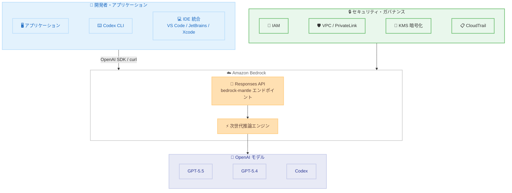

# Amazon Bedrock - OpenAI GPT-5.5、GPT-5.4、Codex の一般提供開始

**リリース日**: 2026 年 6 月 1 日
**サービス**: Amazon Bedrock
**機能**: OpenAI GPT-5.5、GPT-5.4、Codex の一般提供

📊 [このアップデートのインフォグラフィックを見る](https://takech9203.github.io/aws-news-summary/20260601-amazon-bedrock-openai-models-codex-generally-available.html)

## 概要

OpenAI の GPT-5.5、GPT-5.4、および Codex が Amazon Bedrock で一般提供 (GA) を開始した。これにより、AWS の既存のセキュリティ、ガバナンス、運用制御を維持しながら、OpenAI の最先端モデルを本番ワークロードで利用できるようになった。

GPT-5.5 は OpenAI の最も高性能なモデルであり、エージェント型コーディング、データ分析、マルチステップの自律タスクに優れている。Bedrock の次世代推論エンジン上で動作し、高パフォーマンス、信頼性、セキュリティが確保されている。Codex は AI を活用したソフトウェア開発向けのコーディングエージェントで、Codex App、Codex CLI、および Visual Studio Code、JetBrains、Xcode との IDE 統合を通じて利用可能である。

料金は OpenAI のファーストパーティレートと同一で、使用量は既存の AWS コミットメントに算入される。シートライセンスや開発者単位のコミットメントは不要で、トークン単位の従量課金制となっている。

**アップデート前の課題**

- OpenAI モデルを利用するには OpenAI の API を直接使用する必要があり、AWS のセキュリティ・ガバナンス体制とは別の管理が必要だった
- 企業のデータレジデンシー要件を満たしながら OpenAI モデルを使用することが困難だった
- 開発チームが Codex を利用する場合、AWS の IAM やログ管理とは別系統の認証・監査が必要だった
- AWS の既存コミットメント (Savings Plans など) を OpenAI モデルの利用に充当できなかった

**アップデート後の改善**

- AWS のセキュリティ制御 (IAM、VPC、PrivateLink、KMS、CloudTrail) を維持しながら OpenAI モデルを利用可能になった
- 推論処理が選択した Bedrock リージョン内に留まるため、データレジデンシー要件に対応できるようになった
- Codex の推論を Bedrock 経由で実行するよう設定でき、統一的なガバナンスが可能になった
- 使用量が既存の AWS コミットメントに算入されるため、コスト管理が一元化された
- プロンプトおよびレスポンスがモデルのトレーニングに使用されず、モデルプロバイダーとデータが共有されない

## アーキテクチャ図



Amazon Bedrock の次世代推論エンジンを介して OpenAI モデルにアクセスする構成図。開発者はアプリケーション、Codex CLI、IDE 統合から Responses API を通じてモデルを利用し、AWS のセキュリティ制御が一貫して適用される。

## サービスアップデートの詳細

### 主要機能

1. **GPT-5.5 の一般提供**
   - OpenAI の最も高性能なフロンティアモデル
   - エージェント型コーディング、データ分析、マルチステップの自律タスクに最適
   - 長時間のコンテキスト維持とアクション実行が可能
   - 大規模コードベースにわたるコードの記述とデバッグに対応
   - ドキュメントおよびスプレッドシート生成をサポート

2. **GPT-5.4 の一般提供**
   - 複雑なマルチステップタスクの実行に最適化
   - 最高のコストパフォーマンスを提供
   - Amazon Bedrock モデルカタログから利用可能

3. **Codex の一般提供**
   - 毎週 500 万人以上が利用する OpenAI のコーディングエージェント
   - コードの記述、リファクタリング、デバッグ、テスト、バリデーションに対応
   - リポジトリ全体のコンテキストを保持
   - 曖昧なエラーを推論し、仮説をツールで検証
   - 推論には GPT-5.5 を使用

4. **次世代推論エンジン**
   - 顧客ごとの分離キューと自動キャパシティ管理
   - 耐久性のある状態キャプチャ: ハードウェア障害時にリクエストを再開
   - ゼロオペレーターアクセス設計
   - 高負荷時でも予測可能なパフォーマンス

## 技術仕様

### モデル ID

| モデル | モデル ID |
|--------|-----------|
| GPT-5.5 | `openai.gpt-5.5` |
| GPT-5.4 | `openai.gpt-5.4` |
| GPT OSS 120B | `openai.gpt-oss-120b` |
| GPT OSS 20B | `openai.gpt-oss-20b` |

### API 仕様

| 項目 | 詳細 |
|------|------|
| API タイプ | Responses API |
| エンドポイント | `https://bedrock-mantle.{region}.api.aws/openai/v1` |
| SDK 互換性 | OpenAI Python SDK |
| 認証方式 | Bedrock API Key / AWS SDK クレデンシャルチェーン |
| 推論パラメータ | `reasoning.effort` / `text.verbosity` |

### API 変更履歴

| 日付 | サービス | 変更内容 |
|------|----------|----------|
| 2026/05/29 | [Amazon Bedrock](https://awsapichanges.com/archive/changes/96246a-bedrock.html) | 3 updated methods |
| 2026/05/28 | [Amazon Bedrock Runtime](https://awsapichanges.com/archive/changes/364f28-bedrock-runtime.html) | 3 updated methods |
| 2026/05/28 | [Amazon Bedrock](https://awsapichanges.com/archive/changes/364f28-bedrock.html) | 1 updated method |

### セキュリティ仕様

| 項目 | 詳細 |
|------|------|
| アクセス制御 | IAM ポリシー |
| ネットワーク分離 | VPC / PrivateLink |
| 暗号化 | KMS |
| 監査ログ | AWS CloudTrail |
| データ利用 | プロンプト・レスポンスはモデルトレーニングに不使用 |
| データ共有 | モデルプロバイダーへのデータ共有なし |
| データレジデンシー | 選択したリージョン内で推論処理 |

## 設定方法

### 前提条件

1. AWS アカウントと Amazon Bedrock へのアクセス権限
2. OpenAI モデルへのアクセスが有効化されていること
3. Python 環境 (OpenAI SDK 利用時)

### 手順

#### ステップ 1: OpenAI SDK のインストール

```bash
pip install -U openai
```

OpenAI の Python SDK を最新バージョンにアップグレードする。Bedrock 経由での Responses API 呼び出しに必要。

#### ステップ 2: 環境変数の設定

```bash
export OPENAI_BASE_URL="https://bedrock-mantle.us-east-2.api.aws/openai/v1"
export OPENAI_API_KEY="<BEDROCK_API_KEY>"
export BEDROCK_OPENAI_MODEL_ID="openai.gpt-5.5"
```

Bedrock の Mantle エンドポイントを OpenAI SDK のベース URL として設定する。API キーは Bedrock で発行されたものを使用する。

#### ステップ 3: Python からモデルを呼び出す

```python
import os
from openai import OpenAI

client = OpenAI(
    base_url=os.environ["OPENAI_BASE_URL"],
    api_key=os.environ["OPENAI_API_KEY"],
)

response = client.responses.create(
    model=os.environ["BEDROCK_OPENAI_MODEL_ID"],
    input=[
        {
            "role": "developer",
            "content": "You are a software engineer with excellent AWS cloud knowledge. Be concise and practical.",
        },
        {
            "role": "user",
            "content": "Design a distributed architecture on AWS in Python that should support 100k requests per second across multiple geographic regions.",
        },
    ],
    reasoning={"effort": "medium"},
    text={"verbosity": "low"},
)

print(response.output_text)
```

Responses API を使用して GPT-5.5 にリクエストを送信する。`reasoning.effort` で推論の深さ、`text.verbosity` で出力の詳細度を制御可能。

#### ステップ 4: Codex の設定

```bash
# Bedrock API キーを設定
export AWS_BEARER_TOKEN_BEDROCK=<your-bedrock-api-key>
```

```toml
# ~/.codex/config.toml
model = "openai.gpt-5.5"
model_provider = "amazon-bedrock"
[model_providers.amazon-bedrock.aws]
region = "us-east-2"
```

Codex が Bedrock 経由で推論を実行するよう設定する。`AWS_BEARER_TOKEN_BEDROCK` が設定されている場合はそれを優先し、未設定の場合は AWS SDK のクレデンシャルチェーンにフォールバックする。IDE 拡張機能を使用する場合は `~/.codex/.env` に環境変数を配置し、アプリを再起動する。

## メリット

### ビジネス面

- **統一的なコスト管理**: 使用量が既存の AWS コミットメントに算入されるため、予算管理が一元化される
- **ライセンスコスト不要**: シートライセンスや開発者単位のコミットメントが不要で、トークン単位の従量課金のみ
- **ベンダー統合**: OpenAI との直接契約なしに最先端モデルを AWS の請求体系で利用可能

### 技術面

- **既存セキュリティ制御の活用**: IAM、VPC、PrivateLink、KMS、CloudTrail など既存の AWS セキュリティスタックがそのまま適用される
- **データ保護**: プロンプト・レスポンスがモデルトレーニングに使用されず、モデルプロバイダーとデータが共有されない
- **高可用性推論エンジン**: 顧客分離キュー、耐久性のある状態キャプチャによりハードウェア障害時もリクエストが再開される
- **OpenAI SDK 互換**: 既存の OpenAI SDK コードをエンドポイント変更のみで Bedrock に移行可能

## デメリット・制約事項

### 制限事項

- GPT-5.5 は現時点で US East (Ohio) リージョンのみで利用可能
- GPT-5.4 は US East (Ohio) および US West (Oregon) の 2 リージョンのみ
- 東京リージョンでの提供は今回のローンチ時点では未確認
- 高需要時にはリクエストが拒否されずキューイングされるため、レイテンシが増加する可能性がある

### 考慮すべき点

- データレジデンシー要件により利用可能リージョンが限定される場合、選択肢が制限される
- OpenAI モデルのバージョンアップやサポート終了は OpenAI 側のスケジュールに依存する
- Codex の推論パフォーマンスは Bedrock 経由のため、直接 OpenAI API を使用する場合と異なる可能性がある
- GPT-5.5 のデフォルト推論 effort が高いため、コスト最適化には `reasoning.effort` パラメータの調整が必要

## ユースケース

### ユースケース 1: エンタープライズ向け AI アシスタント

**シナリオ**: 金融機関が顧客向けの AI アシスタントを構築する際に、データレジデンシーとセキュリティ要件を満たしながら最先端のモデルを使用したい。

**実装例**:
```python
client = OpenAI(
    base_url="https://bedrock-mantle.us-east-2.api.aws/openai/v1",
    api_key=bedrock_api_key,
)

response = client.responses.create(
    model="openai.gpt-5.5",
    input=[
        {"role": "developer", "content": "You are a financial advisor assistant. Follow compliance guidelines strictly."},
        {"role": "user", "content": user_query},
    ],
    reasoning={"effort": "medium"},
)
```

**効果**: VPC 内での推論処理、CloudTrail による全リクエストの監査ログ、KMS 暗号化により、金融規制に準拠した AI アシスタントを実現。

### ユースケース 2: 開発チームの生産性向上

**シナリオ**: 大規模開発チームが Codex を導入し、AWS の既存ガバナンス体制の下でコーディング支援を受けたい。

**実装例**:
```toml
# ~/.codex/config.toml
model = "openai.gpt-5.5"
model_provider = "amazon-bedrock"
[model_providers.amazon-bedrock.aws]
region = "us-east-2"
```

**効果**: シートライセンス不要のトークン課金により、チーム規模に関わらず柔軟にスケール。IAM による個別アクセス制御と CloudTrail による利用状況の可視化が可能。

### ユースケース 3: マルチモデル戦略によるコスト最適化

**シナリオ**: タスクの複雑さに応じて GPT-5.5 と GPT-5.4 を使い分け、コストパフォーマンスを最適化したい。

**実装例**:
```python
def select_model(task_complexity):
    if task_complexity == "high":
        return "openai.gpt-5.5"
    else:
        return "openai.gpt-5.4"

response = client.responses.create(
    model=select_model(complexity),
    input=messages,
    reasoning={"effort": "medium" if complexity == "high" else "low"},
)
```

**効果**: 高度な推論が必要なタスクには GPT-5.5、定型的なタスクには GPT-5.4 を使用することで、品質を維持しながらコストを最適化。

## 料金

料金は OpenAI のファーストパーティレートと同一で、追加料金はない。トークン単位の従量課金制で、使用量は既存の AWS コミットメントに算入される。

### 料金体系

| 項目 | 詳細 |
|------|------|
| 課金単位 | トークン単位 |
| 追加マークアップ | なし (OpenAI 同一レート) |
| シートライセンス | 不要 |
| 開発者単位コミットメント | 不要 |
| AWS コミットメント算入 | 対象 |

具体的なトークン単価については [Amazon Bedrock 料金ページ](https://aws.amazon.com/bedrock/pricing/) を参照。

## 利用可能リージョン

| モデル | リージョン |
|--------|-----------|
| GPT-5.5 | US East (Ohio / us-east-2) |
| GPT-5.4 | US East (Ohio / us-east-2)、US West (Oregon / us-west-2) |

最新のリージョン対応状況は [AWS リージョン互換性ページ](https://docs.aws.amazon.com/bedrock/latest/userguide/models-region-compatibility.html) を参照。

## 関連サービス・機能

- **Amazon Bedrock**: OpenAI モデルのホスティング基盤。モデルカタログ、セキュリティ制御、推論エンジンを提供
- **Amazon Bedrock Managed Agents**: 今後提供予定の OpenAI モデルを活用したマネージドエージェント機能
- **AWS IAM**: Bedrock 経由の OpenAI モデルへのアクセス制御
- **AWS CloudTrail**: 全 API リクエストの監査ログ記録
- **AWS KMS**: 保存データおよび通信データの暗号化
- **AWS PrivateLink**: VPC からのプライベート接続

## 参考リンク

- 📊 [インフォグラフィック](https://takech9203.github.io/aws-news-summary/20260601-amazon-bedrock-openai-models-codex-generally-available.html)
- [公式発表 (What's New)](https://aws.amazon.com/about-aws/whats-new/2026/06/amazon-bedrock-openai-models-codex-generally-available/)
- [AWS Blog - OpenAI models and Codex on Amazon Bedrock are now generally available](https://aws.amazon.com/blogs/machine-learning/openai-models-and-codex-on-amazon-bedrock-are-now-generally-available)
- [AWS Blog - Get started with OpenAI GPT-5.5, GPT-5.4 models and Codex on Amazon Bedrock](https://aws.amazon.com/blogs/aws/get-started-with-openai-gpt-5-5-gpt-5-4-models-and-codex-on-amazon-bedrock)
- [OpenAI モデルドキュメント](https://docs.aws.amazon.com/bedrock/latest/userguide/model-cards-openai.html)
- [リージョン互換性](https://docs.aws.amazon.com/bedrock/latest/userguide/models-region-compatibility.html)
- [Codex on Amazon Bedrock ガイド](https://developers.openai.com/api/docs/guides/amazon-bedrock)
- [Amazon Bedrock 料金](https://aws.amazon.com/bedrock/pricing/)

## まとめ

OpenAI の GPT-5.5、GPT-5.4、Codex が Amazon Bedrock で一般提供開始されたことで、AWS のセキュリティ・ガバナンス体制を維持しながら最先端の AI モデルを本番環境で活用可能になった。特に、データがモデルプロバイダーと共有されない点、推論が選択リージョン内に留まる点、既存の AWS コミットメントに使用量が算入される点は、エンタープライズ利用における大きなメリットである。現時点では US リージョンのみの提供だが、OpenAI SDK との互換性により移行コストが低く、Bedrock を通じた統一的なマルチモデル戦略を構築する好機といえる。
