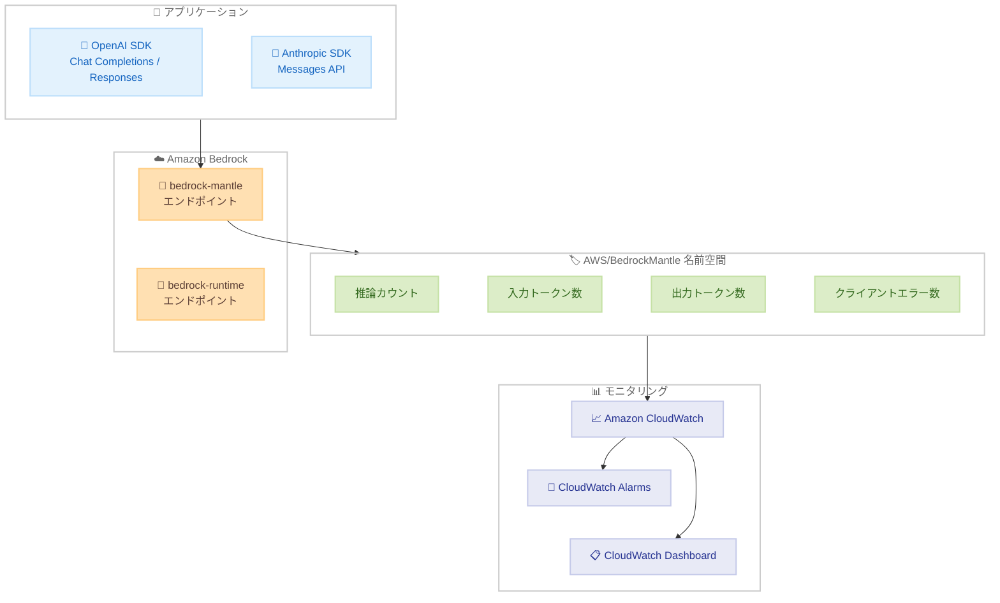

# Amazon Bedrock - bedrock-mantle エンドポイント向け CloudWatch メトリクス

**リリース日**: 2026 年 6 月 1 日
**サービス**: Amazon Bedrock
**機能**: bedrock-mantle エンドポイントの Amazon CloudWatch メトリクスサポート

📊 [このアップデートのインフォグラフィックを見る](https://takech9203.github.io/aws-news-summary/20260601-amazon-bedrock-supports-cloudwatch-metrics-bedrock-mantle-endpoint.html)

## 概要

Amazon Bedrock の bedrock-mantle エンドポイントで Amazon CloudWatch メトリクスが利用可能になりました。bedrock-mantle エンドポイントは OpenAI Responses API、OpenAI Chat Completions API、Anthropic Messages API をサポートしており、既存の OpenAI や Anthropic ベースのアプリケーションを最小限のコード変更で Amazon Bedrock 上で実行できる互換性レイヤーです。

今回のアップデートにより、従来の bedrock-runtime エンドポイントと同様のモニタリング機能が bedrock-mantle エンドポイントにも拡張され、推論トラフィックの監視、アラーム設定、キャパシティプランニングが可能になりました。

**アップデート前の課題**

- bedrock-mantle エンドポイントへの推論トラフィックを CloudWatch メトリクスで監視できなかった
- OpenAI/Anthropic 互換 API を使用するワークロードの使用量やエラー率を AWS ネイティブのモニタリングツールで追跡できなかった
- プロジェクトやモデル単位でのコスト配分や使用量の可視化が困難だった

**アップデート後の改善**

- AWS/BedrockMantle 名前空間で CloudWatch メトリクスが自動的に発行されるようになった
- アカウント、プロジェクト、モデル、プロジェクト+モデルの複数の粒度でメトリクスを取得可能になった
- bedrock-runtime エンドポイントと同じモニタリング体験が bedrock-mantle エンドポイントでも実現された

## アーキテクチャ図



bedrock-mantle エンドポイントへの推論リクエストが自動的に CloudWatch メトリクスとして発行され、アラームやダッシュボードで監視できるフローを示しています。

## サービスアップデートの詳細

### 主要機能

1. **CloudWatch メトリクスの自動発行**
   - bedrock-mantle エンドポイントへのすべての推論リクエストに対してメトリクスが自動的に発行される
   - 追加の設定や SDK の変更は不要
   - AWS/BedrockMantle 名前空間で CloudWatch コンソールから即座に確認可能

2. **複数粒度レベルでのメトリクス**
   - アカウントレベル: AWS アカウント全体の使用状況を把握
   - プロジェクトレベル: プロジェクト単位でのコスト配分に活用
   - モデルレベル: 使用しているモデルごとの推論傾向を分析
   - プロジェクト+モデルレベル: 最も詳細な粒度でワークロードを特定

3. **OpenAI/Anthropic 互換 API のサポート**
   - OpenAI Responses API
   - OpenAI Chat Completions API
   - Anthropic Messages API
   - 既存のアプリケーションコードをほぼ変更せずに Bedrock 上で実行可能

## 技術仕様

### メトリクス一覧

| メトリクス名 | 説明 | 用途 |
|-------------|------|------|
| 推論カウント | 推論リクエストの総数 | スループットの監視 |
| 入力トークン数 | リクエストに含まれる入力トークンの合計 | コスト見積もり、使用量追跡 |
| 出力トークン数 | レスポンスに含まれる出力トークンの合計 | コスト見積もり、使用量追跡 |
| クライアントエラー数 | クライアント側エラーの発生回数 | エラー率の監視、品質管理 |

### CloudWatch 名前空間

| 項目 | 詳細 |
|------|------|
| 名前空間 | AWS/BedrockMantle |
| ディメンション | Account、Project、Model、Project+Model |
| 既存の名前空間 | AWS/Bedrock (bedrock-runtime 用) |

### サポートされる API エンドポイント

| API | プロトコル | 互換性 |
|-----|-----------|--------|
| OpenAI Chat Completions API | HTTPS | OpenAI SDK 互換 |
| OpenAI Responses API | HTTPS | OpenAI SDK 互換 |
| Anthropic Messages API | HTTPS | Anthropic SDK 互換 |

## 設定方法

### 前提条件

1. Amazon Bedrock へのアクセス権限を持つ AWS アカウント
2. bedrock-mantle エンドポイントが利用可能なリージョンにデプロイされたワークロード
3. CloudWatch メトリクスの読み取り権限 (cloudwatch:GetMetricData、cloudwatch:ListMetrics など)

### 手順

#### ステップ 1: メトリクスの確認

```bash
aws cloudwatch list-metrics --namespace "AWS/BedrockMantle"
```

AWS/BedrockMantle 名前空間に発行されているメトリクスの一覧を取得します。bedrock-mantle エンドポイントへのリクエストが発生していれば、メトリクスが自動的に表示されます。

#### ステップ 2: メトリクスデータの取得

```bash
aws cloudwatch get-metric-statistics \
  --namespace "AWS/BedrockMantle" \
  --metric-name "InvocationCount" \
  --start-time "2026-06-01T00:00:00Z" \
  --end-time "2026-06-01T23:59:59Z" \
  --period 3600 \
  --statistics Sum
```

指定した期間の推論カウントを 1 時間単位で取得します。必要に応じて metric-name やディメンションを変更してください。

#### ステップ 3: アラームの設定

```bash
aws cloudwatch put-metric-alarm \
  --alarm-name "BedrockMantle-HighErrorRate" \
  --namespace "AWS/BedrockMantle" \
  --metric-name "ClientErrorCount" \
  --statistic Sum \
  --period 300 \
  --threshold 100 \
  --comparison-operator GreaterThanThreshold \
  --evaluation-periods 2 \
  --alarm-actions "arn:aws:sns:us-east-1:123456789012:bedrock-alerts"
```

クライアントエラー数が 5 分間で 100 を超えた場合にアラームを発報する設定です。SNS トピックの ARN を適切な値に変更してください。

## メリット

### ビジネス面

- **コスト可視化**: プロジェクトやモデル単位でトークン使用量を追跡し、正確なコスト配分が可能
- **SLA 管理**: エラー率や推論回数のモニタリングにより、サービス品質の維持と報告が容易に
- **キャパシティプランニング**: 使用量のトレンドを分析し、将来のリソース需要を予測可能

### 技術面

- **統一されたモニタリング体験**: bedrock-runtime と同じ CloudWatch ベースのモニタリングが bedrock-mantle でも利用可能
- **追加設定不要**: メトリクスは自動的に発行されるため、コード変更やエージェントのインストールが不要
- **既存ツールとの統合**: CloudWatch Alarms、Dashboard、EventBridge など既存の AWS モニタリングスタックとシームレスに連携

## デメリット・制約事項

### 制限事項

- メトリクスは bedrock-mantle エンドポイントが利用可能なリージョンでのみ発行される
- カスタムメトリクスではないため、メトリクスの保持期間は CloudWatch の標準ポリシーに従う (高解像度で 3 時間、1 分解像度で 15 日間、5 分解像度で 63 日間、1 時間解像度で 455 日間)
- レイテンシーやサーバーエラーなど、追加のメトリクスタイプについては今後の拡張を待つ必要がある可能性がある

### 考慮すべき点

- bedrock-runtime エンドポイントのメトリクスとは別の名前空間 (AWS/BedrockMantle) で管理されるため、統合ダッシュボードを作成する場合は両方の名前空間を参照する必要がある
- プロジェクトレベルのディメンションを活用するには、bedrock-mantle エンドポイントでプロジェクトを適切に設定する必要がある

## ユースケース

### ユースケース 1: マルチテナント SaaS アプリケーションのコスト配分

**シナリオ**: 複数のテナントが利用する SaaS アプリケーションで、テナントごとの AI 推論コストを正確に計算したい。

**実装例**:
```bash
# プロジェクト+モデル単位でトークン使用量を取得
aws cloudwatch get-metric-statistics \
  --namespace "AWS/BedrockMantle" \
  --metric-name "InputTokenCount" \
  --dimensions Name=Project,Value=tenant-a Name=Model,Value=claude-sonnet \
  --start-time "2026-06-01T00:00:00Z" \
  --end-time "2026-06-30T23:59:59Z" \
  --period 86400 \
  --statistics Sum
```

**効果**: テナントごとのトークン使用量を正確に計測し、従量課金やコストチャージバックを自動化できる。

### ユースケース 2: 本番環境の推論エラー監視

**シナリオ**: OpenAI SDK を使用した既存アプリケーションを Bedrock に移行後、クライアントエラーの急増を早期に検知したい。

**実装例**:
```bash
# エラー率のアラームを設定
aws cloudwatch put-metric-alarm \
  --alarm-name "BedrockMantle-ErrorSpike" \
  --namespace "AWS/BedrockMantle" \
  --metric-name "ClientErrorCount" \
  --statistic Sum \
  --period 60 \
  --threshold 50 \
  --comparison-operator GreaterThanThreshold \
  --evaluation-periods 3 \
  --alarm-actions "arn:aws:sns:ap-northeast-1:123456789012:ops-team"
```

**効果**: エラーの急増を 3 分以内に検知し、運用チームへ即座に通知することで、ユーザー影響を最小化できる。

### ユースケース 3: モデル使用量のトレンド分析とキャパシティプランニング

**シナリオ**: 複数の基盤モデルを使い分けている環境で、モデルごとの使用トレンドを可視化し、将来のキャパシティニーズを予測したい。

**実装例**:
```bash
# モデル別の推論カウントをダッシュボードウィジェットとして設定
aws cloudwatch put-dashboard \
  --dashboard-name "BedrockMantle-ModelUsage" \
  --dashboard-body '{
    "widgets": [
      {
        "type": "metric",
        "properties": {
          "metrics": [
            ["AWS/BedrockMantle", "InvocationCount", "Model", "claude-sonnet"],
            ["AWS/BedrockMantle", "InvocationCount", "Model", "claude-haiku"]
          ],
          "period": 3600,
          "stat": "Sum",
          "title": "Model Invocation Trends"
        }
      }
    ]
  }'
```

**効果**: モデルごとの使用量トレンドを視覚的に把握し、Provisioned Throughput の調達やモデル選択の最適化に活用できる。

## 料金

CloudWatch メトリクスの料金は標準の CloudWatch 料金に従います。

### 料金例

| 項目 | 料金 |
|------|------|
| AWS/BedrockMantle メトリクス | 追加料金なし (AWS サービスのデフォルトメトリクス) |
| CloudWatch Alarms | アラームあたり $0.10/月 (標準解像度) |
| CloudWatch Dashboard | ダッシュボードあたり $3.00/月 |
| GetMetricData API | 1,000 メトリクスリクエストあたり $0.01 |

bedrock-mantle エンドポイントのメトリクス自体は AWS サービスのデフォルトメトリクスとして発行されるため、メトリクスの発行に対する追加課金は発生しません。ただし、アラーム、ダッシュボード、API 呼び出しには標準の CloudWatch 料金が適用されます。

## 利用可能リージョン

| 地域 | リージョン |
|------|-----------|
| 米国東部 | バージニア北部 (us-east-1)、オハイオ (us-east-2) |
| 米国西部 | オレゴン (us-west-2) |
| アジアパシフィック | ジャカルタ (ap-southeast-3)、ムンバイ (ap-south-1)、シドニー (ap-southeast-2)、東京 (ap-northeast-1) |
| 欧州 | フランクフルト (eu-central-1)、アイルランド (eu-west-1)、ロンドン (eu-west-2)、ミラノ (eu-south-1)、ストックホルム (eu-north-1) |
| 南米 | サンパウロ (sa-east-1) |

## 関連サービス・機能

- **Amazon CloudWatch**: メトリクスの収集、可視化、アラーム設定を行う AWS のモニタリングサービス
- **Amazon Bedrock bedrock-runtime エンドポイント**: Bedrock ネイティブ API 向けの推論エンドポイント (既に CloudWatch メトリクス対応済み)
- **Amazon CloudWatch Alarms**: メトリクスのしきい値に基づいて自動通知やアクションを実行する機能
- **Amazon EventBridge**: CloudWatch アラーム状態の変化に応じて自動化ワークフローをトリガー可能

## 参考リンク

- 📊 [インフォグラフィック](https://takech9203.github.io/aws-news-summary/20260601-amazon-bedrock-supports-cloudwatch-metrics-bedrock-mantle-endpoint.html)
- [公式発表 (What's New)](https://aws.amazon.com/about-aws/whats-new/2026/06/amazon-bedrock-supports-cloudwatch-metrics-bedrock-mantle-endpoint/)
- [Amazon Bedrock ドキュメント](https://docs.aws.amazon.com/bedrock/latest/userguide/)
- [Amazon CloudWatch ドキュメント](https://docs.aws.amazon.com/AmazonCloudWatch/latest/monitoring/)
- [Amazon Bedrock 料金ページ](https://aws.amazon.com/bedrock/pricing/)

## まとめ

Amazon Bedrock の bedrock-mantle エンドポイントで CloudWatch メトリクスがサポートされたことにより、OpenAI や Anthropic 互換 API を使用するワークロードに対しても AWS ネイティブのモニタリング機能が利用可能になりました。プロジェクトやモデル単位の粒度でメトリクスを取得できるため、マルチテナント環境でのコスト配分や、本番推論のヘルスモニタリングが容易になります。既に bedrock-mantle エンドポイントを利用している場合は、CloudWatch コンソールから AWS/BedrockMantle 名前空間を確認し、アラームやダッシュボードの設定を推奨します。
