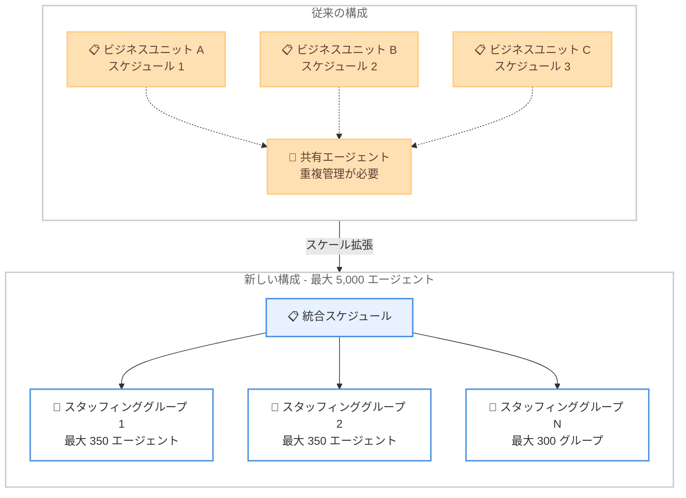

# Amazon Connect - スケジュールあたり最大 5,000 エージェントのサポート

**リリース日**: 2026年6月1日
**サービス**: Amazon Connect
**機能**: エージェントスケジューリングのスケール拡張

[このアップデートのインフォグラフィックを見る](https://takech9203.github.io/aws-news-summary/20260601-amazon-connect-customer-5000-agents.html)

## 概要

Amazon Connect のエージェントスケジューリング機能において、1 つのスケジュールで管理可能なエージェント数が最大 5,000 名に拡張された。これにより、大規模なビジネスユニットや複数のビジネスユニット間で共有されるマルチスキルエージェントを、単一のスケジュール内で一元管理できるようになった。

今回のスケール拡張には、スタッフィンググループあたり最大 350 エージェント、フォーキャストグループあたり最大 300 スタッフィンググループ (合計で最大 5,000 エージェント) という上限の引き上げも含まれている。Amazon Connect のエージェントスケジューリングが利用可能なすべての AWS リージョンで提供される。

**アップデート前の課題**

- 大規模なコンタクトセンターでは、スケジュールあたりのエージェント数制限により複数のスケジュールに分割して管理する必要があった
- マルチスキルエージェント (複数の業務を担当するエージェント) を複数のスケジュールで別々に管理する運用が必要だった
- スケジュール分割により最適化の精度が低下し、全体的なワークフォース最適化が困難だった
- 複数のスケジュール実行を管理する運用負荷が高かった

**アップデート後の改善**

- 1 つのスケジュールで最大 5,000 エージェントを管理可能になった
- マルチスキルエージェントプールを分割せず単一スケジュールで最適化できるようになった
- スケジュール分割が不要になり運用の複雑さが大幅に軽減された
- ワークフォース全体を対象としたより正確なスケジュール最適化が実現可能になった

## アーキテクチャ図

従来は複数のスケジュールに分割してエージェントを管理する必要があったが、今回のアップデートにより単一の統合スケジュールで最大 5,000 エージェントを一括管理できるようになった。

## サービスアップデートの詳細

### 主要機能

1. **スケジュールあたりのエージェント数拡張**
   - 1 つのスケジュールで最大 5,000 エージェントをサポート
   - 大規模ビジネスユニットの一元管理が可能
   - 複数ビジネスユニットの統合スケジューリングに対応

2. **スタッフィンググループの拡張**
   - スタッフィンググループあたり最大 350 エージェント
   - スキルや役割ごとにエージェントをグループ化して管理
   - グループ単位での柔軟なスケジュール設定が可能

3. **フォーキャストグループの拡張**
   - フォーキャストグループあたり最大 300 スタッフィンググループ
   - 合計で最大 5,000 エージェントをフォーキャストグループに含められる
   - 予測精度の向上とスケジュール最適化の改善

## 技術仕様

### スケール上限値

| 項目 | 上限値 |
|------|--------|
| スケジュールあたりのエージェント数 | 最大 5,000 |
| スタッフィンググループあたりのエージェント数 | 最大 350 |
| フォーキャストグループあたりのスタッフィンググループ数 | 最大 300 |
| フォーキャストグループあたりの合計エージェント数 | 最大 5,000 |

### スケジューリング階層構造

| 階層 | 説明 |
|------|------|
| スケジュール | 最上位の管理単位。最大 5,000 エージェントを含む |
| フォーキャストグループ | 需要予測の単位。最大 300 スタッフィンググループを含む |
| スタッフィンググループ | エージェントのグルーピング単位。最大 350 エージェントを含む |

## 設定方法

### 前提条件

1. Amazon Connect インスタンスが構成済みであること
2. Amazon Connect エージェントスケジューリング機能が有効化されていること
3. 適切な IAM 権限が設定されていること

### 手順

#### ステップ 1: スタッフィンググループの作成

Amazon Connect コンソールの「スケジューリング」セクションからスタッフィンググループを作成する。各グループに最大 350 エージェントを割り当てることができる。

#### ステップ 2: フォーキャストグループへのスタッフィンググループ追加

作成したスタッフィンググループをフォーキャストグループに追加する。1 つのフォーキャストグループに最大 300 のスタッフィンググループを含めることが可能。

#### ステップ 3: 統合スケジュールの生成

統合されたスタッフィンググループを対象にスケジュールを生成する。最大 5,000 エージェントが単一のスケジュール実行で最適化される。

## メリット

### ビジネス面

- **運用コスト削減**: 複数のスケジュール実行や手動調整が不要になり、管理工数が大幅に削減される
- **サービス品質向上**: ワークフォース全体での最適化により、適切なスキルを持つエージェントの配置精度が向上する
- **柔軟な組織対応**: 部門統合や組織変更時にスケジュール構成を大きく変更する必要がなくなる

### 技術面

- **最適化精度の向上**: エージェントプール全体を一括で最適化するため、分割管理時と比較してより精度の高いスケジュールが生成される
- **運用の簡素化**: 複数のスケジュール実行結果を統合する処理が不要になり、運用フローがシンプルになる
- **マルチスキル対応の改善**: 複数スキルを持つエージェントを単一スケジュールで管理するため、スキルベースの最適化が容易になる

## デメリット・制約事項

### 制限事項

- スケジュールあたりの上限は 5,000 エージェントであり、それ以上の場合は引き続き分割が必要
- スタッフィンググループあたりの上限は 350 エージェントに制限されている
- 利用可能リージョンは Amazon Connect エージェントスケジューリングが提供されているリージョンに限定

### 考慮すべき点

- 大規模スケジュールの生成には処理時間が増加する可能性がある
- 既存の複数スケジュール運用から統合スケジュールへの移行計画が必要
- スケジュール最適化の結果を確認するための検証期間を設けることを推奨

## ユースケース

### ユースケース 1: 大規模コンタクトセンターの統合管理

**シナリオ**: 3,000 名以上のエージェントを擁するコンタクトセンターで、これまで複数のスケジュールに分割していた運用を統合する。

**効果**: スケジュール分割によるオーバーラップやギャップが解消され、全エージェントの最適配置が単一スケジュールで実現できる。管理者の運用負荷も大幅に軽減される。

### ユースケース 2: マルチスキルエージェントの効率的活用

**シナリオ**: テクニカルサポートとセールスの両方に対応可能なマルチスキルエージェント 500 名を含む 2,000 名規模のコンタクトセンターで、需要変動に応じた柔軟なスケジューリングを行う。

**効果**: マルチスキルエージェントを別々のスケジュールで管理する必要がなくなり、需要予測に基づいた最適なスキル配分が自動的に実現される。

### ユースケース 3: 複数事業部のスケジュール統合

**シナリオ**: 事業部 A (1,500 名)、事業部 B (1,200 名)、事業部 C (800 名) が共通のエージェントプールを持ち、繁忙期に相互支援を行う組織。

**効果**: 3 事業部合計 3,500 名のエージェントを単一スケジュールで管理し、繁忙期の相互支援を含めた最適なスケジュールが自動生成される。

## 料金

Amazon Connect のスケジューリング機能は Amazon Connect の料金体系に含まれる。エージェントスケジューリングの利用料金は、スケジュールされたエージェント数に基づく。詳細は Amazon Connect の料金ページを参照。

## 利用可能リージョン

Amazon Connect エージェントスケジューリングが利用可能なすべての AWS リージョンで提供される。対応リージョンの詳細は [Amazon Connect 管理者ガイドのリージョンページ](https://docs.aws.amazon.com/connect/latest/adminguide/regions.html#optimization_region)を参照。

## 関連サービス・機能

- **Amazon Connect Forecasting**: 需要予測機能。フォーキャストグループと連携してスケジュール最適化の基盤となる
- **Amazon Connect Agent Scheduling**: エージェントスケジューリング機能の本体。今回のスケール拡張の対象
- **Amazon Connect Capacity Planning**: キャパシティプランニング機能。長期的な人員計画との連携が可能

## 参考リンク

- [インフォグラフィック](https://takech9203.github.io/aws-news-summary/20260601-amazon-connect-customer-5000-agents.html)
- [公式発表 (What's New)](https://aws.amazon.com/about-aws/whats-new/2026/06/amazon-connect-customer-5000-agents/)
- [Amazon Connect 管理者ガイド - リージョン](https://docs.aws.amazon.com/connect/latest/adminguide/regions.html#optimization_region)
- [Amazon Connect 料金ページ](https://aws.amazon.com/connect/pricing/)

## まとめ

Amazon Connect のエージェントスケジューリング機能が大幅にスケールアップし、1 つのスケジュールで最大 5,000 エージェントを管理できるようになった。大規模コンタクトセンターやマルチスキルエージェントを活用する組織にとって、スケジュール分割の運用負荷を解消し、ワークフォース全体の最適化精度を向上させる重要なアップデートである。既存の分割スケジュール運用を見直し、統合スケジュールへの移行を検討することを推奨する。
