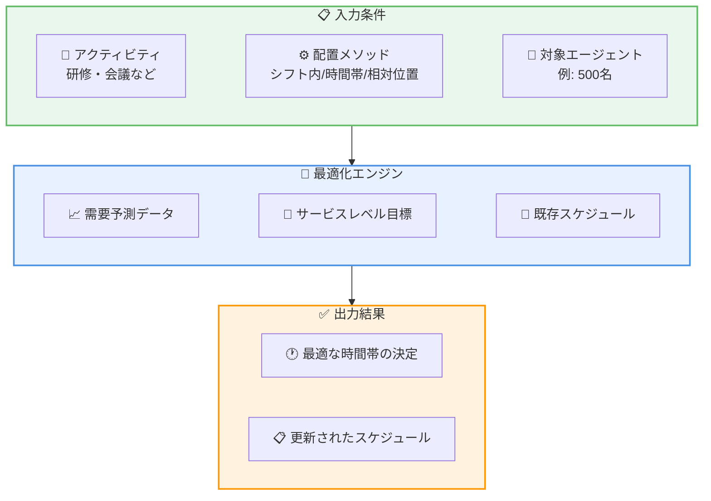

# Amazon Connect - エージェントスケジュールにおけるアドホックアクティビティの最適配置

**リリース日**: 2026年6月1日
**サービス**: Amazon Connect
**機能**: エージェントスケジュールにおけるアドホックアクティビティ配置の最適化

[このアップデートのインフォグラフィックを見る](https://takech9203.github.io/aws-news-summary/20260601-amazon-connect-customer-activity-optimization.html)

## 概要

Amazon Connect のエージェントスケジューリング機能に、アドホックアクティビティ (研修、会議など) の最適な配置を自動的に決定する機能が追加された。この機能により、非生産的イベントのスケジューリング時にサービスレベル目標への影響を自動的に最小化できるようになる。

例えば、500 名のエージェントに対するコンプライアンス研修を今後 2 週間以内の最適な時間帯に自動的にスケジュールすることが可能になる。スーパーバイザーが手動で最適な時間を探す必要がなくなり、スーパーバイザーの生産性向上と一貫したサービスレベルの維持が実現される。

**アップデート前の課題**

- スーパーバイザーが研修や会議などの非生産的アクティビティをスケジュールする際、サービスレベルへの影響を考慮しながら手動で最適な時間帯を探す必要があった
- 大規模なエージェント (例: 500 名) への一括スケジューリングでは、各エージェントの最適時間を個別に判断する工数が膨大だった
- 手動配置ではサービスレベル目標の維持が困難で、顧客対応品質が低下するリスクがあった

**アップデート後の改善**

- システムが指定された制約条件内で自動的に最適な配置時間を特定し、サービスレベルへの影響を最小化する
- 3 種類の配置メソッドから選択可能になり、柔軟なスケジューリングが実現された
- スーパーバイザーの手動作業が不要になり、生産性が向上した

## アーキテクチャ図



スーパーバイザーが入力条件を設定すると、最適化エンジンが需要予測データ、サービスレベル目標、既存スケジュールを考慮して最適な配置時間を自動決定する。

## サービスアップデートの詳細

### 主要機能

1. **3 種類の配置メソッド**
   - **シフト内の任意の時間**: 追加の制約なく、シフト時間内で最適な時間を自動決定
   - **特定の時間帯内**: 例えば 12:00 - 16:00 のように指定した時間枠内で最適化
   - **シフトに対する相対位置**: 例えばシフト開始 1 時間後からシフト終了 2 時間前までの範囲内で最適化

2. **サービスレベル影響の最小化**
   - 指定された制約条件内でサービスレベルへの影響が最も少ない時間帯を自動的に特定
   - 需要予測データと既存のスケジュールを考慮した最適化アルゴリズムを使用

3. **大規模スケジューリング対応**
   - 数百名規模のエージェントに対する一括スケジューリングが可能
   - 各エージェントの個別のシフトパターンを考慮した最適化

## 技術仕様

### 配置メソッドの詳細

| 配置メソッド | 説明 | ユースケース |
|------|------|------|
| シフト内任意 | シフト全体を対象に最適時間を決定 | 柔軟性が高い研修・ e ラーニング |
| 特定時間帯 | 指定した時間枠内で最適化 | 講師の都合がある集合研修 |
| シフト相対位置 | シフト開始/終了からの相対時間で範囲指定 | シフト交代前後を避けたい活動 |

### 前提条件

- Amazon Connect インスタンスが作成済みであること
- エージェントスケジューリング機能が有効化されていること
- 需要予測データ (Forecasting) が設定済みであること

## 設定方法

### 前提条件

1. Amazon Connect インスタンスが作成済みであること
2. Forecasting、Capacity Planning、Scheduling 機能が有効化されていること
3. エージェントのシフトスケジュールが設定済みであること

### 手順

#### ステップ 1: スケジューリング画面からアクティビティを追加

Amazon Connect 管理コンソールのスケジューリングセクションで、アドホックアクティビティ (研修、会議など) を追加する。

#### ステップ 2: 配置メソッドを選択

以下の 3 つの配置メソッドから選択する。

- **シフト内任意**: アクティビティをシフト内の任意の時間に配置
- **特定時間帯**: 例えば 12:00 - 16:00 など、特定の時間枠を指定
- **シフト相対位置**: シフト開始後 X 時間、シフト終了前 Y 時間のように相対的に指定

#### ステップ 3: 対象エージェントと期間を指定

アクティビティの対象となるエージェントグループと、スケジュール対象期間 (例: 今後 2 週間) を指定する。システムが自動的にサービスレベルへの影響を最小化する最適な時間帯を決定する。

## メリット

### ビジネス面

- **スーパーバイザーの生産性向上**: 手動で最適時間を探す作業が不要になり、管理業務の効率が大幅に改善
- **サービスレベルの一貫性**: アルゴリズムによる最適化により、人的判断のばらつきがなくなり安定したサービス品質を維持
- **コスト最適化**: サービスレベルへの影響を最小限に抑えることで、追加人員配置のコストを削減

### 技術面

- **自動最適化**: 需要予測と既存スケジュールを考慮した最適化エンジンにより、複雑な制約条件下でも最適解を自動導出
- **柔軟な制約指定**: 3 種類の配置メソッドにより、様々なビジネス要件に対応可能
- **スケーラビリティ**: 大規模なエージェント集団 (500 名以上) に対しても一括最適化が可能

## デメリット・制約事項

### 制限事項

- Amazon Connect の Forecasting、Capacity Planning、Scheduling 機能が利用可能なリージョンでのみ使用可能
- 需要予測データが十分に蓄積されていない場合、最適化の精度が低下する可能性がある
- リアルタイムの突発的な需要変動には対応できず、事前のスケジューリングに限定される

### 考慮すべき点

- 最適化結果はあくまでサービスレベル目標に基づく自動判断であり、エージェントの個人的な希望は考慮されない
- 配置メソッドの選択によって最適化結果が大きく異なるため、適切なメソッドの選定が重要

## ユースケース

### ユースケース 1: 大規模コンプライアンス研修のスケジューリング

**シナリオ**: コンタクトセンターで 500 名のエージェントに対し、2 時間のコンプライアンス研修を今後 2 週間以内に完了させる必要がある。

**実装例**:
```
配置メソッド: シフト内任意
対象エージェント: 全エージェント (500名)
アクティビティ: コンプライアンス研修 (2時間)
期間: 今後14日間
```

**効果**: システムが各エージェントのシフトと需要予測を分析し、サービスレベルへの影響が最も少ない時間帯に研修を自動配置。スーパーバイザーの手動調整作業を完全に排除。

### ユースケース 2: チームミーティングの時間帯指定スケジューリング

**シナリオ**: マネージャーが午後の特定時間帯 (13:00 - 16:00) にチームミーティングを実施したいが、サービスレベルへの影響を最小限にしたい。

**実装例**:
```
配置メソッド: 特定時間帯 (13:00-16:00)
対象エージェント: チームA (20名)
アクティビティ: チームミーティング (1時間)
期間: 今週中
```

**効果**: 指定した時間帯内で最もサービスレベルへの影響が少ない時間に自動配置。講師やミーティングルームの都合に合わせた時間帯制約と最適化を両立。

### ユースケース 3: シフト交代を考慮したスキルトレーニング

**シナリオ**: 新システム導入に伴う 1 時間のスキルトレーニングを、シフト開始直後やシフト終了直前を避けて実施したい。

**実装例**:
```
配置メソッド: シフト相対位置 (開始1時間後 - 終了2時間前)
対象エージェント: 対象スキルグループ (100名)
アクティビティ: システムトレーニング (1時間)
期間: 今後7日間
```

**効果**: シフト交代時の引き継ぎ業務と重複せず、エージェントが業務に慣れた時間帯にトレーニングを配置。学習効果とサービスレベルの両方を最適化。

## 料金

Amazon Connect のスケジューリング機能の一部として提供される。追加料金は発生しない。Amazon Connect の料金体系に従い、使用量ベースの課金が適用される。

詳細は [Amazon Connect の料金ページ](https://aws.amazon.com/connect/pricing/) を参照。

## 利用可能リージョン

Amazon Connect の Forecasting、Capacity Planning、Scheduling 機能が利用可能な以下のリージョンで使用可能。

- US East (N. Virginia) - us-east-1
- US West (Oregon) - us-west-2
- Asia Pacific (Tokyo) - ap-northeast-1
- Asia Pacific (Seoul) - ap-northeast-2
- Asia Pacific (Singapore) - ap-southeast-1
- Asia Pacific (Sydney) - ap-southeast-2
- Canada (Central) - ca-central-1
- Europe (Frankfurt) - eu-central-1
- Europe (London) - eu-west-2
- AWS GovCloud (US-West) - us-gov-west-1

## 関連サービス・機能

- **Amazon Connect Forecasting**: 需要予測データを提供し、最適化エンジンの入力として使用される
- **Amazon Connect Capacity Planning**: キャパシティ計画と連携し、エージェント数と需要のバランスを考慮したスケジューリングを実現
- **Amazon Connect Agent Scheduling**: 本機能の基盤となるエージェントスケジューリング機能

## 参考リンク

- [インフォグラフィック](https://takech9203.github.io/aws-news-summary/20260601-amazon-connect-customer-activity-optimization.html)
- [公式発表 (What's New)](https://aws.amazon.com/about-aws/whats-new/2026/06/amazon-connect-customer-activity-optimization/)
- [Amazon Connect Forecasting, Capacity Planning, Scheduling ドキュメント](https://docs.aws.amazon.com/connect/latest/adminguide/forecasting-capacity-planning-scheduling.html)
- [利用可能リージョン](https://docs.aws.amazon.com/connect/latest/adminguide/regions.html#optimization_region)
- [Amazon Connect 料金ページ](https://aws.amazon.com/connect/pricing/)

## まとめ

Amazon Connect のエージェントスケジューリングにおけるアドホックアクティビティの最適配置機能は、コンタクトセンター運営におけるスーパーバイザーの生産性とサービス品質の両方を改善する重要なアップデートである。特に大規模なコンタクトセンターにおいて、数百名規模のエージェントに対する研修や会議のスケジューリングを自動化できる点は大きな価値がある。既に Amazon Connect のスケジューリング機能を利用しているユーザーは、追加設定なしですぐにこの最適化機能を活用できる。
