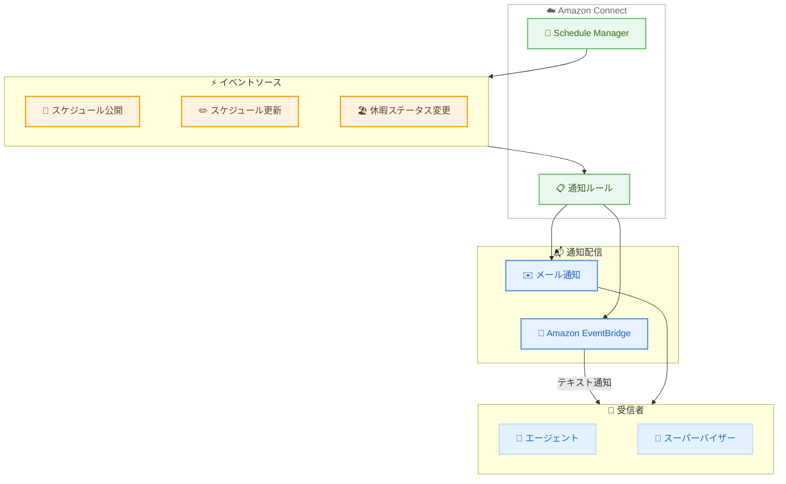

# Amazon Connect - スケジュール更新通知機能

**リリース日**: 2026 年 6 月 1 日
**サービス**: Amazon Connect
**機能**: スケジュール更新通知 (Schedule Update Notifications)

[このアップデートのインフォグラフィックを見る](https://takech9203.github.io/aws-news-summary/20260601-amazon-connect-customer-scheduling-notifications.html)

## 概要

Amazon Connect のエージェントスケジューリング機能に、スケジュール更新通知が追加された。この機能により、スケジュールの公開や変更、休暇リクエストのステータス変更時に、エージェントやスーパーバイザーへ自動的にメールまたはテキスト通知を送信できるようになる。

通知はルールベースで定義し、Amazon EventBridge を経由してテキスト通知を配信する仕組みとなっている。例えば、翌月のスケジュールが利用可能になった際に全エージェントへ自動的にメールを送信するといった運用が可能になる。

**アップデート前の課題**

- スケジュールが公開・更新されたことをスケジューラーが手動でエージェントに通知する必要があった
- エージェントが休暇リクエストのステータスを継続的に確認する必要があった
- スケジュール変更の伝達漏れにより、シフトの混乱が発生するリスクがあった

**アップデート後の改善**

- スケジュールの公開・更新時にルールベースで自動通知が送信される
- 休暇リクエストのステータス変更も自動で通知される
- スケジューラーの手動通知作業が不要になり、エージェントの生産性も向上する

## アーキテクチャ図



Amazon Connect のスケジュールマネージャーでスケジュールの公開・更新・休暇ステータス変更が発生すると、定義されたルールに基づいてメールまたは EventBridge 経由のテキスト通知がエージェントやスーパーバイザーに配信される。

## サービスアップデートの詳細

### 主要機能

1. **ルールベースの通知定義**
   - スケジュールイベントに対する通知ルールを定義可能
   - 通知のトリガー条件、受信者、配信チャネルを柔軟に設定
   - 複数のルールを組み合わせて異なるシナリオに対応

2. **複数の通知トリガー**
   - 新しいスケジュールの公開時
   - 既存スケジュールの更新時
   - 休暇リクエストのステータス変更時

3. **マルチチャネル配信**
   - メール通知: 直接エージェントやスーパーバイザーに送信
   - テキスト通知: Amazon EventBridge を経由して配信
   - 受信者をスーパーバイザーとエージェントで個別に指定可能

## 技術仕様

### 通知イベントタイプ

| イベント | トリガー条件 | 通知チャネル |
|----------|--------------|--------------|
| スケジュール公開 | 新規スケジュールが公開された時 | メール / テキスト |
| スケジュール更新 | 既存スケジュールが変更された時 | メール / テキスト |
| 休暇ステータス変更 | 休暇リクエストの承認・却下等 | メール / テキスト |

### 通知配信メカニズム

| 項目 | 詳細 |
|------|------|
| メール通知 | Amazon Connect から直接送信 |
| テキスト通知 | Amazon EventBridge 経由で配信 |
| ルール設定 | Amazon Connect 管理コンソールで定義 |
| 受信者指定 | エージェント単位 / スーパーバイザー単位 |

## 設定方法

### 前提条件

1. Amazon Connect インスタンスが稼働していること
2. エージェントスケジューリング機能が有効化されていること
3. 通知ルールの設定権限を持つユーザーアカウント
4. テキスト通知を使用する場合は Amazon EventBridge の設定

### 手順

#### ステップ 1: Amazon Connect 管理コンソールにアクセス

スケジューリング権限を持つアカウントで Amazon Connect の管理サイトにログインし、「Analytics and optimization」から「Scheduling」を選択する。

#### ステップ 2: 通知ルールの作成

通知ルールを定義し、トリガーイベント、受信者、通知チャネルを設定する。

```json
{
  "NotificationRule": {
    "Name": "MonthlySchedulePublished",
    "TriggerEvent": "SCHEDULE_PUBLISHED",
    "Recipients": {
      "AgentGroups": ["all-agents"],
      "Supervisors": ["scheduling-team"]
    },
    "Channels": ["EMAIL"],
    "Message": "来月のスケジュールが公開されました"
  }
}
```

上記は通知ルールの概念的な設定例。実際の設定は Amazon Connect 管理コンソールまたは API で行う。

#### ステップ 3: EventBridge でテキスト通知を設定

テキスト通知を利用する場合、Amazon EventBridge でルールを作成し、通知先を設定する。

```json
{
  "Source": ["aws.connect"],
  "DetailType": ["Connect Schedule Notification"],
  "Detail": {
    "eventType": ["SCHEDULE_PUBLISHED", "SCHEDULE_UPDATED", "LEAVE_STATUS_CHANGED"]
  }
}
```

EventBridge ルールのイベントパターン例。スケジュール関連のイベントをキャプチャし、SNS や Lambda などのターゲットに送信する。

## メリット

### ビジネス面

- **運用コスト削減**: スケジューラーの手動通知作業が不要になり、管理工数を削減
- **エージェント生産性向上**: 休暇ステータスの継続的な確認が不要になり、本来の業務に集中可能
- **スケジュール遵守率の改善**: 変更の即時通知により、スケジュール認識のギャップを解消

### 技術面

- **EventBridge 連携**: 既存の AWS イベント駆動アーキテクチャとシームレスに統合可能
- **ルールベースの柔軟性**: 多様な通知シナリオに対応する条件分岐が可能
- **マルチチャネル対応**: メールとテキストの使い分けにより、確実な情報伝達を実現

## デメリット・制約事項

### 制限事項

- テキスト通知は EventBridge 経由のため、EventBridge の追加設定が必要
- 通知チャネルはメールとテキストに限定される (プッシュ通知等は未対応)
- スケジューリング機能が利用可能なリージョンでのみ使用可能

### 考慮すべき点

- 大量の通知が発生する場合、EventBridge のイベント量と関連コストに注意
- エージェントのメールアドレスやテキスト通知先が正しく設定されている必要がある

## ユースケース

### ユースケース 1: 月次スケジュール公開の自動通知

**シナリオ**: コンタクトセンターのスケジューラーが翌月のスケジュールを作成・公開した際に、全エージェントへ自動的にメール通知を送信する。

**実装例**:
```
トリガー: スケジュール公開
受信者: 全エージェント
チャネル: メール
メッセージ: 「翌月のスケジュールが公開されました。確認してください。」
```

**効果**: スケジューラーが個別にエージェントへ連絡する必要がなくなり、通知漏れも防止できる。

### ユースケース 2: 休暇リクエストのステータス通知

**シナリオ**: エージェントが申請した休暇リクエストが承認・却下された際に、テキスト通知を即時送信する。

**実装例**:
```
トリガー: 休暇ステータス変更
受信者: 該当エージェント
チャネル: テキスト (EventBridge 経由)
メッセージ: 「休暇リクエストが承認されました。」
```

**効果**: エージェントが管理画面を頻繁に確認する必要がなくなり、迅速にスケジュール調整が可能になる。

### ユースケース 3: 緊急スケジュール変更のスーパーバイザー通知

**シナリオ**: 急な欠員や需要変動により既存スケジュールが更新された際に、スーパーバイザーへ即座に通知する。

**実装例**:
```
トリガー: スケジュール更新
受信者: スーパーバイザー
チャネル: メール + テキスト
メッセージ: 「本日のスケジュールが更新されました。変更内容を確認してください。」
```

**効果**: スーパーバイザーがリアルタイムでスケジュール変更を把握し、適切な対応を迅速に行える。

## 料金

Amazon Connect のスケジューリング機能の一部として提供される。スケジュール更新通知の利用に追加料金は発生しないが、以下の関連コストに注意が必要。

| 項目 | 料金 |
|------|------|
| Amazon Connect スケジューリング | 既存のスケジューリング料金に含まれる |
| Amazon EventBridge | イベント配信量に応じた従量課金 |
| メール送信 | Amazon Connect の利用料金に含まれる |

## 利用可能リージョン

Amazon Connect のエージェントスケジューリング機能が利用可能な全リージョンで使用可能。

- US East (N. Virginia) - us-east-1
- US West (Oregon) - us-west-2
- Asia Pacific (Tokyo) - ap-northeast-1
- Asia Pacific (Seoul) - ap-northeast-2
- Asia Pacific (Singapore) - ap-southeast-1
- Asia Pacific (Sydney) - ap-southeast-2
- Canada (Central) - ca-central-1
- Europe (Frankfurt) - eu-central-1
- Europe (London) - eu-west-2
- AWS GovCloud (US-West) - us-gov-west-1

## 関連サービス・機能

- **Amazon EventBridge**: テキスト通知の配信基盤として使用。スケジュールイベントを他の AWS サービスに連携可能
- **Amazon Connect エージェントスケジューリング**: スケジュールの生成・公開・管理を行う基盤機能
- **Amazon Connect Rules**: 通知ルールの定義・管理に使用されるルールエンジン

## 参考リンク

- [インフォグラフィック](https://takech9203.github.io/aws-news-summary/20260601-amazon-connect-customer-scheduling-notifications.html)
- [公式発表 (What's New)](https://aws.amazon.com/about-aws/whats-new/2026/06/amazon-connect-customer-scheduling-notifications/)
- [Amazon Connect スケジューリングドキュメント](https://docs.aws.amazon.com/connect/latest/adminguide/forecasting-capacity-planning-scheduling.html)
- [リージョン別機能一覧](https://docs.aws.amazon.com/connect/latest/adminguide/regions.html#optimization_region)
- [Amazon Connect 料金ページ](https://aws.amazon.com/connect/pricing/)

## まとめ

Amazon Connect のスケジュール更新通知機能は、コンタクトセンター運用における手動通知作業を排除し、スケジューラーとエージェント双方の生産性を向上させる実用的なアップデートである。EventBridge との連携により既存の AWS イベント駆動アーキテクチャにも統合しやすく、大規模なコンタクトセンターでの導入効果が特に大きい。エージェントスケジューリングを利用中の組織は、通知ルールの設定を検討することを推奨する。
