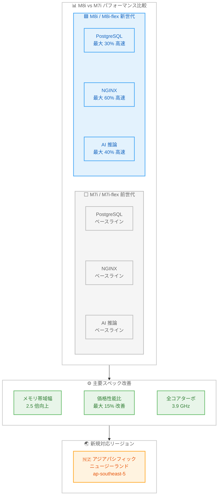

# Amazon EC2 M8i / M8i-flex インスタンス - アジアパシフィック (ニュージーランド) リージョンで利用可能に

**リリース日**: 2026 年 6 月 1 日
**サービス**: Amazon EC2
**機能**: M8i および M8i-flex インスタンスのアジアパシフィック (ニュージーランド) リージョン対応

📊 [このアップデートのインフォグラフィックを見る](https://takech9203.github.io/aws-news-summary/20260601-amazon-ec2-m8i-m8i-flex-new-zealand.html)

## 概要

Amazon EC2 M8i および M8i-flex インスタンスがアジアパシフィック (ニュージーランド) リージョン (ap-southeast-5) で利用可能になった。これらのインスタンスは AWS 専用のカスタム Intel Xeon 6 プロセッサを搭載しており、クラウド上の同等の Intel プロセッサの中で最高のパフォーマンスと最速のメモリ帯域幅を提供する。

M8i および M8i-flex インスタンスは前世代の Intel ベースインスタンスと比較して最大 15% の価格性能比改善と 2.5 倍のメモリ帯域幅を実現する。M7i / M7i-flex インスタンスと比較して最大 20% の性能向上を達成し、特定のワークロードではさらに高いパフォーマンスゲインが得られる。ニュージーランドリージョンでの利用開始により、オセアニア地域のユーザーがより低レイテンシで高性能な汎用インスタンスを活用できるようになった。

**アップデート前の課題**

- ニュージーランドリージョンでは M8i / M8i-flex インスタンスが利用できず、前世代の Intel ベースインスタンスを使用する必要があった
- オセアニア地域のユーザーが最新世代の Intel ベース汎用インスタンスの性能恩恵を受けるには、他リージョンへのデプロイが必要でレイテンシが増加していた
- SAP ワークロードをニュージーランドリージョンで最新の Intel インスタンスで実行する選択肢がなかった

**アップデート後の改善**

- ニュージーランドリージョンで M8i / M8i-flex インスタンスが直接利用可能になり、最大 20% の性能向上を享受できる
- オセアニアのユーザーが低レイテンシで PostgreSQL、NGINX、AI 推論などのワークロードを高性能に実行可能
- SAP 認定の M8i インスタンスにより、ニュージーランドリージョンでの SAP ワークロード実行が可能に

## アーキテクチャ図



M8i インスタンスは前世代 M7i と比較してワークロード別に大幅なパフォーマンス向上を実現し、今回ニュージーランドリージョンで利用可能になった。

## サービスアップデートの詳細

### 主要機能

1. **カスタム Intel Xeon 6 プロセッサ**
   - AWS 専用設計で全コア 3.9 GHz のサステインドターボ周波数を実現
   - DDR5 7200MT/s DIMM による 2.5 倍のメモリスループット向上
   - 前世代比 4.6 倍の L3 キャッシュ容量
   - AMX FP16 サポートによる CPU ベースの推論ワークロード加速

2. **第 6 世代 AWS Nitro カード**
   - 前世代比最大 2 倍のネットワークおよび EBS 帯域幅
   - 帯域幅構成機能によりネットワークと EBS の帯域幅を 25% 単位で調整可能
   - 小パケットネットワークスループットの改善

3. **M8i-flex のバースト性能モデル**
   - 95% の時間でフル CPU パフォーマンスに到達可能
   - M8i と比較して 5% 低い料金で 5% 優れた価格性能比
   - コンピュートリソースを常時フル活用しないワークロードに最適

4. **SAP 認定**
   - M8i は 13 の SAP 認定サイズを提供
   - 2 つのベアメタルオプション (metal-48xl、metal-96xl) を含む
   - 新しい 96xlarge サイズで最大規模のアプリケーションに対応

## 技術仕様

### M8i インスタンスサイズ

| インスタンスサイズ | vCPU | メモリ (GiB) | ネットワーク帯域幅 (Gbps) | EBS 帯域幅 (Gbps) |
|---|---|---|---|---|
| m8i.large | 2 | 8 | 最大 12.5 | 最大 10 |
| m8i.xlarge | 4 | 16 | 最大 12.5 | 最大 10 |
| m8i.2xlarge | 8 | 32 | 最大 15 | 最大 10 |
| m8i.4xlarge | 16 | 64 | 最大 15 | 最大 10 |
| m8i.8xlarge | 32 | 128 | 15 | 10 |
| m8i.12xlarge | 48 | 192 | 22.5 | 15 |
| m8i.16xlarge | 64 | 256 | 30 | 20 |
| m8i.24xlarge | 96 | 384 | 40 | 30 |
| m8i.32xlarge | 128 | 512 | 50 | 40 |
| m8i.48xlarge | 192 | 768 | 75 | 60 |
| m8i.96xlarge | 384 | 1,536 | 100 | 80 |
| m8i.metal-48xl | 192 | 768 | 75 | 60 |
| m8i.metal-96xl | 384 | 1,536 | 100 | 80 |

### M8i-flex インスタンスサイズ

| インスタンスサイズ | vCPU | メモリ (GiB) | ネットワーク帯域幅 (Gbps) | EBS 帯域幅 (Gbps) |
|---|---|---|---|---|
| m8i-flex.large | 2 | 8 | 最大 12.5 | 最大 10 |
| m8i-flex.xlarge | 4 | 16 | 最大 12.5 | 最大 10 |
| m8i-flex.2xlarge | 8 | 32 | 最大 15 | 最大 10 |
| m8i-flex.4xlarge | 16 | 64 | 最大 15 | 最大 10 |
| m8i-flex.8xlarge | 32 | 128 | 最大 15 | 最大 10 |
| m8i-flex.12xlarge | 48 | 192 | 最大 22.5 | 最大 15 |
| m8i-flex.16xlarge | 64 | 256 | 最大 30 | 最大 20 |

### パフォーマンス比較 (M7i/M7i-flex 比)

| ワークロード | パフォーマンス向上 |
|---|---|
| 全体的な性能 | 最大 20% 向上 |
| 価格性能比 | 最大 15% 改善 |
| メモリ帯域幅 | 2.5 倍 |
| PostgreSQL データベース | 最大 30% 高速 |
| NGINX Web アプリケーション | 最大 60% 高速 |
| AI ディープラーニング推論モデル | 最大 40% 高速 |

### 主要技術仕様

| 項目 | 詳細 |
|------|------|
| プロセッサ | カスタム Intel Xeon 6 (AWS 専用) |
| ターボ周波数 | 全コア 3.9 GHz サステインド |
| メモリタイプ | DDR5 7200MT/s |
| L3 キャッシュ | 前世代比 4.6 倍 |
| ストレージ | EBS Only |
| Nitro 世代 | 第 6 世代 Nitro カード |
| EFA サポート | 48xlarge、96xlarge、metal-48xl、metal-96xl |
| AI アクセラレーション | AMX FP16 サポート |

## 設定方法

### 前提条件

1. AWS アカウントを所有していること
2. アジアパシフィック (ニュージーランド) リージョン (ap-southeast-5) が有効であること
3. M8i / M8i-flex に対応した AMI が利用可能であること

### 手順

#### ステップ 1: リージョンの選択

AWS マネジメントコンソールにサインインし、リージョンセレクターで「Asia Pacific (New Zealand) ap-southeast-5」を選択する。

#### ステップ 2: インスタンスの起動 (AWS CLI)

```bash
# M8i インスタンスの起動
aws ec2 run-instances \
  --region ap-southeast-5 \
  --instance-type m8i.xlarge \
  --image-id ami-xxxxxxxxxxxxxxxxx \
  --key-name my-key-pair \
  --subnet-id subnet-xxxxxxxxxxxxxxxxx \
  --security-group-ids sg-xxxxxxxxxxxxxxxxx
```

指定したリージョンで M8i インスタンスを起動するコマンド。AMI ID はリージョン固有のものを使用する。

#### ステップ 3: M8i-flex インスタンスの起動

```bash
# M8i-flex インスタンスの起動
aws ec2 run-instances \
  --region ap-southeast-5 \
  --instance-type m8i-flex.large \
  --image-id ami-xxxxxxxxxxxxxxxxx \
  --key-name my-key-pair \
  --subnet-id subnet-xxxxxxxxxxxxxxxxx \
  --security-group-ids sg-xxxxxxxxxxxxxxxxx
```

コンピュートリソースを常時フル活用しないワークロードには M8i-flex を選択することでコスト効率が向上する。

#### ステップ 4: 帯域幅構成の調整 (オプション)

```bash
# ネットワーク帯域幅とEBS帯域幅の配分を調整
aws ec2 modify-instance-attribute \
  --region ap-southeast-5 \
  --instance-id i-xxxxxxxxxxxxxxxxx \
  --instance-bandwidth-configuration '{"BandwidthWeighting":"ebs-1"}'
```

帯域幅構成機能を使用して、ネットワークと EBS の帯域幅配分を 25% 単位で調整できる。

## メリット

### ビジネス面

- **コスト効率の向上**: 前世代比最大 15% の価格性能比改善により、同じ予算でより多くの処理能力を確保できる
- **データ主権への対応**: ニュージーランド国内にデータを保持する要件がある組織がローカルリージョンで最新インスタンスを使用可能
- **低レイテンシ**: オセアニア地域のエンドユーザーに対してより近い場所からサービスを提供可能

### 技術面

- **大幅な性能向上**: PostgreSQL で最大 30%、NGINX で最大 60%、AI 推論で最大 40% の高速化
- **メモリ帯域幅の大幅改善**: 2.5 倍のメモリ帯域幅によりメモリインテンシブなワークロードが高速化
- **柔軟なサイズ選択**: M8i で 13 サイズ (ベアメタル 2 種含む)、M8i-flex で 7 サイズから選択可能
- **帯域幅構成機能**: ネットワークと EBS の帯域幅を 25% 単位でワークロードに合わせて調整可能

## デメリット・制約事項

### 制限事項

- EBS Only ストレージのため、ローカルインスタンスストレージが必要なワークロードには不向き
- M8i-flex はフル CPU パフォーマンスに到達できるのが 95% の時間であり、常時フルパフォーマンスが必要な場合は M8i を選択する必要がある
- EFA サポートは M8i の 48xlarge 以上のサイズに限定される
- Dedicated Instances / Dedicated Hosts は M8i のみ対応で M8i-flex では利用不可

### 考慮すべき点

- ニュージーランドリージョンは比較的新しいリージョンのため、他のリージョンと比較してサービスの可用性に差がある場合がある
- 前世代 M7i からの移行時は AMI の互換性確認が必要
- Intel Xeon 6 プロセッサ固有の命令セットに依存するワークロードの場合、動作検証が推奨される

## ユースケース

### ユースケース 1: ニュージーランド向け Web アプリケーション

**シナリオ**: ニュージーランドのユーザーを対象とする NGINX ベースの Web アプリケーションを低レイテンシで提供したい。

**実装例**:
```bash
aws ec2 run-instances \
  --region ap-southeast-5 \
  --instance-type m8i-flex.2xlarge \
  --image-id ami-xxxxxxxxxxxxxxxxx \
  --count 3 \
  --tag-specifications 'ResourceType=instance,Tags=[{Key=Name,Value=nginx-web-nz}]'
```

**効果**: M7i-flex 比で最大 60% の NGINX パフォーマンス向上により、より少ないインスタンス数で同等のトラフィックを処理可能。M8i-flex により常時フル CPU を使用しない Web サーバーのコストを最適化。

### ユースケース 2: PostgreSQL データベースのローカルデプロイ

**シナリオ**: ニュージーランドのデータ主権要件に対応し、PostgreSQL データベースをローカルリージョンで高性能に運用したい。

**実装例**:
```bash
aws ec2 run-instances \
  --region ap-southeast-5 \
  --instance-type m8i.8xlarge \
  --image-id ami-xxxxxxxxxxxxxxxxx \
  --block-device-mappings '[{"DeviceName":"/dev/xvda","Ebs":{"VolumeSize":500,"VolumeType":"gp3","Iops":16000,"Throughput":1000}}]'
```

**効果**: M7i 比で最大 30% の PostgreSQL パフォーマンス向上。2.5 倍のメモリ帯域幅によりデータベースクエリの応答時間が大幅に改善。

### ユースケース 3: SAP ワークロードのニュージーランドデプロイ

**シナリオ**: オセアニア地域の SAP ワークロードをニュージーランドリージョンでホストし、最新世代のインスタンスパフォーマンスを活用したい。

**実装例**:
```bash
aws ec2 run-instances \
  --region ap-southeast-5 \
  --instance-type m8i.24xlarge \
  --image-id ami-xxxxxxxxxxxxxxxxx \
  --placement '{"Tenancy":"dedicated"}'
```

**効果**: SAP 認定の M8i インスタンスにより、ニュージーランドリージョンで SAP HANA やその他の SAP アプリケーションを最新世代のパフォーマンスで実行可能。Dedicated Instance オプションによりコンプライアンス要件にも対応。

## 料金

料金はリージョンやインスタンスサイズにより異なる。以下の購入オプションが利用可能。

| 購入オプション | 説明 |
|---|---|
| オンデマンド | 時間単位または秒単位 (最小 60 秒) の従量課金 |
| Savings Plans | 1 年または 3 年のコミットメントで割引 |
| スポットインスタンス | 未使用キャパシティを大幅割引で利用 |
| Dedicated Instances | M8i のみ対応。専用ハードウェアで実行 |
| Dedicated Hosts | M8i のみ対応。専用物理サーバーを割り当て |

M8i-flex は M8i と比較して約 5% 低い料金設定となっている。詳細な料金は [Amazon EC2 料金ページ](https://aws.amazon.com/ec2/pricing/on-demand/) を参照。

## 利用可能リージョン

M8i および M8i-flex インスタンスは以下のリージョンで利用可能。

| リージョン | リージョンコード |
|---|---|
| 米国東部 (バージニア北部) | us-east-1 |
| 米国東部 (オハイオ) | us-east-2 |
| 米国西部 (オレゴン) | us-west-2 |
| 欧州 (スペイン) | eu-south-2 |
| アジアパシフィック (ニュージーランド) | ap-southeast-5 (今回追加) |

## 関連サービス・機能

- **Amazon EC2 M7i / M7i-flex**: M8i の前世代にあたる Intel ベースの汎用インスタンス
- **Amazon EC2 M8g**: Graviton4 プロセッサ搭載の汎用インスタンス (ARM ベース)
- **AWS Nitro System**: M8i の基盤となる第 6 世代 Nitro カードによるハードウェアオフロード
- **Elastic Fabric Adapter (EFA)**: M8i の大きなサイズで利用可能な高性能ネットワーキング
- **Amazon EBS**: M8i / M8i-flex で使用する EBS Only ストレージ

## 参考リンク

- 📊 [インフォグラフィック](https://takech9203.github.io/aws-news-summary/20260601-amazon-ec2-m8i-m8i-flex-new-zealand.html)
- [公式発表 (What's New)](https://aws.amazon.com/about-aws/whats-new/2026/06/amazon-ec2-m8i-m8i-flex-new-zealand/)
- [AWS Blog - New General Purpose Amazon EC2 M8i and M8i-flex Instances](https://aws.amazon.com/blogs/aws/new-general-purpose-amazon-ec2-m8i-and-m8i-flex-instances-are-now-available/)
- [M8i インスタンスタイプ詳細](https://aws.amazon.com/ec2/instance-types/m8i/)
- [Amazon EC2 料金ページ](https://aws.amazon.com/ec2/pricing/on-demand/)

## まとめ

Amazon EC2 M8i および M8i-flex インスタンスのアジアパシフィック (ニュージーランド) リージョン対応により、オセアニア地域のユーザーがカスタム Intel Xeon 6 プロセッサの最大 20% のパフォーマンス向上と 2.5 倍のメモリ帯域幅改善を低レイテンシで活用できるようになった。特に PostgreSQL、NGINX、AI 推論ワークロードで顕著な性能改善が期待でき、SAP 認定ワークロードにも対応する。ニュージーランドにデータを保持する必要がある組織や、オセアニア地域のエンドユーザーに低レイテンシでサービスを提供したい組織にとって、インスタンスタイプの見直しを検討する価値がある。
