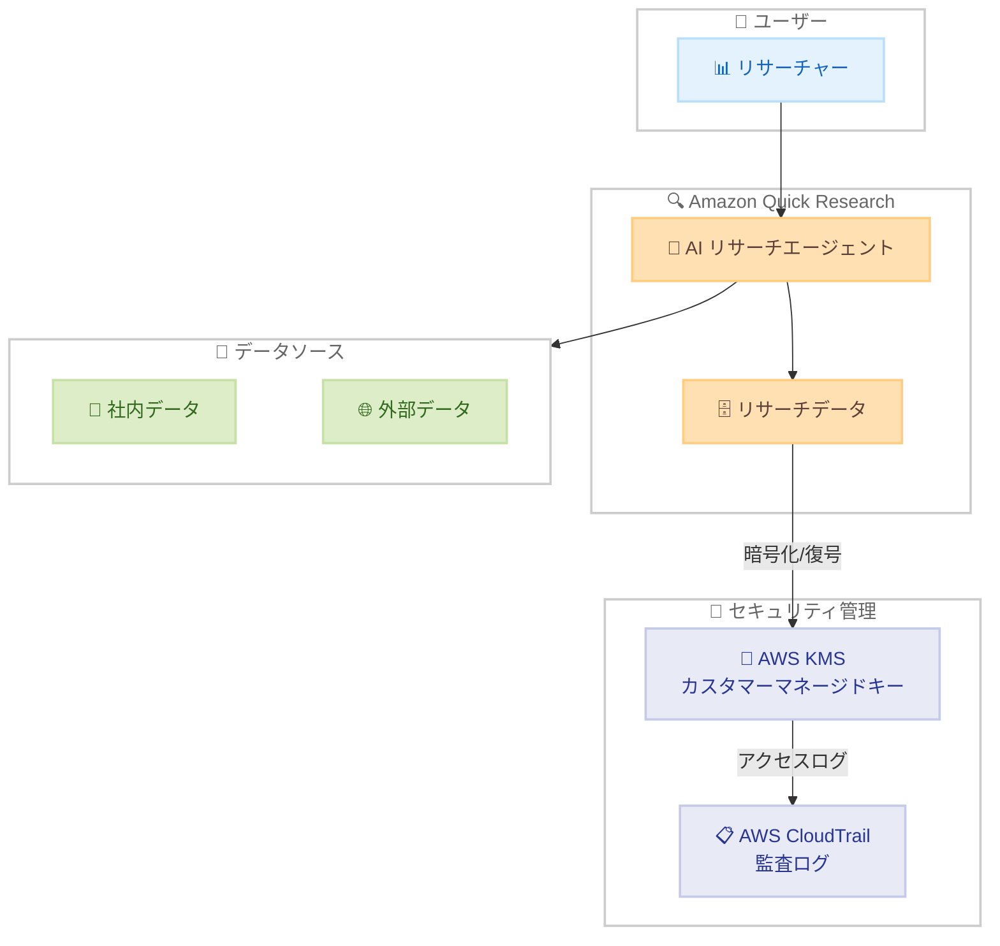

# Amazon Quick Research - カスタマーマネージドキー (CMK) サポート

**リリース日**: 2026 年 6 月 1 日
**サービス**: Amazon Quick Research
**機能**: カスタマーマネージドキー (CMK) による暗号化

📊 [このアップデートのインフォグラフィックを見る](https://takech9203.github.io/aws-news-summary/20260601-amazon-quick-research-cm-keys.html)

## 概要

Amazon Quick Research が AWS Key Management Service (KMS) を通じたカスタマーマネージドキー (CMK) によるデータ暗号化をサポートしました。これにより、厳格なセキュリティおよびコンプライアンス要件を持つ組織が、自社で暗号化キーを管理しながら AI リサーチエージェントを活用できるようになります。

Amazon Quick Research は、組織の内部ナレッジと公開インターネットデータを統合し、エキスパートレベルのインサイトを迅速に提供する AI エージェントです。今回の CMK サポートにより、金融機関や医療機関など、データの暗号化管理に厳しい要件を持つ業界でも安心して利用できるようになりました。

**アップデート前の課題**

- Quick Research のデータ暗号化は AWS マネージドキーのみで行われ、ユーザーが独自のキーを使用できなかった
- セキュリティインシデント発生時に暗号化キーへのアクセスを即座に取り消す手段がなかった
- コンプライアンス要件で自社管理の暗号化キーが必須な組織は Quick Research の採用が困難だった
- 暗号化キーの使用状況を詳細に監査する仕組みが限定的だった

**アップデート後の改善**

- 自社の KMS キーを使用して Quick Research のデータを暗号化可能になった
- セキュリティインシデント時に 15 分以内でキーアクセスを取り消し可能になった
- AWS CloudTrail との統合により、すべてのデータアクセスを追跡・監査可能になった
- 複数の CMK をサポートし、AWS アカウントおよびリージョンごとに 1 つのデフォルトキーを設定可能になった

## アーキテクチャ図



Amazon Quick Research が CMK を使用してデータを暗号化し、AWS CloudTrail で全アクセスを監査する構成を示しています。

## サービスアップデートの詳細

### 主要機能

1. **カスタマーマネージドキーによる暗号化**
   - 自社の AWS KMS キーを使用して Quick Research のデータを暗号化
   - 対称 KMS キーのみをサポート
   - Quick Research リソースと同じ AWS アカウントおよびリージョンにキーを作成する必要あり

2. **包括的な監査機能**
   - AWS CloudTrail との統合によるすべてのデータアクセスの追跡
   - セキュリティ監査のためのキー使用状況の可視化
   - コンプライアンスレポート作成に必要な証跡の自動記録

3. **迅速なキーアクセス取り消し**
   - セキュリティインシデント発生時に 15 分以内でキーアクセスを無効化
   - 侵害されたキーの即時失効によるデータ保護
   - インシデントレスポンスプロセスとの統合

4. **複数キーのサポート**
   - AWS アカウントおよびリージョンごとに 1 つのデフォルトキーを設定
   - 複数の CMK を管理可能
   - 用途やデータ分類に応じたキーの使い分け

## 技術仕様

### 暗号化仕様

| 項目 | 詳細 |
|------|------|
| サポートされるキータイプ | 対称 AWS KMS キーのみ |
| キーの配置要件 | Quick Research リソースと同一アカウント・同一リージョン |
| デフォルトキー数 | AWS アカウント・リージョンあたり 1 つ |
| 複数キーサポート | あり |
| キー取り消し反映時間 | 15 分以内 |
| 監査ログ | AWS CloudTrail 統合 |

### API 変更履歴

| 日付 | サービス | 変更内容 |
|------|----------|----------|
| 2026/06/01 | [quicksight](https://awsapichanges.com/archive/changes/8fdb47-quicksight.html) | 22 new api methods - Spaces、Agents、Flows の公開 API 追加 |

### KMS キーポリシー設定例

```json
{
  "Version": "2012-10-17",
  "Statement": [
    {
      "Sid": "AllowQuickResearchEncryption",
      "Effect": "Allow",
      "Principal": {
        "Service": "quick.amazonaws.com"
      },
      "Action": [
        "kms:Encrypt",
        "kms:Decrypt",
        "kms:GenerateDataKey",
        "kms:DescribeKey"
      ],
      "Resource": "*",
      "Condition": {
        "StringEquals": {
          "aws:SourceAccount": "123456789012"
        }
      }
    }
  ]
}
```

## 設定方法

### 前提条件

1. AWS KMS で対称キーが作成済みであること
2. キーが Quick Research リソースと同じ AWS アカウントおよびリージョンに存在すること
3. Quick Research サービスに対するキーポリシーが適切に設定されていること

### 手順

#### ステップ 1: KMS 対称キーの作成

```bash
aws kms create-key \
  --key-spec SYMMETRIC_DEFAULT \
  --key-usage ENCRYPT_DECRYPT \
  --description "Quick Research encryption key" \
  --region us-east-1
```

Quick Research で使用する対称暗号化キーを AWS KMS に作成します。`--key-spec SYMMETRIC_DEFAULT` を指定して対称キーを生成します。

#### ステップ 2: キーポリシーの設定

```bash
aws kms put-key-policy \
  --key-id <key-id> \
  --policy-name default \
  --policy file://quick-research-key-policy.json
```

作成したキーに Quick Research サービスからのアクセスを許可するキーポリシーを適用します。

#### ステップ 3: Quick Research での CMK 設定

Quick Research コンソールまたは API を使用して、作成した KMS キーをデフォルトの暗号化キーとして設定します。Quick Research の暗号化設定ページから KMS キー ARN を指定します。

## メリット

### ビジネス面

- **コンプライアンス対応の強化**: HIPAA、PCI DSS、SOC 2 などの規制要件を満たす暗号化キー管理が可能
- **リスク管理の向上**: セキュリティインシデント時に 15 分以内でデータアクセスを遮断可能
- **監査対応の効率化**: CloudTrail による自動的な監査証跡の記録により、監査対応工数を削減

### 技術面

- **暗号化キーの完全制御**: キーの作成、ローテーション、無効化を自社で管理
- **きめ細かなアクセス制御**: IAM ポリシーと KMS キーポリシーの組み合わせによる多層防御
- **自動監査ログ**: すべてのキー使用操作が CloudTrail に自動記録され、セキュリティ監視と異常検知に活用可能

## デメリット・制約事項

### 制限事項

- 対称 KMS キーのみサポート (非対称キーは使用不可)
- キーは Quick Research リソースと同じ AWS アカウント・リージョンに作成する必要あり
- AWS アカウント・リージョンあたりのデフォルトキーは 1 つに制限
- クロスアカウントでのキー共有は非対応

### 考慮すべき点

- KMS キーを削除または無効化すると Quick Research データへのアクセスが不可能になる
- キーポリシーの誤設定により Quick Research サービスが動作しなくなるリスクがある
- KMS API 呼び出しに対する追加コストが発生する
- キーローテーション時のデータ再暗号化プロセスの確認が必要

## ユースケース

### ユースケース 1: 金融機関のマーケットリサーチ

**シナリオ**: 大手金融機関のリサーチチームが市場分析に Quick Research を活用したいが、金融規制により暗号化キーの自社管理が必須。

**実装例**:
```bash
# 金融規制準拠の暗号化キーを作成
aws kms create-key \
  --key-spec SYMMETRIC_DEFAULT \
  --key-usage ENCRYPT_DECRYPT \
  --description "Financial research - regulatory compliance" \
  --tags '[{"TagKey":"Compliance","TagValue":"PCI-DSS"}]'
```

**効果**: 金融規制に準拠しながら Quick Research の AI リサーチ機能を活用し、市場分析の効率を 90% 以上向上。

### ユースケース 2: 医薬品企業の特許調査

**シナリオ**: 製薬企業が Quick Research を使用して特許調査を行いたいが、研究データの機密性確保のため自社管理の暗号化が必要。

**実装例**:
```bash
# 研究データ用の暗号化キーを作成しキーローテーションを有効化
aws kms create-key \
  --key-spec SYMMETRIC_DEFAULT \
  --description "Pharma patent research encryption"

aws kms enable-key-rotation --key-id <key-id>
```

**効果**: 機密性の高い研究データを保護しながら、PubMed データや特許情報を活用した包括的な調査を実現。

### ユースケース 3: セキュリティインシデント対応

**シナリオ**: データ侵害の疑いが検知された際に、Quick Research に保存されたビジネスインテリジェンスデータへのアクセスを即時遮断する必要がある。

**実装例**:
```bash
# インシデント発生時にキーを即時無効化
aws kms disable-key --key-id <key-id>

# CloudTrail でアクセスログを確認
aws cloudtrail lookup-events \
  --lookup-attributes AttributeKey=ResourceType,AttributeValue=AWS::KMS::Key \
  --start-time "2026-06-01T00:00:00Z"
```

**効果**: 15 分以内にデータアクセスを完全遮断し、CloudTrail ログで侵害範囲を特定。迅速なインシデントレスポンスを実現。

## 料金

CMK の使用に関する追加料金は以下のとおりです。

### 料金例

| 項目 | 月額料金 (概算) |
|------|-----------------|
| KMS カスタマーマネージドキー | $1.00/キー/月 |
| API リクエスト (暗号化/復号) | $0.03/10,000 リクエスト |
| 自動キーローテーション | 追加料金なし |

※ Quick Research 本体の料金は別途発生します。最新の料金情報は [AWS KMS 料金ページ](https://aws.amazon.com/kms/pricing/)を参照してください。

## 利用可能リージョン

Amazon Quick が利用可能なすべての AWS リージョンで利用可能です。詳細は [Amazon Quick リージョンガイド](https://docs.aws.amazon.com/quick/latest/userguide/regions.html#regions-qs)を参照してください。

## 関連サービス・機能

- **AWS Key Management Service (KMS)**: 暗号化キーの作成・管理・ローテーションを提供するマネージドサービス
- **AWS CloudTrail**: API 呼び出しの監査ログを記録し、セキュリティ監視とコンプライアンス対応を支援
- **Amazon QuickSight**: BI ダッシュボードおよびビジュアル分析サービス。Quick Research と同じ Amazon Quick ファミリーに属する
- **AWS IAM**: Quick Research リソースおよび KMS キーへのアクセス制御を提供

## 参考リンク

- 📊 [インフォグラフィック](https://takech9203.github.io/aws-news-summary/20260601-amazon-quick-research-cm-keys.html)
- [公式発表 (What's New)](https://aws.amazon.com/about-aws/whats-new/2026/06/amazon-quick-research-cm-keys)
- [Amazon Quick Research 製品ページ](https://aws.amazon.com/quick/research/)
- [Amazon Quick リージョンガイド](https://docs.aws.amazon.com/quick/latest/userguide/regions.html#regions-qs)
- [AWS KMS 料金ページ](https://aws.amazon.com/kms/pricing/)

## まとめ

Amazon Quick Research のカスタマーマネージドキー (CMK) サポートは、セキュリティとコンプライアンスを重視する組織にとって重要なアップデートです。特に金融機関や医療機関など、規制要件でデータ暗号化キーの自社管理が求められる業界において、Quick Research の AI リサーチ機能を安心して導入できるようになります。セキュリティインシデント時の 15 分以内のキーアクセス取り消し機能は、迅速なインシデントレスポンスを可能にする実践的な機能です。
