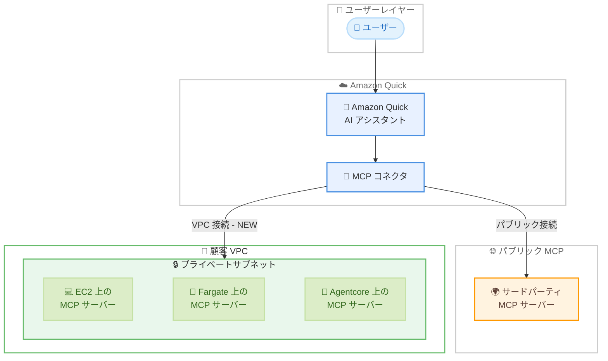

# Amazon Quick - VPC 経由での MCP サーバー接続サポート

**リリース日**: 2026 年 6 月 1 日
**サービス**: Amazon Quick
**機能**: VPC connectivity for MCP connections

📊 [このアップデートのインフォグラフィックを見る](https://takech9203.github.io/aws-news-summary/20260601-amazon-quick-vpc-mcp.html)

## 概要

Amazon Quick が、プライベートネットワーク上でホストされている Model Context Protocol (MCP) サーバーへの Amazon Virtual Private Cloud (VPC) 経由の接続をサポートしました。これにより、企業が社内ネットワークで運用する MCP サーバーを、インターネットに公開することなく Quick の AI ワークフローに統合できるようになります。

Amazon Quick は AWS が提供する AI アシスタントであり、Slack、Microsoft Teams、CRM、データベースなど既存のツールやデータソースと連携して、質問への回答やアクションの実行を自然言語で行えるサービスです。今回のアップデートにより、セキュリティ要件の厳しいエンタープライズ顧客が、社内の独自アプリケーション、カスタムデータソース、内部ツールの MCP サーバーを Quick に安全に接続できるようになりました。

**アップデート前の課題**

- Quick の MCP サポートはパブリックインターネット経由でアクセス可能なサードパーティホストサーバーに限定されていた
- プライベートネットワーク上の MCP サーバーを Quick に接続するには、サーバーをインターネットに公開する必要があった
- セキュリティポリシーにより社内 MCP サーバーをインターネットに公開できない組織は、Quick の MCP 機能を活用できなかった
- 社内の独自データソースや内部ツールへの AI アシスタントからのアクセスが制限されていた

**アップデート後の改善**

- VPC 経由でプライベートネットワーク上の MCP サーバーに直接接続が可能になった
- MCP サーバーをインターネットに公開せずに Quick と統合できるようになった
- Amazon EC2、AWS Fargate、AWS Agentcore などで稼働する MCP サーバーとの安全な接続が実現した
- MCP コネクタ作成時に VPC 接続を選択するだけで簡単にセットアップできるようになった

## アーキテクチャ図



Amazon Quick から VPC 経由でプライベートネットワーク上の MCP サーバーにアクセスする構成図。従来のパブリック接続に加え、VPC 接続を使用してインターネットを経由せずに社内 MCP サーバーと通信できます。

## サービスアップデートの詳細

### 主要機能

1. **VPC 経由の MCP サーバー接続**
   - プライベートネットワーク上の MCP サーバーに VPC を通じて安全に接続
   - インターネットへの公開が不要
   - MCP コネクタ作成時に VPC 接続を選択し、MCP サーバーの URL を指定するだけで設定完了

2. **対応コンピューティング環境**
   - Amazon EC2 インスタンス上で稼働する MCP サーバー
   - AWS Fargate で実行されるコンテナ化された MCP サーバー
   - AWS Agentcore で管理される MCP サーバー
   - その他のプライベートネットワーク内のコンピューティングリソース

3. **自然言語によるインタラクション**
   - VPC 経由で接続されたプライベート MCP サーバーに対して、自然言語で操作が可能
   - 接続後はパブリック MCP サーバーと同様のユーザー体験を提供
   - チームメンバーが技術的な知識なしに社内ツールやデータにアクセス可能

## 技術仕様

### VPC 接続要件

| 項目 | 詳細 |
|------|------|
| 接続方式 | Amazon VPC 経由のプライベート接続 |
| プロトコル | Model Context Protocol (MCP) |
| 対応コンピューティング | EC2、Fargate、Agentcore、その他 VPC 内コンピューティング |
| ネットワーク要件 | VPC 内のプライベートサブネットに MCP サーバーが配置されていること |
| インターネット公開 | 不要 |

### API 変更履歴

| 日付 | サービス | 変更内容 |
|------|----------|----------|
| 2026/06/01 | [quicksight](https://awsapichanges.com/archive/changes/8fdb47-quicksight.html) | 22 new api methods - Spaces、Agents、Flows の公開 API 追加 |

### IAM ポリシー設定例

```json
{
    "Version": "2012-10-17",
    "Statement": [
        {
            "Effect": "Allow",
            "Action": [
                "quicksight:CreateAgent",
                "quicksight:UpdateAgent",
                "quicksight:DescribeAgent"
            ],
            "Resource": "arn:aws:quicksight:*:*:agent/*"
        },
        {
            "Effect": "Allow",
            "Action": [
                "ec2:DescribeVpcs",
                "ec2:DescribeSubnets",
                "ec2:DescribeSecurityGroups"
            ],
            "Resource": "*"
        }
    ]
}
```

## 設定方法

### 前提条件

1. Amazon Quick のアカウントとサブスクリプションが有効であること
2. MCP サーバーが VPC 内のプライベートサブネットで稼働していること
3. VPC のセキュリティグループが Quick からの接続を許可していること
4. MCP サーバーの URL がプライベートネットワーク内で解決可能であること

### 手順

#### ステップ 1: VPC 接続の準備

MCP サーバーが稼働するプライベートサブネットのセキュリティグループで、Amazon Quick からのインバウンドトラフィックを許可します。MCP サーバーがリッスンするポートへのアクセスを設定してください。

#### ステップ 2: MCP コネクタの作成

Amazon Quick のコンソールから MCP コネクタを新規作成します。コネクタ作成画面で接続タイプとして「VPC 接続」を選択します。

#### ステップ 3: VPC 接続の設定

対象の VPC を選択し、MCP サーバーの内部 URL を入力します。サブネットとセキュリティグループを指定して接続を確立します。

#### ステップ 4: 接続の確認

設定完了後、Quick のインターフェースから自然言語でプライベート MCP サーバーへのアクセスをテストします。正常に応答が返ることを確認してください。

## メリット

### ビジネス面

- **セキュリティコンプライアンスの維持**: 社内のセキュリティポリシーを遵守しながら AI ワークフローを活用できる
- **社内データ活用の促進**: プライベートネットワーク上の独自データソースや内部ツールを AI アシスタントから利用可能にすることで、業務効率が向上する
- **既存インフラの活用**: 既に VPC 内で運用している MCP サーバーをそのまま Quick に統合でき、追加のインフラ変更が不要

### 技術面

- **ゼロトラストアーキテクチャとの整合**: MCP サーバーをインターネットに公開する必要がなく、VPC 内のプライベート通信で完結する
- **柔軟なコンピューティング選択**: EC2、Fargate、Agentcore など多様なコンピューティング環境に対応している
- **簡易なセットアップ**: MCP コネクタ作成時に VPC 接続を選択して URL を指定するだけで設定が完了する

## デメリット・制約事項

### 制限事項

- VPC 内の MCP サーバーへのネットワーク到達性を事前に確保する必要がある
- セキュリティグループやネットワーク ACL の設定が適切でないと接続に失敗する可能性がある
- VPC ピアリングやトランジットゲートウェイを使用する場合、追加のネットワーク設定が必要になる場合がある

### 考慮すべき点

- VPC 接続に関連するデータ転送料金が発生する可能性がある
- MCP サーバーの可用性は顧客側の責任で管理する必要がある
- DNS 解決の設定が適切でない場合、プライベート URL の名前解決に失敗する可能性がある

## ユースケース

### ユースケース 1: 社内 CRM データへの AI アクセス

**シナリオ**: 営業チームが社内プライベートネットワーク上にホストされた CRM システムの MCP サーバーを通じて、Quick から顧客情報や商談状況を自然言語で照会する。

**実装例**:
```
VPC 内の EC2 インスタンスで CRM 用 MCP サーバーを稼働
  -> Quick の MCP コネクタで VPC 接続を設定
  -> 営業担当者が「今月の主要商談の進捗を教えて」と質問
  -> Quick がプライベート MCP サーバー経由で CRM データを取得し回答
```

**効果**: 営業チームが CRM の操作画面を開くことなく、Quick 上で即座に顧客情報にアクセスでき、業務効率が向上する。

### ユースケース 2: 社内ナレッジベースとの統合

**シナリオ**: IT 部門が社内 Wiki やドキュメント管理システムへの MCP サーバーを Fargate 上で運用し、従業員が Quick から社内手順やポリシーを検索できるようにする。

**実装例**:
```
Fargate 上でナレッジベース MCP サーバーをコンテナ化して運用
  -> VPC 接続で Quick と統合
  -> 従業員が「VPN 接続の設定手順を教えて」と質問
  -> Quick がプライベート MCP サーバーから社内ドキュメントを検索し回答
```

**効果**: 社内ドキュメントの検索性が大幅に向上し、IT ヘルプデスクへの問い合わせが削減される。

### ユースケース 3: カスタムデータ分析パイプラインへのアクセス

**シナリオ**: データエンジニアリングチームが社内のデータレイクやカスタム分析パイプラインへの MCP サーバーを AWS Agentcore で管理し、ビジネスアナリストが Quick から分析結果を取得する。

**実装例**:
```
Agentcore で管理されるデータ分析 MCP サーバー
  -> プライベートサブネット内のデータレイクに接続
  -> VPC 経由で Quick と統合
  -> アナリストが「先月の売上トレンドを分析して」とリクエスト
  -> Quick がプライベート MCP サーバー経由でデータ分析を実行
```

**効果**: ビジネスアナリストが SQL やデータ分析ツールの知識なしに、自然言語で複雑なデータ分析を実行できるようになる。

## 料金

Amazon Quick の料金体系に基づきます。VPC 接続自体に追加料金は明示されていませんが、以下の関連コストが発生する可能性があります。

| 項目 | 料金 |
|------|------|
| Amazon Quick サブスクリプション | Free / Plus / Pro / Enterprise の各プランに応じた料金 |
| VPC 関連のデータ転送 | AWS 標準のデータ転送料金 |
| コンピューティング | EC2 / Fargate / Agentcore の利用料金 (MCP サーバー稼働分) |

## 利用可能リージョン

Amazon Quick が利用可能なすべての AWS リージョンで VPC 接続による MCP サーバー接続がサポートされています。

## 関連サービス・機能

- **Amazon VPC**: プライベートネットワークの構築と管理。MCP サーバーへのセキュアな接続経路を提供
- **AWS Agentcore**: AI エージェントの管理プラットフォーム。MCP サーバーの運用環境として使用可能
- **AWS Fargate**: サーバーレスコンテナ実行環境。MCP サーバーのコンテナ化運用に対応
- **Amazon EC2**: 仮想サーバー。MCP サーバーのホスティング環境として使用
- **Model Context Protocol (MCP)**: AI モデルが外部ツールやデータソースと通信するためのオープンプロトコル

## 参考リンク

- 📊 [インフォグラフィック](https://takech9203.github.io/aws-news-summary/20260601-amazon-quick-vpc-mcp.html)
- [公式発表 (What's New)](https://aws.amazon.com/about-aws/whats-new/2026/06/amazon-quick-vpc-mcp/)
- [Amazon Quick 製品ページ](https://aws.amazon.com/quick/)
- [MCP 統合ドキュメント](https://docs.aws.amazon.com/quick/latest/userguide/mcp-integration.html)
- [VPC 接続ガイド](https://docs.aws.amazon.com/quick/latest/userguide/working-with-aws-vpc.html)

## まとめ

Amazon Quick の VPC 経由 MCP サーバー接続サポートは、エンタープライズ顧客にとって重要なアップデートです。セキュリティポリシーによりインターネットへの公開が困難だった社内の MCP サーバーを、VPC 経由で安全に Quick に接続できるようになったことで、社内データソースや独自ツールを AI ワークフローに統合する障壁が大幅に低下しました。プライベートネットワーク上で MCP サーバーを運用している組織は、コネクタ作成時に VPC 接続を選択するだけで、既存のインフラを変更することなく Quick の AI アシスタント機能を活用できます。
