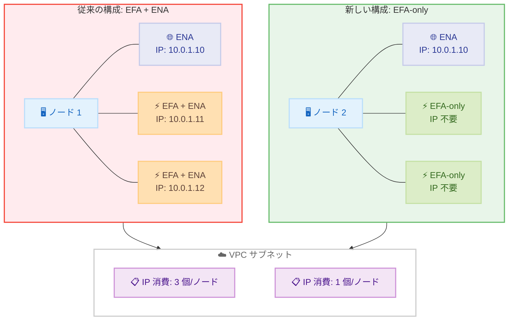

# Amazon SageMaker HyperPod - EFA-only ネットワークインターフェースサポート

**リリース日**: 2026 年 6 月 1 日
**サービス**: Amazon SageMaker HyperPod
**機能**: EFA-only ネットワークインターフェース

📊 [このアップデートのインフォグラフィックを見る](https://takech9203.github.io/aws-news-summary/20260601-amazon-sagemaker-hyperpod-efa-only.html)

## 概要

Amazon SageMaker HyperPod がクラスターインスタンスグループ向けに EFA-only ネットワークインターフェースをサポートしました。これにより、従来の Elastic Network Adapter (ENA) を伴わずに、専用の Elastic Fabric Adapter (EFA) デバイスを構成できるようになります。

SageMaker HyperPod は AI/ML モデル開発に特化したインフラストラクチャであり、組み込みのフォールトトレランスと自動クラスターリカバリを備えた耐障害性の高いハイパフォーマンス環境を提供します。今回の EFA-only サポートにより、VPC 内の IP アドレス枯渇リスクを回避しながら、大規模な AI/ML クラスターへのスケールアウトが可能になります。

**アップデート前の課題**

- EFA インターフェースを構成する際、各インターフェースに ENA デバイスが自動的にアタッチされ、IP アドレスが消費されていた
- 大規模分散トレーニングクラスターでは、ノード間通信に必要のない IP アドレスが大量に消費され、サブネットの IP アドレス枯渇が発生するリスクがあった
- IP アドレス枯渇を回避するためにサブネットの分割や VPC の再設計が必要になる場合があった

**アップデート後の改善**

- `efa-only` オプションにより、ENA デバイスをアタッチせずに EFA トラフィック専用のネットワークインターフェースを割り当て可能になった
- EFA-only インターフェースは IP アドレスを必要としないため、同じサブネット内でより大規模なクラスターへスケール可能になった
- 低レイテンシ・高スループットのノード間通信に専用の EFA インターフェースを最大限に活用できるようになった

## アーキテクチャ図



従来構成では各 EFA インターフェースに ENA が付随し IP アドレスを消費していたが、EFA-only 構成では管理用の ENA 1 つのみ IP アドレスを使用し、残りの EFA インターフェースは IP 不要で動作する。

## サービスアップデートの詳細

### 主要機能

1. **EFA-only ネットワークインターフェースタイプ**
   - `ClusterNetworkInterface` 設定で `efa-only` を指定可能
   - ENA デバイスをアタッチせずに EFA デバイスのみを割り当て
   - EFA トラフィック専用のネットワークインターフェースとして機能

2. **IP アドレス消費の削減**
   - EFA-only インターフェースは IP アドレスを必要としない
   - 管理通信用の最小限の ENA インターフェースのみが IP アドレスを消費
   - サブネット内で利用可能な IP アドレスを大幅に節約

3. **スケーラビリティの向上**
   - 同一サブネット内でより多くのノードを展開可能
   - VPC の IP アドレス空間の制約を受けにくくなった
   - 大規模な分散トレーニングクラスターの構築が容易に

## 技術仕様

### ネットワークインターフェースタイプ比較

| 項目 | efa | efa-only |
|------|-----|----------|
| EFA デバイス | あり | あり |
| ENA デバイス | あり | なし |
| IP アドレス消費 | あり | なし |
| IP ネットワーキング | 可能 | 不可 |
| ノード間 RDMA 通信 | 可能 | 可能 |
| 用途 | IP 通信 + EFA 通信 | EFA 通信専用 |

### API 変更履歴

| 日付 | サービス | 変更内容 |
|------|----------|----------|
| 2026/05/27 | [Amazon SageMaker Service](https://awsapichanges.com/archive/changes/0a7d57-api.sagemaker.html) | 7 updated api methods - CreateCluster/UpdateCluster に NetworkInterface.InterfaceType として efa-only を追加 |

### ClusterNetworkInterface 設定

```json
{
  "NetworkInterface": {
    "InterfaceType": "efa-only"
  }
}
```

## 設定方法

### 前提条件

1. SageMaker HyperPod クラスターを作成/更新する権限を持つ IAM ロール
2. EFA をサポートするインスタンスタイプの選択 (ml.p4d.24xlarge, ml.p5.48xlarge, ml.trn1.32xlarge など)
3. VPC およびサブネットの構成

### 手順

#### ステップ 1: クラスター作成時に EFA-only を指定

```bash
aws sagemaker create-cluster \
  --cluster-name "my-training-cluster" \
  --instance-groups '[
    {
      "InstanceGroupName": "gpu-group",
      "InstanceType": "ml.p5.48xlarge",
      "InstanceCount": 16,
      "LifeCycleConfig": {
        "SourceS3Uri": "s3://my-bucket/lifecycle-scripts/",
        "OnCreate": "on_create.sh"
      },
      "ExecutionRole": "arn:aws:iam::123456789012:role/HyperPodRole",
      "NetworkInterface": {
        "InterfaceType": "efa-only"
      }
    }
  ]' \
  --vpc-config '{
    "SecurityGroupIds": ["sg-12345678"],
    "Subnets": ["subnet-abcdef01"]
  }'
```

CreateCluster API の `InstanceGroups` 内で `NetworkInterface.InterfaceType` に `efa-only` を指定することで、EFA-only ネットワークインターフェースが構成される。

#### ステップ 2: 既存クラスターの更新

```bash
aws sagemaker update-cluster \
  --cluster-name "my-training-cluster" \
  --instance-groups '[
    {
      "InstanceGroupName": "gpu-group",
      "InstanceType": "ml.p5.48xlarge",
      "InstanceCount": 32,
      "LifeCycleConfig": {
        "SourceS3Uri": "s3://my-bucket/lifecycle-scripts/",
        "OnCreate": "on_create.sh"
      },
      "ExecutionRole": "arn:aws:iam::123456789012:role/HyperPodRole",
      "NetworkInterface": {
        "InterfaceType": "efa-only"
      }
    }
  ]'
```

UpdateCluster API でも同様に `NetworkInterface.InterfaceType` に `efa-only` を指定して、既存クラスターのネットワークインターフェースタイプを変更できる。

#### ステップ 3: クラスター状態の確認

```bash
aws sagemaker describe-cluster \
  --cluster-name "my-training-cluster" \
  --query "InstanceGroups[].{Name:InstanceGroupName,Type:InstanceType,NetworkInterface:NetworkInterface}"
```

DescribeCluster API のレスポンスで `NetworkInterface.InterfaceType` が `efa-only` になっていることを確認する。

## メリット

### ビジネス面

- **コスト効率の向上**: VPC の IP アドレス空間を節約することで、追加のサブネットや VPC の作成コストを削減
- **スケーラビリティの実現**: IP アドレス枯渇を心配せずに、ビジネス要件に応じた大規模クラスターを構築可能
- **運用負荷の軽減**: ネットワーク設計の複雑さが軽減され、インフラ管理が容易に

### 技術面

- **ノード間通信の最適化**: EFA インターフェースを IP ネットワーキングのオーバーヘッドなしに EFA トラフィック専用として使用可能
- **VPC 設計の簡素化**: 大規模クラスターでも単一サブネットで運用可能になり、ネットワーク設計がシンプルに
- **高スループット維持**: 低レイテンシ・高スループットのノード間通信性能を維持しながら IP 消費を削減

## デメリット・制約事項

### 制限事項

- EFA-only インターフェースでは IP ベースの通信ができないため、管理通信用に別途 ENA インターフェースが必要
- EFA-only は EFA をサポートするインスタンスタイプでのみ利用可能
- 既存のクラスターを EFA-only に変更する場合、クラスターの更新操作が必要

### 考慮すべき点

- EFA-only インターフェースはノード間の RDMA 通信にのみ使用されるため、IP ベースのアプリケーション通信には使用不可
- 分散トレーニングフレームワークが EFA/RDMA ベースの通信をサポートしている必要がある (NCCL, Gloo など)

## ユースケース

### ユースケース 1: 大規模 LLM 分散トレーニング

**シナリオ**: 数百ノード規模の LLM トレーニングクラスターを構築する際、従来は各ノードの複数 EFA インターフェースが IP アドレスを消費し、/16 サブネットでも IP 枯渇が発生するリスクがあった。

**実装例**:
```json
{
  "InstanceGroups": [
    {
      "InstanceGroupName": "llm-training",
      "InstanceType": "ml.p5.48xlarge",
      "InstanceCount": 256,
      "NetworkInterface": {
        "InterfaceType": "efa-only"
      }
    }
  ]
}
```

**効果**: 256 ノード x 複数 EFA インターフェースの IP 消費がなくなり、単一サブネットで大規模クラスターを運用可能。

### ユースケース 2: マルチテナント VPC での AI クラスター運用

**シナリオ**: 他のワークロードと共有する VPC 内で HyperPod クラスターを運用する場合、IP アドレスの競合を最小限に抑えたい。

**実装例**:
```json
{
  "InstanceGroups": [
    {
      "InstanceGroupName": "shared-vpc-training",
      "InstanceType": "ml.p4d.24xlarge",
      "InstanceCount": 64,
      "NetworkInterface": {
        "InterfaceType": "efa-only"
      }
    }
  ],
  "VpcConfig": {
    "SecurityGroupIds": ["sg-shared-vpc"],
    "Subnets": ["subnet-shared"]
  }
}
```

**効果**: IP アドレス消費を最小限に抑え、他のサービスやワークロードとの IP アドレス競合を回避。

### ユースケース 3: Trainium/Inferentia クラスターの高密度展開

**シナリオ**: AWS Trainium インスタンス (ml.trn1.32xlarge, ml.trn2.48xlarge) を使用した大規模クラスターで、ノード間通信帯域を最大化しながらスケールアウトする。

**実装例**:
```json
{
  "InstanceGroups": [
    {
      "InstanceGroupName": "trainium-cluster",
      "InstanceType": "ml.trn2.48xlarge",
      "InstanceCount": 128,
      "NetworkInterface": {
        "InterfaceType": "efa-only"
      }
    }
  ]
}
```

**効果**: EFA インターフェースを全てノード間通信専用に割り当てることで、分散トレーニングの通信性能を最大化。

## 料金

EFA-only ネットワークインターフェース自体には追加料金は発生しません。SageMaker HyperPod の料金は、使用するインスタンスタイプとインスタンス数に基づきます。

- EFA の使用料金: 追加料金なし
- IP アドレス節約による間接的なコスト削減効果あり (追加サブネット/VPC 不要)

## 利用可能リージョン

Amazon SageMaker HyperPod がサポートされている全ての AWS リージョンで利用可能です。

## 関連サービス・機能

- **Elastic Fabric Adapter (EFA)**: 低レイテンシ・高スループットのノード間通信を実現する AWS のネットワークインターフェース
- **Amazon SageMaker HyperPod**: AI/ML モデル開発に特化した耐障害性クラスターインフラストラクチャ
- **Amazon VPC**: クラスターのネットワーク環境を提供する仮想プライベートクラウド
- **AWS Trainium / Inferentia**: ML ワークロード向けカスタムチップ、EFA-only と組み合わせて利用可能

## 参考リンク

- 📊 [インフォグラフィック](https://takech9203.github.io/aws-news-summary/20260601-amazon-sagemaker-hyperpod-efa-only.html)
- [公式発表 (What's New)](https://aws.amazon.com/about-aws/whats-new/2026/06/amazon-sagemaker-hyperpod-efa-only/)
- [ClusterNetworkInterface API リファレンス](https://docs.aws.amazon.com/sagemaker/latest/APIReference/API_ClusterNetworkInterface.html)
- [SageMaker HyperPod ドキュメント](https://docs.aws.amazon.com/sagemaker/latest/dg/sagemaker-hyperpod.html)
- [Elastic Fabric Adapter ドキュメント](https://docs.aws.amazon.com/AWSEC2/latest/UserGuide/efa.html)
- [SageMaker 料金ページ](https://aws.amazon.com/sagemaker/pricing/)

## まとめ

Amazon SageMaker HyperPod の EFA-only ネットワークインターフェースサポートは、大規模分散 AI/ML トレーニングワークロードを運用するユーザーにとって重要なアップデートです。IP アドレス枯渇の制約を取り除くことで、VPC 設計を複雑にすることなく数百ノード規模のクラスターをスケールできるようになります。大規模 LLM トレーニングや分散学習を計画しているチームは、CreateCluster/UpdateCluster API で `efa-only` を指定するだけで即座にこの機能を活用できるため、早期の導入を推奨します。
