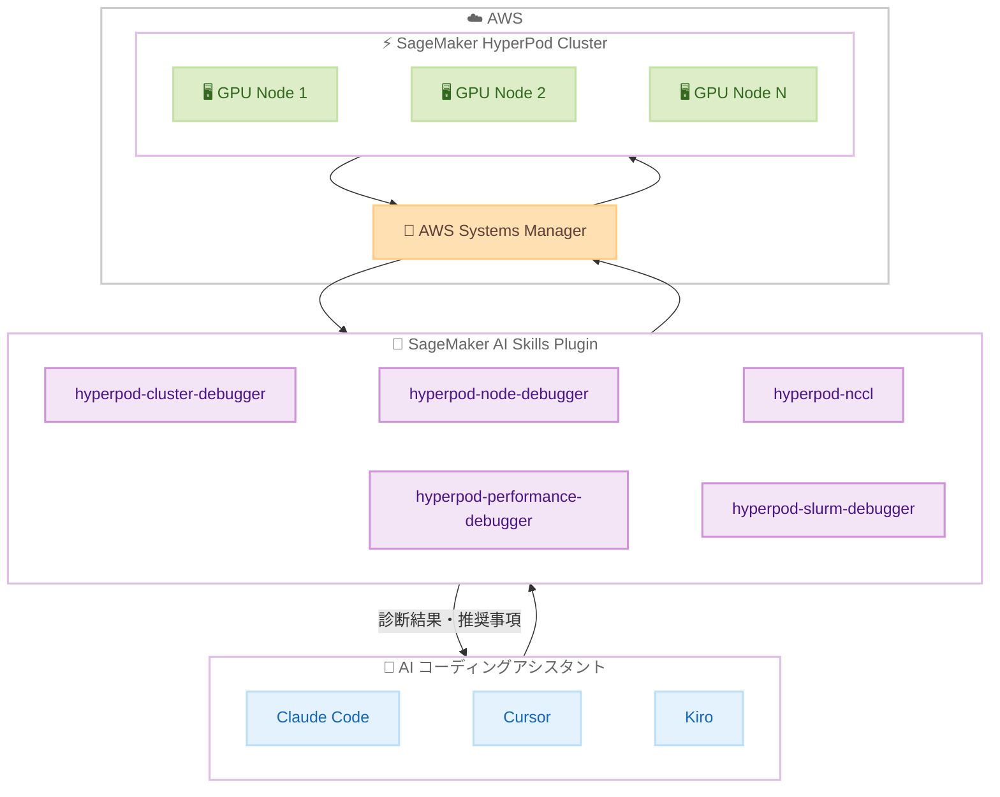

# Amazon SageMaker HyperPod - AI コーディングアシスタント向けトラブルシューティングスキル

**リリース日**: 2026 年 6 月 1 日
**サービス**: Amazon SageMaker HyperPod
**機能**: HyperPod Troubleshooting Skills for AI Coding Assistants

📊 [このアップデートのインフォグラフィックを見る](https://takech9203.github.io/aws-news-summary/20260601-amazon-sagemaker-hyperpod-troubleshooting-skills.html)

## 概要

Amazon SageMaker HyperPod が AI コーディングアシスタント向けのトラブルシューティングスキルを提供開始した。Claude Code、Cursor、Kiro などの AI コーディングアシスタントにエキスパートレベルの AI/ML クラスター診断機能を直接統合し、自然言語でクラスターの問題を診断・解決できるようになる。

本スキルは AWS のベストプラクティスを構造化された診断ワークフローとしてエンコードしており、AI エージェントが AWS Systems Manager を通じてクラスターノードからエビデンスを収集し、パターンを分析し、実行可能な推奨事項を提供する。オープンソースとして GitHub (awslabs/agent-plugins) で公開されており、Slurm および Amazon EKS でオーケストレーションされた HyperPod クラスターの両方に対応している。

**アップデート前の課題**

- GPU ハードウェア障害のデバッグ、NCCL 通信エラーの診断、大規模分散クラスター全体のパフォーマンスボトルネック特定は複雑で時間がかかる作業だった
- 運用者は手動で各ノードに SSM 接続し、多数のインスタンスにまたがるログを解析し、ドキュメントを相互参照する必要があった
- 分散トレーニング・推論インフラのトラブルシューティングには高度な専門知識が必要だった

**アップデート後の改善**

- 自然言語でクラスターの問題を診断・解決でき、必要な時間と専門知識が大幅に削減された
- クラスターヘルス検証、ハードウェア・通信診断、ソフトウェアバージョンドリフト検出、自動診断レポート作成が統合的に利用可能になった
- 既存の HyperPod インフラストラクチャにそのまま適用でき、変更は不要

## アーキテクチャ図



AI コーディングアシスタントがスキルプラグインを介して AWS Systems Manager 経由でクラスターノードの情報を収集し、診断結果をユーザーに返すフローを示している。

## サービスアップデートの詳細

### 主要機能

1. **HyperPod Cluster Debugger**
   - クラスター作成・デプロイ障害の診断
   - EFA ヘルスチェック
   - ライフサイクルスクリプトエラーの特定
   - キャパシティ問題の分析

2. **HyperPod NCCL Debugger**
   - AllReduce タイムアウトの診断
   - EFA/libfabric エラーの特定
   - ランデブー障害の分析
   - コンテナ OOM の検出

3. **HyperPod Node Debugger**
   - GPU ハードウェア障害の診断 (XID、ECC、NVLink)
   - EFA 問題の特定
   - ディスク・メモリプレッシャーの検出
   - コンテナランタイム問題の分析

4. **HyperPod Performance Debugger**
   - ノード間の NCCL 帯域幅の不均一性の検出
   - ファイルシステムスループット問題の特定
   - ストラグラーノードの特定

5. **HyperPod Slurm Debugger**
   - ノードの down/drain 状態の診断
   - ジョブがペンディングのまま停止する問題
   - GRES ミスカウントの検出
   - auto-resume 障害の分析

6. **補助スキル**
   - **hyperpod-ssm**: SSH アクセスなしでのリモートコマンド実行・ファイル転送
   - **hyperpod-version-checker**: ソフトウェアバージョンドリフトや非互換性の検出
   - **hyperpod-issue-report**: サポートケース用の診断レポート自動生成

## 技術仕様

### スキル一覧

| スキル名 | 対象問題 | 対応オーケストレーター |
|----------|----------|------------------------|
| hyperpod-cluster-debugger | クラスター作成障害、EFA、ライフサイクルスクリプト | Slurm / EKS |
| hyperpod-nccl | AllReduce タイムアウト、EFA エラー、ランデブー障害 | Slurm / EKS |
| hyperpod-node-debugger | GPU 障害、EFA、ディスク・メモリ、コンテナランタイム | Slurm / EKS |
| hyperpod-performance-debugger | NCCL 帯域幅不均一、ファイルシステム、ストラグラー | Slurm / EKS |
| hyperpod-slurm-debugger | ノード状態、ジョブペンディング、GRES、auto-resume | Slurm |
| hyperpod-ssm | リモートコマンド実行、ファイル転送 | Slurm / EKS |
| hyperpod-version-checker | ソフトウェアバージョン不整合 | Slurm / EKS |
| hyperpod-issue-report | 診断レポート生成 | Slurm / EKS |

### API 変更履歴

| 日付 | サービス | 変更内容 |
|------|----------|----------|
| 2026/05/27 | [Amazon SageMaker Service](https://awsapichanges.com/archive/changes/0a7d57-api.sagemaker.html) | 7 updated methods - HyperPod 共有環境サポート、RIG 間ワークロードスケジューリング |

### 動作の仕組み

各スキルは以下のワークフローで動作する。

1. ユーザーが自然言語で問題を説明
2. AI エージェントが適切なスキルを選択
3. スキルが構造化された診断ワークフローに従い、AWS Systems Manager 経由でノードからエビデンスを収集
4. 収集したデータのパターンを分析
5. 実行可能な推奨事項をユーザーに提供

## 設定方法

### 前提条件

1. Amazon SageMaker HyperPod クラスターが稼働中であること
2. AWS アカウントに適切な IAM 権限が設定されていること
3. AWS CLI がインストール・設定済みであること
4. `uv` (Python パッケージマネージャー) がインストール済みであること

### 手順

#### ステップ 1: Claude Code へのインストール

```bash
claude plugins marketplace add awslabs/agent-plugins
claude plugins install sagemaker-ai@agent-plugins-for-aws
```

Claude Code のプラグインマーケットプレイスから SageMaker AI プラグインをインストールする。

#### ステップ 2: Cursor へのインストール

```bash
# Cursor Marketplace から直接インストール
# または Cursor 内で以下を実行
/add-plugin sagemaker-ai
```

Cursor IDE 内のコマンドパレットまたはマーケットプレイスからインストールする。

#### ステップ 3: Kiro など他のエージェントへのインストール

```bash
npx skills add https://github.com/awslabs/agent-plugins/tree/main/plugins/sagemaker-ai/skills --all --agent kiro-cli --copy
```

Skills CLI を使用してスキルファイルをローカルにコピーし、`.mcp.json` をエージェントの設定パスにコピーする。

#### ステップ 4: AWS 認証情報の設定

```bash
aws configure
# または環境変数で設定
export AWS_ACCESS_KEY_ID=<your-access-key>
export AWS_SECRET_ACCESS_KEY=<your-secret-key>
export AWS_DEFAULT_REGION=us-east-1
```

ローカル環境で使用する場合は AWS 認証情報を設定する。SageMaker Spaces 経由のリモート環境では追加設定不要。

#### ステップ 5: トラブルシューティングの実行

AI コーディングアシスタントに自然言語で問題を記述するだけで診断が開始される。

```
# 使用例
"My HyperPod cluster creation failed, help me debug it"
"Training is hanging with NCCL timeout errors"
"A node in my cluster is unhealthy, diagnose it"
"My training is slower than expected across nodes"
"Slurm jobs are stuck pending even though nodes show idle"
```

## メリット

### ビジネス面

- **問題解決時間の短縮**: 手動でのログ解析やノード調査が不要になり、障害解決までの時間を大幅に削減
- **専門知識の民主化**: 高度な AI/ML インフラの専門知識がなくても、自然言語で分散システムの問題を診断可能
- **運用コスト削減**: トラブルシューティングに要する人的リソースとダウンタイムの削減

### 技術面

- **体系的な診断アプローチ**: AWS ベストプラクティスに基づく構造化されたワークフローで一貫した診断品質を確保
- **既存インフラとの互換性**: 既存の HyperPod クラスターに変更なしで適用可能
- **マルチオーケストレーター対応**: Slurm と Amazon EKS の両方に対応し、異なる環境でも統一的に利用可能
- **オープンソース**: Apache 2.0 ライセンスでカスタマイズ・拡張が可能

## デメリット・制約事項

### 制限事項

- AI コーディングアシスタント (Claude Code、Cursor、Kiro) のいずれかが必要
- AWS Systems Manager による接続が前提のため、SSM エージェントがクラスターノードに正しく設定されている必要がある
- `AmazonSageMakerFullAccess` 相当の IAM 権限が必要
- Slurm Debugger スキルは EKS オーケストレーションのクラスターでは使用不可

### 考慮すべき点

- 診断ワークフローは AI エージェントによる推論に依存するため、複雑な問題では追加の手動調査が必要な場合がある
- クラスターの規模やノード数によって診断に要する時間が変動する可能性がある
- Kiro IDE では "vibe" モードでスキルが正しくトリガーされるが、"spec" モードでは一貫性が低い場合がある

## ユースケース

### ユースケース 1: GPU ハードウェア障害の迅速な診断

**シナリオ**: 大規模分散トレーニング中に特定のノードで XID エラーが発生し、トレーニングジョブが停止した。

**実装例**:
```
User: "A node in my cluster is unhealthy, I'm seeing XID errors. Diagnose it."
```

**効果**: hyperpod-node-debugger スキルが自動的に該当ノードの GPU 状態、ECC エラー、NVLink ステータスを確認し、障害のあるハードウェアを特定して交換推奨を提示する。

### ユースケース 2: NCCL 通信障害のトラブルシューティング

**シナリオ**: 数百 GPU の分散トレーニングで AllReduce 操作がタイムアウトし、トレーニングが進まない。

**実装例**:
```
User: "Training is hanging with NCCL timeout errors on my 256-GPU cluster"
```

**効果**: hyperpod-nccl スキルが EFA 設定、ネットワークトポロジー、NCCL 環境変数を検査し、通信障害の根本原因と修正手順を提供する。

### ユースケース 3: ソフトウェアバージョンドリフトの検出

**シナリオ**: クラスター拡張後に一部のノードで異なるバージョンの CUDA ドライバーが動作しており、パフォーマンスが不安定。

**実装例**:
```
User: "Check the software versions on all nodes in my HyperPod cluster"
```

**効果**: hyperpod-version-checker がクラスター全ノードのソフトウェアコンポーネントバージョンを比較し、ドリフトが検出されたノードと修正手順を報告する。

## 料金

トラブルシューティングスキル自体はオープンソース (Apache 2.0) で無料。以下の関連サービスの利用料金が発生する。

| コンポーネント | 料金 |
|----------------|------|
| SageMaker AI Skills Plugin | 無料 (オープンソース) |
| Amazon SageMaker HyperPod | クラスター構成に基づく従量課金 |
| AWS Systems Manager | SSM コマンド実行は無料 (標準利用の範囲内) |
| AI コーディングアシスタント | 各アシスタントのサブスクリプション料金 |

## 利用可能リージョン

Amazon SageMaker HyperPod が利用可能なすべてのリージョンで使用可能。スキル自体はオープンソースであり、HyperPod クラスターが存在するリージョンであれば利用できる。

## 関連サービス・機能

- **Amazon SageMaker HyperPod**: 本スキルの対象となる分散トレーニング・推論インフラストラクチャ
- **AWS Systems Manager**: クラスターノードへのリモートアクセスとコマンド実行の基盤
- **Amazon EKS**: HyperPod のオーケストレーションオプションの 1 つ
- **Slurm**: HyperPod のオーケストレーションオプションの 1 つ (HPC ワークロードスケジューラー)
- **Amazon FSx for Lustre**: HyperPod クラスターの共有ファイルシステムとして使用されることが多い

## 参考リンク

- 📊 [インフォグラフィック](https://takech9203.github.io/aws-news-summary/20260601-amazon-sagemaker-hyperpod-troubleshooting-skills.html)
- [公式発表 (What's New)](https://aws.amazon.com/about-aws/whats-new/2026/06/amazon-sagemaker-hyperpod-troubleshooting-skills/)
- [SageMaker AI Skills Plugin - GitHub](https://github.com/awslabs/agent-plugins/tree/main/plugins/sagemaker-ai)
- [Amazon SageMaker HyperPod ドキュメント](https://docs.aws.amazon.com/sagemaker/latest/dg/sagemaker-hyperpod.html)

## まとめ

Amazon SageMaker HyperPod のトラブルシューティングスキルは、分散 AI/ML インフラの運用における大きな課題であった障害診断の複雑さを、AI コーディングアシスタントとの統合によって解決するアップデートである。GPU 障害、NCCL 通信エラー、パフォーマンスボトルネックなどの問題を自然言語で診断できるようになり、専門知識の有無にかかわらず迅速な問題解決が可能になった。HyperPod を利用している組織は、既存のインフラを変更することなく即座にこのスキルを導入し、運用効率の向上を図ることを推奨する。
