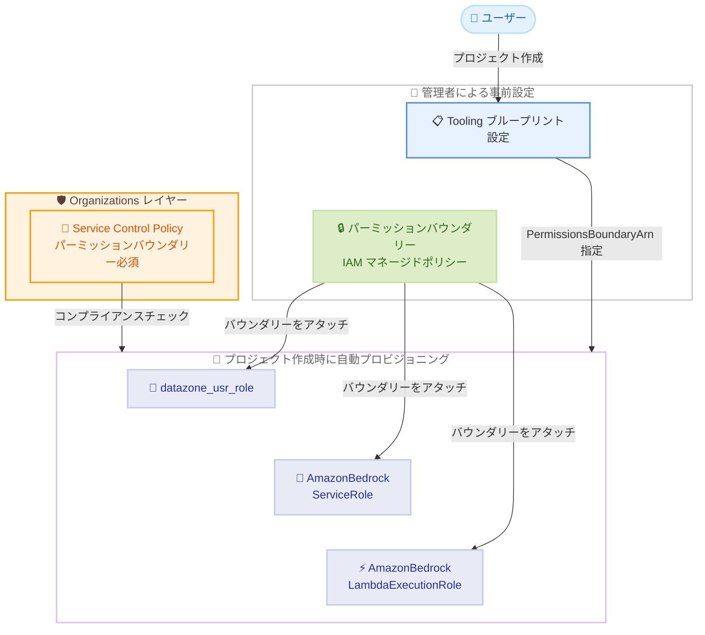

# Amazon SageMaker Unified Studio - IAM パーミッションバウンダリーによる SCP コンプライアンス対応

**リリース日**: 2026 年 6 月 1 日
**サービス**: Amazon SageMaker Unified Studio
**機能**: Tooling ブループリントにおけるカスタム IAM パーミッションバウンダリーの設定

📊 [このアップデートのインフォグラフィックを見る](https://takech9203.github.io/aws-news-summary/20260601-amazon-sagemaker-scp.html)

## 概要

Amazon SageMaker Unified Studio が、Tooling ブループリントで作成される IAM ロールに対してカスタムパーミッションバウンダリーを設定する機能をサポートした。これにより、Service Control Policies (SCPs) ですべての IAM ロールにパーミッションバウンダリーを要求する組織でも、既存のセキュリティポスチャーを変更することなく SageMaker Unified Studio を導入できるようになった。

SageMaker Unified Studio では、ユーザーがプロジェクトを作成する際にプロジェクトユーザーロール、Amazon Bedrock サービスロール、Bedrock Lambda 実行ロールの 3 つの IAM ロールが自動的にプロビジョニングされる。本アップデートにより、管理者が Tooling ブループリント構成にパーミッションバウンダリーを指定することで、これら 3 つのロールすべてに対して指定したバウンダリーが自動的にアタッチされるようになった。

**アップデート前の課題**

- SCP でパーミッションバウンダリーを必須とする組織では、SageMaker Unified Studio がプロビジョニングする IAM ロールがバウンダリーなしで作成されるため、プロジェクト作成が SCP 違反で失敗していた
- 回避策として SCP を緩和する必要があり、組織全体のセキュリティポスチャーが低下する可能性があった
- プロビジョニングされたロールの権限を組織のポリシーに合わせて制限する統一的な手段がなかった
- 新規プロジェクト作成のたびに管理者が手動で IAM ロールにバウンダリーをアタッチする運用が必要だった

**アップデート後の改善**

- Tooling ブループリント構成で `PermissionsBoundaryArn` を指定するだけで、3 つの IAM ロールすべてにパーミッションバウンダリーが自動アタッチされるようになった
- SCP 要件がロール作成時に満たされるため、管理者の介入なしにプロジェクトプロビジョニングが成功する
- ブループリントレベルで設定されるため、すべての新規プロジェクトに自動的に適用される
- パーミッションバウンダリーにより、プロビジョニングされたロールの権限上限も制御可能になった

## アーキテクチャ図



管理者が Tooling ブループリントにパーミッションバウンダリー ARN を設定すると、プロジェクト作成時にプロビジョニングされる 3 つの IAM ロールすべてに自動的にバウンダリーがアタッチされ、SCP コンプライアンスを満たす。

## サービスアップデートの詳細

### 主要機能

1. **Tooling ブループリントでのパーミッションバウンダリー設定**
   - `regionalParameters` に `PermissionsBoundaryArn` パラメータを追加
   - リージョンごとに異なるパーミッションバウンダリーを指定可能
   - `put-environment-blueprint-configuration` API で設定

2. **3 つの IAM ロールへの自動アタッチ**
   - `datazone_usr_role`: プロジェクトユーザーが使用するロール
   - `AmazonBedrockServiceRole`: Amazon Bedrock サービスが使用するロール
   - `AmazonBedrockLambdaExecutionRole`: Bedrock Lambda 実行ロール
   - CloudFormation スタック実行時に自動的にバウンダリーがアタッチされる

3. **ブループリントレベルの一元管理**
   - 設定はブループリントレベルで行われ、すべての新規プロジェクトに自動適用
   - 個別プロジェクトごとの設定は不要
   - 管理者の介入なしでプロジェクトプロビジョニングが完了

## 技術仕様

### パーミッションバウンダリーの適用対象

| 項目 | 詳細 |
|------|------|
| 対象ロール | `datazone_usr_role`, `AmazonBedrockServiceRole`, `AmazonBedrockLambdaExecutionRole` |
| 設定レベル | Tooling ブループリント構成 (リージョナルパラメータ) |
| パラメータ名 | `PermissionsBoundaryArn` |
| 値の形式 | IAM マネージドポリシーの ARN |
| 適用範囲 | 新規作成プロジェクトのみ (既存プロジェクトには影響なし) |
| 選択的適用 | 不可 (3 ロールすべてに同一バウンダリーが適用) |

### API 変更履歴

| 日付 | サービス | 変更内容 |
|------|----------|----------|
| 2026/05/26 | [datazone](https://awsapichanges.com/archive/changes/e7ba6b-datazone.html) | 3 updated methods - resourceConfigurations と allowUserProvidedConfigurations フィールドの追加 |

### 設定パラメータの構造

```json
{
    "regionalParameters": {
        "us-east-1": {
            "AZs": "us-east-1a,us-east-1b",
            "S3Location": "s3://bucket-name/prefix",
            "Subnets": "subnet-xxx,subnet-yyy",
            "VpcId": "vpc-xxx",
            "PermissionsBoundaryArn": "arn:aws:iam::123456789012:policy/SageMakerBoundaryPolicy"
        }
    }
}
```

## 設定方法

### 前提条件

1. Identity Center ベースのドメインで Tooling ブループリントが有効化されていること
2. AWS CLI がドメイン構成を管理する権限で設定されていること
3. パーミッションバウンダリーとして使用する IAM マネージドポリシーが対象アカウントに存在すること

### 手順

#### ステップ 1: ドメイン ID の取得

```bash
aws datazone list-domains \
    --region us-east-1 \
    --query "items[?name=='my-domain'].id | [0]" \
    --output text
```

SageMaker Unified Studio ドメインの識別子を取得する。

#### ステップ 2: Tooling ブループリント ID の取得

```bash
aws datazone list-environment-blueprints \
    --domain-identifier d-xxxxxxxxxxxx \
    --managed \
    --region us-east-1 \
    --query "items[?name=='Tooling'].id | [0]" \
    --output text
```

Tooling ブループリントの識別子を取得する。

#### ステップ 3: 現在のブループリント構成の取得

```bash
aws datazone get-environment-blueprint-configuration \
    --domain-identifier d-xxxxxxxxxxxx \
    --environment-blueprint-identifier bp-xxxxxxxxxxxx \
    --region us-east-1
```

既存の設定値 (`provisioningRoleArn`, `manageAccessRoleArn`, `enabledRegions`, `regionalParameters`) を記録する。次のステップで上書きモードの API を使用するため、すべての既存値が必要になる。

#### ステップ 4: パーミッションバウンダリーの設定

```bash
aws datazone put-environment-blueprint-configuration \
    --domain-identifier d-xxxxxxxxxxxx \
    --environment-blueprint-identifier bp-xxxxxxxxxxxx \
    --enabled-regions '["us-east-1"]' \
    --provisioning-role-arn "arn:aws:iam::123456789012:role/ProvisioningRole" \
    --manage-access-role-arn "arn:aws:iam::123456789012:role/ManageAccessRole" \
    --regional-parameters '{
        "us-east-1": {
            "AZs": "us-east-1a,us-east-1b",
            "S3Location": "s3://my-bucket/prefix",
            "Subnets": "subnet-xxx,subnet-yyy",
            "VpcId": "vpc-xxx",
            "PermissionsBoundaryArn": "arn:aws:iam::123456789012:policy/SageMakerBoundaryPolicy"
        }
    }' \
    --region us-east-1
```

`put-environment-blueprint-configuration` API は上書きモードで動作する。既存のすべての値を含め、新たに `PermissionsBoundaryArn` を追加して実行する。既存パラメータを省略すると削除されるため注意が必要。

#### ステップ 5: 設定の確認

```bash
aws datazone get-environment-blueprint-configuration \
    --domain-identifier d-xxxxxxxxxxxx \
    --environment-blueprint-identifier bp-xxxxxxxxxxxx \
    --region us-east-1 \
    --query "regionalParameters.\"us-east-1\".PermissionsBoundaryArn"
```

設定したパーミッションバウンダリー ARN が正しく反映されていることを確認する。

## メリット

### ビジネス面

- **セキュリティポスチャーの維持**: SCP を緩和する必要がなく、既存のセキュリティ基準を維持したまま SageMaker Unified Studio を導入可能
- **運用コストの削減**: プロジェクト作成のたびに管理者が手動でバウンダリーをアタッチする運用が不要になり、セルフサービス化を実現
- **ガバナンスの強化**: プロジェクトレベルの権限上限をブループリントで一元管理でき、組織全体で統一的なセキュリティ制御を維持

### 技術面

- **SCP コンプライアンスの自動達成**: ロール作成時にバウンダリーが自動アタッチされるため、SCP 違反によるプロビジョニング失敗が解消
- **最小権限の原則の実装**: パーミッションバウンダリーでプロビジョニングされたロールの有効権限を制限可能
- **スケーラブルな管理**: ブループリントレベルの設定で、プロジェクト数が増加しても管理負荷が変わらない

## デメリット・制約事項

### 制限事項

- 既存プロジェクトには適用されない (新規プロジェクトのみが対象)
- 3 つのロールすべてに同一のバウンダリーが適用され、ロールごとに異なるバウンダリーを設定することはできない
- `PermissionsBoundaryArn` で指定した IAM ポリシーが削除されるか ARN が無効な場合、プロジェクトプロビジョニングが失敗する
- `put-environment-blueprint-configuration` API は上書きモードのため、既存パラメータの指定漏れに注意が必要

### 考慮すべき点

- パーミッションバウンダリーの設計時に、SageMaker Unified Studio の各ロールが必要とする権限を考慮する必要がある (バウンダリーが厳しすぎるとプロジェクト機能が制限される)
- マルチリージョン構成の場合、各リージョンごとに `PermissionsBoundaryArn` を設定する必要がある
- パーミッションバウンダリーポリシーの変更は、既にアタッチ済みのロールにも即座に影響する

## ユースケース

### ユースケース 1: エンタープライズにおける SCP 準拠の SageMaker 導入

**シナリオ**: 大企業のクラウドセキュリティチームが、すべての IAM ロールにパーミッションバウンダリーを必須とする SCP を組織全体に適用している。データサイエンスチームが SageMaker Unified Studio を使用してプロジェクトを作成したいが、従来は SCP 違反で失敗していた。

**実装例**:
```json
{
    "PermissionsBoundaryArn": "arn:aws:iam::123456789012:policy/EnterpriseBoundary"
}
```

**効果**: セキュリティチームは SCP を維持したまま、データサイエンスチームがセルフサービスでプロジェクトを作成可能になる。

### ユースケース 2: マルチアカウント環境での権限制御

**シナリオ**: AWS Organizations でマルチアカウント構成を運用する組織が、開発アカウントで SageMaker Unified Studio を利用する際に、プロジェクトロールが特定のリソースやアクションのみアクセスできるよう制限したい。

**実装例**:
```json
{
    "Version": "2012-10-17",
    "Statement": [
        {
            "Effect": "Allow",
            "Action": [
                "s3:*",
                "bedrock:*",
                "sagemaker:*"
            ],
            "Resource": "*"
        },
        {
            "Effect": "Deny",
            "Action": [
                "iam:CreateUser",
                "iam:CreateRole",
                "organizations:*"
            ],
            "Resource": "*"
        }
    ]
}
```

**効果**: プロジェクトロールが必要な SageMaker や Bedrock のアクションを実行しつつ、IAM ユーザー作成や Organizations 操作など機密性の高いアクションを防止できる。

### ユースケース 3: コンプライアンス監査への対応

**シナリオ**: 金融業界の企業が、規制要件としてすべての IAM ロールに権限上限を設定することを求められている。監査チームが SageMaker Unified Studio で自動作成されるロールにもバウンダリーが適用されていることを確認する必要がある。

**実装例**:
```bash
# 監査用: ブループリント構成の確認
aws datazone get-environment-blueprint-configuration \
    --domain-identifier d-xxxxxxxxxxxx \
    --environment-blueprint-identifier bp-xxxxxxxxxxxx \
    --region us-east-1 \
    --query "regionalParameters.\"us-east-1\".PermissionsBoundaryArn"

# 監査用: プロビジョニングされたロールのバウンダリー確認
aws iam get-role --role-name datazone_usr_role_xxxxx \
    --query "Role.PermissionsBoundary.PermissionsBoundaryArn"
```

**効果**: ブループリント構成と実際のロール設定の両方で、パーミッションバウンダリーの適用を証跡として確認でき、コンプライアンス監査に対応可能。

## 料金

本機能自体に追加料金は発生しない。IAM パーミッションバウンダリーは IAM の標準機能であり、追加コストなしで利用可能。SageMaker Unified Studio の利用料金は従来通り。

## 利用可能リージョン

Amazon SageMaker Unified Studio が利用可能なすべての AWS リージョンで使用可能。

- US East (N. Virginia) - us-east-1
- US East (Ohio) - us-east-2
- US West (Oregon) - us-west-2
- Asia Pacific (Tokyo) - ap-northeast-1
- Asia Pacific (Seoul) - ap-northeast-2
- Asia Pacific (Singapore) - ap-southeast-1
- Asia Pacific (Sydney) - ap-southeast-2
- Asia Pacific (Mumbai) - ap-south-1
- Canada (Central) - ca-central-1
- Europe (Ireland) - eu-west-1
- Europe (London) - eu-west-2
- Europe (Frankfurt) - eu-central-1
- Europe (Paris) - eu-west-3
- Europe (Stockholm) - eu-north-1
- South America (Sao Paulo) - sa-east-1

## 関連サービス・機能

- **AWS IAM パーミッションバウンダリー**: IAM エンティティの有効権限の上限を設定する機能。今回のアップデートで SageMaker Unified Studio のロールプロビジョニングに統合された
- **AWS Organizations Service Control Policies**: 組織内のアカウントに対してアクセス許可のガードレールを設定するポリシー。パーミッションバウンダリー必須の SCP と組み合わせて使用
- **Amazon DataZone**: SageMaker Unified Studio の基盤サービス。ブループリント構成 API は DataZone API を通じて提供される
- **Amazon Bedrock**: SageMaker Unified Studio のプロジェクトで使用される AI サービス。プロビジョニングされる 3 ロール中 2 ロールが Bedrock 関連

## 参考リンク

- 📊 [インフォグラフィック](https://takech9203.github.io/aws-news-summary/20260601-amazon-sagemaker-scp.html)
- [公式発表 (What's New)](https://aws.amazon.com/about-aws/whats-new/2026/05/amazon-sagemaker-scp/)
- [Manage Tooling blueprint parameters - ドキュメント](https://docs.aws.amazon.com/sagemaker-unified-studio/latest/adminguide/manage-tooling-blueprint.html)
- [Permissions boundaries for IAM entities - IAM ユーザーガイド](https://docs.aws.amazon.com/IAM/latest/UserGuide/access_policies_boundaries.html)
- [SageMaker Unified Studio 対応リージョン](https://docs.aws.amazon.com/sagemaker-unified-studio/latest/adminguide/supported-regions.html)
- [Amazon SageMaker 料金ページ](https://aws.amazon.com/sagemaker/pricing/)

## まとめ

本アップデートにより、SCP でパーミッションバウンダリーを必須とする組織が、セキュリティポスチャーを変更することなく SageMaker Unified Studio を導入できるようになった。Tooling ブループリントに `PermissionsBoundaryArn` を設定するだけで、プロジェクト作成時にプロビジョニングされる 3 つの IAM ロールすべてにバウンダリーが自動アタッチされる。エンタープライズ環境でのガバナンス要件を満たしつつ、データサイエンスチームのセルフサービス化を推進する上で重要な機能強化である。
