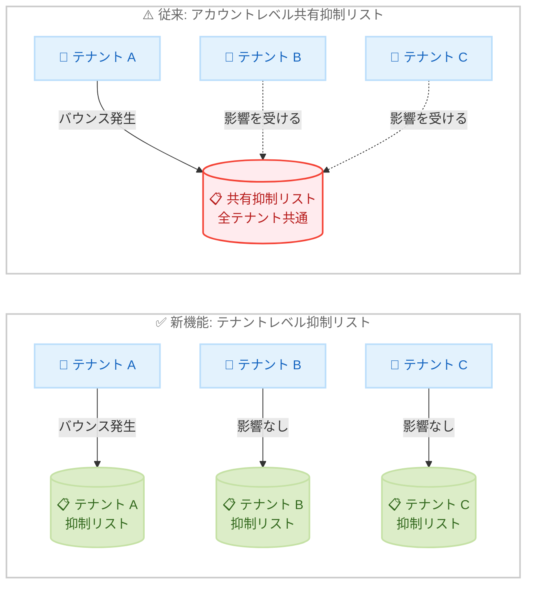

# Amazon SES - テナントレベル抑制リスト

**リリース日**: 2026 年 6 月 1 日
**サービス**: Amazon Simple Email Service (Amazon SES)
**機能**: テナントレベル抑制リスト (Tenant-Level Suppression Lists)

:bar_chart: [このアップデートのインフォグラフィックを見る](https://takech9203.github.io/aws-news-summary/20260601-amazon-ses-tenant-level-suppression-lists.html)

## 概要

Amazon SES がテナントレベルの抑制リスト (Suppression Lists) をサポートしました。この機能により、マルチテナント環境でメール送信を行う場合に、テナントごとに独立した抑制リストを維持できるようになります。バウンスや苦情がテナント間で相互に影響し合う問題を解消し、各テナントのメール配信品質を独立して管理できます。

この機能は、単一の SES アカウントから複数の異なるメールストリームを管理するすべての送信者にとって有益です。SaaS プロバイダー、複数事業部門を持つ企業、複数ブランドのキャンペーンを管理する代理店など、幅広いユースケースに対応します。

**アップデート前の課題**

- 同一アカウント内のすべてのテナントが単一の抑制リストを共有しており、あるテナントのバウンスや苦情が他のテナントのメール送信にも影響していた
- テナント A の受信者がバウンスした場合、テナント B からのメールもその宛先に送信できなくなっていた
- テナント間のメール配信品質を独立して管理するためには、アカウントを分離する必要があった
- マルチテナント SaaS アプリケーションにおいて、1 つの顧客のメール問題が他の顧客に波及するリスクがあった

**アップデート後の改善**

- 各テナントが独立した抑制リストを持ち、バウンスや苦情が該当テナントにのみ影響するようになった
- テナント間の「クロステナント汚染」が防止され、メール配信の信頼性が向上した
- 単一アカウントで複数テナントを安全に管理できるようになり、アカウント分離が不要になった
- API 操作で `TenantName` パラメータを指定するだけで、テナント単位の抑制リスト管理が可能になった

## アーキテクチャ図



従来はアカウント内の全テナントが単一の抑制リストを共有していたため、1 つのテナントのバウンスが他テナントに影響していました。新機能によりテナントごとに独立した抑制リストが維持され、クロステナント汚染が防止されます。

## サービスアップデートの詳細

### 主要機能

1. **テナントレベルの抑制分離**
   - 各テナントが独立した抑制リストを保持
   - テナント間でバウンスや苦情が相互に影響しない
   - 1 つのテナントに対して 1 つの抑制リストが 1:1 でマッピング

2. **設定可能な抑制動作**
   - `SuppressionScope`: `TENANT` または `ACCOUNT` を選択
   - `SuppressedReasons`: `BOUNCE`、`COMPLAINT`、または両方を選択
   - `PutTenantSuppressionAttributes` API で設定可能
   - テナント作成時に `CreateTenant` API の `SuppressionAttributes` で指定も可能

3. **自動記録と管理**
   - SES がバウンスと苦情を自動的に適切なテナントのリストに記録
   - ハードバウンスはテナント抑制リストとグローバル抑制リストに追加
   - 苦情はテナント抑制リストにのみ追加
   - 「not-spam」フィードバック時に苦情エントリを自動削除

4. **Configuration Set によるオーバーライド**
   - Configuration Set の `SuppressionOptions` に `SuppressionScope` フィールドを追加
   - スコープのみ、理由のみ、または両方を個別にオーバーライド可能
   - テナントのデフォルト設定を変更せずに特定の送信ワークフローを制御

## 技術仕様

### 抑制動作マトリクス

| スコープ | 理由 | 送信時の動作 | 記録動作 |
|----------|------|--------------|----------|
| TENANT | BOUNCE, COMPLAINT | テナントリストでバウンスと苦情をチェック | 両方をテナントリストに記録 |
| TENANT | BOUNCE | テナントリストでバウンスのみチェック | バウンスのみテナントリストに記録 |
| TENANT | COMPLAINT | テナントリストで苦情のみチェック | 苦情のみテナントリストに記録 |
| TENANT | 空 | 抑制チェックなし | 記録なし |
| ACCOUNT | BOUNCE, COMPLAINT | アカウントリストでバウンスと苦情をチェック | 両方をアカウントリストに記録 |
| ACCOUNT | 空 | 抑制チェックなし | 記録なし |

### 優先順位

SES は以下の優先順位で抑制設定を解決します。

| 優先順位 | 設定レベル | 説明 |
|----------|------------|------|
| 1 (最高) | Configuration Set | Configuration Set に設定がある場合はそれを使用 |
| 2 | テナント | Configuration Set のオーバーライドがない場合はテナント設定を使用 |
| 3 (最低) | アカウント | テナント設定もない場合はアカウントレベルのデフォルトを使用 |

### テナント抑制バウンスの識別

| 識別方法 | 値 |
|----------|-----|
| バウンス通知 | Type: `Permanent`, Subtype: `OnTenantSuppressionList` |
| VDM バウンス理由 | `ON_TENANT_SUPPRESSION_LIST` |
| 診断コード | `Amazon SES did not send the message to this address because it is on the suppression list for your tenant.` |
| イベントタグ | `ses:tenant-name` タグがバウンス/苦情通知に付与 |

### API 操作

| API | 説明 |
|-----|------|
| `PutTenantSuppressionAttributes` | テナントの抑制設定を構成 |
| `CreateTenant` | テナント作成時に `SuppressionAttributes` を指定 |
| `PutSuppressedDestination` | テナントの抑制リストにアドレスを追加 |
| `GetSuppressedDestination` | テナントの抑制アドレス詳細を取得 |
| `DeleteSuppressedDestination` | テナントの抑制リストからアドレスを削除 |
| `ListSuppressedDestinations` | テナントの全抑制アドレスを一覧表示 |

## 設定方法

### 前提条件

1. SES マルチテナンシーが構成されており、少なくとも 1 つのテナントが作成済みであること
2. SES アカウントが本番環境アクセスを持っていること (サンドボックスでは `PutSuppressedDestination` を呼び出せない)
3. 適切な IAM 権限が設定されていること

### 手順

#### ステップ 1: テナントの抑制属性を設定

```bash
aws sesv2 put-tenant-suppression-attributes \
  --tenant-name "customer-a" \
  --suppression-attributes '{
    "SuppressionScope": "TENANT",
    "SuppressedReasons": ["BOUNCE", "COMPLAINT"]
  }'
```

テナント `customer-a` の抑制スコープを `TENANT` に設定し、バウンスと苦情の両方を記録対象に指定します。

#### ステップ 2: テナントの抑制リストにアドレスを手動追加

```bash
aws sesv2 put-suppressed-destination \
  --email-address "bounced@example.com" \
  --reason "BOUNCE" \
  --tenant-name "customer-a"
```

特定のメールアドレスをテナントの抑制リストに手動で追加します。`TenantName` パラメータを省略するとアカウントレベルのリストに追加されます。

#### ステップ 3: テナントの抑制リストを確認

```bash
aws sesv2 list-suppressed-destinations \
  --tenant-name "customer-a"
```

テナントの抑制リストに登録されている全アドレスを一覧表示します。

#### ステップ 4: 抑制アドレスを削除

```bash
aws sesv2 delete-suppressed-destination \
  --email-address "bounced@example.com" \
  --tenant-name "customer-a"
```

テナントの抑制リストから特定のアドレスを削除し、再度メール送信可能にします。

#### ステップ 5: 抑制設定をクリア

```bash
aws sesv2 put-tenant-suppression-attributes \
  --tenant-name "customer-a" \
  --suppression-attributes '{
    "SuppressionScope": null,
    "SuppressedReasons": null
  }'
```

テナントの抑制設定をクリアし、デフォルトの `ACCOUNT` スコープ動作に戻します。

## メリット

### ビジネス面

- **顧客間影響の排除**: マルチテナント SaaS 環境で、1 つの顧客のメール問題が他の顧客に影響しなくなる
- **アカウント統合の実現**: テナント分離のためにアカウントを分ける必要がなくなり、運用コストが削減される
- **メール配信品質の向上**: 各テナントが独立した配信レピュテーションを維持でき、全体的な配信率が向上する

### 技術面

- **きめ細かい制御**: テナント単位、Configuration Set 単位での抑制動作カスタマイズが可能
- **後方互換性**: `TenantName` パラメータを省略すれば既存の動作が維持され、移行リスクが低い
- **自動化対応**: API ベースの管理により、プログラマティックな抑制リスト運用が可能
- **イベント追跡**: `ses:tenant-name` タグにより、どのテナントのイベントかを容易に識別可能

## デメリット・制約事項

### 制限事項

- SES マルチテナンシーが必須であり、マルチテナンシーを構成していないアカウントでは利用不可
- テナントあたり 1 つの抑制リストのみ (1:1 マッピング)
- 抑制リストはリージョン固有であり、クロスリージョンでの共有はできない
- メールアドレスは大文字小文字を区別して保存され、API 操作時に完全一致が必要
- Gmail は苦情データを SES に送信しないため、Gmail アドレスは苦情による自動追加の対象外
- サンドボックス環境では `PutSuppressedDestination` を呼び出せない
- テナントを削除すると、そのテナントの全抑制リストエントリも削除される

### 考慮すべき点

- テナント抑制リストで抑制されたメッセージも日次送信クォータにカウントされる
- スコープが `TENANT` の場合、アカウントレベルの抑制リストはチェックされない (アカウントリストにあるがテナントリストにないアドレスは抑制されない)
- `SuppressionScope` と `SuppressedReasons` は必ずセットで指定するか、両方を null に設定する必要がある

## ユースケース

### ユースケース 1: SaaS プロバイダーのマルチテナントメール送信

**シナリオ**: SaaS プラットフォームが複数の顧客企業に代わってメールを送信しており、ある顧客のバウンス問題が他の顧客に影響するのを防ぎたい。

**実装例**:
```bash
# 各顧客テナントにテナントレベル抑制を設定
aws sesv2 put-tenant-suppression-attributes \
  --tenant-name "acme-corp" \
  --suppression-attributes '{
    "SuppressionScope": "TENANT",
    "SuppressedReasons": ["BOUNCE", "COMPLAINT"]
  }'

aws sesv2 put-tenant-suppression-attributes \
  --tenant-name "beta-inc" \
  --suppression-attributes '{
    "SuppressionScope": "TENANT",
    "SuppressedReasons": ["BOUNCE", "COMPLAINT"]
  }'
```

**効果**: 顧客 A のバウンスが顧客 B のメール送信に影響しなくなり、各顧客が独立した配信品質を維持できる。

### ユースケース 2: 企業内のトランザクションメールとマーケティングメールの分離

**シナリオ**: 1 つのアカウントからトランザクションメール (注文確認、パスワードリセット) とマーケティングメール (ニュースレター、プロモーション) を送信しており、マーケティングメールへの苦情がトランザクションメールに影響するのを防ぎたい。

**実装例**:
```bash
# トランザクションメール用テナント
aws sesv2 put-tenant-suppression-attributes \
  --tenant-name "transactional" \
  --suppression-attributes '{
    "SuppressionScope": "TENANT",
    "SuppressedReasons": ["BOUNCE"]
  }'

# マーケティングメール用テナント
aws sesv2 put-tenant-suppression-attributes \
  --tenant-name "marketing" \
  --suppression-attributes '{
    "SuppressionScope": "TENANT",
    "SuppressedReasons": ["BOUNCE", "COMPLAINT"]
  }'
```

**効果**: マーケティングメールへの苦情がトランザクションメールの配信に影響せず、重要な業務メールの到達率を維持できる。

### ユースケース 3: 代理店のマルチブランドキャンペーン管理

**シナリオ**: マーケティング代理店が複数のブランドのメールキャンペーンを管理しており、ブランドごとに独立した抑制管理を行いたい。

**実装例**:
```bash
# ブランド A のテナント設定
aws sesv2 put-tenant-suppression-attributes \
  --tenant-name "brand-alpha" \
  --suppression-attributes '{
    "SuppressionScope": "TENANT",
    "SuppressedReasons": ["BOUNCE", "COMPLAINT"]
  }'

# ブランド A の抑制リスト確認
aws sesv2 list-suppressed-destinations \
  --tenant-name "brand-alpha"

# 特定アドレスの抑制状態を確認
aws sesv2 get-suppressed-destination \
  --email-address "user@example.com" \
  --tenant-name "brand-alpha"
```

**効果**: ブランドごとに独立した配信レピュテーションを管理でき、あるブランドのキャンペーンでの問題が他のブランドに波及しない。

## 料金

テナントレベル抑制リスト機能の追加料金に関する具体的な情報は、現時点では公式発表に含まれていません。Amazon SES の既存のマルチテナンシー機能と同様の料金体系が適用される見込みです。

Amazon SES の基本料金は以下の通りです。

| 項目 | 料金 |
|------|------|
| メール送信 (EC2 からの送信) | 最初の 62,000 通/月は無料、以降 $0.10/1,000 通 |
| メール送信 (その他) | $0.10/1,000 通 |
| 添付ファイル | $0.12/GB |

詳細な料金については AWS 公式料金ページを参照してください。

## 利用可能リージョン

公式発表では具体的なリージョン情報は記載されていませんが、テナントレベル抑制リストはリージョン固有の機能です。Amazon SES が利用可能なリージョンで順次提供されると考えられます。Amazon SES は現在、以下を含む多数のリージョンで利用可能です。

- 米国東部 (バージニア北部、オハイオ)
- 米国西部 (オレゴン)
- アジアパシフィック (東京、シンガポール、シドニー、ムンバイ、ソウル)
- 欧州 (フランクフルト、アイルランド、ロンドン)
- その他多数のリージョン

## 関連サービス・機能

- **Amazon SES マルチテナンシー**: テナントレベル抑制リストの前提機能。テナントの作成と管理を担当
- **Amazon SES アカウントレベル抑制リスト**: 従来のアカウント全体で共有される抑制リスト。テナントレベルと併用可能
- **Amazon SES グローバル抑制リスト**: AWS 全体で管理される抑制リスト。ハードバウンスは自動的に追加される
- **Amazon SES Configuration Sets**: テナントの抑制設定をオーバーライドする際に使用。送信ワークフロー単位での制御が可能
- **Virtual Deliverability Manager (VDM)**: メール配信のモニタリングと最適化。テナント抑制バウンスの理由を確認可能

## 参考リンク

- :bar_chart: [インフォグラフィック](https://takech9203.github.io/aws-news-summary/20260601-amazon-ses-tenant-level-suppression-lists.html)
- [公式発表 (What's New)](https://aws.amazon.com/about-aws/whats-new/2026/06/amazon-ses-tenant-level-suppression-lists/)
- [テナントレベル抑制リスト ドキュメント](https://docs.aws.amazon.com/ses/latest/dg/sending-email-suppression-list-tenant-level.html)
- [Amazon SES 料金ページ](https://aws.amazon.com/ses/pricing/)
- [Amazon SES コンソール](https://console.aws.amazon.com/ses)

## まとめ

Amazon SES のテナントレベル抑制リストは、マルチテナント環境でメール送信を行う組織にとって重要なアップデートです。テナント間の「クロステナント汚染」を防止し、各テナントが独立したメール配信品質を維持できるようになります。SaaS プロバイダー、複数事業部門を持つ企業、マルチブランド代理店は、アカウント分離なしにテナント単位のメール配信管理を実現でき、運用の簡素化とコスト削減が期待できます。既存の API との後方互換性も維持されているため、段階的な移行が可能です。
