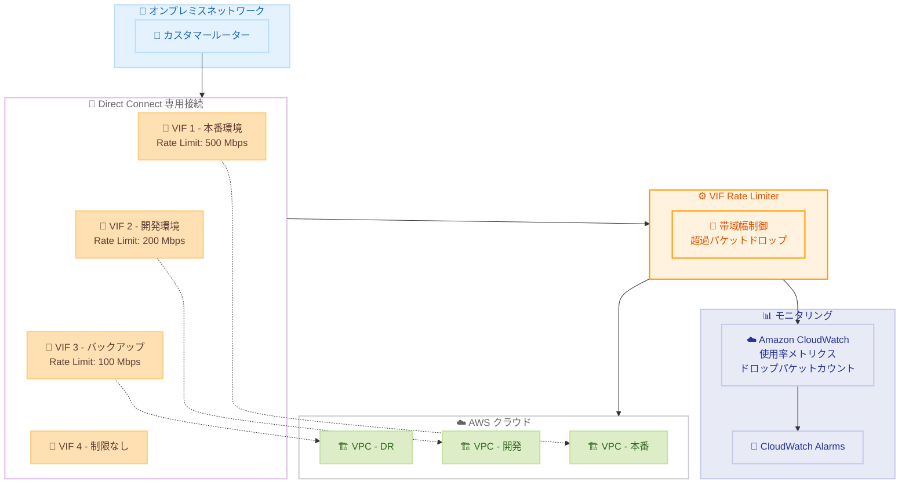

# AWS Direct Connect - VIF Rate Limiters

**リリース日**: 2026 年 6 月 1 日
**サービス**: AWS Direct Connect
**機能**: Virtual Interface (VIF) Rate Limiters

📊 [このアップデートのインフォグラフィックを見る](https://takech9203.github.io/aws-news-summary/20260601-aws-direct-connect-now-supports-vif-rate-limiters.html)

## 概要

AWS Direct Connect が、専用接続 (Dedicated Connection) 上の仮想インターフェース (VIF) に対するレートリミッター機能をサポートしました。この機能により、特定の VIF で予期しないトラフィックスパイクが発生した際に、同一接続上の他の VIF が使用する帯域幅を圧迫することを防止できます。

VIF Rate Limiters では、専用接続上の最大 10 個の VIF に対して最大帯域幅の割り当てを設定できます。設定可能な帯域幅は 50 Mbps から 1.6 Tbps (Link Aggregation Group 使用時) まで幅広い容量増分から選択可能です。レート制限はAWS ネットワークへの入力 (ingress) および出力 (egress) の両方向のトラフィックに適用されます。

**アップデート前の課題**

- 同一の Direct Connect 専用接続上で複数の VIF を使用する場合、1 つの VIF のトラフィックスパイクが接続全体の帯域幅を消費する可能性があった
- VIF 間の帯域幅の公平な配分を制御する手段がなく、ノイジーネイバー問題が発生するリスクがあった
- 重要なワークロード用の VIF が、他の VIF のバーストトラフィックにより影響を受ける可能性があった

**アップデート後の改善**

- VIF 単位で最大帯域幅を設定することで、ノイジーネイバー問題を防止できるようになった
- レート制限を超過したパケットはドロップされ、他の VIF への影響を確実に防止できる
- CloudWatch メトリクスにより、VIF の使用率とドロップパケット数を監視・アラーム設定できるようになった

## アーキテクチャ図



Direct Connect 専用接続上の複数の VIF に対して個別にレートリミットを設定し、CloudWatch で監視する構成を示しています。

## サービスアップデートの詳細

### 主要機能

1. **VIF レートリミッター**
   - 専用接続上の個々の VIF に最大帯域幅を設定
   - 1 つの専用接続あたり最大 10 個の VIF にレートリミットを設定可能
   - 双方向 (ingress/egress) でレート制限を適用
   - 超過トラフィックのパケットドロップにより他の VIF を保護

2. **柔軟な帯域幅設定**
   - 最小 50 Mbps から最大 1.6 Tbps まで設定可能
   - Link Aggregation Group (LAG) 使用時に最大帯域幅が利用可能
   - 幅広い容量増分から選択可能

3. **CloudWatch モニタリング統合**
   - トラフィック使用率メトリクス (設定容量に対するパーセンテージ)
   - ドロップパケットカウントメトリクス
   - カスタムしきい値に基づくアラーム設定が可能

## 技術仕様

### レートリミッター仕様

| 項目 | 詳細 |
|------|------|
| 対象接続タイプ | 専用接続 (Dedicated Connection) のみ |
| 最大設定可能 VIF 数 | 1 接続あたり 10 VIF |
| 最小帯域幅 | 50 Mbps |
| 最大帯域幅 | 1.6 Tbps (LAG 使用時) |
| 適用方向 | 双方向 (ingress + egress) |
| 超過時の動作 | パケットドロップ |
| 設定方法 | コンソール、API、SDK |

### CloudWatch メトリクス

| メトリクス | 説明 |
|-----------|------|
| トラフィック使用率 | VIF の設定容量に対する使用率 (%) |
| ドロップパケットカウント | レートリミットにより破棄されたパケット数 |

### API 変更履歴

本アップデートに関連する API 変更は AWS API Changes フィードでは確認されていません。今後、Direct Connect API に `CreateVifRateLimiter`、`UpdateVifRateLimiter` などの新しいメソッドが追加される可能性があります。

## 設定方法

### 前提条件

1. AWS Direct Connect 専用接続が確立されていること
2. 対象の VIF が作成済みであること
3. 適切な IAM 権限 (Direct Connect 管理権限) を持っていること

### 手順

#### ステップ 1: AWS コンソールでの設定

AWS Direct Connect コンソールから対象の専用接続を選択し、VIF のレートリミッターを設定します。

1. AWS Direct Connect コンソールを開く
2. 対象の専用接続を選択
3. Virtual Interfaces タブから対象の VIF を選択
4. Rate Limiter の設定を有効化し、最大帯域幅を指定

#### ステップ 2: AWS CLI での設定

```bash
# VIF にレートリミッターを設定する例
aws directconnect update-virtual-interface-attributes \
  --virtual-interface-id dxvif-xxxxxxxx \
  --rate-limit-mbps 500
```

VIF のレートリミッターを 500 Mbps に設定するコマンド例です。実際のパラメータ名は公式ドキュメントで確認してください。

#### ステップ 3: CloudWatch アラームの設定

```bash
# VIF 使用率に基づくアラームを作成
aws cloudwatch put-metric-alarm \
  --alarm-name "DX-VIF-HighUtilization" \
  --namespace "AWS/DirectConnect" \
  --metric-name "VifUtilization" \
  --dimensions Name=VirtualInterfaceId,Value=dxvif-xxxxxxxx \
  --threshold 80 \
  --comparison-operator GreaterThanThreshold \
  --evaluation-periods 3 \
  --period 300 \
  --statistic Average \
  --alarm-actions arn:aws:sns:ap-northeast-1:123456789012:dx-alerts
```

VIF の使用率が 80% を超えた場合に SNS 通知を送信するアラームを設定するコマンド例です。

## メリット

### ビジネス面

- **SLA 保護**: 重要なワークロードの帯域幅を確保し、予測可能なネットワークパフォーマンスを提供
- **コスト最適化**: 追加の物理接続を購入せずに帯域幅を効率的に配分できる
- **運用リスク軽減**: 予期しないトラフィックスパイクによるサービス影響を防止

### 技術面

- **ノイジーネイバー対策**: VIF 間の帯域幅分離により、相互影響を排除
- **きめ細かな制御**: VIF 単位で帯域幅を設定し、ワークロードの優先度に応じた配分が可能
- **可観測性の向上**: CloudWatch メトリクスとアラームによるリアルタイム監視

## デメリット・制約事項

### 制限事項

- 専用接続 (Dedicated Connection) のみが対象で、ホスト接続 (Hosted Connection) には適用不可
- 1 つの専用接続あたり最大 10 VIF までしかレートリミットを設定できない
- 超過トラフィックはドロップされるため、バーストが必要なワークロードには適さない場合がある

### 考慮すべき点

- レートリミットの設定値が低すぎると、正常なトラフィックもドロップされる可能性がある
- パケットドロップは TCP の再送を引き起こし、アプリケーションレベルでのレイテンシー増加につながる可能性がある
- 適切なしきい値の決定には、事前のトラフィックパターン分析が必要
- すべての VIF にレートリミットを設定する場合、合計が接続容量を超えないよう設計する必要がある

## ユースケース

### ユースケース 1: マルチテナント環境での帯域幅保証

**シナリオ**: 1 つの Direct Connect 接続を複数の事業部門で共有しており、各部門の VIF に帯域幅の最低保証を設定したい。

**実装例**:
```
専用接続: 10 Gbps
VIF 1 (本番環境 - 事業部A): Rate Limit 4 Gbps
VIF 2 (本番環境 - 事業部B): Rate Limit 3 Gbps
VIF 3 (開発環境): Rate Limit 2 Gbps
VIF 4 (バックアップ): Rate Limit 1 Gbps
```

**効果**: 各事業部門のワークロードが他の部門のトラフィックスパイクの影響を受けず、安定したネットワークパフォーマンスを維持できる。

### ユースケース 2: 本番/非本番ワークロードの分離

**シナリオ**: 本番環境と開発環境が同一の Direct Connect 接続を使用しており、開発環境の大量データ転送が本番環境に影響を与えるリスクがある。

**実装例**:
```
専用接続: 10 Gbps
VIF 1 (本番環境): レートリミットなし (残りの帯域幅すべて使用可能)
VIF 2 (開発環境): Rate Limit 2 Gbps
VIF 3 (ステージング): Rate Limit 1 Gbps
```

**効果**: 開発・ステージング環境のトラフィックに上限を設けることで、本番環境の帯域幅を確実に確保できる。

### ユースケース 3: データレプリケーションの帯域幅制御

**シナリオ**: DR (災害復旧) 用のデータレプリケーション VIF が、夜間バッチ処理時に大量のデータ転送を行い、同時間帯のオンラインワークロードに影響を与える。

**実装例**:
```
専用接続: 10 Gbps
VIF 1 (オンラインワークロード): レートリミットなし
VIF 2 (DR レプリケーション): Rate Limit 3 Gbps
CloudWatch アラーム: VIF 2 使用率 90% で通知
```

**効果**: DR レプリケーションのトラフィックを制限しながら、CloudWatch アラームで異常を検知し、必要に応じてレートリミットを調整できる。

## 料金

VIF Rate Limiters 自体の追加料金に関する情報は公式発表では言及されていません。AWS Direct Connect の既存料金体系として以下が適用されます。

### 料金構成

| 項目 | 詳細 |
|------|------|
| ポート時間料金 | 接続容量とタイプに基づく時間課金 |
| データ転送 (アウトバウンド) | AWS からオンプレミスへのデータ転送量に基づく課金 |
| VIF Rate Limiters | 追加料金の記載なし (公式発表時点) |

最新の料金情報は [AWS Direct Connect 料金ページ](https://aws.amazon.com/directconnect/pricing/) を確認してください。

## 利用可能リージョン

AWS Direct Connect 専用接続がサポートされるすべての AWS リージョンで利用可能です。

- **商用パーティション**: すべての商用リージョン
- **中国パーティション**: 中国リージョン

## 関連サービス・機能

- **Amazon CloudWatch**: VIF 使用率メトリクスとドロップパケットカウントの監視、アラーム設定
- **AWS Direct Connect Gateway**: 複数リージョンの VPC に対する Direct Connect 接続の集約
- **Link Aggregation Group (LAG)**: 複数の接続を束ねて最大 1.6 Tbps の帯域幅を提供、VIF Rate Limiters と組み合わせて使用

## 参考リンク

- 📊 [インフォグラフィック](https://takech9203.github.io/aws-news-summary/20260601-aws-direct-connect-now-supports-vif-rate-limiters.html)
- [公式発表 (What's New)](https://aws.amazon.com/about-aws/whats-new/2026/06/aws-direct-connect-now-supports-vif-rate-limiters/)
- [AWS Direct Connect ドキュメント](https://docs.aws.amazon.com/directconnect/latest/UserGuide/Welcome.html)
- [AWS Direct Connect 料金](https://aws.amazon.com/directconnect/pricing/)
- [Amazon CloudWatch ドキュメント](https://docs.aws.amazon.com/AmazonCloudWatch/latest/monitoring/WhatIsCloudWatch.html)

## まとめ

AWS Direct Connect の VIF Rate Limiters は、専用接続上で複数の VIF を共有する環境において、ノイジーネイバー問題を解決する重要な機能です。特に、本番環境と非本番環境が同一接続を共有するケースや、マルチテナント環境での帯域幅保証が求められるケースで大きな価値を発揮します。既存の Direct Connect 専用接続を使用しているお客様は、CloudWatch メトリクスで現在のトラフィックパターンを分析した上で、適切なレートリミット値の設定を検討することを推奨します。
