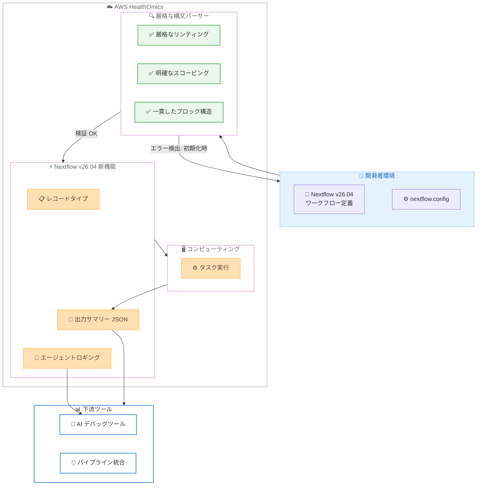

# AWS HealthOmics - Nextflow バージョン 26.04 サポート

**リリース日**: 2026年6月1日
**サービス**: AWS HealthOmics
**機能**: Nextflow version 26.04 サポート

📊 [このアップデートのインフォグラフィックを見る](https://takech9203.github.io/aws-news-summary/20260601-aws-healthomics-nextflow-version-26-04.html)

## 概要

AWS HealthOmics が Nextflow バージョン 26.04 のサポートを開始した。これにより、ヘルスケアおよびライフサイエンスの顧客は、レコードタイプ、厳格な構文パーサー、ワークフロー出力サマリー、エージェントロギングモードといった Nextflow の最新機能を活用できるようになる。

AWS HealthOmics は HIPAA 対応のフルマネージド型バイオインフォマティクスワークフローサービスであり、科学的ブレークスルーを大規模に加速することを目的としている。今回のアップデートにより、パイプラインの開発効率、デバッグ体験、下流ツールとの統合が大幅に改善される。特に、厳格な構文パーサーがデフォルトで有効になったことで、ワークフロー実行の数時間後ではなく初期化時点でエラーを検出でき、コンピューティングコストの削減に直結する。

Nextflow v26.04 は、US East (N. Virginia)、US West (Oregon)、Europe (Frankfurt, Ireland, London)、Israel (Tel Aviv)、Asia Pacific (Singapore, Seoul) の全 AWS HealthOmics リージョンで利用可能である。

**アップデート前の課題**

- ワークフローの構文エラーが実行開始から数時間後に検出されることがあり、コンピューティングリソースが無駄に消費されていた
- タプル要素の順序を追跡する必要があり、ワークフローの可読性が低く、バグが発生しやすかった
- ワークフロー出力の統合に独自のパース処理が必要で、下流ツールとの連携が煩雑だった
- ワークフローのデバッグにおいて AI ツールと連携する構造化ログがなく、問題特定に時間を要していた

**アップデート後の改善**

- 厳格な構文パーサーがデフォルトで有効になり、パイプライン初期化時にエラーを検出してコンピューティングコストを削減
- レコードタイプにより、タプルの順序ではなく意味のあるデータ名でワークフローを記述でき、可読性とメンテナンス性が向上
- JSON 形式のワークフロー出力サマリーにより、下流ツールとの統合がシンプルに
- エージェントロギングモードにより、AI アシスタントによるワークフローデバッグ・開発が最適化

## アーキテクチャ図



Nextflow v26.04 のワークフロー実行フローを示す。開発者が定義したワークフローは、まず厳格な構文パーサーで検証され、初期化時点でエラーが検出される。検証を通過したワークフローはレコードタイプや出力サマリーなどの新機能を活用して実行され、結果が下流ツールに連携される。

## サービスアップデートの詳細

### 主要機能

1. **厳格な構文パーサー (Strict Syntax Parser)**
   - Nextflow v26.04 からデフォルトで有効 (v2 パーサー)
   - 厳格なリンティング、一貫したブロック構造、明確なスコーピングを強制
   - パイプライン初期化時にエラーを検出し、長時間実行後のエラー発見を防止
   - レガシー (v1) パーサーへのフォールバックも `engineSettings.syntaxVersion` で設定可能

2. **レコードタイプ (Record Types)**
   - タプル要素の順序追跡ではなく、意味のあるデータ名でワークフローを記述可能
   - ワークフローの可読性が向上し、要素の順序間違いによるバグを削減
   - Seqera の Nextflow ドキュメントで詳細を確認可能

3. **ワークフロー出力サマリー (Workflow Output Summary)**
   - ワークフロー完了時に出力のサマリーを生成
   - JSON 形式で出力されるため、下流ツールとの統合が容易
   - `engineSettings.outputFormat` で出力形式を設定可能

4. **エージェントロギングモード (Agent Logging Mode)**
   - AI アシスタントによるワークフローデバッグ・開発に最適化された構造化ログを出力
   - 最小限かつ構造化されたログ形式で、AI ツールが解析しやすい
   - `engineSettings.agentMode` で設定可能

## 技術仕様

### サポートバージョンとプラグイン

| 項目 | 詳細 |
|------|------|
| Nextflow バージョン | v26.04 |
| デフォルトパーサー | v2 (厳格な構文パーサー) |
| nf-schema | v2.7.2 (プリインストール) |
| nf-core-utils | v0.4.0 (プリインストール) |
| nf-prov | v1.7.0 (プリインストール) |
| nf-fgbio | v1.0.1 (プリインストール) |

### HealthOmics でサポートされる v26.04 新機能

| 機能 | サポート状況 | 備考 |
|------|-------------|------|
| 厳格な構文パーサー | サポート | デフォルト有効、v1 へのフォールバック可能 |
| レコードタイプ | サポート | Seqera ドキュメント参照 |
| ワークフロー出力サマリー | サポート | engineSettings.outputFormat で設定 |
| エージェントロギングモード | サポート | engineSettings.agentMode で設定 |
| モジュールシステム (Nextflow Registry) | 非サポート | ネットワーク分離環境のため、zip に直接含める必要あり |
| 静的型付け (プレビュー) | 非サポート | プレビュー機能は HealthOmics 非対応 |
| コレクションパラメータの自動読み込み | 非サポート | 静的型付けが前提のため非対応 |

### 非推奨となった機能

| 非推奨項目 | 推奨対応 |
|-----------|----------|
| `listFiles()` メソッド | `listDirectory()` に置き換え |
| `nextflow.enable.strict` フラグ | 設定から削除 (デフォルトで有効) |
| `manifest.defaultBranch` | 設定から削除 (HealthOmics では未サポート) |

### API変更履歴

今回のアップデートに関連する API 変更は awsapichanges.com で確認された範囲では検出されなかった。エンジン設定 (`engineSettings`) に以下のパラメータが追加されている。

| パラメータ | 説明 |
|-----------|------|
| `syntaxVersion` | パーサーバージョンを指定 ("v1" でレガシーパーサー使用) |
| `outputFormat` | ワークフロー出力サマリーの形式を設定 |
| `agentMode` | エージェントロギングモードの有効化 |

## 設定方法

### 前提条件

1. AWS HealthOmics にアクセスできる AWS アカウント
2. HealthOmics ワークフローの実行に必要な IAM ロール
3. Nextflow v26.04 対応のワークフロー定義ファイル (DSL2)

### 手順

#### ステップ 1: ワークフローの v26.04 対応を確認

既存のワークフローが厳格な構文パーサー (v2) に対応しているか確認する。`nextflow.enable.strict` フラグは不要になったため削除する。

```groovy
// nextflow.config から以下を削除
// nextflow.enable.strict = true  // v26.04 からはデフォルトで有効

manifest {
    nextflowVersion = '!>=26.04'
}
```

`manifest.nextflowVersion` でバージョンを固定し、実行環境の一貫性を確保する。

#### ステップ 2: レコードタイプを活用したワークフロー記述

タプルの代わりにレコードタイプを使用して、可読性の高いワークフローを記述する。

```groovy
// レコードタイプの定義例
record SampleData {
    String sampleId
    Path fastqR1
    Path fastqR2
    String readGroup
}

workflow {
    samples = Channel.of(
        new SampleData(
            sampleId: 'SAMPLE001',
            fastqR1: file('s3://bucket/sample001_R1.fastq.gz'),
            fastqR2: file('s3://bucket/sample001_R2.fastq.gz'),
            readGroup: '@RG\\tID:sample001\\tSM:SAMPLE001'
        )
    )
    alignReads(samples)
}
```

タプルの順序を追跡する必要がなくなり、意味のあるフィールド名でデータにアクセスできる。

#### ステップ 3: ワークフローの実行とエンジン設定

AWS CLI を使用して、新しいエンジン設定を指定してワークフローを実行する。

```bash
aws omics start-run \
  --workflow-id wf-1234567890 \
  --role-arn arn:aws:iam::123456789012:role/OmicsWorkflowRole \
  --output-uri s3://my-bucket/output/ \
  --engine-settings '{
    "outputFormat": "json",
    "agentMode": true
  }'
```

`outputFormat` を `json` に設定するとワークフロー出力サマリーが JSON 形式で生成され、`agentMode` を `true` にすると AI アシスタント向けの構造化ログが有効になる。

#### ステップ 4: レガシーワークフローの移行 (必要な場合)

v26.04 の厳格なパーサーに未対応のレガシーワークフローは、一時的に v1 パーサーを使用して実行できる。

```bash
aws omics start-run \
  --workflow-id wf-1234567890 \
  --role-arn arn:aws:iam::123456789012:role/OmicsWorkflowRole \
  --output-uri s3://my-bucket/output/ \
  --engine-settings '{"syntaxVersion": "v1"}'
```

レガシーパーサーはフォールバックオプションであり、早期に v2 構文への移行を推奨する。

## メリット

### ビジネス面

- **コンピューティングコストの削減**: 厳格な構文パーサーにより、パイプライン初期化時にエラーを検出し、数時間のコンピューティングリソースの浪費を防止
- **開発サイクルの短縮**: レコードタイプとエージェントロギングにより、ワークフローの開発・デバッグ効率が向上し、タイムトゥマーケットを短縮
- **運用の自動化促進**: JSON 形式の出力サマリーにより、下流の分析パイプラインとの自動連携が容易に

### 技術面

- **コード品質の向上**: 厳格なリンティングと明確なスコーピングにより、パイプラインコードの品質と一貫性が向上
- **型安全性の強化**: レコードタイプによりデータ構造が明示的になり、タプル要素の順序間違いによるバグを排除
- **AI 開発体験の最適化**: エージェントロギングモードにより、AI コーディングアシスタントがワークフローログを効率的に解析可能
- **後方互換性の確保**: `syntaxVersion: "v1"` によりレガシーワークフローの段階的な移行が可能

## デメリット・制約事項

### 制限事項

- モジュールシステム (Nextflow Registry) は HealthOmics の分離ネットワーク環境ではサポートされない。モジュールはワークフロー zip に直接含める必要がある
- 静的型付け (プレビュー機能) および関連するコレクションパラメータの自動読み込みは非サポート
- マルチリビジョンパイプラインのチェックアウトは、HealthOmics が Git ベースのチェックアウトを使用しないため対象外

### 考慮すべき点

- 厳格な構文パーサーがデフォルトで有効になるため、既存のレガシーワークフローは修正またはフォールバック設定が必要
- `listFiles()` メソッドが非推奨となったため、`listDirectory()` への移行が必要
- ワークフロー zip にすべてのモジュールを含める必要があり、外部レジストリからの動的取得はできない

## ユースケース

### ユースケース 1: ゲノムシーケンス解析パイプラインの品質向上

**シナリオ**: バイオインフォマティクスチームが大規模なゲノムシーケンス解析パイプラインを運用しており、構文エラーが実行の数時間後に検出されてコストが増大していた。

**実装例**:
```groovy
// v26.04 の厳格な構文パーサーにより初期化時にエラーを検出
manifest {
    nextflowVersion = '!>=26.04'
}

record AlignmentResult {
    String sampleId
    Path bam
    Path bai
    Float coverage
}

process alignSequences {
    input:
    tuple val(sampleId), path(fastq_r1), path(fastq_r2)

    output:
    val(new AlignmentResult(
        sampleId: sampleId,
        bam: file("${sampleId}.bam"),
        bai: file("${sampleId}.bai"),
        coverage: 30.0
    ))

    script:
    """
    bwa mem -t 16 ref.fa ${fastq_r1} ${fastq_r2} | samtools sort -o ${sampleId}.bam
    samtools index ${sampleId}.bam
    """
}
```

**効果**: パイプライン初期化時点でエラーが検出されるため、数時間分のコンピューティングコストを節約。レコードタイプにより出力データ構造が明確になり、下流プロセスでのデータ取り違えを防止。

### ユースケース 2: 創薬パイプラインの AI 支援デバッグ

**シナリオ**: 製薬企業が複雑な創薬パイプラインのデバッグに AI ツールを活用したいが、従来のログ形式では AI が解析しにくかった。

**実装例**:
```bash
aws omics start-run \
  --workflow-id wf-drug-discovery \
  --role-arn arn:aws:iam::123456789012:role/OmicsRole \
  --output-uri s3://pharma-bucket/results/ \
  --engine-settings '{
    "agentMode": true,
    "outputFormat": "json"
  }'
```

**効果**: エージェントロギングモードにより、AI コーディングアシスタントがワークフロー実行の問題を構造化ログから迅速に特定。JSON 出力サマリーにより、パイプライン結果の自動検証が可能に。

### ユースケース 3: マルチサンプル解析の自動化パイプライン

**シナリオ**: 臨床検査機関が数百のサンプルを日次で処理しており、ワークフロー出力を LIMS (検査情報管理システム) に自動連携する必要がある。

**実装例**:
```groovy
// JSON 出力サマリーにより下流ツールとの統合を簡素化
workflow {
    main:
    samples = Channel.fromPath('s3://lab-bucket/samples/*.fastq.gz')
    results = processSamples(samples)

    publish:
    qcReport = results.qc
    variants = results.vcf
}

output {
    qcReport {
        path 'qc/'
    }
    variants {
        path 'variants/'
    }
}
```

**効果**: ワークフロー完了時に JSON 形式の出力サマリーが自動生成され、LIMS との API 連携で各サンプルの処理結果を自動登録可能。手動確認の工数を大幅に削減。

## 料金

AWS HealthOmics の料金体系はワークフローエンジンのバージョンによる変更はなく、従来と同様にコンピューティング (タスクインスタンス) とランストレージの 2 要素で構成される。

### 料金例

| 項目 | 料金 (US East - N. Virginia) |
|------|------------------------------|
| omics.c.4xlarge (コンピューティング) | $0.918/時間 |
| omics.r.8xlarge (メモリ最適化) | $2.7216/時間 |
| omics.m.xlarge (汎用) | $0.2592/時間 |
| 静的ランストレージ | $0.0001918/GB-時間 |
| 動的ランストレージ | $0.0004110/GB-時間 |

**参考例**: 3 タスクのゲノム解析パイプライン (約 5 時間、1,200 GB ストレージ) で約 $9.43

新規顧客は 12 か月間有効な最大 $200 の無料利用枠を利用可能。

## 利用可能リージョン

Nextflow v26.04 は全 AWS HealthOmics リージョンで利用可能。

| リージョン | コード |
|-----------|--------|
| US East (N. Virginia) | us-east-1 |
| US West (Oregon) | us-west-2 |
| Europe (Frankfurt) | eu-central-1 |
| Europe (Ireland) | eu-west-1 |
| Europe (London) | eu-west-2 |
| Israel (Tel Aviv) | il-central-1 |
| Asia Pacific (Singapore) | ap-southeast-1 |
| Asia Pacific (Seoul) | ap-northeast-2 |

## 関連サービス・機能

- **AWS HealthOmics Storage**: ゲノミクスデータの保存・管理サービス。ワークフローの入出力データの格納に使用
- **Amazon S3**: ワークフロー出力の保存先として利用。JSON サマリーの保存にも使用
- **AWS Step Functions**: HealthOmics ワークフローのオーケストレーションに活用可能。JSON 出力サマリーとの連携が容易
- **Amazon Bedrock**: エージェントロギングモードと組み合わせて、AI によるワークフローデバッグ・開発支援に活用可能

## 参考リンク

- 📊 [インフォグラフィック](https://takech9203.github.io/aws-news-summary/20260601-aws-healthomics-nextflow-version-26-04.html)
- [公式発表 (What's New)](https://aws.amazon.com/about-aws/whats-new/2026/06/aws-healthomics-nextflow-version-26-04/)
- [Nextflow ワークフロー定義ドキュメント](https://docs.aws.amazon.com/omics/latest/dev/workflow-definition-nextflow.html#nextflow-v26-release-notes)
- [AWS HealthOmics 製品ページ](https://aws.amazon.com/healthomics/)
- [料金ページ](https://aws.amazon.com/healthomics/pricing/)

## まとめ

AWS HealthOmics の Nextflow v26.04 サポートは、バイオインフォマティクスワークフローの開発効率とコスト効率を大幅に向上させるアップデートである。特に厳格な構文パーサーのデフォルト有効化により、長時間実行後のエラー検出によるコスト浪費を防止できる点が最も実用的な改善である。レコードタイプ、JSON 出力サマリー、エージェントロギングモードの 3 機能は、ワークフロー開発のモダン化と AI ツールとの統合を推進するものであり、ゲノミクスパイプラインの継続的な改善に取り組む組織は早期の移行を検討すべきである。
