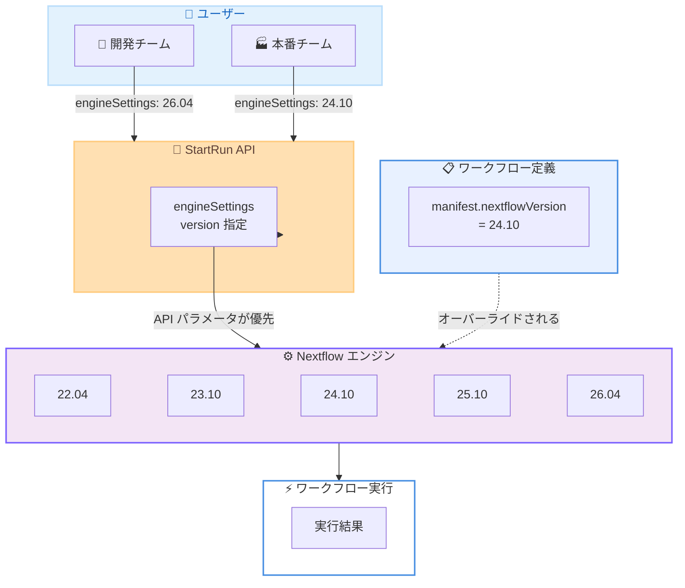

# AWS HealthOmics - Nextflow バージョンピニング (実行時指定)

**リリース日**: 2026年6月1日
**サービス**: AWS HealthOmics
**機能**: Nextflow version pinning at run time

📊 [このアップデートのインフォグラフィックを見る](https://takech9203.github.io/aws-news-summary/20260601-aws-healthomics-nextflow-version-pinning-at-runtime.html)

## 概要

AWS HealthOmics が、StartRun API を通じて実行時に Nextflow エンジンバージョンを指定できるバージョンピニング機能をサポートした。新しい `engineSettings` パラメータにより、サポートされている Nextflow バージョン (22.04, 23.10, 24.10, 25.10, 26.04) から任意のバージョンを選択し、ワークフロー実行時に明示的に制御できる。

AWS HealthOmics は HIPAA 対応のフルマネージドバイオインフォマティクスワークフローサービスであり、ヘルスケアおよびライフサイエンス分野の顧客が大規模な科学的発見を加速するために活用されている。今回のアップデートは、特に規制環境下でパイプラインバリデーションが求められる顧客にとって、エンジンバージョンの移行を安全に管理するための重要な機能である。

実行時のバージョンオーバーライドにより、ワークフロー定義内の `manifest.nextflowVersion` で指定されたバージョンよりも StartRun API パラメータが優先される。これにより、ワークフローのソースコードを変更することなく、同一ワークフローを複数のエンジンバージョンでテストすることが可能になった。

**アップデート前の課題**

- ワークフロー定義内の `manifest.nextflowVersion` またはプロファイル設定でバージョンを管理する必要があり、テスト時にソースコードの変更が必要だった
- 本番ワークフローと開発環境で異なるエンジンバージョンを使用する場合、ワークフロー定義を分岐させる必要があった
- 新しいエンジンバージョンへのアップグレード時に、予期しない動作変更のリスクがあり、段階的な移行が困難だった
- 規制環境では、バリデーション済みのエンジンバージョンを確実に維持する手段が限られていた

**アップデート後の改善**

- StartRun API の `engineSettings` パラメータで実行時にエンジンバージョンを明示的に指定可能
- ワークフローのソースコードを変更せずに、同一ワークフローを複数バージョンでテスト可能
- 本番環境はバリデーション済みバージョンに固定しつつ、開発チームが並行して新バージョンをテスト可能
- API パラメータがワークフロー定義のバージョン指定に優先するため、実行時の制御が確実

## アーキテクチャ図



開発チームと本番チームが同一ワークフロー定義に対して異なるエンジンバージョンを指定して実行できる構成を示している。StartRun API の `engineSettings` パラメータがワークフロー定義内の `manifest.nextflowVersion` に優先する。

## サービスアップデートの詳細

### 主要機能

1. **実行時バージョン指定**
   - StartRun API に新しい `engineSettings` パラメータが追加
   - 実行ごとに使用する Nextflow エンジンバージョンを明示的に選択可能
   - ワークフロー定義を変更せずにバージョンを切り替え可能

2. **バージョンオーバーライド**
   - ワークフロー定義内の `manifest.nextflowVersion` よりも API パラメータが優先
   - プロファイル設定のバージョン指定もオーバーライド可能
   - 同一ワークフローを複数バージョンで並行テスト可能

3. **制御された移行**
   - 本番ワークフローをバリデーション済みバージョンに固定
   - 開発環境で新バージョンの動作検証を並行実施
   - バリデーション完了後に本番のバージョン指定を更新するだけで移行完了

## 技術仕様

### サポートされる Nextflow バージョン

| バージョン | リリース時期 |
|------|------|
| 22.04 | 2022年4月 |
| 23.10 | 2023年10月 |
| 24.10 | 2024年10月 |
| 25.10 | 2025年10月 |
| 26.04 | 2026年4月 |

### バージョン優先順位

| 優先度 | 設定方法 | 説明 |
|------|------|------|
| 1 (最高) | StartRun API `engineSettings` | 実行時に指定されたバージョン |
| 2 | ワークフロー定義 `manifest.nextflowVersion` | nextflow.config 内の指定 |
| 3 | プロファイル設定 | プロファイルで指定されたバージョン |
| 4 (最低) | サービスデフォルト | HealthOmics のデフォルトバージョン |

### API 変更履歴

| 日付 | サービス | 変更内容 |
|------|----------|----------|
| 2026/05/29 | [Amazon Omics](https://awsapichanges.com/archive/changes/96246a-omics.html) | 4 updated api methods - StartRun, GetRun に engineSettings を追加。GetWorkflow, GetWorkflowVersion に profiles と profileParameterTemplates を追加 |

### engineSettings パラメータ

```json
{
  "workflowId": "1234567",
  "name": "my-nextflow-run",
  "roleArn": "arn:aws:iam::123456789012:role/OmicsRole",
  "outputUri": "s3://my-bucket/outputs/",
  "parameters": {
    "sample": "NA12878",
    "reference": "hg38"
  },
  "engineSettings": {
    "nextflow": {
      "version": "24.10"
    }
  }
}
```

## 設定方法

### 前提条件

1. AWS HealthOmics が利用可能なリージョンに AWS アカウントがあること
2. Nextflow エンジンタイプのワークフローが登録されていること
3. ワークフロー実行用の IAM ロールが設定されていること

### 手順

#### ステップ 1: 現在のワークフロー設定を確認

```bash
aws omics get-workflow \
  --id "1234567" \
  --query '{engine:engine, id:id, name:name}'
```

ワークフローのエンジンタイプが NEXTFLOW であることを確認する。

#### ステップ 2: engineSettings を指定してワークフローを実行

```bash
aws omics start-run \
  --workflow-id "1234567" \
  --role-arn "arn:aws:iam::123456789012:role/OmicsRole" \
  --output-uri "s3://my-bucket/outputs/" \
  --parameters '{"sample": "NA12878"}' \
  --engine-settings '{"nextflow": {"version": "24.10"}}'
```

`--engine-settings` パラメータで Nextflow バージョン `24.10` を明示的に指定してワークフローを実行する。このパラメータがワークフロー定義内の `manifest.nextflowVersion` に優先する。

#### ステップ 3: 実行結果でバージョンを確認

```bash
aws omics get-run \
  --id "run-id-from-step2" \
  --query '{engineVersion:engineVersion, engineSettings:engineSettings, status:status}'
```

GetRun API のレスポンスに含まれる `engineVersion` と `engineSettings` フィールドで、指定したバージョンが使用されていることを確認する。

#### ステップ 4: 別バージョンで同一ワークフローをテスト

```bash
aws omics start-run \
  --workflow-id "1234567" \
  --role-arn "arn:aws:iam::123456789012:role/OmicsRole" \
  --output-uri "s3://my-bucket/outputs-test/" \
  --parameters '{"sample": "NA12878"}' \
  --engine-settings '{"nextflow": {"version": "26.04"}}'
```

同一ワークフローを新バージョン `26.04` で実行し、結果を比較する。ワークフローのソースコード変更は不要である。

## メリット

### ビジネス面

- **規制対応の簡素化**: GxP 環境やその他の規制環境において、バリデーション済みエンジンバージョンを確実に維持でき、コンプライアンス要件への対応が容易
- **リスク低減**: 本番ワークフローへの影響なく新バージョンを評価でき、予期しない動作変更によるインシデントリスクを軽減
- **開発効率の向上**: 開発チームと本番チームが独立してバージョン選択を行えるため、組織全体のアジリティが向上

### 技術面

- **コードの一元管理**: バージョン切り替えのためにワークフロー定義を複製する必要がなく、単一のソースコードを維持可能
- **再現性の確保**: 特定のバージョンでの実行を API レベルで保証でき、科学的再現性の要件を満たす
- **段階的移行**: 新バージョンへの移行をワークフロー単位で段階的に実施でき、全ワークフローを一度に移行するリスクを回避

## デメリット・制約事項

### 制限事項

- サポートされる Nextflow バージョンは 5 つ (22.04, 23.10, 24.10, 25.10, 26.04) に限定される
- Nextflow エンジンタイプのワークフローのみが対象 (WDL, CWL には適用されない)
- 古いバージョンのサポート終了時期はサービスのポリシーに依存する

### 考慮すべき点

- バージョン間で DSL (Domain Specific Language) の互換性が異なる場合があるため、テスト結果の差異を慎重に評価する必要がある
- チーム間でバージョン管理のガバナンスポリシーを策定し、どのバージョンをどの環境で使用するかを明確にすることを推奨
- ワークフロー定義が特定バージョンの機能に依存している場合、古いバージョンを指定すると実行エラーが発生する可能性がある

## ユースケース

### ユースケース 1: GxP 規制環境でのバリデーション管理

**シナリオ**: 製薬会社が FDA 提出用のゲノム解析パイプラインを運用している。IQ/OQ/PQ バリデーションを通過した Nextflow 24.10 を本番で使用しながら、新バージョン 26.04 のバリデーション作業を並行で進めたい。

**実装例**:
```bash
# 本番実行: バリデーション済みバージョン
aws omics start-run \
  --workflow-id "validated-pipeline" \
  --engine-settings '{"nextflow": {"version": "24.10"}}' \
  --parameters file://production-params.json

# バリデーション用テスト: 新バージョン
aws omics start-run \
  --workflow-id "validated-pipeline" \
  --engine-settings '{"nextflow": {"version": "26.04"}}' \
  --parameters file://production-params.json \
  --output-uri "s3://my-bucket/validation-outputs/"
```

**効果**: 本番運用を中断せずにバリデーション作業を進められ、承認完了後にバージョン指定を切り替えるだけで移行完了

### ユースケース 2: CI/CD パイプラインでのマルチバージョンテスト

**シナリオ**: バイオインフォマティクスチームが新しい変異解析ワークフローを開発中。リリース前に複数のエンジンバージョンで互換性テストを自動実行したい。

**実装例**:
```bash
# CI/CD パイプラインで複数バージョンをテスト
for VERSION in "23.10" "24.10" "25.10" "26.04"; do
  aws omics start-run \
    --workflow-id "variant-calling-wf" \
    --engine-settings "{\"nextflow\": {\"version\": \"${VERSION}\"}}" \
    --parameters file://test-params.json \
    --output-uri "s3://ci-bucket/test-${VERSION}/" \
    --name "ci-test-${VERSION}"
done
```

**効果**: 自動テストによりバージョン互換性を早期に検出し、特定バージョン依存のコードを回避

### ユースケース 3: 段階的バージョンアップグレード

**シナリオ**: 研究機関が 50 以上のワークフローを Nextflow 23.10 で運用中。全ワークフローを一度に 25.10 へ移行するのはリスクが高いため、段階的に移行したい。

**実装例**:
```bash
# フェーズ 1: 低リスクワークフローから移行
aws omics start-run \
  --workflow-id "simple-qc-workflow" \
  --engine-settings '{"nextflow": {"version": "25.10"}}' \
  --parameters file://qc-params.json

# フェーズ 2: 検証完了後に次のワークフローを移行
aws omics start-run \
  --workflow-id "alignment-workflow" \
  --engine-settings '{"nextflow": {"version": "25.10"}}' \
  --parameters file://alignment-params.json

# 未移行ワークフローは引き続き旧バージョンで実行
aws omics start-run \
  --workflow-id "complex-pipeline" \
  --engine-settings '{"nextflow": {"version": "23.10"}}' \
  --parameters file://complex-params.json
```

**効果**: ワークフローの複雑さやリスクに応じた段階的移行が可能になり、問題発生時の影響範囲を最小限に抑制

## 料金

Nextflow バージョンピニング機能自体には追加料金は発生しない。ワークフロー実行にかかる通常の HealthOmics 料金が適用される。

### 料金例

| 項目 | 料金 |
|------|------|
| HealthOmics ワークフロー実行 | 使用した OMICS CPUhour および GPUhour に基づく |
| アクティブラン (実行中) | $0.30/ラン/時間 |
| ストレージ (DYNAMIC) | 使用量に基づく |

バージョンテストのために同一ワークフローを複数回実行する場合は、各実行に対してコンピューティング費用が発生する点に留意する。

## 利用可能リージョン

本機能は AWS HealthOmics の Nextflow ワークフロー実行が利用可能なすべてのリージョンで提供されている。

| リージョン | コード |
|------|------|
| 米国東部 (バージニア北部) | us-east-1 |
| 米国西部 (オレゴン) | us-west-2 |
| 欧州 (フランクフルト) | eu-central-1 |
| 欧州 (アイルランド) | eu-west-1 |
| 欧州 (ロンドン) | eu-west-2 |
| イスラエル (テルアビブ) | il-central-1 |
| アジアパシフィック (シンガポール) | ap-southeast-1 |
| アジアパシフィック (ソウル) | ap-northeast-2 |

## 関連サービス・機能

- **AWS HealthOmics Batch Run**: 複数ワークフロー実行のバッチ処理機能。バージョンピニングと組み合わせてバッチ内の全ランで同一バージョンを保証可能
- **AWS HealthOmics Run Cache**: ワークフロー実行間でタスク出力を共有するキャッシュ機能。バージョン固定によりキャッシュの有効性が安定
- **AWS HealthOmics Workflow Profiles**: ワークフローのプロファイル機能。バージョンピニングと組み合わせて実行構成を細かく制御可能
- **Amazon S3**: ワークフロー出力の保存先。バージョン別テスト結果の比較に活用

## 参考リンク

- 📊 [インフォグラフィック](https://takech9203.github.io/aws-news-summary/20260601-aws-healthomics-nextflow-version-pinning-at-runtime.html)
- [公式発表 (What's New)](https://aws.amazon.com/about-aws/whats-new/2026/06/aws-healthomics-nextflow-version-pinning-at-runtime/)
- [AWS HealthOmics Nextflow エンジン設定ドキュメント](https://docs.aws.amazon.com/omics/latest/dev/nextflow-engine-settings.html)
- [AWS HealthOmics ドキュメント](https://docs.aws.amazon.com/omics/latest/dev/what-is-service.html)
- [AWS HealthOmics 料金ページ](https://aws.amazon.com/omics/pricing/)

## まとめ

AWS HealthOmics の Nextflow バージョンピニング機能は、バイオインフォマティクスワークフローのエンジンバージョン管理に対して実行時レベルの明示的な制御を提供する重要なアップデートである。特に GxP などの規制環境において、バリデーション済みバージョンの維持と新バージョンの並行検証が可能になり、安全で段階的なバージョン移行を実現できる。HealthOmics で Nextflow ワークフローを運用しているチームは、本番環境のバージョン固定と開発環境での新バージョンテストを即座に導入することを推奨する。
