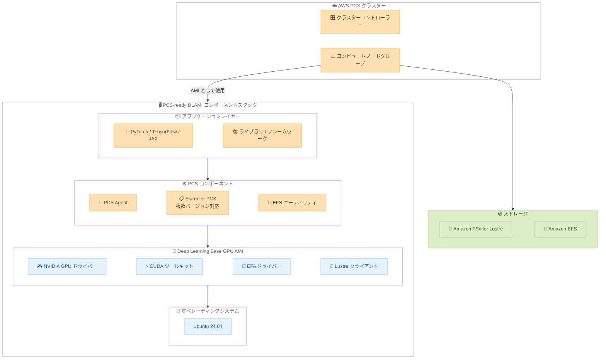

# AWS Parallel Computing Service - PCS-ready DLAMI

**リリース日**: 2026年6月1日
**サービス**: AWS Parallel Computing Service (AWS PCS)
**機能**: PCS-ready DLAMI Base GPU AMI (Ubuntu 24.04)

📊 [このアップデートのインフォグラフィックを見る](https://takech9203.github.io/aws-news-summary/20260601-aws-pcs-deep-learning-ami.html)

## 概要

AWS Parallel Computing Service (AWS PCS) が、本番環境対応の Deep Learning AMI「PCS-ready DLAMI」をリリースした。この AMI は Deep Learning Base GPU AMI (Ubuntu 24.04) をベースに構築された AWS 管理の Amazon Machine Image であり、AI/ML トレーニングおよびハイパフォーマンスコンピューティング (HPC) ワークロード向けの基盤を提供する。

PCS-ready DLAMI は、NVIDIA GPU ドライバー、CUDA ツールキット、EFA ドライバー、Lustre クライアントといったインフラストラクチャコンポーネントに加え、PCS Agent、Slurm for PCS、EFS ユーティリティを事前インストールしており、互換性テスト済みの状態で提供される。これにより、カスタム AMI を一から構築・検証する手間を省き、数分でクラスターを展開できる。

x86_64 および arm64 アーキテクチャの両方に対応し、AWS PCS が利用可能なすべてのリージョンで追加費用なしで利用できる。AWS はソース DLAMI や PCS コンポーネントの更新に合わせて定期的に最新版をリリースし、セキュリティパッチやドライバーアップデートを継続的に提供する。

**アップデート前の課題**

- AI/ML や HPC ワークロード用に PCS クラスターを構築する際、GPU ドライバー、CUDA、EFA、Slurm などを手動でインストール・設定したカスタム AMI を作成する必要があった
- 各コンポーネント間の互換性を自分で検証・テストする必要があり、環境構築に多大な時間と労力を要していた
- セキュリティパッチやドライバーアップデートの適用を独自に管理する必要があった
- Slurm バージョンの選択と設定を手動で行う必要があった

**アップデート後の改善**

- AWS が管理する本番品質の AMI を選択するだけで、互換性テスト済みのインフラストラクチャ基盤を即座に利用可能
- PCS Agent と Slurm for PCS が事前インストールされており、クラスター構成に基づいて適切な Slurm バージョンが自動的にアクティベートされる
- AWS が定期的に更新版をリリースするため、セキュリティパッチやドライバーアップデートの管理負荷が大幅に軽減
- SSM Parameter Store による最新 AMI ID の参照が可能で、Infrastructure as Code との統合が容易

## アーキテクチャ図



PCS-ready DLAMI のコンポーネントスタックと AWS PCS クラスターとの関係を示す。ユーザーはアプリケーションレイヤーのみを追加すればよく、インフラストラクチャ基盤は AMI が提供する。

## サービスアップデートの詳細

### 主要機能

1. **本番品質の AMI 基盤**
   - Deep Learning Base GPU AMI (Ubuntu 24.04) をベースとした AWS 管理の AMI
   - GPU ドライバー、CUDA、EFA、Lustre クライアントが事前インストール・互換性テスト済み
   - x86_64 と arm64 の両アーキテクチャをサポート

2. **Slurm バージョン自動選択**
   - 複数の Slurm バージョンが事前インストールされている (例: 24.11.7-1、25.05.7-1、25.11.2-1)
   - クラスター構成に基づいてインスタンス起動時に適切なバージョンが自動的にアクティベート
   - バージョン管理の手間を排除

3. **継続的なアップデート提供**
   - ソース DLAMI または PCS コンポーネントの更新時に AWS が新バージョンをリリース
   - セキュリティパッチやドライバーアップデートを自動的に反映
   - SSM Parameter Store 経由で常に最新の AMI ID を取得可能

## 技術仕様

### AMI コンポーネント詳細

| コンポーネント | 詳細 |
|------|------|
| ベース OS | Ubuntu 24.04 |
| GPU ドライバー | NVIDIA GPU ドライバー (DLAMI から継承) |
| CUDA | CUDA ツールキット (DLAMI から継承) |
| ネットワーク | EFA ドライバー、Lustre クライアント |
| PCS Agent | クラスター管理エージェント (例: v1.4.0-1) |
| Slurm | Slurm for PCS (複数バージョン事前インストール) |
| ファイルシステム | EFS ユーティリティ (例: v2.4.2) |
| アーキテクチャ | x86_64、arm64 |

### AMI Description フィールド例

```
PCS-Ready DLAMI based on Deep Learning Base OSS Nvidia Driver GPU AMI (Ubuntu 24.04) 20260522.
PCS Agent: 1.4.0-1. Slurm: 24.11.7-1, 25.05.7-1, 25.11.2-1. EFS Utils: 2.4.2
```

### API 変更履歴

| 日付 | サービス | 変更内容 |
|------|----------|----------|
| 2026/05/28 | [pcs](https://awsapichanges.com/archive/changes/364f28-pcs.html) | 3 updated api methods - コンピュートノードグループレベルでの scaleDownIdleTimeInSeconds 設定サポート追加 |
| 2026/05/13 | [pcs](https://awsapichanges.com/archive/changes/74501c-pcs.html) | 3 updated api methods - Interruptible Capacity Reservation 購入オプションのサポート追加 |

### SSM パラメータパス

```
# x86_64
/aws/service/pcs/ami/dlami-base-ubuntu2404/x86_64/latest/ami-id

# arm64
/aws/service/pcs/ami/dlami-base-ubuntu2404/arm64/latest/ami-id
```

## 設定方法

### 前提条件

1. AWS PCS クラスターが作成済みであること
2. AWS CLI v2 がインストール・設定済みであること
3. 適切な IAM 権限 (PCS、EC2、SSM に対するアクセス権) を持っていること

### 手順

#### ステップ 1: 最新の AMI ID を取得

```bash
# x86_64 アーキテクチャの最新 AMI ID を取得
aws ssm get-parameter --region us-east-1 \
  --name /aws/service/pcs/ami/dlami-base-ubuntu2404/x86_64/latest/ami-id \
  --query "Parameter.Value" --output text
```

SSM Parameter Store から PCS-ready DLAMI の最新 AMI ID を取得する。リージョンは使用するリージョンに置き換える。

#### ステップ 2: AMI 名パターンで検索 (代替方法)

```bash
# AMI 名パターンで最新の AMI を検索
aws ec2 describe-images --region us-east-1 --owners amazon \
  --filters 'Name=name,Values=aws-pcs-ready-dlami-base-ubuntu2404-x86_64-*' \
            'Name=state,Values=available' \
  --query 'sort_by(Images, &CreationDate)[-1].[Name,ImageId]' --output text
```

SSM Parameter Store を使用しない場合、AMI 名パターンでの検索も可能。最新のバージョンが返される。

#### ステップ 3: コンピュートノードグループに AMI を指定

```bash
# コンピュートノードグループの作成時に AMI ID を指定
aws pcs create-compute-node-group \
  --cluster-identifier my-cluster \
  --compute-node-group-name gpu-nodes \
  --ami-id ami-0123456789abcdef0 \
  --subnet-ids subnet-12345678 \
  --purchase-option ONDEMAND \
  --iam-instance-profile-arn arn:aws:iam::123456789012:instance-profile/my-pcs-role \
  --scaling-configuration minInstanceCount=0,maxInstanceCount=10 \
  --instance-configs '[{"instanceType":"p5.48xlarge"}]'
```

取得した AMI ID をコンピュートノードグループの作成または更新時に指定する。

#### ステップ 4: Infrastructure as Code での利用

```yaml
# CloudFormation テンプレートでの SSM パラメータ参照
AmiId: '{{resolve:ssm:/aws/service/pcs/ami/dlami-base-ubuntu2404/x86_64/latest/ami-id}}'
```

CloudFormation テンプレートで SSM パラメータを動的に解決することで、再デプロイ時に自動的に最新の AMI を使用できる。

## メリット

### ビジネス面

- **環境構築時間の大幅短縮**: カスタム AMI の構築・テストが不要になり、数分でクラスターを展開できる
- **運用コストの削減**: セキュリティパッチやドライバーアップデートの管理を AWS に委任できる
- **追加費用なし**: AMI 自体には追加料金が発生せず、標準の PCS とコンピュートリソースの料金のみ

### 技術面

- **互換性保証**: すべてのコンポーネントが互換性テスト済みで提供されるため、ドライバーの不整合によるトラブルを回避
- **IaC 統合**: SSM Parameter Store による最新 AMI ID の参照により、Infrastructure as Code での管理が容易
- **マルチアーキテクチャ対応**: x86_64 と arm64 の両方をサポートし、Graviton ベースのインスタンスでも利用可能
- **自動 Slurm バージョン選択**: クラスター構成に合わせた適切な Slurm バージョンが自動的に有効化される

## デメリット・制約事項

### 制限事項

- アプリケーションソフトウェア (PyTorch、TensorFlow、JAX など) は含まれていないため、別途インストールが必要
- ベース OS は Ubuntu 24.04 のみ (Amazon Linux 2 や RHEL などは非対応)
- AMI の更新時にはコンピュートノードグループの AMI ID を手動で変更する必要がある (ローリングアップデートではない)

### 考慮すべき点

- フレームワークやライブラリは共有ファイルシステム上に配置するか、PCS-ready DLAMI をベースとしたカスタム AMI を構築して追加する運用設計が必要
- 新しい AMI バージョンへの更新タイミングは、ワークロードへの影響を考慮して計画する必要がある

## ユースケース

### ユースケース 1: 大規模言語モデルの分散トレーニング

**シナリオ**: 研究チームが大規模言語モデルのトレーニングを複数の GPU インスタンスで分散実行する必要がある。

**実装例**:
```bash
# PCS-ready DLAMI を使用した GPU クラスターの構成
aws pcs create-compute-node-group \
  --cluster-identifier ml-training-cluster \
  --compute-node-group-name training-nodes \
  --ami-id $(aws ssm get-parameter --name /aws/service/pcs/ami/dlami-base-ubuntu2404/x86_64/latest/ami-id --query "Parameter.Value" --output text) \
  --instance-configs '[{"instanceType":"p5.48xlarge"}]' \
  --scaling-configuration minInstanceCount=0,maxInstanceCount=32 \
  --purchase-option ONDEMAND
```

**効果**: EFA ドライバーが事前設定されているため、マルチノード間の高速通信を即座に活用でき、分散トレーニングの環境構築時間を大幅に短縮できる。

### ユースケース 2: HPC シミュレーション環境の迅速な展開

**シナリオ**: 製薬企業が分子動力学シミュレーションのために GPU アクセラレーテッドな HPC 環境を迅速に立ち上げる必要がある。

**実装例**:
```yaml
# CloudFormation での動的 AMI 参照
Resources:
  SimulationNodeGroup:
    Type: AWS::PCS::ComputeNodeGroup
    Properties:
      ClusterIdentifier: !Ref SimCluster
      AmiId: '{{resolve:ssm:/aws/service/pcs/ami/dlami-base-ubuntu2404/x86_64/latest/ami-id}}'
      ScalingConfiguration:
        MinInstanceCount: 0
        MaxInstanceCount: 64
```

**効果**: IaC テンプレートに SSM パラメータを組み込むことで、最新の AMI を使った環境を再現性高くデプロイでき、規制対応のための環境管理も容易になる。

### ユースケース 3: Graviton ベースのコスト効率の高い推論環境

**シナリオ**: スタートアップが推論ワークロード向けに arm64 (Graviton) インスタンスでコスト効率の高いクラスターを構築したい。

**実装例**:
```bash
# arm64 アーキテクチャの AMI を使用
aws pcs create-compute-node-group \
  --cluster-identifier inference-cluster \
  --compute-node-group-name arm-nodes \
  --ami-id $(aws ssm get-parameter --name /aws/service/pcs/ami/dlami-base-ubuntu2404/arm64/latest/ami-id --query "Parameter.Value" --output text) \
  --instance-configs '[{"instanceType":"g6g.4xlarge"}]' \
  --scaling-configuration minInstanceCount=0,maxInstanceCount=16 \
  --purchase-option SPOT
```

**効果**: arm64 対応の PCS-ready DLAMI により、Graviton ベースの GPU インスタンスでも互換性の心配なく環境を展開でき、x86_64 対比で高いコスト効率を実現できる。

## 料金

PCS-ready DLAMI 自体には追加費用は発生しない。AWS PCS の利用料金は以下の構成となる。

### AWS PCS 料金体系

| 項目 | 料金 |
|------|------|
| クラスターコントローラー (Medium) | $3.2579/時間 |
| ノード管理費 (Standard Tier) | $0.08/インスタンス/時間 |
| ノード管理費 (Advanced Tier: P、TRN ファミリー) | $0.64/インスタンス/時間 |
| Slurm Accounting 使用料 (Medium、オプション) | $0.98/時間 |
| Accounting ストレージ (オプション) | $0.81/GB/月 |

※ 上記は US East (N. Virginia) の料金例。EC2 インスタンス、データ転送、ストレージなどの基盤リソースの料金は別途発生する。

## 利用可能リージョン

AWS PCS が利用可能なすべてのリージョンで提供される。

- US East (N. Virginia、Ohio)
- US West (Oregon)
- Asia Pacific (Singapore、Sydney、Tokyo)
- Europe (Frankfurt、Ireland、London、Stockholm)
- AWS GovCloud (US-East、US-West)

## 関連サービス・機能

- **Deep Learning Base GPU AMI**: PCS-ready DLAMI のベースとなる AMI。NVIDIA ドライバー、CUDA、EFA を提供
- **Amazon FSx for Lustre**: HPC ワークロード向けの高性能ファイルシステム。大規模データセットの共有に使用
- **Amazon EFS**: EFS ユーティリティが事前インストールされており、共有ファイルシステムとして活用可能
- **Elastic Fabric Adapter (EFA)**: マルチノード間の高速通信を実現するネットワークインターフェース
- **AWS Systems Manager Parameter Store**: 最新の AMI ID を動的に参照するために使用

## 参考リンク

- 📊 [インフォグラフィック](https://takech9203.github.io/aws-news-summary/20260601-aws-pcs-deep-learning-ami.html)
- [公式発表 (What's New)](https://aws.amazon.com/about-aws/whats-new/2026/06/aws-pcs-deep-learning-ami/)
- [ドキュメント - Using PCS-ready DLAMI](https://docs.aws.amazon.com/pcs/latest/userguide/working-with_ami_pcs-ready-dlami.html)
- [AWS PCS 料金ページ](https://aws.amazon.com/pcs/pricing/)
- [awsome-distributed-ai リファレンスアーキテクチャ](https://github.com/awslabs/awsome-distributed-ai)

## まとめ

AWS PCS-ready DLAMI は、AI/ML トレーニングや HPC ワークロードの環境構築を大幅に簡素化する AWS 管理の AMI である。GPU ドライバー、CUDA、EFA、Slurm for PCS などの主要コンポーネントが互換性テスト済みで提供されるため、カスタム AMI の構築・検証にかかる時間と労力を大幅に削減できる。AWS PCS を活用して AI/ML や HPC ワークロードを実行しているユーザーは、SSM Parameter Store から最新の AMI ID を取得し、既存のコンピュートノードグループの AMI を更新することで、すぐにこの機能を活用できる。
