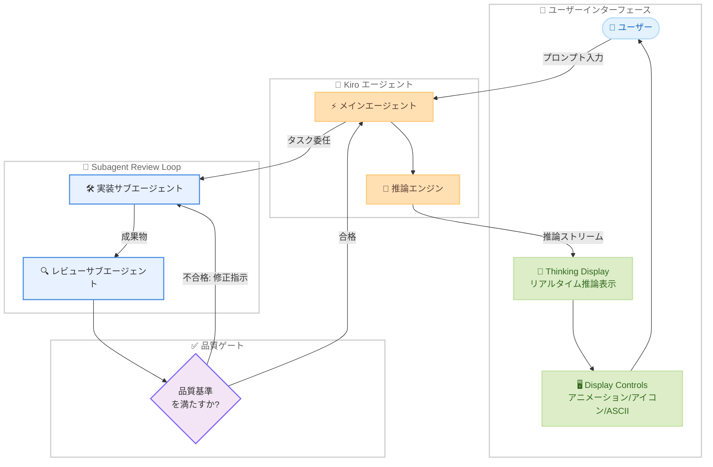

# Kiro - Thinking Display、Subagent Review Loops、Display Controls

**リリース日**: 2026 年 6 月 1 日
**サービス**: Kiro (AI-powered IDE by AWS)
**機能**: Thinking Display、Subagent Review Loops、Display Controls

📊 [このアップデートのインフォグラフィックを見る](https://takech9203.github.io/aws-news-summary/20260601-kiro-changelog-2026-06-01.html)

## 概要

Kiro CLI 2.5.0 (パッチ 2.5.1) は、エージェントの動作をより透明かつ自律的にするリリースである。Thinking Display 機能によりモデルの推論プロセスをリアルタイムで可視化し、Subagent Review Loops によりサブエージェントパイプラインが自らの出力をレビュー・修正できるようになった。さらに Display Controls により出力レンダリングの表示設定をカスタマイズ可能になった。

本リリースではストリーミング中のメッセージおよびシェル出力のレンダリング速度も顕著に向上しており、エージェントとのインタラクション全体がよりスムーズになっている。

**アップデート前の課題**

- エージェントがどのような推論プロセスを経て結論に至ったのかが不透明で、意図しない方向に進んでいることに気づくのが遅れていた
- サブエージェントパイプラインの出力は一度きりで、品質が不十分な場合もユーザーが手動で修正する必要があった
- 出力のレンダリング設定 (アニメーション、装飾、アイコン表示など) をカスタマイズする手段がなく、アクセシビリティへの対応が限定的だった
- ストリーミング中のレンダリング速度に改善の余地があった

**アップデート後の改善**

- Thinking Display によりモデルの推論をリアルタイムでストリーミング表示し、論理の誤りを早期に検知できるようになった
- Subagent Review Loops により、レビュアーステージが実装者に作業を差し戻し、品質基準を満たすまで自動的にループする自己修正ワークフローが実現した
- `/settings display` コマンドで表示設定を即座に変更可能になり、アクセシビリティニーズに柔軟に対応できるようになった
- メッセージとシェル出力のストリーミングレンダリングが高速化した

## アーキテクチャ図

## サービスアップデートの詳細

### 主要機能

#### Thinking Display

モデルの推論プロセスをリアルタイムでストリーミング表示する機能。エージェントが問題に取り組む際の思考過程を可視化することで、ユーザーはロジックの流れを追跡し、誤った方向に進んでいる場合に早期に介入できる。デフォルトで有効になっており、設定から切り替え可能。

#### Subagent Review Loops

サブエージェントパイプラインに自己レビュー・修正機能を追加。レビュアーステージが実装者の成果物を評価し、品質基準を満たさない場合は修正指示とともに差し戻す。このループは基準を満たすまで繰り返され、最終的な成果物のみがユーザーに返される。コードレビューやリファクタリングなどの品質が重要なタスクに適している。

#### Display Controls

出力レンダリングに関する設定をユーザーがカスタマイズできる機能。ストリーミングアニメーション、装飾的な ASCII アート、アイコンとテキストのみの表示切り替えが可能。アクセシビリティ要件やユーザーの好みに応じて調整できる。

### 技術仕様

| 項目 | 詳細 |
|------|------|
| バージョン | CLI 2.5.0 (パッチ 2.5.1) |
| Thinking Display デフォルト | 有効 |
| Thinking Display 設定反映 | 次回チャットセッションから |
| Display Controls 設定反映 | 即時 (再起動不要) |
| Subagent Review Loops | 品質基準を満たすまで自動ループ |
| レンダリング性能 | ストリーミング中の表示速度が顕著に向上 |

## 設定方法

### 前提条件

- Kiro CLI 2.5.0 以上がインストールされていること
- 有効な Kiro アカウント (Free、Pro、Pro+、Power のいずれか)

### 手順

#### Thinking Display の設定

1. Kiro CLI でチャットセッションを開始する
2. `/settings` コマンドを実行する
3. `Display` セクションから `Show thinking` を選択する
4. 有効/無効を切り替える
5. 次回のチャットセッションから設定が反映される

#### Display Controls の設定

1. `/settings display` コマンドを実行する
2. 以下の項目を好みに合わせて設定する。
   - ストリーミングアニメーションの有効/無効
   - 装飾的 ASCII アートの有効/無効
   - アイコン表示 / テキストのみ表示の切り替え
3. 設定変更は即座に反映される (再起動不要)

#### Subagent Review Loops の利用

Subagent Review Loops はマルチエージェントパイプラインで自動的に動作する。特別な設定は不要で、サブエージェントを使用するタスクにおいて自動的にレビューループが適用される。

## メリット

### ビジネス面

- **品質向上**: サブエージェントの自己修正により、手動レビューの工数を削減しつつ成果物の品質を向上
- **生産性向上**: エージェントの推論を確認しながら作業できるため、意図しない方向への逸脱を早期に防止
- **チーム効率化**: 自動レビューループにより、ペアプログラミングやコードレビューの一部を自動化

### 技術面

- **透明性向上**: 推論プロセスの可視化によりデバッグやプロンプト改善が容易に
- **自律性向上**: サブエージェントが自己修正することで、ユーザーの介入頻度が減少
- **アクセシビリティ改善**: 表示設定のカスタマイズにより、多様なユーザー環境に対応
- **パフォーマンス改善**: ストリーミングレンダリングの高速化により、操作のレスポンスが向上

## デメリット・制約事項

- Thinking Display の設定変更は即時反映されず、次回チャットセッションから適用される
- Subagent Review Loops の反復回数に上限がある可能性があり、複雑なタスクでは基準を完全に満たせない場合がある
- Thinking Display を有効にすると表示情報量が増加し、ターミナルの表示スペースを多く消費する
- Review Loops のループ回数が増えるとクレジット消費が増加する可能性がある

## ユースケース

1. **コードレビューの自動化**: サブエージェントにコードを生成させ、レビューサブエージェントがベストプラクティスに基づいて修正を要求。品質基準を満たすまで自動的にイテレーションする
2. **リファクタリング**: 既存コードのリファクタリングをサブエージェントに委任し、レビューループで設計原則への準拠を確認してから適用する
3. **推論のデバッグ**: Thinking Display を活用して、エージェントが誤った前提に基づいて推論している場合に早期に中断し、正しい方向に修正する
4. **アクセシビリティ対応**: スクリーンリーダーを使用するユーザーがテキストのみ表示に切り替え、アニメーションや装飾を無効化して利用する

## 料金

Kiro の料金プランは以下の通り。

| プラン | 月額 | クレジット |
|--------|------|-----------|
| Free | $0 | 50 クレジット/月 |
| Pro | $20 | 1,000 クレジット/月 |
| Pro+ | $40 | 2,000 クレジット/月 |
| Power | $200 | 10,000 クレジット/月 |

Thinking Display および Display Controls 機能は全プランで利用可能。Subagent Review Loops の利用はループ回数に応じてクレジットを消費する。

## 利用可能リージョン

グローバル (Kiro はリージョンに依存しないグローバルサービスとして提供)

## 関連サービス・機能

- **Kiro Specs**: 仕様駆動開発を支援する機能。サブエージェントレビューループと組み合わせることで、仕様に基づいた品質保証が可能
- **Kiro Agent Hooks**: エージェントの動作に応じた自動化フックを設定する機能
- **Kiro CLI 2.4**: 会話の巻き戻し、エフォートコントロール、統合設定を導入した前バージョン
- **Amazon Bedrock**: Kiro のバックエンドで利用される基盤モデルサービス

## 参考リンク

- 📊 [インフォグラフィック](https://takech9203.github.io/aws-news-summary/20260601-kiro-changelog-2026-06-01.html)
- [公式発表 Changelog](https://kiro.dev/changelog/)
- [CLI 2.5.0 リリース詳細](https://kiro.dev/changelog/cli/2-5)
- [Display 設定ドキュメント](https://kiro.dev/docs/cli/chat/settings/#settings-display)
- [Subagent ドキュメント](https://kiro.dev/docs/cli/chat/subagents/)

## まとめ

Kiro CLI 2.5.0 (パッチ 2.5.1) は、エージェントの透明性と自律性を大幅に向上させるアップデートである。Thinking Display によりモデルの推論過程がリアルタイムで可視化され、ユーザーはエージェントの判断根拠を理解し早期に軌道修正できる。Subagent Review Loops は自己修正ワークフローを実現し、コードレビューやリファクタリングなど品質が重視されるタスクにおいて人手による介入を削減する。Display Controls はアクセシビリティと好みに応じた表示カスタマイズを提供し、多様な利用環境に対応する。これらの機能により、Kiro は AI 支援開発ツールとしての成熟度をさらに高めている。
