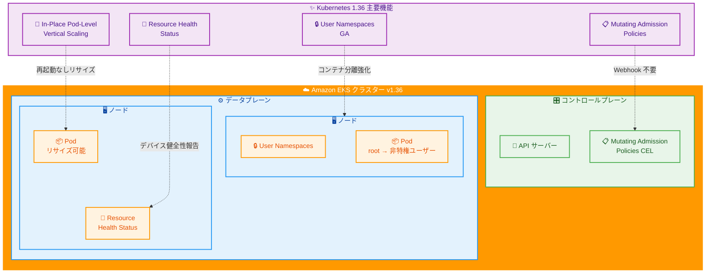

# Amazon EKS - Kubernetes バージョン 1.36 サポート

**リリース日**: 2026 年 06 月 02 日
**サービス**: Amazon EKS (Elastic Kubernetes Service)
**機能**: Kubernetes バージョン 1.36 サポート

[このアップデートのインフォグラフィックを見る](https://takech9203.github.io/aws-news-summary/20260602-amazon-eks-distro-kubernetes-version-1-36.html)

## 概要

Amazon EKS と Amazon EKS Distro が Kubernetes バージョン 1.36 のサポートを開始しました。本日より、EKS コンソール、eksctl コマンドラインインターフェース、またはインフラストラクチャコード (IaC) ツールを使用して、バージョン 1.36 で新しい EKS クラスターを作成したり、既存のクラスターをバージョン 1.36 にアップグレードしたりできます。

Kubernetes 1.36 (リリース名: ハル / Haru) では、コンテナのセキュリティ分離を強化する User Namespaces の GA 昇格、Webhook インフラなしで API サーバー上で CEL ベースのリソース変更を行う Mutating Admission Policies、Pod を再起動することなく CPU とメモリの共有バジェットをリサイズできる In-Place Pod-Level Resources Vertical Scaling、デバイスの健全性を Pod ステータスで報告してハードウェア起因のクラッシュループの特定を支援する Resource Health Status など、重要な改善が導入されています。

EKS は、AWS GovCloud (US) リージョンを含む EKS が利用可能な全ての AWS リージョンで Kubernetes バージョン 1.36 をサポートしています。

**アップデート前の課題**

- コンテナがホストの root 権限で動作する可能性があり、コンテナエスケープ攻撃時にノードレベルの権限が取得されるリスクがあった
- API サーバーでリソースの動的な変更 (Mutation) を行うには Webhook インフラを構築・運用する必要があった
- Pod レベルの CPU とメモリのバジェットを変更するには Pod の再起動が必要で、アプリケーションのダウンタイムが発生していた
- ハードウェア障害による Pod のクラッシュループの原因特定が困難だった

**アップデート後の改善**

- User Namespaces により、コンテナの root ユーザーをホスト上の非特権ユーザーにマッピングし、エスケープ時のリスクを大幅に軽減
- Mutating Admission Policies により、CEL 式を使用して Webhook なしでリソースの変更ポリシーを定義可能
- In-Place Pod-Level Resources Vertical Scaling により、Pod を再起動することなく共有リソースバジェットを動的に調整可能
- Resource Health Status により、Pod ステータスからデバイスの健全性情報を取得し、ハードウェア起因の問題を迅速に特定可能

## アーキテクチャ図



この図は、Kubernetes 1.36 の 4 つの主要な新機能と EKS クラスターのコンポーネントとの関係を示しています。User Namespaces はノードレベルのセキュリティ分離を提供し、Mutating Admission Policies はコントロールプレーンで動作し、In-Place Vertical Scaling と Resource Health Status はデータプレーンの Pod レベルで機能します。

## サービスアップデートの詳細

### 主要機能

1. **User Namespaces (GA 昇格)**
   - コンテナ内の root ユーザーをホスト上の非特権ユーザーにマッピング
   - コンテナエスケープ攻撃が成功してもノードレベルの権限を取得できない
   - Kubernetes 1.36 で正式に一般提供 (GA) に昇格
   - マルチテナント環境でのセキュリティ境界を大幅に強化

2. **Mutating Admission Policies**
   - CEL (Common Expression Language) ベースでリソースの変更ルールを定義
   - 従来の Mutating Webhook を構築・運用する必要がない
   - API サーバー内で直接変更処理を実行するため、レイテンシーが低減
   - Webhook の障害によるクラスター全体への影響リスクを排除

3. **In-Place Pod-Level Resources Vertical Scaling (Beta)**
   - Pod レベルの共有 CPU とメモリのバジェットを再起動なしでリサイズ
   - 従来の Pod 単位のリソース変更に加え、Pod レベルのリソースバジェットも動的に調整可能
   - アプリケーションのダウンタイムを最小化しながらリソース最適化を実現
   - Kubernetes 1.35 で導入された In-Place Pod Resource Updates をさらに拡張

4. **Resource Health Status**
   - Pod ステータスにデバイスの健全性情報を報告
   - GPU やアクセラレータなどのハードウェアデバイスの障害を迅速に検知
   - ハードウェア起因のクラッシュループの根本原因を特定しやすくなる
   - 自動修復やノード退避のトリガーとして活用可能

### その他の注目機能 (Kubernetes 1.36)

5. **Fine-Grained Kubelet API Authorization (GA)**
   - Kubelet API へのアクセスを細かく制御
   - クラスターのセキュリティポスチャを強化

6. **Volume Group Snapshots (GA)**
   - 複数のボリュームを一括でスナップショット取得
   - データの整合性を保った状態でバックアップ可能

7. **PSI Metrics (GA)**
   - Pressure Stall Information メトリクスを Kubernetes で利用可能
   - リソース競合の可視化と最適化を支援

## 技術仕様

### Kubernetes 1.36 主要変更点

| カテゴリ | 機能 | ステータス |
|----------|------|-----------|
| セキュリティ | User Namespaces | GA |
| セキュリティ | Fine-Grained Kubelet API Authorization | GA |
| アドミッション制御 | Mutating Admission Policies | 新規 |
| リソース管理 | In-Place Pod-Level Resources Vertical Scaling | Beta |
| 可観測性 | Resource Health Status | 新規 |
| ストレージ | Volume Group Snapshots | GA |
| 可観測性 | PSI Metrics | GA |
| バリデーション | Declarative Validation | GA |
| SELinux | SELinux Volume Label Changes | GA |
| ネットワーク | Mixed Version Proxy | Beta |

### EKS バージョンサポート

| 項目 | 詳細 |
|------|------|
| Kubernetes バージョン | 1.36 |
| リリース名 | ハル (Haru) |
| アップストリームリリース日 | 2026 年 4 月 22 日 |
| EKS サポート開始日 | 2026 年 6 月 2 日 |
| 利用可能ツール | EKS コンソール、eksctl、IaC ツール |
| EKS Distro 提供先 | ECR Public Gallery、GitHub |

## 設定方法

### 前提条件

1. AWS CLI または eksctl がインストールされていること
2. EKS クラスターを作成または管理する IAM 権限があること
3. Kubernetes 1.36 にアップグレードする前に、EKS cluster insights で互換性問題を確認すること
4. 既存クラスターの場合、現在のバージョンが 1.35 であること (1 バージョンずつアップグレード)

### 手順

#### ステップ 1: 新しい EKS クラスターを Kubernetes 1.36 で作成

```bash
# eksctl を使用して Kubernetes 1.36 クラスターを作成
eksctl create cluster \
    --name my-cluster \
    --version 1.36 \
    --region ap-northeast-1 \
    --nodegroup-name standard-workers \
    --node-type t3.medium \
    --nodes 3 \
    --nodes-min 1 \
    --nodes-max 4
```

このコマンドは、Kubernetes 1.36 を使用する新しい EKS クラスターを東京リージョンに作成します。

#### ステップ 2: 既存クラスターのアップグレード前確認

```bash
# EKS cluster insights で互換性問題を確認
aws eks list-insights \
    --region ap-northeast-1 \
    --cluster-name my-cluster

# 現在のクラスターバージョンを確認
aws eks describe-cluster \
    --name my-cluster \
    --region ap-northeast-1 \
    --query 'cluster.version'
```

アップグレード前に cluster insights で互換性の問題がないかを確認します。非推奨 API の使用やアドオンの互換性を事前にチェックできます。

#### ステップ 3: コントロールプレーンのアップグレード

```bash
# eksctl を使用してクラスターをアップグレード
eksctl upgrade cluster \
    --name my-cluster \
    --version 1.36 \
    --region ap-northeast-1 \
    --approve
```

コントロールプレーンを Kubernetes 1.36 にアップグレードします。この処理には通常 25-45 分程度かかります。

#### ステップ 4: ノードグループのアップグレード

```bash
# マネージドノードグループをアップグレード
eksctl upgrade nodegroup \
    --name standard-workers \
    --cluster my-cluster \
    --region ap-northeast-1 \
    --kubernetes-version 1.36
```

コントロールプレーンのアップグレード後、ノードグループも Kubernetes 1.36 にアップグレードする必要があります。

#### ステップ 5: User Namespaces の有効化

```yaml
# Pod spec で User Namespaces を有効化
apiVersion: v1
kind: Pod
metadata:
  name: secure-pod
spec:
  hostUsers: false
  containers:
  - name: app
    image: my-app:latest
    securityContext:
      runAsUser: 0
```

`hostUsers: false` を設定することで、コンテナの root ユーザーがホスト上の非特権ユーザーにマッピングされます。

## メリット

### ビジネス面

- **セキュリティリスクの大幅な低減**: User Namespaces の GA により、コンテナエスケープ攻撃のリスクを根本的に軽減し、コンプライアンス要件を満たしやすくなる
- **運用コストの削減**: Mutating Admission Policies により Webhook インフラの構築・運用が不要になり、運用負担を軽減
- **ダウンタイムの最小化**: In-Place Pod-Level Resources Vertical Scaling により、リソース調整時のアプリケーション停止を回避

### 技術面

- **セキュリティ境界の強化**: User Namespaces により、マルチテナント環境でのコンテナ間の分離を強化
- **アドミッション制御の簡素化**: CEL ベースの Mutating Admission Policies により、宣言的にリソース変更ルールを定義可能
- **障害の迅速な特定**: Resource Health Status によりハードウェア障害の検知と根本原因の分析が容易に
- **柔軟なリソース管理**: Pod レベルのリソースバジェットを動的に調整し、最適なリソース配分を維持

## デメリット・制約事項

### 制限事項

- アップグレードは 1 バージョンずつ行う必要がある (例: 1.34 → 1.35 → 1.36)
- User Namespaces は Linux ノードでのみ利用可能で、すべてのランタイムが対応しているわけではない
- In-Place Pod-Level Resources Vertical Scaling は Beta 段階であり、一部の制約がある可能性
- Mutating Admission Policies は新機能のため、既存の Webhook との移行計画が必要

### 考慮すべき点

- Kubernetes 1.36 へのアップグレードは一方向のみで、ダウングレードはサポートされていない
- アップグレード前に本番環境以外でテストすることを強く推奨
- EKS のバージョンライフサイクルポリシーを確認し、Standard Support と Extended Support の期間を把握しておく
- 非推奨 API が削除されている可能性があるため、事前に cluster insights で確認が必要
- Service ExternalIPs の非推奨化と削除が含まれるため、使用している場合は移行計画が必要

## ユースケース

### ユースケース 1: マルチテナント環境のセキュリティ強化

**シナリオ**: SaaS プラットフォームで複数のテナントが同一クラスター上でワークロードを実行しており、テナント間のセキュリティ分離を強化したい。

**実装例**:
```yaml
apiVersion: v1
kind: Pod
metadata:
  name: tenant-a-workload
  namespace: tenant-a
spec:
  hostUsers: false
  containers:
  - name: app
    image: tenant-a-app:latest
    securityContext:
      runAsUser: 0
      allowPrivilegeEscalation: false
```

**効果**: User Namespaces により、たとえコンテナ内で root として動作していても、ホスト上では非特権ユーザーとして実行されるため、コンテナエスケープ攻撃が成功してもノードレベルの権限を取得できない。

### ユースケース 2: Webhook 不要のポリシー適用

**シナリオ**: 全ての Pod に特定のリソースリミットやラベルを自動付与したいが、Webhook サーバーの可用性管理が負担になっている。

**実装例**:
```yaml
apiVersion: admissionregistration.k8s.io/v1
kind: MutatingAdmissionPolicy
metadata:
  name: add-default-resources
spec:
  matchConstraints:
    resourceRules:
    - apiGroups: [""]
      apiVersions: ["v1"]
      resources: ["pods"]
      operations: ["CREATE"]
  mutations:
  - patchType: ApplyConfiguration
    applyConfiguration:
      expression: >
        Object{
          spec: Object{
            containers: [Object{
              resources: Object{
                limits: Object{
                  memory: "512Mi"
                }
              }
            }]
          }
        }
```

**効果**: Webhook インフラの構築・運用が不要になり、API サーバー内で直接ポリシーを適用できるため、信頼性が向上し運用コストが削減される。

### ユースケース 3: GPU ワークロードのハードウェア障害検知

**シナリオ**: ML 推論ワークロードで GPU を使用しているが、ハードウェア障害による Pod のクラッシュループの原因特定に時間がかかっている。

**実装例**:
```bash
# Pod のリソース健全性ステータスを確認
kubectl get pod ml-inference-pod -o jsonpath='{.status.resourceHealth}'
```

**効果**: Resource Health Status により、GPU やアクセラレータの健全性情報が Pod ステータスに報告されるため、ハードウェア起因のクラッシュループを迅速に特定し、障害ノードからの退避を自動化できる。

## 料金

Kubernetes バージョン 1.36 の使用に追加料金はかかりません。標準の EKS 料金が適用されます。

### 料金例

| 項目 | 料金 |
|------|------|
| EKS コントロールプレーン | クラスターあたり $0.10/時間 |
| EKS Extended Support | クラスターあたり $0.60/時間 (Standard Support 終了後) |
| ワーカーノード | EC2 インスタンス料金が適用 |
| EKS with Fargate | vCPU とメモリに基づく料金 |

詳細な料金情報については、[Amazon EKS 料金ページ](https://aws.amazon.com/eks/pricing/)を参照してください。

## 利用可能リージョン

Kubernetes バージョン 1.36 は、AWS GovCloud (US) リージョンを含む EKS が利用可能な全ての AWS リージョンで提供されています。東京リージョン (ap-northeast-1) を含む全商用リージョンで即座に利用可能です。

## 関連サービス・機能

- **Amazon EKS Distro**: Kubernetes バージョン 1.36 のビルドを ECR Public Gallery と GitHub で提供
- **EKS Cluster Insights**: アップグレードに影響を与える可能性のある問題を事前に検出
- **eksctl**: EKS クラスターの作成とアップグレードを簡素化するコマンドラインツール
- **Amazon ECR**: コンテナイメージを保存および管理
- **AWS Fargate**: サーバーレスでの EKS Pod 実行をサポート
- **Amazon CloudWatch Container Insights**: クラスターのメトリクスとログの可視化

## 参考リンク

- [このアップデートのインフォグラフィック](https://takech9203.github.io/aws-news-summary/20260602-amazon-eks-distro-kubernetes-version-1-36.html)
- [公式発表 (What's New)](https://aws.amazon.com/about-aws/whats-new/2026/06/amazon-eks-distro-kubernetes-version-1-36)
- [EKS ドキュメント - Kubernetes バージョン](https://docs.aws.amazon.com/eks/latest/userguide/kubernetes-versions-standard.html)
- [Kubernetes 1.36 リリースノート](https://github.com/kubernetes/kubernetes/blob/master/CHANGELOG/CHANGELOG-1.36.md)
- [EKS Cluster Insights](https://docs.aws.amazon.com/eks/latest/userguide/cluster-insights.html)
- [EKS バージョンライフサイクル](https://docs.aws.amazon.com/eks/latest/userguide/kubernetes-versions.html)
- [Amazon EKS 料金](https://aws.amazon.com/eks/pricing/)

## まとめ

Amazon EKS の Kubernetes バージョン 1.36 サポートにより、User Namespaces の GA 昇格でコンテナセキュリティが大幅に強化され、Mutating Admission Policies で Webhook 不要のポリシー適用が可能になり、In-Place Pod-Level Resources Vertical Scaling で Pod レベルのリソースを再起動なしに調整でき、Resource Health Status でハードウェア障害の検知が容易になりました。特にセキュリティとリソース管理の面で大きな進歩があり、マルチテナント環境や GPU ワークロードを運用するユーザーにとって重要なアップグレードです。既存クラスターのアップグレードを検討する場合は、EKS cluster insights で互換性を確認し、ステージング環境でのテストを経て計画的に実施してください。
