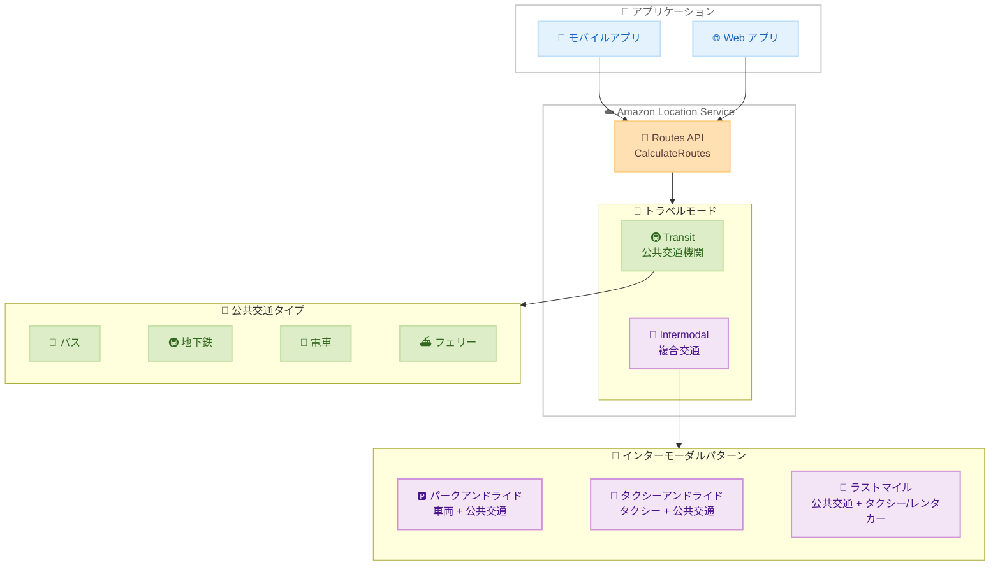

# Amazon Location Service - 公共交通機関およびインターモーダルルーティング

**リリース日**: 2026 年 6 月 2 日
**サービス**: Amazon Location Service
**機能**: Public Transit and Intermodal Routing

📊 [このアップデートのインフォグラフィックを見る](https://takech9203.github.io/aws-news-summary/20260602-amazon-location-new-public-transit-intermodal-routing.html)

## 概要

Amazon Location Service の Routes API に、公共交通機関 (Transit) およびインターモーダル (Intermodal) ルーティングのサポートが追加された。`CalculateRoutes` オペレーションで 2 つの新しいトラベルモード「Transit」と「Intermodal」が利用可能になり、公共交通機関と徒歩、自動車、タクシー、レンタカーを組み合わせた経路計画が可能になった。

公共交通機関ルーティングでは、バス、地下鉄、電車、フェリーなどの交通手段を利用したポイント間ルートを計算できる。停留所までの徒歩案内、出発時刻・到着時刻、路線情報なども含まれる。インターモーダルルーティングでは、パークアンドライド (車両 + 公共交通)、タクシーアンドライド (タクシー + 公共交通)、ラストマイル配送 (タクシーまたはレンタカー) など、複数の交通手段を単一のルートに統合できる。

これらの機能により、モビリティ、物流、従業員通勤、都市計画などのアプリケーションにおいて、正確なマルチモーダルルート計算が実現される。

**アップデート前の課題**

- Amazon Location Service の Routes API では自動車、徒歩、トラックのトラベルモードのみがサポートされ、公共交通機関を含むルート計算ができなかった
- 複数の交通手段を組み合わせたマルチモーダルなルート計画には、サードパーティの API を別途利用する必要があった
- パークアンドライドやラストマイル配送など、現実的な通勤・移動パターンを単一の API コールで計算することが不可能だった
- 都市部のモビリティアプリケーション開発において、AWS エコシステム内で完結する経路検索ソリューションが欠如していた

**アップデート後の改善**

- `CalculateRoutes` API で Transit および Intermodal トラベルモードが利用可能になり、公共交通機関を含むルート計算が AWS ネイティブで実現できるようになった
- バス、地下鉄、電車、フェリーなど複数の交通タイプに対応し、停留所への徒歩案内や時刻情報も取得可能になった
- パークアンドライド、タクシーアンドライド、ラストマイル配送を単一の API コールで計算可能になった
- アクセシビリティ属性 (車椅子対応) やタクシー・レンタカーの有効化区間の制御など、きめ細かいルートカスタマイズが可能になった

## アーキテクチャ図



Amazon Location Service Routes API が Transit と Intermodal の 2 つの新しいトラベルモードを提供し、公共交通機関やマルチモーダルな経路計算を単一 API で実現する全体像を示す。

## サービスアップデートの詳細

### 主要機能

1. **Transit トラベルモード**
   - バス、地下鉄、電車、フェリー、路面電車、エアリアルトラムウェイなど多様な交通タイプに対応
   - 停留所までの徒歩案内を含むポイント間ルート計算
   - 出発時刻・到着時刻の情報を含むスケジュールベースのルーティング
   - 路線名、運行事業者、中間停留所などの詳細情報を取得可能
   - `AllowedModes` で特定の交通タイプのみに限定可能

2. **Intermodal トラベルモード**
   - 複数の交通手段を単一ルートに統合
   - パークアンドライド: 車両で駅まで移動し公共交通に乗り換え
   - タクシーアンドライド: タクシーで駅まで移動し公共交通に乗り換え
   - ラストマイル: 公共交通から降りた後タクシーまたはレンタカーで目的地へ
   - `EnabledFor` パラメータで各交通手段を適用する区間 (FirstLeg / LastLeg / EntireRoute / None) を制御可能

3. **アクセシビリティ対応**
   - `AccessibilityAttributes` で車椅子対応のルートをフィルタリング可能
   - 停留所やアクセスポイントの車椅子対応状況 (Available / Limited / Unavailable / Unknown) を取得
   - バリアフリー経路の計算に対応

4. **追加レッグ情報**
   - `LegAdditionalFeatures` に IntermediateStops、NextDepartures、Bookings を新たに追加
   - PedestrianLegDetails で徒歩区間の詳細 (待機時間、案内指示など) を取得
   - TransitLegDetails で乗車・降車情報、路線詳細を取得

## 技術仕様

### API パラメータ

| 項目 | 詳細 |
|------|------|
| API オペレーション | `CalculateRoutes` |
| 新規トラベルモード | `Transit`、`Intermodal` |
| Transit 対応交通タイプ | AerialTramway、Bus、BusRapidTransit、CityTrain、CommuterTrain、Ferry、HighSpeedTrain、IntercityTrain、LightRail、LongDistanceTrain、Metro、Monorail、All |
| Intermodal 構成要素 | Pedestrian (徒歩)、Transit (公共交通)、Taxi (タクシー)、Rental (レンタカー) |
| アクセシビリティ | Wheelchair |
| 区間制御 | FirstLeg / LastLeg / EntireRoute / None |

### Intermodal オプション

| パラメータ | 型 | 説明 |
|-----------|------|------|
| `MaxTransfers` | integer | 公共交通の最大乗り換え回数 |
| `Pedestrian.MaxDistance` | long | 徒歩区間の最大距離 |
| `Pedestrian.Speed` | double | 徒歩速度 |
| `Taxi.EnabledFor` | enum | タクシーを有効にする区間 |
| `Taxi.AllowedModes` | list | タクシーの許可モード (All / Car) |
| `Rental.EnabledFor` | enum | レンタカーを有効にする区間 |
| `Rental.AllowedModes` | list | レンタカーの許可モード (All / Car) |

### API 変更履歴

| 日付 | サービス | 変更内容 |
|------|----------|----------|
| 2026/06/02 | [Amazon Location Service Routes V2](https://awsapichanges.com/archive/changes/250cdc-geo-routes.html) | 1 updated api method - CalculateRoutes に Transit および Intermodal トラベルモードを追加 |

### エラーハンドリング

新しい通知コードが追加された。

| 通知コード | 説明 |
|-----------|------|
| `NoTransitStationsFound` | 指定エリアに公共交通の駅が見つからない |
| `TransitDataUnavailable` | 対象地域の公共交通データが利用不可 |
| `TransitRouteUnavailable` | 指定条件でのルート計算が不可 |

## 設定方法

### 前提条件

1. AWS アカウントおよび Amazon Location Service へのアクセス権限
2. `geo-routes` に対する `geo:CalculateRoute` IAM アクション権限
3. Routes API v2 エンドポイントへのアクセス

### 手順

#### ステップ 1: Transit ルートの計算

```python
import boto3

client = boto3.client('geo-routes', region_name='ap-northeast-1')

response = client.calculate_routes(
    Origin=[139.7671, 35.6812],  # 東京駅
    Destination=[139.7454, 35.6586],  # 渋谷駅
    TravelMode='Transit',
    TravelModeOptions={
        'Transit': {
            'AllowedModes': ['Metro', 'CityTrain'],
            'AccessibilityAttributes': ['Wheelchair']
        }
    },
    DepartureTime='2026-06-02T09:00:00+09:00',
    LegAdditionalFeatures=['IntermediateStops', 'NextDepartures']
)
```

Transit モードを指定し、地下鉄と都市鉄道のみを許可した公共交通ルートを計算する。車椅子対応のアクセシビリティフィルタも適用している。

#### ステップ 2: Intermodal ルートの計算 (パークアンドライド)

```python
response = client.calculate_routes(
    Origin=[139.5000, 35.5500],  # 郊外の出発地
    Destination=[139.7671, 35.6812],  # 東京駅
    TravelMode='Intermodal',
    TravelModeOptions={
        'Intermodal': {
            'MaxTransfers': 2,
            'Pedestrian': {
                'MaxDistance': 1000,
                'Speed': 4.5
            },
            'Taxi': {
                'EnabledFor': ['None']
            },
            'Rental': {
                'EnabledFor': ['None']
            }
        }
    },
    DepartureTime='2026-06-02T08:00:00+09:00'
)
```

自動車で最寄り駅まで移動し、公共交通で目的地に向かうパークアンドライドのルートを計算する。タクシーとレンタカーは無効にし、乗り換えは最大 2 回に制限している。

#### ステップ 3: Intermodal ルートの計算 (ラストマイル配送)

```python
response = client.calculate_routes(
    Origin=[139.7671, 35.6812],  # 東京駅
    Destination=[139.6900, 35.7100],  # 目的地
    TravelMode='Intermodal',
    TravelModeOptions={
        'Intermodal': {
            'MaxTransfers': 1,
            'Pedestrian': {
                'MaxDistance': 500,
                'Speed': 4.5
            },
            'Taxi': {
                'EnabledFor': ['LastLeg'],
                'AllowedModes': ['Car']
            },
            'Rental': {
                'EnabledFor': ['None']
            }
        }
    }
)
```

公共交通で移動した後、最終区間をタクシーで目的地まで向かうラストマイルパターンを計算する。タクシーは LastLeg のみで有効化している。

## メリット

### ビジネス面

- **モビリティアプリの価値向上**: 公共交通を含むマルチモーダル経路検索により、エンドユーザー体験が大幅に向上する
- **開発コスト削減**: サードパーティの交通 API を別途契約・統合する必要がなくなり、AWS エコシステム内で完結できる
- **都市計画の最適化**: 公共交通データに基づいた通勤パターン分析やオフィス立地最適化に活用できる
- **従業員満足度向上**: 企業の通勤支援アプリケーションで最適な通勤ルートを提案可能になる

### 技術面

- **単一 API コール**: 複数の交通手段を組み合わせたルートを 1 回の API 呼び出しで取得可能
- **きめ細かな制御**: EnabledFor パラメータによる区間単位のモード制御で、ビジネスロジックに合わせたルート計算が可能
- **アクセシビリティ対応**: 車椅子対応情報を含むルート計算がネイティブにサポートされ、バリアフリーアプリ開発が容易
- **AWS サービス統合**: Amazon Location Service の他の機能 (Places、Maps、Geofences) と統合した位置情報ソリューションの構築が容易

## デメリット・制約事項

### 制限事項

- 公共交通データのカバレッジは地域によって異なり、すべての都市・路線が網羅されているわけではない
- `TransitDataUnavailable` エラーが返される地域では利用不可
- リアルタイムの遅延情報や運休情報は含まれない (スケジュールベースのルーティング)
- 利用可能リージョンが 13 リージョンに限定されている

### 考慮すべき点

- 公共交通データの更新頻度に依存するため、ダイヤ改正時にはルート計算結果が一時的に不正確になる可能性がある
- Intermodal ルーティングの応答サイズが従来のモードより大きくなるため、帯域幅とレスポンス解析の設計を考慮する必要がある
- 既存の Car / Pedestrian / Truck モードとは異なるレスポンス構造 (PedestrianLegDetails、TransitLegDetails) のため、パーサーの実装更新が必要

## ユースケース

### ユースケース 1: 従業員通勤支援アプリ

**シナリオ**: 大企業が従業員向けの通勤経路提案アプリを構築し、最適な通勤手段と経路を提案する。

**実装例**:
```python
# 従業員の自宅から会社までの最適ルートを計算
response = client.calculate_routes(
    Origin=employee_home,
    Destination=office_location,
    TravelMode='Intermodal',
    TravelModeOptions={
        'Intermodal': {
            'MaxTransfers': 2,
            'Pedestrian': {'MaxDistance': 800},
            'Taxi': {'EnabledFor': ['None']},
            'Rental': {'EnabledFor': ['None']}
        }
    },
    DepartureTime=commute_time
)
```

**効果**: 従業員ごとに最適な通勤ルートと所要時間を自動提案し、通勤手当の最適化やフレックスタイム制度の設計に活用できる。

### ユースケース 2: MaaS プラットフォーム

**シナリオ**: MaaS (Mobility as a Service) プラットフォームで、ユーザーの移動ニーズに応じた最適なマルチモーダルルートを提供する。

**実装例**:
```python
# タクシー + 電車 + 徒歩の組み合わせルート
response = client.calculate_routes(
    Origin=pickup_location,
    Destination=destination,
    TravelMode='Intermodal',
    TravelModeOptions={
        'Intermodal': {
            'MaxTransfers': 3,
            'Taxi': {
                'EnabledFor': ['FirstLeg', 'LastLeg'],
                'AllowedModes': ['Car']
            },
            'Rental': {'EnabledFor': ['None']}
        }
    },
    LegAdditionalFeatures=['Bookings']
)
```

**効果**: 複数の交通手段をシームレスに組み合わせた経路を提供し、予約情報 (Bookings) も含めたエンドツーエンドの移動体験を実現できる。

### ユースケース 3: 物流ラストマイル最適化

**シナリオ**: 物流会社が都市部の配送ルートを最適化し、公共交通を活用したラストマイル配送を計画する。

**実装例**:
```python
# 配送拠点から目的地までのルート計算
response = client.calculate_routes(
    Origin=distribution_center,
    Destination=delivery_point,
    TravelMode='Intermodal',
    TravelModeOptions={
        'Intermodal': {
            'MaxTransfers': 1,
            'Pedestrian': {'MaxDistance': 300},
            'Taxi': {'EnabledFor': ['LastLeg']},
            'Rental': {'EnabledFor': ['None']}
        }
    }
)
```

**効果**: 都市部の渋滞を回避し、公共交通を活用した配送ルートの最適化により、配送時間の短縮と CO2 排出量の削減を実現できる。

## 料金

Amazon Location Service Routes API の料金は、ルート計算リクエスト数に基づく従量課金制である。

### 料金例

| 使用量 | 月額料金 (概算) |
|--------|------------------|
| 最初の 1,000 リクエスト/月 | 無料枠 (AWS Free Tier) |
| 1,001 - 100,000 リクエスト | $0.50/1,000 リクエスト |
| 100,001 以上 | ボリュームディスカウント適用 |

※ Transit および Intermodal モードの料金は公式料金ページで最新情報を確認すること。マルチモーダルルートの場合、通常モードと異なる料金体系が適用される可能性がある。

## 利用可能リージョン

以下の 13 リージョンで利用可能。

| リージョン | コード |
|-----------|--------|
| US East (Ohio) | us-east-2 |
| US East (N. Virginia) | us-east-1 |
| US West (Oregon) | us-west-2 |
| Asia Pacific (Mumbai) | ap-south-1 |
| Asia Pacific (Sydney) | ap-southeast-2 |
| Asia Pacific (Tokyo) | ap-northeast-1 |
| Canada (Central) | ca-central-1 |
| Europe (Frankfurt) | eu-central-1 |
| Europe (Ireland) | eu-west-1 |
| Europe (London) | eu-west-2 |
| Europe (Stockholm) | eu-north-1 |
| Europe (Spain) | eu-south-2 |
| South America (Sao Paulo) | sa-east-1 |

東京リージョン (ap-northeast-1) を含むグローバルな主要リージョンで利用可能。

## 関連サービス・機能

- **Amazon Location Service Places**: ジオコーディングや POI 検索と組み合わせて、出発地・目的地の特定やトランジット駅の検索に活用
- **Amazon Location Service Maps**: 計算されたルートを地図上に可視化し、ユーザーに経路を表示
- **Amazon Location Service Geofences**: ジオフェンスと組み合わせて、特定エリアに入った際の乗り換え通知などを実現
- **Amazon EventBridge**: ルート計算結果に基づくイベント駆動型の通知やワークフローの構築
- **AWS Lambda**: ルート計算のバックエンド処理やリアルタイムの経路最適化ロジックの実装

## 参考リンク

- 📊 [インフォグラフィック](https://takech9203.github.io/aws-news-summary/20260602-amazon-location-new-public-transit-intermodal-routing.html)
- [公式発表 (What's New)](https://aws.amazon.com/about-aws/whats-new/2026/06/amazon-location-service/amazon-location-new-public-transit-intermodal-routing)
- [Amazon Location Service Routes API ドキュメント](https://docs.aws.amazon.com/location/latest/APIReference/API_routes_CalculateRoutes.html)
- [Amazon Location Service 料金ページ](https://aws.amazon.com/location/pricing/)
- [API 変更履歴](https://awsapichanges.com/archive/changes/250cdc-geo-routes.html)

## まとめ

Amazon Location Service に公共交通機関およびインターモーダルルーティングが追加されたことで、AWS ネイティブなマルチモーダル経路検索が実現された。モビリティ、物流、通勤支援、都市計画などの幅広いユースケースに対応し、サードパーティ依存を減らしながら高度なルート計算アプリケーションを構築できる。東京リージョンを含む 13 リージョンで利用可能であり、日本のユーザーも即座に活用を開始できる。
