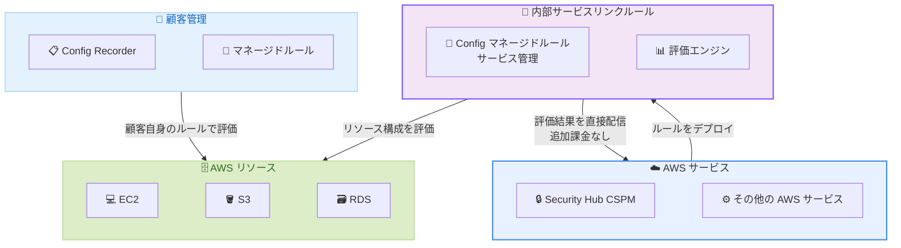

# AWS Config - 内部サービスリンクルール

**リリース日**: 2026年6月2日
**サービス**: AWS Config
**機能**: Internal Service Linked Rules

📊 [このアップデートのインフォグラフィックを見る](https://takech9203.github.io/aws-news-summary/20260602-aws-config-supports-internal-service-linked-rules.html)

## 概要

AWS Config が内部サービスリンクルール (Internal Service Linked Rules) をサポートした。これにより、AWS サービスが AWS Config のマネージドルールを使用してリソース構成を評価できるようになった。既存のサービスリンクレコーダー機能を拡張し、AWS Security Hub CSPM などの AWS サービスが、サービス固有の機能のためにルール評価をデプロイおよび管理できるようになる。

内部サービスリンクルールは、既存の顧客管理 AWS Config レコーダーおよびルールとは独立して動作する。これにより、顧客は AWS Config をインベントリ、ガバナンス、コンプライアンス、監査のユースケースに引き続き使用しながら、AWS サービスがサービス固有の評価を独立して管理できる。

評価結果はルールをデプロイした AWS サービスに直接配信され、AWS Config から顧客への追加料金は発生しない。この仕組みにより、AWS サービスは統合されたセキュリティおよびコンプライアンス機能を提供できるようになった。

**アップデート前の課題**

- AWS サービスがリソース構成を評価するには、顧客の AWS Config レコーダーとルールに依存する必要があった
- 顧客管理のルールとサービス管理のルールが同じパイプラインで動作し、相互に影響を与える可能性があった
- AWS サービスが独自のセキュリティ評価を実行するためには、顧客が AWS Config を有効化し適切に設定している必要があった
- サービスリンクルールの評価コストが顧客に課金されるケースがあった

**アップデート後の改善**

- AWS サービスが顧客の AWS Config 設定に依存せず、独立してリソース構成を評価可能になった
- 内部サービスリンクルールは顧客管理のレコーダーおよびルールとは完全に独立して動作する
- 評価結果はルールをデプロイした AWS サービスに直接配信され、AWS Config から顧客への課金は発生しない
- AWS Security Hub CSPM などのサービスが、より統合されたセキュリティ機能を提供可能になった

## アーキテクチャ図



内部サービスリンクルールは、顧客管理の AWS Config ルールとは独立して動作し、AWS サービスが直接リソース構成を評価する。評価結果はサービスに直接返され、顧客への課金は発生しない。

## サービスアップデートの詳細

### 主要機能

1. **内部サービスリンクルール**
   - AWS サービスが AWS Config マネージドルールを使用してリソース構成を評価する仕組み
   - 既存のサービスリンクレコーダー機能を拡張した機能
   - AWS サービスが統合されたセキュリティおよびコンプライアンス機能を提供するための基盤

2. **独立した動作**
   - 顧客管理の AWS Config レコーダーおよびルールとは完全に独立
   - 顧客の AWS Config 設定に影響を与えずに動作
   - AWS サービスがサービス固有の評価を独自に管理

3. **評価結果の直接配信**
   - ルールをデプロイした AWS サービスに評価結果を直接配信
   - AWS Config から顧客への追加課金なし
   - サービス側で評価結果を活用したセキュリティ機能を提供

## 技術仕様

### サービスリンクルールの比較

| 項目 | 従来のサービスリンクルール | 内部サービスリンクルール |
|------|----------------------------|--------------------------|
| 管理主体 | AWS サービス | AWS サービス |
| 動作環境 | 顧客の Config レコーダーに依存 | 独立して動作 |
| 評価結果の配信先 | 顧客の Config ダッシュボード | AWS サービスに直接配信 |
| 顧客への課金 | Config ルール評価として課金 | 追加課金なし |
| 顧客の操作権限 | 読み取り専用 | 読み取り専用 |
| 顧客ルールへの影響 | 同じパイプラインで動作 | 完全に独立 |

### API変更履歴

本アップデートに関連する API 変更は、本レポート執筆時点では確認されていない。内部サービスリンクルールは AWS サービス側で管理されるため、顧客向けの新しい API は追加されていない可能性がある。

### サービスリンクルールの権限

```json
{
  "Version": "2012-10-17",
  "Statement": [
    {
      "Effect": "Deny",
      "Action": [
        "config:PutConfigRule",
        "config:DeleteConfigRule",
        "config:DeleteEvaluationResults"
      ],
      "Resource": "arn:aws:config:*:*:config-rule/aws-service-rule/*",
      "Condition": {
        "StringNotEquals": {
          "aws:PrincipalServiceName": "securityhub.amazonaws.com"
        }
      }
    }
  ]
}
```

内部サービスリンクルールは AWS サービスが所有し、顧客は読み取り専用でアクセスする。`PutConfigRule`、`DeleteConfigRule`、`DeleteEvaluationResults` API は権限不足エラーを返す。

## 設定方法

### 前提条件

1. AWS Security Hub CSPM を使用する場合、Security Hub が有効化されていること
2. 評価対象のリソースが対象リージョンに存在すること
3. 内部サービスリンクルールは自動的にデプロイされるため、顧客側での追加設定は不要

### 手順

#### ステップ 1: AWS Security Hub の有効化

```bash
aws securityhub enable-security-hub --enable-default-standards
```

Security Hub を有効化すると、CSPM 機能に必要な内部サービスリンクルールが自動的にデプロイされる。

#### ステップ 2: 内部サービスリンクルールの確認

```bash
aws configservice describe-config-rules --filters '{"FilterName": "configRuleName", "FilterValue": "securityhub-"}'
```

Security Hub がデプロイした内部サービスリンクルールの一覧を確認する。ルール名は通常 `securityhub-` プレフィックスで始まる。

#### ステップ 3: 評価結果の確認

```bash
aws securityhub get-findings --filters '{"GeneratorId": [{"Value": "aws-config", "Comparison": "PREFIX"}]}'
```

内部サービスリンクルールの評価結果は Security Hub のファインディングとして確認できる。AWS Config コンソールではなく、Security Hub コンソールで結果を確認する。

## メリット

### ビジネス面

- **コスト削減**: 内部サービスリンクルールの評価は AWS Config から顧客に課金されないため、セキュリティ評価のコストが軽減される
- **運用負荷の軽減**: AWS サービスが独自にルールを管理するため、顧客側での設定・メンテナンスが不要
- **統合セキュリティ**: AWS サービスがネイティブにセキュリティ評価を実行し、より包括的なコンプライアンス管理を実現

### 技術面

- **独立性**: 顧客管理の Config ルールと内部サービスリンクルールが干渉しないため、安定した運用が可能
- **スケーラビリティ**: AWS サービスが必要に応じてルールを追加・更新でき、顧客の既存設定に影響を与えない
- **即時利用可能**: AWS サービスを有効化するだけで、事前の Config 設定なしにリソース評価が開始される

## デメリット・制約事項

### 制限事項

- 内部サービスリンクルールは読み取り専用であり、顧客が編集・削除できない
- ルールの評価対象やトリガー条件を顧客が個別にカスタマイズすることはできない
- 評価結果は AWS Config コンソールではなく、ルールをデプロイした AWS サービスのコンソールで確認する必要がある

### 考慮すべき点

- 内部サービスリンクルールがアカウントあたりの Config ルール上限数にカウントされる可能性があるため、大規模環境では上限に注意が必要
- 顧客管理ルールと内部サービスリンクルールで同一リソースを評価する場合、結果の確認先が異なることを理解しておく必要がある

## ユースケース

### ユースケース 1: Security Hub CSPM によるセキュリティ態勢管理

**シナリオ**: セキュリティチームが AWS Config を明示的に設定していない環境でも、Security Hub CSPM を有効化するだけでリソースのセキュリティ評価を自動的に実行したい。

**実装例**:
```bash
# Security Hub を有効化するだけで内部サービスリンクルールが自動デプロイ
aws securityhub enable-security-hub --enable-default-standards

# CSPM の評価結果を確認
aws securityhub get-findings \
  --filters '{"ProductName": [{"Value": "Security Hub", "Comparison": "EQUALS"}]}' \
  --max-items 10
```

**効果**: AWS Config の事前設定なしに、Security Hub がリソース構成を評価し、セキュリティリスクを検出できる。

### ユースケース 2: 既存の Config 運用との共存

**シナリオ**: 既にカスタム Config ルールで独自のコンプライアンス基準を運用しているが、AWS サービスによるセキュリティ評価も並行して利用したい。

**実装例**:
```bash
# 顧客管理ルールの確認
aws configservice describe-config-rules \
  --filters '{"FilterName": "configRuleState", "FilterValue": "ACTIVE"}'

# 内部サービスリンクルールは独立して動作するため
# 既存ルールに影響なく追加のセキュリティ評価が実行される
```

**効果**: 既存の Config 運用を変更せずに、AWS サービスによる追加のセキュリティ評価を受けられる。相互に干渉しないため、安定した運用を維持できる。

### ユースケース 3: マルチアカウント環境でのセキュリティ統合

**シナリオ**: AWS Organizations で管理する複数アカウントにおいて、各アカウントの Config 設定状況に依存せず統一的なセキュリティ評価を実施したい。

**実装例**:
```bash
# Organizations 全体で Security Hub を有効化
aws securityhub create-members \
  --account-details '[{"AccountId": "123456789012"}]'

aws securityhub update-organization-configuration \
  --auto-enable
```

**効果**: 各メンバーアカウントの Config 設定状況に関わらず、内部サービスリンクルールにより統一的なセキュリティ評価が実行される。Config 未設定のアカウントでもセキュリティカバレッジを確保できる。

## 料金

内部サービスリンクルールの評価は、AWS Config から顧客への追加課金が発生しない。評価結果はルールをデプロイした AWS サービスに直接配信されるため、Config ルール評価としての料金は AWS サービス側が負担する。

### 料金の考慮事項

| 項目 | 課金状況 |
|------|----------|
| 内部サービスリンクルールの評価 | 顧客への課金なし |
| Security Hub の利用 | Security Hub の料金が適用 |
| 顧客管理の Config ルール | 従来通り Config の料金が適用 |
| Config レコーダー (顧客管理) | 従来通り Config の料金が適用 |

## 利用可能リージョン

AWS Security Hub CSPM の内部サービスリンクルールは以下のすべてのリージョンで利用可能。

- すべての商用リージョン (Commercial Regions)
- AWS GovCloud (US) リージョン
- 中国リージョン (China Regions)

## 関連サービス・機能

- **AWS Security Hub CSPM**: 内部サービスリンクルールの最初の利用サービス。クラウドセキュリティ態勢管理を提供
- **AWS Config マネージドルール**: 内部サービスリンクルールの基盤として使用される事前定義済みルール
- **AWS Config サービスリンクレコーダー**: 内部サービスリンクルールの前身となる機能。AWS サービスがリソース記録を実行
- **AWS Organizations**: マルチアカウント環境での Security Hub 統合管理に使用
- **AWS Security Hub セキュリティ標準**: CIS、AWS Foundational Security Best Practices など、内部サービスリンクルールで評価される基準

## 参考リンク

- 📊 [インフォグラフィック](https://takech9203.github.io/aws-news-summary/20260602-aws-config-supports-internal-service-linked-rules.html)
- [公式発表 (What's New)](https://aws.amazon.com/about-aws/whats-new/2026/06/aws-config-supports-internal-service-linked-rules)
- [ドキュメント - Service-Linked AWS Config Rules](https://docs.aws.amazon.com/config/latest/developerguide/service-linked-awsconfig-rules.html)
- [AWS Config 料金](https://aws.amazon.com/config/pricing/)
- [AWS Security Hub ドキュメント](https://docs.aws.amazon.com/securityhub/latest/userguide/)

## まとめ

AWS Config の内部サービスリンクルールは、AWS サービスが顧客の Config 設定に依存せず独立してリソース構成を評価できる重要な基盤機能である。顧客への追加課金なしで動作し、既存の Config 運用に影響を与えないため、特に Security Hub CSPM を利用するすべてのユーザーにとって運用コストの削減とセキュリティカバレッジの向上が期待できる。AWS Config を未設定の環境でも AWS サービスによるセキュリティ評価が受けられるため、セキュリティ態勢の底上げに貢献する機能である。
