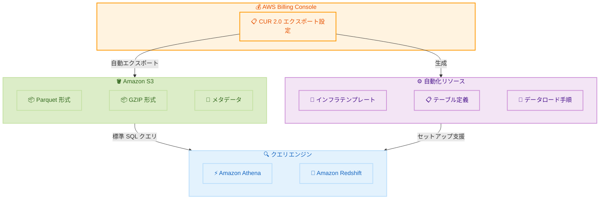

# AWS Cost and Usage Report 2.0 - Athena / Redshift インテグレーション

**リリース日**: 2026年6月2日
**サービス**: AWS Billing and Cost Management
**機能**: AWS Cost and Usage Report 2.0 Athena / Redshift 統合

📊 [このアップデートのインフォグラフィックを見る](https://takech9203.github.io/aws-news-summary/20260602-aws-cur2-athena-redshift.html)

## 概要

AWS は、AWS Cost and Usage Report 2.0 (CUR 2.0) に Amazon Athena および Amazon Redshift との統合オプションを追加したことを発表した。これにより、Amazon S3 に保存された CUR 2.0 データを標準 SQL で直接クエリすることが可能となり、カスタムデータウェアハウスソリューションを構築する必要がなくなる。

この機能は CUR 1.0 で提供されていた統合オプションとの機能パリティを実現するものである。CUR 2.0 は従来の CUR 1.0 に対してスキーマの正規化やカラム構造の改善が行われた次世代レポートであるが、Athena や Redshift との直接統合が欠けていたため、移行を躊躇していた顧客にとって重要なアップデートとなる。

統合を選択すると、CUR 2.0 エクスポートは選択したクエリエンジンに最適なフォーマット (Parquet、GZIP) で自動的に配信される。また、インフラストラクチャテンプレート、テーブル定義、データロード手順などの自動化リソースが付属し、手動設定なしでコストデータのクエリを開始できる。

**アップデート前の課題**

- CUR 2.0 では Athena や Redshift との直接統合が提供されておらず、CUR 1.0 の統合オプションとの機能パリティがなかった
- CUR 2.0 のデータを分析するには、カスタム ETL パイプラインやデータウェアハウスソリューションを独自に構築する必要があった
- テーブル定義やデータロードの設定を手動で行う必要があり、セットアップに時間がかかっていた
- CUR 1.0 から CUR 2.0 への移行が統合機能の欠如により困難だった

**アップデート後の改善**

- Athena または Redshift を選択するだけで、最適なフォーマットでデータが自動配信される
- インフラストラクチャテンプレート、テーブル定義、データロード手順が自動的に提供される
- CUR 2.0 データの定期更新が Athena / Redshift テーブルに自動反映され、追加の ETL が不要
- CUR 1.0 との機能パリティが達成され、CUR 2.0 への移行障壁が解消された

## アーキテクチャ図



CUR 2.0 エクスポート設定で Athena または Redshift を選択すると、S3 への最適フォーマットでの自動配信と、クエリ開始に必要な自動化リソースが提供される。

## サービスアップデートの詳細

### 主要機能

1. **Athena 統合**
   - CUR 2.0 データを Athena で直接クエリ可能
   - Parquet 形式で最適化されたデータ配信
   - テーブル定義とパーティション設定が自動生成
   - データ更新時に Athena テーブルへ自動反映

2. **Redshift 統合**
   - CUR 2.0 データを Redshift で直接クエリ可能
   - Redshift に最適化されたフォーマットでのデータ配信
   - データロード手順とテーブル定義が自動提供
   - 定期的なデータリフレッシュが自動反映

3. **自動化リソースの提供**
   - インフラストラクチャテンプレート (CloudFormation 等)
   - テーブル定義 (DDL)
   - データロード手順
   - サポートメタデータ
   - 手動設定不要で即座にクエリ開始可能

## 技術仕様

### データフォーマット

| 項目 | 詳細 |
|------|------|
| Athena 向けフォーマット | Parquet |
| Redshift 向けフォーマット | GZIP (圧縮 CSV) |
| データ配信先 | Amazon S3 |
| データ更新 | 定期的な自動リフレッシュ |
| 追加 ETL | 不要 |

### CUR 2.0 と CUR 1.0 の比較

| 項目 | CUR 1.0 | CUR 2.0 |
|------|---------|---------|
| スキーマ | レガシー形式 | 正規化・改善済み |
| Athena 統合 | 対応済み | 今回対応 |
| Redshift 統合 | 対応済み | 今回対応 |
| データフォーマット | Parquet / CSV | Parquet / GZIP (自動選択) |
| 自動化リソース | 一部提供 | 完全提供 |

### API 変更履歴

本アップデートに関連する API 変更は、調査時点では awsapichanges.com に記録されていない。AWS Data Exports API (bcm-data-exports) を通じて統合オプションの設定が行われる。

## 設定方法

### 前提条件

1. AWS アカウントで Billing and Cost Management へのアクセス権限があること
2. CUR 2.0 エクスポートの作成権限 (ce:CreateExport 等) があること
3. データ配信先の S3 バケットが存在すること
4. Athena または Redshift の利用環境が整っていること

### 手順

#### ステップ 1: CUR 2.0 エクスポートの作成

AWS Billing and Cost Management コンソールから、Data Exports セクションに移動し、新しいエクスポートを作成する。

```bash
# AWS CLI を使用する場合の例
aws bcm-data-exports create-export \
  --export '{
    "Name": "my-cur2-athena-export",
    "DataQuery": {
      "QueryStatement": "SELECT * FROM COST_AND_USAGE_REPORT",
      "TableConfigurations": {
        "COST_AND_USAGE_REPORT": {
          "TIME_GRANULARITY": "DAILY"
        }
      }
    },
    "DestinationConfigurations": {
      "S3Destination": {
        "S3Bucket": "my-cur2-bucket",
        "S3Prefix": "cur2-reports",
        "S3Region": "us-east-1"
      }
    }
  }'
```

エクスポート作成時に統合先 (Athena または Redshift) を選択する。

#### ステップ 2: 自動化リソースの適用

エクスポート作成後に提供されるインフラストラクチャテンプレートを使用して、Athena テーブルまたは Redshift テーブルをセットアップする。

```bash
# 提供された CloudFormation テンプレートをデプロイ
aws cloudformation deploy \
  --template-file cur2-athena-integration.yaml \
  --stack-name cur2-athena-setup \
  --capabilities CAPABILITY_IAM
```

提供されたテンプレートにより、Glue Data Catalog テーブル定義やパーティション設定が自動的に構成される。

#### ステップ 3: クエリの実行

Athena コンソールまたは Redshift でコストデータをクエリする。

```sql
-- Athena でのクエリ例: サービス別月次コスト
SELECT
  line_item_product_code,
  SUM(line_item_unblended_cost) AS total_cost
FROM cur2_report
WHERE billing_period = '2026-06'
GROUP BY line_item_product_code
ORDER BY total_cost DESC
LIMIT 10;
```

Athena で標準 SQL を使用して CUR 2.0 データを直接クエリできる。

## メリット

### ビジネス面

- **移行障壁の解消**: CUR 1.0 との機能パリティにより、CUR 2.0 への移行が容易になる
- **分析の迅速化**: 手動設定なしで即座にコストデータの分析を開始できる
- **運用コスト削減**: カスタム ETL パイプラインの構築・維持が不要になる

### 技術面

- **ゼロ ETL**: データ更新が自動的にクエリエンジンに反映され、追加の ETL 処理が不要
- **最適フォーマット自動選択**: クエリエンジンに応じて Parquet / GZIP が自動的に選択される
- **セットアップの自動化**: テンプレートとメタデータにより、インフラ構築が自動化される

## デメリット・制約事項

### 制限事項

- AWS GovCloud (US) リージョンでは利用不可
- 中国リージョンでは利用不可
- CUR 2.0 エクスポートのデータ量に応じて Athena / Redshift のクエリコストが発生する

### 考慮すべき点

- CUR 1.0 から CUR 2.0 への移行ではスキーマが異なるため、既存のクエリの修正が必要な場合がある
- データの更新頻度は CUR 2.0 のリフレッシュスケジュールに依存する
- 大規模なコストデータの場合、Athena のスキャン量に応じた料金に注意が必要

## ユースケース

### ユースケース 1: マルチアカウントコスト分析

**シナリオ**: AWS Organizations で複数アカウントを管理しており、全アカウントのコストを横断的に分析したい。

**実装例**:
```sql
-- アカウント別・サービス別の月次コストサマリー
SELECT
  line_item_usage_account_id,
  line_item_product_code,
  SUM(line_item_unblended_cost) AS total_cost
FROM cur2_report
WHERE billing_period = '2026-06'
GROUP BY line_item_usage_account_id, line_item_product_code
ORDER BY total_cost DESC;
```

**効果**: カスタムデータウェアハウスなしで、Athena から直接マルチアカウントのコスト傾向を分析可能。

### ユースケース 2: RI / Savings Plans 活用状況の可視化

**シナリオ**: Reserved Instances や Savings Plans の利用状況をモニタリングし、最適化の余地を特定したい。

**実装例**:
```sql
-- Savings Plans のカバレッジ分析
SELECT
  savings_plan_savings_plan_a_r_n,
  SUM(savings_plan_savings_plan_effective_cost) AS effective_cost,
  SUM(savings_plan_total_commitment_to_date) AS commitment
FROM cur2_report
WHERE billing_period = '2026-06'
  AND savings_plan_savings_plan_a_r_n IS NOT NULL
GROUP BY savings_plan_savings_plan_a_r_n;
```

**効果**: Redshift のダッシュボード機能と組み合わせ、RI / Savings Plans の活用率を継続的にモニタリングできる。

### ユースケース 3: コスト異常検知の基盤構築

**シナリオ**: 日次でコストデータを分析し、異常な支出パターンを早期に検知したい。

**実装例**:
```sql
-- 日次コストの前日比較
WITH daily_costs AS (
  SELECT
    line_item_usage_start_date::date AS usage_date,
    SUM(line_item_unblended_cost) AS daily_cost
  FROM cur2_report
  WHERE billing_period = '2026-06'
  GROUP BY line_item_usage_start_date::date
)
SELECT
  usage_date,
  daily_cost,
  LAG(daily_cost) OVER (ORDER BY usage_date) AS prev_day_cost,
  daily_cost - LAG(daily_cost) OVER (ORDER BY usage_date) AS cost_change
FROM daily_costs
ORDER BY usage_date DESC;
```

**効果**: 追加の ETL なしで、CUR 2.0 データの自動更新を活用した日次コスト異常検知が実現可能。

## 料金

CUR 2.0 エクスポート自体には追加料金は発生しない。ただし、以下の関連サービスの料金が適用される。

### 料金例

| 項目 | 料金 |
|------|------|
| CUR 2.0 エクスポート | 無料 |
| S3 ストレージ | S3 標準料金 (保存量に応じて) |
| Athena クエリ | スキャンしたデータ 1TB あたり $5.00 |
| Redshift | インスタンスタイプ・時間に応じた料金 |
| Redshift Serverless | スキャンしたデータ RPU 時間あたりの料金 |

Parquet 形式は列指向・圧縮されているため、Athena のスキャン量を大幅に削減でき、コスト効率が高い。

## 利用可能リージョン

すべての商用 AWS リージョンで利用可能。以下のリージョンは対象外。

- AWS GovCloud (US) リージョン
- 中国リージョン (北京、寧夏)

## 関連サービス・機能

- **AWS Data Exports**: CUR 2.0 エクスポートの管理基盤
- **Amazon Athena**: S3 上のデータに対するサーバーレス SQL クエリエンジン
- **Amazon Redshift**: ペタバイト規模のデータウェアハウスサービス
- **AWS Glue Data Catalog**: Athena のテーブル定義・メタデータ管理
- **AWS Cost Explorer**: コスト可視化ツール (CUR 2.0 はより詳細な分析向け)
- **AWS Budgets**: 予算設定とアラート機能

## 参考リンク

- 📊 [インフォグラフィック](https://takech9203.github.io/aws-news-summary/20260602-aws-cur2-athena-redshift.html)
- [公式発表 (What's New)](https://aws.amazon.com/about-aws/whats-new/2026/06/aws-cur2.0-athena-redshift/)
- [AWS Data Exports ドキュメント](https://docs.aws.amazon.com/cur/latest/userguide/what-is-data-exports.html)
- [AWS Billing and Cost Management](https://docs.aws.amazon.com/account-billing/index.html)
- [Amazon Athena ドキュメント](https://docs.aws.amazon.com/athena/)
- [Amazon Redshift ドキュメント](https://docs.aws.amazon.com/redshift/)

## まとめ

AWS CUR 2.0 の Athena / Redshift 統合は、CUR 1.0 との機能パリティを実現する重要なアップデートである。カスタム ETL パイプラインなしでコストデータを標準 SQL で分析できるようになり、CUR 2.0 への移行を検討していた顧客にとって移行障壁が大幅に解消された。すべての商用リージョンで利用可能であり、既存の CUR 1.0 ユーザーは CUR 2.0 への移行を積極的に検討することを推奨する。
