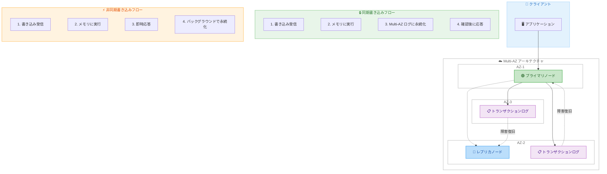

# Amazon ElastiCache for Valkey - 耐久性サポート

**リリース日**: 2026年6月2日
**サービス**: Amazon ElastiCache
**機能**: Durability for Amazon ElastiCache for Valkey

📊 [このアップデートのインフォグラフィックを見る](https://takech9203.github.io/aws-news-summary/20260602-durability-amazon-elasticache.html)

## 概要

Amazon ElastiCache for Valkey にデータ耐久性 (Durability) サポートが追加された。これにより、マイクロ秒レベルの読み取りレイテンシーを維持しながら、データ損失を許容できないワークロードにも ElastiCache を使用できるようになった。Multi-AZ トランザクションログを活用し、複数のアベイラビリティゾーン (AZ) にまたがるデータの永続化を実現している。

耐久性オプションとして、同期書き込み (Synchronous) と非同期書き込み (Asynchronous) の 2 つが提供される。同期書き込みは、クライアントに応答する前に少なくとも 2 つの AZ にデータを永続化し、ゼロデータロスを実現する。非同期書き込みは、クライアントに応答した後にバックグラウンドでデータを永続化し、追加コストなしでマイクロ秒レベルの書き込みレイテンシーを維持する。

このアップデートにより、ElastiCache はキャッシング以外の幅広いユースケースにも対応可能になった。AI エージェントの長期メモリ、AI エージェントのワークフロー状態管理、RAG アプリケーション向けナレッジベース、決済トークナイゼーション、リアルタイム在庫管理など、データ損失が許容できないミッションクリティカルなワークロードに適用できる。

**アップデート前の課題**

- ElastiCache はインメモリデータストアとして高速だが、ノード障害やフェイルオーバー時にデータが失われる可能性があった
- データ耐久性が必要なワークロードでは、ElastiCache とは別にデータベースを併用する必要があった
- キャッシュの再構築にはバックエンドからのデータ再ロードが必要で、障害復旧時間が長くなる場合があった
- データ損失が許容できないユースケースでは、レイテンシーの高いデータベースを使用するか、複雑なデータ同期メカニズムを構築する必要があった

**アップデート後の改善**

- Multi-AZ トランザクションログにより、障害時のデータ損失をゼロ (同期) または最大 10 秒 (非同期) に抑制可能になった
- キャッシング以外のユースケース (AI エージェント、決済、在庫管理など) にも ElastiCache を単独で利用可能になった
- ノード再起動やフェイルオーバー時のデータ復旧が高速化された
- 追加コストなしで非同期耐久性を有効化でき、マイクロ秒レベルの書き込みレイテンシーを維持可能になった

## アーキテクチャ図



同期書き込みでは Multi-AZ トランザクションログへの永続化が確認されてからクライアントに応答を返し、非同期書き込みではクライアントへの即時応答後にバックグラウンドで永続化を行う。障害発生時にはトランザクションログからデータを復旧する。

## サービスアップデートの詳細

### 主要機能

1. **同期書き込み (Synchronous Writes)**
   - クライアントに応答する前に、少なくとも 2 つの AZ にデータを永続化
   - ゼロデータロスを保証 (プライマリノード障害時も含む)
   - 書き込みレイテンシーは一桁ミリ秒台 (P50: 約 2.15ms @ 50K TPS)
   - 読み取りレイテンシーはマイクロ秒レベルを維持

2. **非同期書き込み (Asynchronous Writes)**
   - クライアントに即時応答した後、バックグラウンドで Multi-AZ ログに永続化
   - マイクロ秒レベルの書き込みレイテンシーを維持 (追加コストなし)
   - 障害発生時に最大 10 秒分の未コミットデータが失われる可能性あり
   - DurabilityLag メトリクスを CloudWatch に発行し、ラグが 10 秒を超えると書き込みを一時拒否

3. **Multi-AZ トランザクションログ**
   - 複数の AZ にまたがるトランザクションログによるデータ永続化
   - プライマリ障害、レプリカ障害、シャード全体障害の全てのシナリオで復旧可能
   - 高速フェイルオーバー、データベースリカバリ、ノード再起動をサポート

## 技術仕様

### パフォーマンスベンチマーク

テスト条件: r7g.4xlarge ノード、プライマリ 1 台 + レプリカ 1 台、300 万キー、パイプラインなし、読み取り/書き込み比率 80/20

| スループット | オプション | 読み取り P50 | 読み取り P90 | 書き込み P50 | 書き込み P90 |
|------|------|------|------|------|------|
| 50K TPS | 耐久性なし | 260 us | 301 us | 147 us | 185 us |
| 50K TPS | 非同期 | 245 us | 289 us | 112 us | 152 us |
| 50K TPS | 同期 | 245 us | 288 us | 2.15 ms | 2.36 ms |
| 100K TPS | 耐久性なし | 263 us | 301 us | 160 us | 196 us |
| 100K TPS | 非同期 | 245 us | 286 us | 128 us | 158 us |
| 100K TPS | 同期 | 879 us | 992 us | 2.72 ms | 3.12 ms |

### API 変更履歴

| 日付 | サービス | 変更内容 |
|------|----------|----------|
| 2026/06/02 | [elasticache](https://awsapichanges.com/archive/changes/250cdc-elasticache.html) | 19 updated api methods - Durability パラメータの追加 |

### 主要な API 変更

以下のメソッドに `Durability` パラメータが追加された。

**リクエストパラメータに追加:**
- `CreateReplicationGroup`: `Durability='default'|'async'|'sync'|'disabled'`
- `ModifyReplicationGroup`: `Durability='default'|'async'|'sync'|'disabled'`

**レスポンスに追加 (ReplicationGroup オブジェクト):**
- `Durability`: `'default'|'async'|'sync'|'disabled'` - 設定された耐久性オプション
- `EffectiveDurability`: `'async'|'sync'|'disabled'` - 実際に適用されている耐久性

**影響を受けるメソッド:**
- `CreateReplicationGroup`, `ModifyReplicationGroup` (リクエスト + レスポンス)
- `CompleteMigration`, `DecreaseReplicaCount`, `DeleteReplicationGroup`, `DescribeReplicationGroups`, `IncreaseReplicaCount`, `ModifyReplicationGroupShardConfiguration`, `StartMigration`, `TestFailover`, `TestMigration` (レスポンス)
- `CopySnapshot`, `CreateSnapshot`, `DeleteSnapshot`, `DescribeSnapshots` (Snapshot オブジェクトに Durability 追加)
- `CreateServerlessCache`, `DeleteServerlessCache`, `DescribeServerlessCaches`, `ModifyServerlessCache` (StorageEncryptionType 追加)

### IAM 権限

```json
{
  "Version": "2012-10-17",
  "Statement": [
    {
      "Effect": "Allow",
      "Action": [
        "elasticache:CreateReplicationGroup",
        "elasticache:ModifyReplicationGroup",
        "elasticache:DescribeReplicationGroups"
      ],
      "Resource": "*"
    }
  ]
}
```

## 設定方法

### 前提条件

1. Valkey 9.0 以降のエンジンバージョンを使用すること
2. Multi-AZ が有効化されていること
3. `elasticache:CreateReplicationGroup` および `elasticache:ModifyReplicationGroup` の IAM 権限があること

### 手順

#### ステップ 1: 同期耐久性で新規クラスターを作成

```bash
aws elasticache create-replication-group \
  --replication-group-id my-durable-cluster \
  --replication-group-description "Durable ElastiCache cluster" \
  --engine valkey \
  --engine-version 9.0 \
  --cache-node-type cache.r7g.large \
  --num-cache-clusters 2 \
  --multi-az-enabled \
  --automatic-failover-enabled \
  --durability sync
```

Valkey 9.0 エンジンで Multi-AZ を有効にし、同期耐久性を指定してレプリケーショングループを作成する。

#### ステップ 2: 既存クラスターの耐久性を変更

```bash
aws elasticache modify-replication-group \
  --replication-group-id my-existing-cluster \
  --durability async \
  --apply-immediately
```

既存のレプリケーショングループに対して、耐久性オプションを非同期に変更する。`--apply-immediately` を指定すると即座に適用される。

#### ステップ 3: 耐久性ステータスの確認

```bash
aws elasticache describe-replication-groups \
  --replication-group-id my-durable-cluster \
  --query "ReplicationGroups[0].{Durability:Durability,EffectiveDurability:EffectiveDurability}"
```

`Durability` フィールドで設定値を、`EffectiveDurability` フィールドで実際に適用されている耐久性オプションを確認できる。

## メリット

### ビジネス面

- **ユースケースの拡大**: キャッシングに加え、AI エージェント、決済、在庫管理などのミッションクリティカルなワークロードに対応可能
- **アーキテクチャの簡素化**: データ永続化のために別途データベースを用意する必要がなくなり、システム全体のコストと複雑性を削減
- **ゼロデータロスの保証**: 同期書き込みにより、金融取引やコンプライアンス要件の厳しいワークロードにも対応

### 技術面

- **マイクロ秒レベルの読み取りレイテンシー維持**: 両方の耐久性オプションで読み取りレイテンシーへの影響は最小限
- **柔軟な耐久性オプション**: ワークロード特性に応じて同期/非同期を選択でき、既存クラスターでの切り替えも可能
- **自動障害復旧**: Multi-AZ トランザクションログにより、プライマリ障害、レプリカ障害、シャード全体障害のすべてのシナリオで自動復旧

## デメリット・制約事項

### 制限事項

- 同期書き込みでは書き込みレイテンシーが一桁ミリ秒台に増加する (マイクロ秒 → 約 2-3ms)
- 非同期書き込みでは障害発生時に最大 10 秒分のデータが失われる可能性がある
- レプリカノードは両方のオプションで結果整合性となり、最新の書き込みが反映されない場合がある
- Valkey 9.0 以降が必須であり、Redis や古いバージョンの Valkey では利用不可

### 考慮すべき点

- 同期書き込みでは 100K TPS 時に読み取りレイテンシーも約 260us から約 879us に上昇する
- 非同期書き込みで DurabilityLag が 10 秒を超えると書き込みが一時的に拒否される (読み取りは継続)
- クロス AZ のネットワークラウンドトリップが同期書き込みの書き込みごとに発生する
- クライアントライブラリとして Valkey GLIDE の使用と、エクスポネンシャルバックオフ付きリトライの実装が推奨される

## ユースケース

### ユースケース 1: AI エージェントの長期メモリ

**シナリオ**: AI エージェントがユーザーとの会話コンテキストやタスク実行状態を永続的に保持する必要がある場合。エージェントの再起動やフェイルオーバー時にもコンテキストが維持される必要がある。

**実装例**:
```bash
aws elasticache create-replication-group \
  --replication-group-id ai-agent-memory \
  --engine valkey \
  --engine-version 9.0 \
  --cache-node-type cache.r7g.large \
  --num-cache-clusters 2 \
  --multi-az-enabled \
  --automatic-failover-enabled \
  --durability sync
```

**効果**: マイクロ秒レベルの読み取りレイテンシーで AI エージェントの応答速度を維持しつつ、ゼロデータロスでコンテキストの永続性を保証。

### ユースケース 2: リアルタイム在庫管理

**シナリオ**: EC サイトや物流システムで、リアルタイムの在庫情報を高速に読み書きしつつ、障害時にも在庫データの正確性を保証する必要がある場合。

**実装例**:
```bash
aws elasticache create-replication-group \
  --replication-group-id inventory-store \
  --engine valkey \
  --engine-version 9.0 \
  --cache-node-type cache.r7g.xlarge \
  --num-cache-clusters 3 \
  --multi-az-enabled \
  --automatic-failover-enabled \
  --durability sync
```

**効果**: 在庫の二重販売を防止しながら、高トラフィック時にもマイクロ秒レベルの読み取り速度を維持。

### ユースケース 3: セッションストアとリアルタイム分析

**シナリオ**: ユーザーセッションデータやリアルタイム分析のカウンターを高速に処理しつつ、ほぼデータロスなしの耐久性が求められる場合。コストを最小化しながら耐久性を確保したい。

**実装例**:
```bash
aws elasticache create-replication-group \
  --replication-group-id session-store \
  --engine valkey \
  --engine-version 9.0 \
  --cache-node-type cache.r7g.large \
  --num-cache-clusters 2 \
  --multi-az-enabled \
  --automatic-failover-enabled \
  --durability async
```

**効果**: 追加コストなしでマイクロ秒レベルの書き込みレイテンシーを維持し、障害時も最大 10 秒分のデータ損失に抑制。

## 料金

非同期書き込みは追加コストなしで利用可能。同期書き込みの追加料金については、Amazon ElastiCache 料金ページを参照のこと。

| 耐久性オプション | 追加コスト |
|------------------|-----------|
| 非同期書き込み | 追加料金なし |
| 同期書き込み | 料金ページを参照 |

## 利用可能リージョン

全ての AWS 商用リージョン、AWS 中国リージョン、および AWS GovCloud (US) リージョンで利用可能。Valkey 9.0 以降が必要。

## 関連サービス・機能

- **Amazon MemoryDB**: 同様にマルチ AZ 耐久性を提供するインメモリデータベース。MemoryDB は最初から耐久性を前提に設計されており、ElastiCache は今回のアップデートで耐久性をオプションとして追加
- **Amazon ElastiCache Serverless**: Serverless デプロイメントでも StorageEncryptionType が追加され、連携が強化
- **Amazon CloudWatch**: DurabilityLag メトリクスによる非同期書き込みの遅延監視に使用
- **AWS IAM**: 耐久性設定の作成・変更に必要な権限管理

## 参考リンク

- 📊 [インフォグラフィック](https://takech9203.github.io/aws-news-summary/20260602-durability-amazon-elasticache.html)
- [公式発表 (What's New)](https://aws.amazon.com/about-aws/whats-new/2026/06/durability-amazon-elasticache)
- [AWS Blog - Announcing durability for Amazon ElastiCache for Valkey](https://aws.amazon.com/blogs/database/announcing-durability-for-amazon-elasticache/)
- [Amazon ElastiCache ドキュメント](https://docs.aws.amazon.com/AmazonElastiCache/latest/dg/WhatIs.html)
- [料金ページ](https://aws.amazon.com/elasticache/pricing/)

## まとめ

Amazon ElastiCache for Valkey への耐久性サポートの追加は、インメモリデータストアの適用範囲を大幅に拡大する重要なアップデートである。同期書き込みによるゼロデータロスと非同期書き込みによるコスト最適化の 2 つのオプションにより、AI エージェント、決済システム、在庫管理などのミッションクリティカルなワークロードに ElastiCache を直接適用できるようになった。既存の Multi-AZ クラスターへの適用も API 一つで切り替え可能であり、早期の検証と導入が推奨される。
