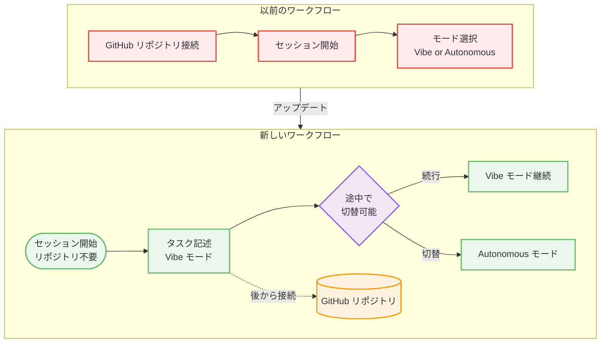

# Kiro Web - リポジトリ不要のセッション開始とモード切替の柔軟化

**リリース日**: 2026 年 6 月 2 日
**サービス**: Kiro (AWS 提供 AI 搭載 IDE)
**機能**: Start Without a Repo, Switch Modes Anytime

📊 [このアップデートのインフォグラフィックを見る](https://takech9203.github.io/aws-news-summary/20260602-kiro-changelog-2026-06-02.html)

## 概要

Kiro Web において、GitHub リポジトリを接続せずにセッションを開始できるようになり、また Vibe セッション中の任意のタイミングで Autonomous モードへ切り替えが可能になった。これにより、Kiro Web の利用開始における摩擦が大幅に低減され、セッション中のワークフローの柔軟性が向上している。

このアップデートでは、メッセージの相対タイムスタンプ表示、ネットワークモードの可視性向上、サンドボックスと信頼性に関する修正も含まれている。

**アップデート前の課題**

- Kiro Web でセッションを開始するには、事前に GitHub リポジトリの接続が必須であった
- Vibe セッションで Autonomous モードに切り替えるには、セッション開始時にのみ選択が可能で、途中からの切り替えができなかった
- メッセージのタイムスタンプが絶対時刻のみで、長時間のタスクにおける経過時間の把握が困難だった

**アップデート後の改善**

- GitHub リポジトリを接続せずに Kiro Web セッションを開始できるようになった (リポジトリの接続は後から必要に応じて実行可能)
- Vibe セッション中の任意のタイミングで Autonomous モードへの切り替えが可能になった
- メッセージに相対タイムスタンプが表示され、ホバーで絶対時刻を確認できるようになった
- ネットワークモードの状態がより明確に表示されるようになった

## アーキテクチャ図

上図は、今回のアップデートによるセッション開始フローの変化を示している。以前は GitHub リポジトリの接続が必須だったが、新しいフローではリポジトリなしでセッションを開始し、途中でモードを切り替えることが可能になった。

## サービスアップデートの詳細

### 主要機能

1. **GitHub リポジトリなしでのセッション開始**
   - Kiro Web でセッションを開始する際に、GitHub リポジトリの接続が不要になった
   - セッションを開き、タスクを記述するだけで作業を開始できる
   - リポジトリが必要になった場合は、後から接続可能

2. **Vibe セッション中の Autonomous モード切替**
   - Vibe セッションで最初のプロンプト送信後、任意のタイミングで Autonomous モードを選択可能
   - セッション開始時だけでなく、作業の進行に応じてモードを変更できる
   - セッションを最初からやり直す必要がなくなった

3. **相対タイムスタンプ表示**
   - セッションメッセージに相対タイムスタンプ (「5 分前」「1 時間前」など) が表示される
   - ホバーすると絶対時刻を確認可能
   - 長時間実行タスクにおけるイベント発生タイミングの把握が容易になった

4. **ネットワークモード可視性の向上**
   - 現在のネットワークモード状態がより明確に表示されるようになった
   - セッション中のネットワーク接続状態を把握しやすくなった

5. **サンドボックスと信頼性の修正**
   - サンドボックス環境の安定性が向上
   - 全般的な信頼性に関する修正が実施された

## 技術仕様

### モード比較

| 項目 | Vibe モード | Autonomous モード |
|------|-------------|-------------------|
| 操作スタイル | 対話的・逐次指示 | 自律的・タスク委任 |
| ユーザー介入 | 各ステップで確認 | エージェントが自律実行 |
| 適用場面 | 探索的な開発、学習 | 明確なタスクの一括実行 |
| 切替タイミング | セッション開始時 + 途中 (新機能) | セッション開始時 + 途中 (新機能) |

### セッション開始要件の変更

| 項目 | 変更前 | 変更後 |
|------|--------|--------|
| GitHub リポジトリ接続 | 必須 | 任意 (後から接続可) |
| モード選択タイミング | セッション開始時のみ | セッション中いつでも |
| セッション再起動 | モード変更時に必要 | 不要 |

## 設定方法

### 前提条件

1. Kiro Web へのアクセス権 (Pro、Pro+、または Power プラン)
2. Web ブラウザ (最新版推奨)

### 手順

#### ステップ 1: リポジトリなしでセッションを開始

Kiro Web にアクセスし、GitHub リポジトリを接続せずに新しいセッションを開始する。タスクの説明を入力するだけで作業を開始できる。

#### ステップ 2: 必要に応じてリポジトリを接続

作業中にコードリポジトリが必要になった場合、セッション内から GitHub リポジトリを接続する。

#### ステップ 3: Autonomous モードへの切替

Vibe セッション中に、最初のプロンプト送信後の任意のタイミングで Autonomous モードを選択する。セッションを再起動する必要はない。

## メリット

### ビジネス面

- **オンボーディングの高速化**: リポジトリ設定なしで即座に Kiro Web を試用できるため、評価や導入検討が迅速化
- **ワークフローの中断削減**: モード切替のためにセッションをやり直す必要がなくなり、作業の中断が減少
- **柔軟なタスク管理**: タスクの性質に応じてリアルタイムにモードを変更できるため、作業効率が向上

### 技術面

- **摩擦のない開始体験**: リポジトリ準備前にプロトタイピングやアイデア検証を開始可能
- **コンテキスト保持**: モード切替時にセッションコンテキストが維持され、会話履歴や作業状態が引き継がれる
- **時間追跡の改善**: 相対タイムスタンプにより、長時間タスクのデバッグや進捗確認が容易

## デメリット・制約事項

### 制限事項

- Kiro Web のみが対象 (IDE 版やCLI 版は本アップデートの対象外)
- リポジトリ未接続の場合、ファイルシステムへのアクセスが制限される可能性がある
- Autonomous モードへの切替は Vibe セッションからのみ可能

### 考慮すべき点

- リポジトリなしで開始した場合、後からリポジトリを接続する際にコンテキストの再構築が必要になる場合がある
- Autonomous モードへの切替後、Vibe モードへの再切替が可能かどうかは確認が必要

## ユースケース

### ユースケース 1: クイックプロトタイピング

**シナリオ**: 新しいアイデアを素早く検証したい開発者が、リポジトリを作成する前に Kiro Web でプロトタイプを作成する。

**効果**: リポジトリのセットアップ時間をスキップし、アイデアの検証に即座に着手できる。有望なプロトタイプが完成したら、後から GitHub リポジトリを接続してコードを保存する。

### ユースケース 2: 段階的なタスク委任

**シナリオ**: 開発者が Vibe モードで対話的にアーキテクチャを議論し、方針が固まった時点で Autonomous モードに切り替えて実装を一括で委任する。

**効果**: 設計フェーズでは対話的なフィードバックを得ながら進め、実装フェーズでは AI エージェントに自律的に作業させることで、開発プロセス全体の効率が向上する。

### ユースケース 3: チーム内での Kiro 紹介

**シナリオ**: チームメンバーに Kiro を紹介する際、リポジトリ設定なしでデモセッションを開始し、AI アシスタントの機能を即座にデモンストレーションする。

**効果**: セットアップの手間なくツールの価値を素早く示すことができ、チーム導入の意思決定が迅速化する。

## 利用可能リージョン

グローバル (Kiro Web はブラウザベースのサービスとしてグローバルに利用可能)

## 関連サービス・機能

- **Kiro IDE**: デスクトップ版の AI 搭載 IDE。同様の Vibe モード / Autonomous モードを提供
- **Kiro CLI**: コマンドラインインターフェース版。ターミナルベースの AI アシスト開発に対応
- **Amazon Bedrock**: Kiro のバックエンドで使用される AI モデル基盤 (Claude Opus 4.8 など)

## 参考リンク

- 📊 [インフォグラフィック](https://takech9203.github.io/aws-news-summary/20260602-kiro-changelog-2026-06-02.html)
- [Kiro Changelog](https://kiro.dev/changelog/)
- [Kiro 公式サイト](https://kiro.dev/)

## まとめ

今回のアップデートにより、Kiro Web の利用開始時の摩擦が大幅に低減され、セッション中のワークフローの柔軟性が向上した。特にリポジトリ不要のセッション開始と途中でのモード切替機能は、プロトタイピングや探索的な開発において即座に価値を発揮する。Kiro Web を活用している開発者は、これらの新機能を活用してワークフローの効率化を図ることを推奨する。
