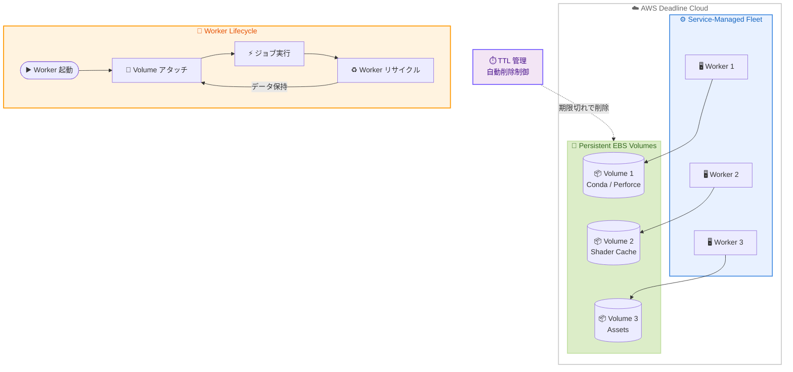

# AWS Deadline Cloud - Service-Managed Fleets 向け永続ストレージ

**リリース日**: 2026年6月2日
**サービス**: AWS Deadline Cloud
**機能**: Persistent Storage for Service-Managed Fleets

📊 [このアップデートのインフォグラフィックを見る](https://takech9203.github.io/aws-news-summary/20260602-persistent-storage.html)

## 概要

AWS Deadline Cloud は、Service-Managed Fleets (SMF) において永続ストレージのサポートを開始した。これにより、ワーカーのライフサイクルイベント (リサイクルや置換) をまたいでデータを保持できるようになる。AWS Deadline Cloud は、VFX、アニメーション、プロダクトデザイン、シミュレーション、ゲーミングなどのコンピュート集約型ワークロードをクラウドで実行するためのフルマネージドサービスである。

今回のアップデートでは、SMF ワーカーに永続的な Amazon Elastic Block Store (Amazon EBS) ボリュームがアタッチされ、Conda 環境、Perforce ワークスペース、シェーダーキャッシュ、アセットコレクションなどがワーカーのライフサイクルイベントを通じて保持される。ワーカーごとの永続ボリューム数や、ボリュームの保持期間を制御する TTL (Time-to-Live) を設定でき、ストレージコストと起動パフォーマンスのバランスを柔軟に調整できる。

**アップデート前の課題**

- SMF ワーカーはエフェメラル (一時的な) ストレージのみに依存しており、ワーカーがリサイクルまたは置換されるたびにソフトウェアやアセットを再インストールする必要があった
- 大規模な Conda 環境や Perforce ワークスペースの再構築に時間がかかり、ジョブの開始が遅延していた
- シェーダーキャッシュやアセットコレクションが毎回失われるため、レンダリングジョブの初回実行が常に低速だった
- ソフトウェアの再インストールによるネットワーク帯域の消費と、それに伴うコスト増加

**アップデート後の改善**

- Amazon EBS ボリュームがワーカーに永続的にアタッチされ、ライフサイクルイベントをまたいでデータが保持される
- ソフトウェアやアセットの再インストールが不要になり、ワーカーの起動時間が大幅に短縮される
- TTL 設定により、不要なボリュームを自動的に削除してコストを最適化できる
- ジョブの完了時間が短縮され、プロダクションパイプラインの効率が向上する

## アーキテクチャ図



SMF ワーカーに永続 EBS ボリュームがアタッチされ、ワーカーのリサイクル時もデータが保持される構成を示す。TTL 設定により、一定期間使用されないボリュームは自動削除される。

## サービスアップデートの詳細

### 主要機能

1. **永続 EBS ボリュームのアタッチ**
   - SMF ワーカーに Amazon EBS gp3 ボリュームを永続的にアタッチ
   - ワーカーのリサイクルや置換後も、同じボリュームが再アタッチされる
   - Conda 環境、Perforce ワークスペース、シェーダーキャッシュ、アセットコレクションを保持

2. **ボリューム数の設定**
   - ワーカーごとに複数の永続ボリュームを構成可能
   - ユースケースに応じてボリュームを分離して管理できる

3. **TTL (Time-to-Live) による自動管理**
   - `lastUsedTtlHours` パラメータでボリュームの保持時間を制御
   - 最後に使用されてから指定時間が経過したボリュームは自動削除
   - ストレージコストと起動パフォーマンスのバランスを最適化

## 技術仕様

### ボリューム設定パラメータ

| 項目 | パラメータ | 説明 |
|------|-----------|------|
| ボリュームサイズ | `sizeGiB` | ボリュームのサイズ (GiB) |
| ボリュームタイプ | `volumeType` | gp3 |
| IOPS | `iops` | プロビジョンド IOPS |
| スループット | `throughputMiB` | スループット (MiB/s) |
| マウントパス | `mountPath` | ワーカー上のマウントポイント |
| 保持期間 | `lastUsedTtlHours` | 最終使用からの保持時間 |

### ボリュームの状態遷移

| 状態 | 説明 |
|------|------|
| `PENDING_CREATION` | ボリューム作成待ち |
| `PENDING_ATTACHMENT` | ワーカーへのアタッチ待ち |
| `IN_USE` | ワーカーで使用中 |
| `AVAILABLE` | 利用可能 (ワーカーからデタッチ済み) |
| `PENDING_DELETION` | 削除待ち (TTL 期限切れ) |

### API 変更履歴

| 日付 | サービス | 変更内容 |
|------|----------|----------|
| 2026/05/28 | [deadline](https://awsapichanges.com/archive/changes/364f28-deadline.html) | 3 new 4 updated api methods - 永続ストレージ管理用 API の追加 |

**新規 API メソッド:**

- `GetVolume` - 特定のボリュームの詳細情報を取得
- `ListVolumes` - フリート内のボリューム一覧を取得
- `DeleteVolume` - ボリュームを削除

**更新された API メソッド:**

- `CreateFleet` - `persistentVolumeConfiguration` パラメータを追加
- `GetFleet` - レスポンスに `persistentVolumeConfiguration` を含む
- `ListFleets` - レスポンスに `persistentVolumeConfiguration` を含む
- `UpdateFleet` - `persistentVolumeConfiguration` パラメータを追加

### persistentVolumeConfiguration の構造

```json
{
  "persistentVolumeConfiguration": {
    "sizeGiB": 500,
    "iops": 3000,
    "throughputMiB": 125,
    "mountPath": "/mnt/persistent",
    "lastUsedTtlHours": 168
  }
}
```

## 設定方法

### 前提条件

1. AWS Deadline Cloud ファーム (Farm) が作成済みであること
2. Service-Managed Fleet を使用するための IAM ロールが設定済みであること
3. AWS CLI v2 が最新バージョンに更新されていること

### 手順

#### ステップ 1: 永続ストレージ付きフリートの作成

```bash
aws deadline create-fleet \
  --farm-id farm-xxxxxxxxxxxx \
  --display-name "VFX-Fleet-with-Persistent-Storage" \
  --role-arn arn:aws:iam::123456789012:role/DeadlineCloudFleetRole \
  --max-worker-count 10 \
  --configuration '{
    "serviceManagedEc2": {
      "instanceCapabilities": {
        "vCpuCount": {"min": 8, "max": 64},
        "memoryMiB": {"min": 32768, "max": 262144},
        "osFamily": "LINUX",
        "cpuArchitectureType": "x86_64"
      },
      "instanceMarketOptions": {"type": "spot"},
      "persistentVolumeConfiguration": {
        "sizeGiB": 500,
        "iops": 3000,
        "throughputMiB": 125,
        "mountPath": "/mnt/persistent",
        "lastUsedTtlHours": 168
      }
    }
  }'
```

永続ボリューム構成を含む SMF フリートを作成する。500 GiB の gp3 ボリュームが `/mnt/persistent` にマウントされ、最終使用から 168 時間 (7 日間) 保持される。

#### ステップ 2: 既存フリートへの永続ストレージ追加

```bash
aws deadline update-fleet \
  --farm-id farm-xxxxxxxxxxxx \
  --fleet-id fleet-xxxxxxxxxxxx \
  --configuration '{
    "serviceManagedEc2": {
      "instanceCapabilities": {
        "vCpuCount": {"min": 8, "max": 64},
        "memoryMiB": {"min": 32768, "max": 262144},
        "osFamily": "LINUX",
        "cpuArchitectureType": "x86_64"
      },
      "persistentVolumeConfiguration": {
        "sizeGiB": 1000,
        "iops": 6000,
        "throughputMiB": 250,
        "mountPath": "/mnt/cache",
        "lastUsedTtlHours": 72
      }
    }
  }'
```

既存のフリートに永続ボリューム構成を追加する。この例では 1 TiB のボリュームを 72 時間の TTL で設定している。

#### ステップ 3: ボリュームの確認

```bash
aws deadline list-volumes \
  --farm-id farm-xxxxxxxxxxxx \
  --fleet-id fleet-xxxxxxxxxxxx
```

フリートに関連付けられた永続ボリュームの一覧と状態を確認する。

## メリット

### ビジネス面

- **ジョブ完了時間の短縮**: ワーカー起動時のソフトウェア・アセット再インストールが不要になり、レンダリングジョブの完了が早まる
- **コスト最適化**: TTL 設定により不要なボリュームが自動削除され、ストレージコストを最小化しつつ起動パフォーマンスを維持
- **プロダクションパイプラインの効率化**: アーティストやエンジニアがジョブの起動待ち時間を短縮でき、全体の生産性が向上

### 技術面

- **起動時間の大幅短縮**: 大規模な Conda 環境 (数十 GB) やアセットライブラリの再ダウンロードが不要
- **ネットワーク帯域の節約**: 毎回のソフトウェアダウンロードがなくなり、ネットワーク負荷が軽減
- **柔軟な構成**: ボリュームサイズ、IOPS、スループット、マウントパス、TTL を個別に設定可能
- **状態管理の自動化**: ボリュームのアタッチ・デタッチ・削除が Deadline Cloud により自動管理される

## デメリット・制約事項

### 制限事項

- ボリュームタイプは gp3 のみ対応 (io2 や st1 などは選択不可)
- Customer-Managed Fleets では利用不可 (SMF 専用機能)
- ボリュームは特定のアベイラビリティゾーンに紐づくため、ゾーン間での共有はできない
- ワーカーとボリュームの紐付けは Deadline Cloud が自動管理するため、特定のワーカーに特定のボリュームを固定する手動制御は限定的

### 考慮すべき点

- TTL を長く設定すると未使用ボリュームのストレージコストが増加する
- ボリュームサイズは事前に決定する必要があり、動的なサイズ変更への対応は要確認
- 永続ボリュームに保存されるデータのセキュリティ管理 (機密アセットの残留など) を考慮する必要がある
- Spot インスタンスの中断時におけるボリュームの挙動を理解しておく必要がある

## ユースケース

### ユースケース 1: VFX レンダリングパイプライン

**シナリオ**: 映画やドラマの VFX プロダクションで、数千フレームのレンダリングを毎日実行する。各ワーカーには大規模な Conda 環境 (Houdini、Nuke プラグイン等) と数十 GB のアセットライブラリが必要。

**実装例**:
```json
{
  "persistentVolumeConfiguration": {
    "sizeGiB": 500,
    "iops": 3000,
    "throughputMiB": 125,
    "mountPath": "/mnt/vfx-env",
    "lastUsedTtlHours": 336
  }
}
```

**効果**: ワーカー起動時間が 15-20 分から 1-2 分に短縮。プロダクション期間中は 14 日間の TTL でボリュームを保持し、環境の再構築を回避。

### ユースケース 2: ゲーム開発のシェーダーコンパイル

**シナリオ**: ゲーム開発スタジオで、シェーダーの事前コンパイルとキャッシュを活用してビルド時間を短縮したい。シェーダーキャッシュは数 GB に達し、毎回のコンパイルには数時間かかる。

**実装例**:
```json
{
  "persistentVolumeConfiguration": {
    "sizeGiB": 200,
    "iops": 6000,
    "throughputMiB": 250,
    "mountPath": "/mnt/shader-cache",
    "lastUsedTtlHours": 168
  }
}
```

**効果**: シェーダーキャッシュが保持されることで、増分コンパイルのみが実行され、ビルド時間が数時間から数分に短縮。

### ユースケース 3: Perforce ワークスペースの保持

**シナリオ**: 大規模アセットリポジトリを Perforce で管理しており、初回同期に数時間かかる。ワーカーが置換されるたびに全同期が発生していた。

**実装例**:
```json
{
  "persistentVolumeConfiguration": {
    "sizeGiB": 1000,
    "iops": 3000,
    "throughputMiB": 125,
    "mountPath": "/mnt/perforce-ws",
    "lastUsedTtlHours": 504
  }
}
```

**効果**: Perforce ワークスペースが永続化され、差分同期のみで済むようになる。初回同期 3 時間が差分同期 5-10 分に短縮。21 日間の TTL でプロジェクト期間中のワークスペースを保持。

## 料金

永続ボリュームの料金は、既存の Service-Managed Fleets の EBS 料金と同じ体系で課金される。

- **EBS ストレージ料金**: $0.10/GB-month (gp3)
- **課金方式**: GB-hours で計算され、GB-month に変換して課金
- **課金先**: Deadline Cloud サービスの一部として請求 (別途 EC2/EBS 請求ではない)

### 料金例

| 構成 | 使用量 | 月額料金 (概算) |
|------|--------|------------------|
| 500 GB x 5 ワーカー x 常時使用 | 2,500 GB-month | $250 |
| 500 GB x 10 ワーカー x 50% 使用率 | 2,500 GB-month | $250 |
| 200 GB x 20 ワーカー x 25% 使用率 | 1,000 GB-month | $100 |
| 1 TB x 3 ワーカー x TTL 7 日 | 利用パターンに依存 | 変動 |

**注意**: IOPS とスループットのプロビジョニングに応じて追加料金が発生する可能性がある。gp3 のベースライン (3,000 IOPS / 125 MiB/s) を超える設定の場合は追加コストを確認すること。

## 利用可能リージョン

AWS Deadline Cloud が提供されているすべての AWS リージョンで利用可能。

## 関連サービス・機能

- **Amazon EBS (gp3)**: 永続ストレージの実体となるブロックストレージサービス。高いスループットと IOPS を提供
- **AWS Deadline Cloud Service-Managed Fleets**: ワーカーインスタンスのプロビジョニングとスケーリングを自動管理するフリートタイプ
- **AWS Deadline Cloud Host Configuration**: ワーカー起動時のカスタムスクリプト実行。永続ボリュームと組み合わせて環境セットアップを最適化
- **Amazon EC2 Spot Instances**: SMF の `instanceMarketOptions` で Spot や Wait and Save を選択し、コストを最適化

## 参考リンク

- 📊 [インフォグラフィック](https://takech9203.github.io/aws-news-summary/20260602-persistent-storage.html)
- [公式発表 (What's New)](https://aws.amazon.com/about-aws/whats-new/2026/06/deadline-cloud/persistent-storage)
- [ドキュメント - Volumes](https://docs.aws.amazon.com/deadline-cloud/latest/userguide/volumes.html)
- [料金ページ](https://aws.amazon.com/deadline-cloud/pricing/)
- [API 変更履歴](https://awsapichanges.com/archive/changes/364f28-deadline.html)

## まとめ

AWS Deadline Cloud の Service-Managed Fleets に永続ストレージが追加されたことで、VFX やゲーム開発などのコンピュート集約型ワークロードにおけるワーカー起動時間が大幅に短縮される。特に大規模な Conda 環境、Perforce ワークスペース、シェーダーキャッシュを利用するプロダクションパイプラインにおいて、ジョブのスループット向上とコスト効率の改善が期待できる。SMF を利用しているチームは、TTL 設定を活用してストレージコストと起動パフォーマンスのバランスを最適化することを推奨する。
