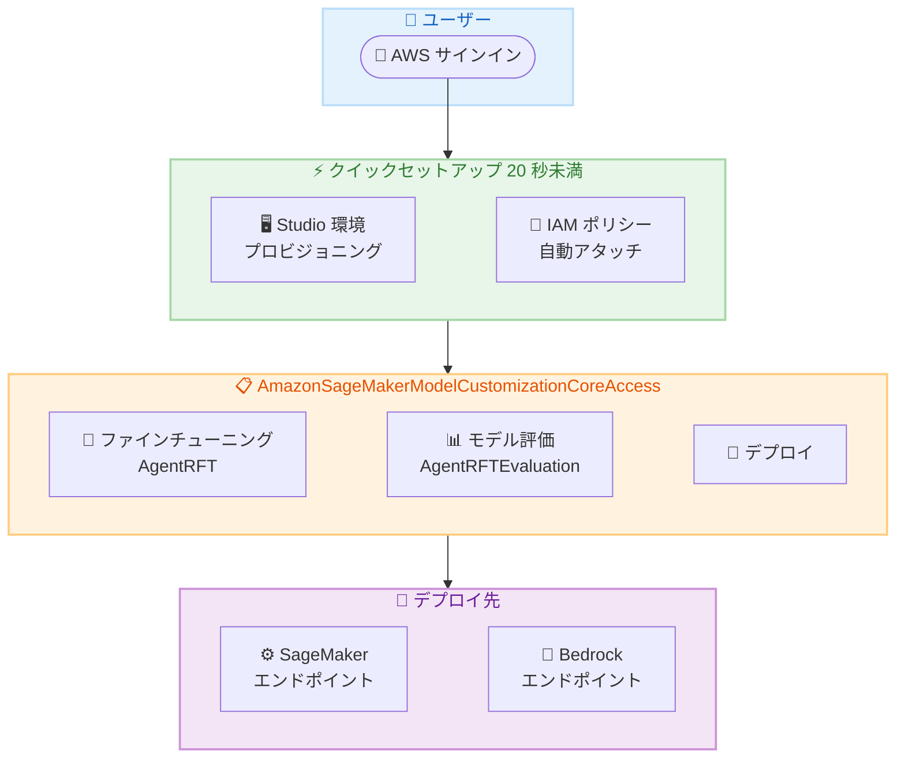

# Amazon SageMaker Studio - クイックセットアップの高速化とモデルカスタマイズ権限の自動設定

**リリース日**: 2026年6月2日
**サービス**: Amazon SageMaker Studio
**機能**: Quick Setup with Model Customization Permissions

📊 [このアップデートのインフォグラフィックを見る](https://takech9203.github.io/aws-news-summary/20260602-quick-setup-model-customization-sagemaker-studio.html)

## 概要

Amazon SageMaker Studio のクイックセットアップが大幅に高速化され、セットアップ完了までの時間が従来の 2 分以上からわずか 20 秒未満に短縮されました。ML パイプラインの構築、データ探索、ノートブック開発、基盤モデルのファインチューニングなど、あらゆるワークロードにおいて、サインインからフル構成の Studio 環境をほぼ瞬時に利用できるようになります。

さらに、新規作成された Studio 環境には、サーバーレスモデルカスタマイズに必要な権限が自動的に構成されるようになりました。新しいマネージドポリシー `AmazonSageMakerModelCustomizationCoreAccess` が自動的に作成・アタッチされ、カスタム報酬関数を使用した強化学習によるファインチューニング、モデル評価、SageMaker または Bedrock エンドポイントへのデプロイメントに必要な権限が即座に利用可能になります。

これにより、実験を開始する前に手動で IAM ロールやポリシーを作成・設定する必要がなくなり、データサイエンティストやML エンジニアはすぐにモデルカスタマイズのワークフローに取り掛かることができます。既存の Studio 環境については、ドキュメントへの直接リンクを含むアクション可能なメッセージが表示され、権限追加の手順が案内されます。

**アップデート前の課題**

- Studio 環境のセットアップに 2 分以上を要し、作業開始までの待ち時間が発生していた
- モデルカスタマイズを行うために、IAM ロールとポリシーを手動で作成・設定する必要があった
- 強化学習ベースのファインチューニングやモデル評価の権限設定が複雑で、初期セットアップの障壁が高かった
- 新規ユーザーが SageMaker のモデルカスタマイズ機能を試すまでに多くの準備作業が必要だった

**アップデート後の改善**

- セットアップ時間が 20 秒未満に短縮され、サインインからほぼ即座に作業を開始可能
- `AmazonSageMakerModelCustomizationCoreAccess` ポリシーが自動的にアタッチされ、権限設定が不要に
- AgentRFT (マルチターンエージェント強化学習ファインチューニング) や AgentRFTEvaluation が追加設定なしで利用可能
- 既存環境向けにガイド付きの権限追加フローが提供される

## アーキテクチャ図



クイックセットアップのフロー: サインインから 20 秒未満で Studio 環境がプロビジョニングされ、モデルカスタマイズ用の IAM ポリシーが自動的にアタッチされます。

## サービスアップデートの詳細

### 主要機能

1. **クイックセットアップの高速化**
   - セットアップ完了時間が 2 分以上から 20 秒未満に短縮
   - サインインから完全に構成された Studio 環境を即座に利用可能
   - ML パイプライン構築、データ探索、ノートブック開発、モデルファインチューニングなど全ワークロードに対応

2. **サーバーレスモデルカスタマイズ権限の自動設定**
   - 新規 Studio 環境に `AmazonSageMakerModelCustomizationCoreAccess` ポリシーが自動アタッチ
   - 手動での IAM ロール・ポリシー作成が不要
   - サーバーレスモデルカスタマイズジョブに必要な全権限をカバー

3. **既存環境向けガイド付き移行**
   - 既存の Studio 環境にはアクション可能なメッセージが表示
   - ドキュメントへの直接リンクで権限追加手順を案内
   - 段階的な移行をサポート

## 技術仕様

### マネージドポリシーの権限スコープ

| 項目 | 詳細 |
|------|------|
| ポリシー名 | `AmazonSageMakerModelCustomizationCoreAccess` |
| ファインチューニング | カスタム報酬関数を使用した強化学習 (AgentRFT) |
| モデル評価 | AgentRFTEvaluation によるベースモデル・学習済みモデルの評価 |
| デプロイ | SageMaker エンドポイントおよび Bedrock エンドポイントへのデプロイ |
| 実行形態 | サーバーレス |

### ジョブカテゴリ

| カテゴリ | 説明 |
|------|------|
| AgentRFT | マルチターンエージェント強化学習ファインチューニング |
| AgentRFTEvaluation | ベースモデルまたは AgentRFT で学習したモデルの評価 |

### API 変更履歴

| 日付 | サービス | 変更内容 |
|------|----------|----------|
| 2026/06/02 | [Amazon SageMaker Service](https://awsapichanges.com/archive/changes/250cdc-api.sagemaker.html) | 7 new 1 updated api methods - SageMaker Job サービス追加。AgentRFT/AgentRFTEvaluation のジョブ管理 API |
| 2026/06/02 | [SageMaker Job Runtime Service](https://awsapichanges.com/archive/changes/250cdc-job-runtime.sagemaker.html) | 4 new api methods - マルチターンカスタマイズジョブ実行時のトラジェクトリデータ管理 API |

### 新規 API メソッド

**SageMaker Service (7 new, 1 updated)**

| メソッド名 | 説明 |
|------|------|
| `CreateJob` | カスタマイズジョブの作成 |
| `DescribeJob` | ジョブの詳細情報取得 |
| `ListJobs` | ジョブ一覧の取得 |
| `StopJob` | ジョブの停止 |
| `DeleteJob` | ジョブの削除 |
| `ListJobSchemaVersions` | ジョブ設定スキーマバージョン一覧 |
| `DescribeJobSchemaVersion` | スキーマバージョンの詳細取得 |
| `ListPipelineExecutionSteps` (updated) | Job メタデータの追加 |

**SageMaker Job Runtime Service (4 new)**

| メソッド名 | 説明 |
|------|------|
| `Sample` | ジョブ実行中のモデルへの推論リクエスト送信 |
| `SampleWithResponseStream` | ストリーミング対応の推論リクエスト |
| `CompleteRollout` | ロールアウトの完了通知 |
| `UpdateReward` | トレーニングトラジェクトリへの報酬値送信 |

## 設定方法

### 前提条件

1. AWS アカウント
2. SageMaker Studio へのアクセス権限
3. 対象リージョンでの利用

### 手順

#### ステップ 1: 新規 Studio 環境の作成 (クイックセットアップ)

AWS マネジメントコンソールから SageMaker Studio にアクセスし、クイックセットアップを選択します。20 秒未満で環境がプロビジョニングされ、`AmazonSageMakerModelCustomizationCoreAccess` ポリシーが自動的にアタッチされます。

#### ステップ 2: 既存環境への権限追加

既存の Studio 環境を使用している場合、コンソールに表示されるアクション可能なメッセージに従い、ドキュメントリンクから権限を追加します。

```bash
# AWS CLI でポリシーをアタッチする場合
aws iam attach-role-policy \
  --role-name <SageMaker-Execution-Role-Name> \
  --policy-arn arn:aws:iam::aws:policy/AmazonSageMakerModelCustomizationCoreAccess
```

IAM 実行ロールにマネージドポリシーをアタッチすることで、モデルカスタマイズ機能を利用可能にします。

#### ステップ 3: モデルカスタマイズジョブの実行

```python
import boto3

sagemaker_client = boto3.client('sagemaker')

# ジョブの作成
response = sagemaker_client.create_job(
    JobName='my-agent-rft-job',
    RoleArn='arn:aws:iam::123456789012:role/SageMakerExecutionRole',
    JobCategory='AgentRFT',
    JobConfigSchemaVersion='1.0',
    JobConfigDocument='{"model": "...", "reward_function": "..."}'
)
```

AgentRFT カテゴリを指定してファインチューニングジョブを作成します。カスタム報酬関数を使用した強化学習ベースのモデルカスタマイズが実行されます。

## メリット

### ビジネス面

- **生産性向上**: セットアップ待ち時間が 2 分から 20 秒に短縮され、チーム全体の累積待ち時間を大幅に削減
- **オンボーディングの簡素化**: 新規メンバーが即座に ML 作業を開始でき、IAM 設定の学習コストを削減
- **実験サイクルの加速**: 権限設定の手間なくモデルカスタマイズを開始でき、アイデアから検証までの時間を短縮

### 技術面

- **IAM 設定の自動化**: `AmazonSageMakerModelCustomizationCoreAccess` ポリシーにより最小権限の原則に沿った適切な権限が自動付与
- **サーバーレス実行**: インフラストラクチャの管理が不要で、ジョブの実行に集中可能
- **エンドツーエンドのワークフロー**: ファインチューニングから評価、デプロイまでを一貫した環境で実行可能

## デメリット・制約事項

### 制限事項

- 自動アタッチされるポリシーはサーバーレスモデルカスタマイズに限定されており、インスタンスベースのトレーニングジョブには別途権限が必要
- 既存の Studio 環境では自動適用されず、手動での権限追加が必要
- ジョブカテゴリは現時点で AgentRFT と AgentRFTEvaluation の 2 種類のみ

### 考慮すべき点

- 自動アタッチされるポリシーの権限範囲がセキュリティ要件に合致するか確認が必要
- 厳格な IAM ガバナンスを運用している組織では、自動ポリシーアタッチの影響を事前に評価すべき
- 既存の IAM ポリシーとの権限重複や競合がないか確認が推奨される

## ユースケース

### ユースケース 1: 新規チームメンバーの即時オンボーディング

**シナリオ**: 新しいデータサイエンティストがチームに参加し、基盤モデルのカスタマイズプロジェクトに即座に貢献する必要がある。

**実装例**:
```
1. AWS SSO でサインイン
2. SageMaker Studio クイックセットアップを選択
3. 20 秒以内に完全構成された環境が利用可能
4. 即座に AgentRFT ジョブでモデルファインチューニングを開始
```

**効果**: IAM 設定の待ち時間やチケット発行なしに、数十秒で ML 作業を開始可能。

### ユースケース 2: カスタム報酬関数による強化学習ファインチューニング

**シナリオ**: カスタマーサポート向けの AI エージェントを、ドメイン固有の報酬関数を用いて強化学習でファインチューニングする。

**実装例**:
```python
# マルチターン対話での強化学習ファインチューニング
sagemaker_client.create_job(
    JobName='support-agent-rft',
    RoleArn=role_arn,
    JobCategory='AgentRFT',
    JobConfigSchemaVersion='1.0',
    JobConfigDocument=json.dumps({
        "model": "foundation-model-arn",
        "reward_function": "custom-reward-arn",
        "training_config": {
            "epochs": 3,
            "learning_rate": 1e-5
        }
    })
)
```

**効果**: 追加の権限設定なしに、カスタム報酬関数を使用したマルチターンエージェントの強化学習が可能。

### ユースケース 3: モデル評価とデプロイの一貫したワークフロー

**シナリオ**: ファインチューニングしたモデルを評価し、性能が基準を満たした場合に Bedrock エンドポイントにデプロイする。

**実装例**:
```python
# モデル評価ジョブの作成
eval_response = sagemaker_client.create_job(
    JobName='model-evaluation',
    RoleArn=role_arn,
    JobCategory='AgentRFTEvaluation',
    JobConfigSchemaVersion='1.0',
    JobConfigDocument=json.dumps({
        "model": "trained-model-arn",
        "evaluation_dataset": "s3://bucket/eval-data/",
        "metrics": ["accuracy", "response_quality"]
    })
)

# 評価結果に基づき Bedrock エンドポイントへデプロイ
```

**効果**: 評価からデプロイまでの権限が事前に設定されているため、ワークフロー全体をシームレスに実行可能。

## 料金

クイックセットアップ自体の追加料金はありません。モデルカスタマイズジョブの料金は、使用するコンピューティングリソースとジョブの実行時間に基づきます。

| 項目 | 料金体系 |
|------|----------|
| Studio クイックセットアップ | 無料 |
| サーバーレスモデルカスタマイズジョブ | 実行時間とリソース使用量に基づく従量課金 |
| Bedrock エンドポイントへのデプロイ | Bedrock の料金体系に準拠 |
| SageMaker エンドポイントへのデプロイ | SageMaker Inference の料金体系に準拠 |

## 利用可能リージョン

Amazon SageMaker Studio がサポートされている全ての AWS 商用リージョンで利用可能です。

## 関連サービス・機能

- **Amazon Bedrock**: モデルカスタマイズ後のデプロイ先として利用可能。Bedrock エンドポイントへの直接デプロイをサポート
- **AWS IAM**: `AmazonSageMakerModelCustomizationCoreAccess` マネージドポリシーによる権限管理
- **Amazon SageMaker HyperPod**: 大規模なモデルトレーニング向けのクラスター管理。同日に共有環境サポートの API 更新あり
- **SageMaker Job Runtime**: マルチターンカスタマイズジョブ実行中のトラジェクトリデータ管理を行う新サービス

## 参考リンク

- 📊 [インフォグラフィック](https://takech9203.github.io/aws-news-summary/20260602-quick-setup-model-customization-sagemaker-studio.html)
- [公式発表 (What's New)](https://aws.amazon.com/about-aws/whats-new/2026/01/quick-setup-model-customization-sagemaker-studio/)
- [クイックセットアップガイド](https://docs.aws.amazon.com/sagemaker/latest/dg/onboard-quick-start.html)
- [モデルカスタマイズ権限設定ドキュメント](https://docs.aws.amazon.com/sagemaker/latest/dg/model-customize-open-weight-prereq.html)
- [SageMaker 料金](https://aws.amazon.com/sagemaker/pricing/)

## まとめ

Amazon SageMaker Studio のクイックセットアップ高速化とモデルカスタマイズ権限の自動設定は、ML ワークフローの開始までの摩擦を大幅に削減するアップデートです。特に、AgentRFT による強化学習ベースのファインチューニングや評価機能が追加設定なしで利用可能になったことで、基盤モデルのカスタマイズに取り組むデータサイエンティストやML エンジニアの生産性が向上します。既存の Studio 環境を使用している場合は、コンソールのガイドに従って権限を追加することを推奨します。
