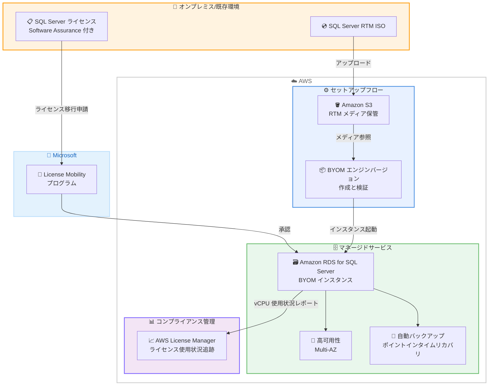

# Amazon RDS for SQL Server - Bring Your Own Media (BYOM)

**リリース日**: 2026年6月2日
**サービス**: Amazon RDS for SQL Server
**機能**: Bring Your Own Media (BYOM)

📊 [このアップデートのインフォグラフィックを見る](https://takech9203.github.io/aws-news-summary/20260602-rds-sqlserver-supports-bring-your-own-media.html)

## 概要

Amazon RDS for SQL Server が Bring Your Own Media (BYOM) をサポートした。BYOM により、オンプレミスや他のクラウド環境で Microsoft SQL Server を運用している顧客が、既存の SQL Server ライセンス (Software Assurance 付き) を Microsoft の License Mobility プログラムを通じて Amazon RDS 上で再利用できるようになった。

BYOM を使用すると、顧客は SQL Server の RTM (Release To Manufacturing) インストールメディアを ISO ファイルとして Amazon S3 にアップロードし、そのメディアを使用して RDS インスタンスを起動する。Amazon RDS はそのメディアから SQL Server をインストールし、必要な累積更新プログラムを自動的に適用する。インスタンス作成後は、License Included モデルと同じインフラストラクチャを使用して、パッチ適用、自動バックアップ、高可用性、モニタリングなどのすべてのデータベース操作を管理する。

AWS License Manager との統合により、AWS 環境全体で SQL Server ライセンスの使用状況を追跡し、ライセンスコンプライアンスを維持できる。

**アップデート前の課題**

- オンプレミスで SQL Server を運用している顧客が Amazon RDS に移行する場合、License Included モデルでは追加の SQL Server ライセンス費用が発生していた
- 既存のライセンス契約が満了するまで RDS への移行を待つ必要があった
- Amazon EC2 上でセルフマネージド SQL Server を運用する場合はライセンス持ち込みが可能だったが、フルマネージドサービスの恩恵を受けられなかった
- ライセンスの二重支払いが発生し、クラウド移行のコスト面でのハードルとなっていた

**アップデート後の改善**

- 既存の SQL Server ライセンスを Amazon RDS 上で再利用可能になり、追加ライセンス費用が不要になった
- ライセンス契約の満了を待たずに、即座に RDS への移行が可能になった
- フルマネージドサービス (自動バックアップ、高可用性、パッチ適用) の恩恵を受けながら、既存ライセンスを活用できるようになった
- AWS License Manager との統合により、ライセンス使用状況の一元的な追跡と監査対応が可能になった

## アーキテクチャ図



BYOM のライセンスフローとインスタンス起動の全体像を示す。顧客は SQL Server RTM メディアを S3 にアップロードし、BYOM エンジンバージョンを作成後、RDS インスタンスを起動する。License Mobility プログラムを通じてライセンスが移行され、AWS License Manager で使用状況を追跡する。

## サービスアップデートの詳細

### 主要機能

1. **Bring Your Own Media (BYOM) ライセンスモデル**
   - 既存の SQL Server ライセンス (Software Assurance 付き) を Microsoft の License Mobility プログラムを通じて RDS 上で再利用
   - License Included モデルとは異なり、SQL Server ライセンス費用が発生しない
   - AWS インフラストラクチャ (コンピューティング、ストレージ、I/O、データ転送) と Windows OS 費用のみ課金

2. **BYOM エンジンバージョン管理**
   - 顧客が SQL Server RTM ISO を S3 にアップロードし、BYOM エンジンバージョンを作成
   - AWS Management Console から起動する場合、エンジンバージョンの作成は自動的に処理される
   - CLI/API を使用する場合は、事前にエンジンバージョンを作成する必要がある
   - 一度作成したエンジンバージョンは同じメジャーバージョンの後続インスタンスで再利用可能

3. **AWS License Manager 統合**
   - BYOM インスタンスを自動検出し、vCPU 使用状況を継続的にレポート
   - License Included とBYOM のインスタンスを区別して追跡
   - 監査対応レポートの生成が可能
   - License Manager の利用に追加料金は発生しない

4. **フルマネージド機能の完全サポート**
   - BYOM インスタンスは License Included インスタンスと同じ機能セットを提供
   - 自動パッチ適用、自動バックアップ、ポイントインタイムリカバリ、Multi-AZ フェイルオーバー、エンジンバージョンアップグレードをサポート

## 技術仕様

### サポート対象エディションとバージョン

| エディション | サポート対象メジャーバージョン |
|------|------|
| Enterprise Edition (EE) | SQL Server 2019、SQL Server 2022 |
| Standard Edition (SE) | SQL Server 2019、SQL Server 2022 |

### License Included と BYOM の比較

| 項目 | License Included (LI) | Bring Your Own Media (BYOM) |
|------|------|------|
| SQL Server ライセンス | 含まれる (時間料金に内包) | 顧客が License Mobility で提供 |
| インストールメディア | AWS が提供・管理 | 顧客が RTM ISO を S3 にアップロード |
| エンジンバージョン管理 | AWS が全バージョンを管理 | 顧客が BYOM エンジンバージョンを作成 |
| ライセンスコンプライアンス | AWS が管理 | 顧客が License Mobility で維持、License Manager で追跡 |

### API 変更履歴

| 日付 | サービス | 変更内容 |
|------|----------|----------|
| 2026/06/02 | Amazon RDS | `license-model` パラメータに `bring-your-own-media` オプションが追加。BYOM エンジンバージョンの作成・管理用 API が利用可能 |

### RTM メディアの要件

```
- 言語: 英語のみ
- ライセンスタイプ: コアベースライセンスの RTM ISO ファイル
- 取得元: Visual Studio サブスクリプションまたは Microsoft 365 管理センター (ボリュームライセンス)
- 形式: ISO ファイル
```

## 設定方法

### 前提条件

1. アクティブな SQL Server ライセンス (Standard または Enterprise) と Software Assurance
2. Microsoft への License Mobility Verification Form の提出と承認
3. SQL Server RTM ISO ファイル (英語版、コアベースライセンス)
4. Amazon S3 バケット (RTM メディアのアップロード先)
5. (推奨) AWS License Manager の設定

### 手順

#### ステップ 1: SQL Server RTM メディアのダウンロード

Visual Studio サブスクリプションまたは Microsoft 365 管理センターから、対象バージョンの SQL Server RTM ISO ファイルをダウンロードする。

```
- Visual Studio サブスクリプンのダウンロードページにアクセス
- 対象の SQL Server バージョンを検索 (例: "SQL Server 2022")
- 言語: English を選択
- ダウンロード形式: ISO を選択
```

#### ステップ 2: S3 バケットへのアップロード

RTM ISO ファイルを Amazon S3 バケットにアップロードする。

```bash
# S3 バケットの作成 (既存バケットを使用する場合はスキップ)
aws s3 mb s3://sqlserver-byom-media --region ap-northeast-1

# RTM ISO ファイルのアップロード
aws s3 cp SQLServer2022-x64-ENU.iso s3://sqlserver-byom-media/
```

S3 バケットに SQL Server の RTM インストールメディアをアップロードする。RDS がこのメディアを参照して BYOM エンジンバージョンを作成する。

#### ステップ 3: BYOM インスタンスの作成 (コンソール)

AWS Management Console を使用する場合、エンジンバージョンの作成は自動的に処理される。

```
1. Amazon RDS コンソール → データベース → データベースの作成
2. エンジンオプション:
   - エンジンタイプ: Microsoft SQL Server
   - データベース管理タイプ: Amazon RDS
   - エディション: SQL Server Standard Edition (または Enterprise)
   - ライセンスモデル: bring-your-own-media
   - メジャーバージョン: SQL Server 2022
   - マイナーエンジンバージョン: 対象バージョンを選択
3. SQL Server RTM media from S3: アップロードした ISO ファイルを選択
4. DB インスタンス識別子を入力
5. 残りの設定 (インスタンスクラス、ストレージ、接続、認証など) を構成
6. データベースの作成 を選択
```

#### ステップ 3 (代替): BYOM インスタンスの作成 (CLI)

AWS CLI を使用する場合は、先に BYOM エンジンバージョンを作成する必要がある。

```bash
# BYOM エンジンバージョンの作成
aws rds create-custom-db-engine-version \
    --engine sqlserver-se \
    --engine-version 16.00.4245.2.v1 \
    --installation-media-s3-bucket-name sqlserver-byom-media \
    --installation-media-s3-prefix SQLServer2022-x64-ENU.iso

# BYOM インスタンスの作成
aws rds create-db-instance \
    --db-instance-identifier sqlserver-se-2022-byom \
    --db-instance-class db.m7i.large \
    --engine sqlserver-se \
    --engine-version 16.00.4245.2.v1 \
    --license-model bring-your-own-media \
    --master-username admin \
    --master-user-password <パスワード> \
    --allocated-storage 200
```

CLI を使用する場合、BYOM エンジンバージョンの作成には約 20 分かかる。エンジンバージョン作成後に RDS インスタンスを起動する。

## メリット

### ビジネス面

- **ライセンスコスト削減**: 既存の SQL Server ライセンスを再利用することで、追加のライセンス費用が不要になる。License Included モデルに比べて大幅なコスト削減が可能
- **即時移行の実現**: 既存ライセンス契約の満了を待つ必要がなく、すぐに RDS への移行を開始できる
- **コンプライアンス管理の簡素化**: AWS License Manager による一元的なライセンス追跡で、監査対応が容易になる
- **投資保護**: Software Assurance に対する既存投資を最大限に活用できる

### 技術面

- **フルマネージドサービスの活用**: セルフマネージド EC2 からフルマネージド RDS に移行でき、運用負荷を大幅に削減
- **機能パリティ**: License Included インスタンスと同じ RDS 機能セット (Multi-AZ、自動バックアップ、ポイントインタイムリカバリ) を利用可能
- **自動パッチ適用**: RDS が累積更新プログラムを自動適用し、セキュリティパッチの管理負荷を軽減
- **AWS サービスとの統合**: RDS 上で動作することで、AWS の分析サービスや AI サービスとの連携が容易になる

## デメリット・制約事項

### 制限事項

- **インプレースメジャーバージョンアップグレード非対応**: SQL Server 2019 から 2022 への直接アップグレードは不可。新しい BYOM インスタンスを作成し、ネイティブバックアップとリストアでデータを移行する必要がある
- **アカウント・リージョン固有**: BYOM エンジンバージョンは AWS アカウントとリージョンに固有。クロスアカウント操作は非対応
- **クロスリージョン操作の制約**: クロスリージョンリードレプリカ、スナップショットコピー、自動バックアップレプリケーションには、ターゲットリージョンでも BYOM エンジンバージョンの作成が必要
- **一部機能の非対応**: SQL Server Analysis Services (SSAS) と SQL Server Reporting Services (SSRS) は BYOM では非対応
- **特定エンジンバージョンの制約**: SQL Server 2019 エンジンバージョン `15.00.4043.16.v1` は BYOM 非対応
- **英語メディアのみ**: RTM ISO は英語版のみサポート

### 考慮すべき点

- License Mobility Verification Form を Microsoft に提出し承認を得る必要がある (承認に数日かかる場合がある)
- ライセンスコンプライアンスの維持は顧客の責任。License Manager は使用状況を追跡するが、制限超過時にオペレーションをブロックしない
- BYOM エンジンバージョンは、関連する RDS インスタンス、スナップショット、バックアップが存在する限り削除できない

## ユースケース

### ユースケース 1: オンプレミスから RDS へのリフトアンドシフト移行

**シナリオ**: 大企業がオンプレミスで SQL Server Enterprise Edition を Software Assurance 付きで運用しており、データセンターの縮小に伴いクラウドへの移行を計画している。

**実装例**:
```bash
# 1. RTM ISO を S3 にアップロード
aws s3 cp SQLServer2022-x64-ENU.iso s3://company-byom-media/

# 2. BYOM インスタンスを作成
aws rds create-db-instance \
    --db-instance-identifier prod-sqlserver-byom \
    --db-instance-class db.r7i.4xlarge \
    --engine sqlserver-ee \
    --engine-version 16.00.4245.2.v1 \
    --license-model bring-your-own-media \
    --multi-az \
    --allocated-storage 1000

# 3. ネイティブバックアップとリストアでデータ移行
aws rds restore-db-instance-from-s3 ...
```

**効果**: ライセンス費用を節約しながら、フルマネージドサービスの恩恵 (高可用性、自動バックアップ、自動パッチ適用) を受けることで、運用コストを大幅に削減

### ユースケース 2: EC2 セルフマネージド SQL Server からの移行

**シナリオ**: 中規模企業が Amazon EC2 上で SQL Server をセルフマネージドで運用しているが、パッチ適用やバックアップ管理の運用負荷が高く、マネージドサービスへの移行を検討している。

**実装例**:
```bash
# EC2 上の SQL Server からネイティブバックアップを取得し S3 に保管
# その後 BYOM インスタンスにリストア

aws rds create-db-instance \
    --db-instance-identifier managed-sqlserver \
    --db-instance-class db.m7i.2xlarge \
    --engine sqlserver-se \
    --engine-version 16.00.4245.2.v1 \
    --license-model bring-your-own-media \
    --allocated-storage 500
```

**効果**: 既存ライセンスを維持したまま、セルフマネージドからフルマネージドに移行し、パッチ適用、バックアップ、高可用性の管理を AWS に委任

### ユースケース 3: マルチリージョン展開でのライセンス一元管理

**シナリオ**: グローバル企業が複数の AWS リージョンで SQL Server を運用しており、ライセンスコンプライアンスの管理を効率化したい。

**実装例**:
```bash
# 各リージョンで BYOM エンジンバージョンを作成
# ap-northeast-1 (東京)
aws rds create-custom-db-engine-version \
    --region ap-northeast-1 \
    --engine sqlserver-ee \
    --engine-version 16.00.4245.2.v1 \
    --installation-media-s3-bucket-name byom-media-apne1 \
    --installation-media-s3-prefix SQLServer2022-x64-ENU.iso

# eu-west-1 (アイルランド)
aws rds create-custom-db-engine-version \
    --region eu-west-1 \
    --engine sqlserver-ee \
    --engine-version 16.00.4245.2.v1 \
    --installation-media-s3-bucket-name byom-media-euw1 \
    --installation-media-s3-prefix SQLServer2022-x64-ENU.iso
```

**効果**: AWS License Manager で全リージョンの BYOM インスタンスの vCPU 使用状況を一元追跡し、Microsoft のライセンス監査に対応可能な状態を維持

## 料金

BYOM を使用する場合、SQL Server ライセンス費用は発生しない。課金対象は以下の通り。

- AWS インフラストラクチャ費用 (コンピューティング、ストレージ、I/O、データ転送)
- Windows OS 費用
- AWS License Manager の利用は無料

### 料金構造の比較

| 項目 | License Included | BYOM |
|------|------------------|------|
| コンピューティング | インスタンス料金 + SQL Server ライセンス料金込み | インスタンス料金のみ |
| SQL Server ライセンス | AWS が提供 (時間料金に含む) | 顧客の既存ライセンスを使用 (追加費用なし) |
| ストレージ/I/O | 同一 | 同一 |
| License Manager | - | 無料 |

**コスト最適化のヒント**: Intel インスタンス (2xl 以上) では、同時マルチスレッディングがデフォルトで無効化されており、物理コア数を維持したまま vCPU 数が 50% 削減される。これによりライセンスコストの最適化が可能。

詳細な料金情報は [Amazon RDS for SQL Server 料金ページ](https://aws.amazon.com/rds/sqlserver/pricing/) を参照。

## 利用可能リージョン

以下の AWS リージョンで利用可能。

| リージョン | 名称 |
|------|------|
| us-east-1 | 米国東部 (バージニア北部) |
| us-east-2 | 米国東部 (オハイオ) |
| us-west-2 | 米国西部 (オレゴン) |
| us-west-1 | 米国西部 (北カリフォルニア) |
| ap-south-1 | アジアパシフィック (ムンバイ) |
| ap-northeast-2 | アジアパシフィック (ソウル) |
| ap-southeast-1 | アジアパシフィック (シンガポール) |
| ap-southeast-2 | アジアパシフィック (シドニー) |
| ap-northeast-1 | アジアパシフィック (東京) |
| eu-west-1 | 欧州 (アイルランド) |
| eu-central-1 | 欧州 (フランクフルト) |
| eu-west-2 | 欧州 (ロンドン) |
| eu-north-1 | 欧州 (ストックホルム) |
| eu-west-3 | 欧州 (パリ) |
| ca-central-1 | カナダ (中部) |
| sa-east-1 | 南米 (サンパウロ) |
| af-south-1 | アフリカ (ケープタウン) |
| us-gov-east-1 | AWS GovCloud (米国東部) |
| us-gov-west-1 | AWS GovCloud (米国西部) |

## 関連サービス・機能

- **AWS License Manager**: BYOM インスタンスの vCPU 使用状況を自動追跡し、ライセンスコンプライアンスを支援
- **Amazon S3**: SQL Server RTM インストールメディアの保管先として使用
- **Amazon RDS Multi-AZ**: BYOM インスタンスでも高可用性構成をサポート
- **AWS Database Migration Service (DMS)**: オンプレミスや EC2 上の SQL Server から BYOM インスタンスへのデータ移行を支援
- **Amazon RDS Custom for SQL Server**: より高度なカスタマイズが必要な場合の選択肢 (OS レベルのアクセスが必要な場合)

## 参考リンク

- 📊 [インフォグラフィック](https://takech9203.github.io/aws-news-summary/20260602-rds-sqlserver-supports-bring-your-own-media.html)
- [公式発表 (What's New)](https://aws.amazon.com/about-aws/whats-new/2026/06/rds-sqlserver-supports-bring-your-own-media/)
- [AWS Blog - Unlock license mobility with Bring Your Own Media on fully managed Amazon RDS for SQL Server](https://aws.amazon.com/blogs/database/unlock-license-mobility-with-bring-your-own-media-on-fully-managed-amazon-rds-for-sql-server/)
- [ドキュメント - BYOM for RDS for SQL Server](https://docs.aws.amazon.com/AmazonRDS/latest/UserGuide/sqlserver-byom.html)
- [料金ページ](https://aws.amazon.com/rds/sqlserver/pricing/)
- [AWS License Manager](https://docs.aws.amazon.com/license-manager/latest/userguide/license-manager.html)

## まとめ

Amazon RDS for SQL Server の BYOM サポートは、オンプレミスや EC2 で SQL Server を運用し、既に Software Assurance 付きライセンスを保有している顧客にとって大きなコスト削減の機会を提供する。License Included モデルでの追加ライセンス費用を回避しながら、フルマネージドサービスの自動バックアップ、高可用性、自動パッチ適用といった運用メリットを享受できる。東京リージョンを含む 19 リージョンで利用可能であり、SQL Server のクラウド移行を検討している組織は、既存ライセンスの Software Assurance 状況を確認し、BYOM による移行計画の策定を推奨する。
