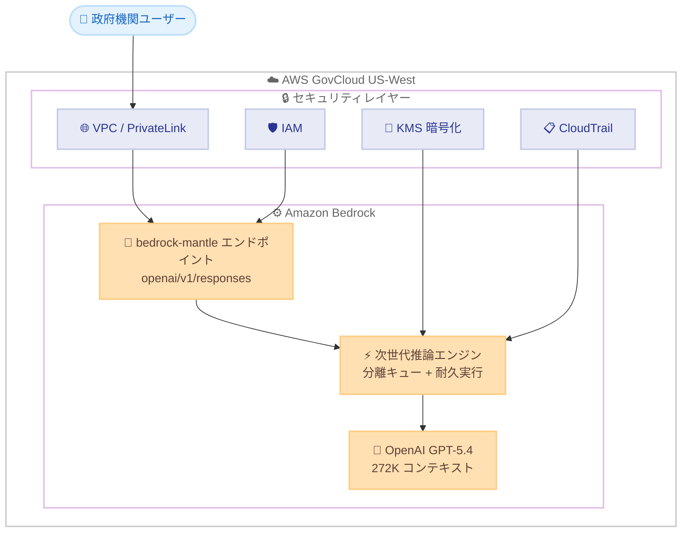

# Amazon Bedrock - OpenAI GPT-5.4 が AWS GovCloud (US-West) で一般提供開始

**リリース日**: 2026 年 6 月 3 日
**サービス**: Amazon Bedrock
**機能**: OpenAI GPT-5.4 の AWS GovCloud (US-West) リージョン対応

[このアップデートのインフォグラフィックを見る](https://takech9203.github.io/aws-news-summary/20260603-GPT54-available-in-aws-govcloud-us-west.html)

## 概要

OpenAI GPT-5.4 が Amazon Bedrock 上で AWS GovCloud (US-West) リージョンにおいて一般提供 (GA) を開始した。これにより、米国政府機関および規制業界のユーザーは、FedRAMP High 認定を受けたセキュアな GovCloud 環境内で OpenAI の最新モデルを利用できるようになった。

GPT-5.4 はフロンティアレベルの推論、コーディング、コンピュータ操作、長文コンテキストワークフロー、およびツール利用機能を Amazon Bedrock に提供するモデルである。272K トークンのコンテキストウィンドウを持ち、複雑なビジネスシステムにおいて信頼性の高い推論とアクションを必要とするプロフェッショナルワークフローに適している。

今回の GovCloud 対応により、防衛、情報機関、法執行機関、金融、医療などのセクターで AI を活用した高度な分析やワークフロー自動化が可能になる。プロンプトとレスポンスはユーザーの AWS 環境内に留まり、モデルのトレーニングには使用されない。

**アップデート前の課題**

- GovCloud 環境で OpenAI の最新モデルを利用する手段がなく、政府機関は商用リージョンでの利用かオンプレミス環境に制限されていた
- 規制要件 (FedRAMP High、ITAR、CJIS 等) を満たしながら最先端の AI モデルを活用することが困難だった
- 機密性の高いデータを扱う業務で、データの所在地管理とコンプライアンス遵守を両立する AI ソリューションが限られていた

**アップデート後の改善**

- AWS GovCloud (US-West) 内で GPT-5.4 を直接利用でき、データは GovCloud リージョン内に留まる
- Amazon Bedrock のガバナンスコントロール (IAM、VPC/PrivateLink、KMS 暗号化、CloudTrail 監査ログ) と組み合わせてセキュアに運用可能
- Responses API を介した OpenAI 互換の呼び出しにより、既存のアプリケーションを最小限の変更で GovCloud に移行可能

## アーキテクチャ図



政府機関ユーザーは VPC/PrivateLink 経由で Amazon Bedrock の bedrock-mantle エンドポイントにアクセスし、GPT-5.4 を利用する。すべての通信とデータは GovCloud リージョン内で完結する。

## サービスアップデートの詳細

### 主要機能

1. **フロンティア推論能力**
   - 複雑な推論、コーディング、ドキュメント分析、マルチステップワークフローに対応
   - reasoning effort パラメータによる推論レベルの制御が可能
   - GPT-5.4 ではデフォルトが `none` のため、明示的に effort を設定することが推奨される

2. **次世代推論エンジン**
   - Amazon Bedrock の専用推論基盤上で稼働
   - 分離されたキューによる自動キャパシティ管理
   - 耐久状態キャプチャにより、ハードウェア障害時のミッドコールリカバリを実現
   - 高需要時はリクエストを拒否せずキューイングで対応

3. **セキュリティとデータ主権**
   - プロンプトとレスポンスはユーザーの AWS 環境内に留まる
   - モデルプロバイダーとのデータ共有なし
   - モデルトレーニングへの顧客データ使用なし
   - GovCloud の物理的・論理的分離による保護

## 技術仕様

### モデル仕様

| 項目 | 詳細 |
|------|------|
| モデル ID | `openai.gpt-5.4` |
| コンテキストウィンドウ | 272K トークン |
| 入力モダリティ | テキスト、画像 |
| 出力モダリティ | テキスト |
| API | Responses API のみ |
| エンドポイント | bedrock-mantle |
| エンドポイント URL | `https://bedrock-mantle.us-gov-west-1.api.aws/openai/v1` |
| サービスティア | Standard (従量課金) |
| モデルライフサイクル | Active |
| ローンチ日 | 2026 年 6 月 1 日 (商用)、2026 年 6 月 3 日 (GovCloud) |

### 対応機能

| 機能 | 対応状況 |
|------|----------|
| マルチターンステート管理 | 対応 |
| ホステッドツール | 対応 |
| ファンクションツール | 対応 |
| ツールオーケストレーション | 対応 |
| バックグラウンド実行 | 対応 |
| コンピュータ操作 | 対応 |
| Chat Completions API | 非対応 |
| Converse API | 非対応 |
| Geo / Global 推論 | 非対応 |

### API 呼び出しパス

```
openai/v1/responses
```

**注意**: 他のモデルで使用される `v1/responses` パスとは異なり、OpenAI モデルは `openai/v1/responses` パスを使用する。

## 設定方法

### 前提条件

1. AWS GovCloud (US-West) アカウントを保有していること
2. Amazon Bedrock のモデルアクセスで GPT-5.4 が有効化されていること
3. 適切な IAM 権限が設定されていること
4. Bedrock API キーが発行されていること

### 手順

#### ステップ 1: API キーの生成

Amazon Bedrock コンソールから長期 API キーを生成する。

```bash
# AWS GovCloud コンソールにアクセス
# Amazon Bedrock > API keys > 長期キーの作成
```

GovCloud コンソール (`console.amazonaws-us-gov.com`) にログインし、Bedrock セクションから API キーを作成する。

#### ステップ 2: 環境変数の設定

```bash
# GovCloud (US-West) エンドポイントを設定
export OPENAI_API_KEY="<Bedrock API キー>"
export OPENAI_BASE_URL="https://bedrock-mantle.us-gov-west-1.api.aws/openai/v1"
```

GovCloud リージョンの bedrock-mantle エンドポイントを指定する。これにより OpenAI SDK が Bedrock 経由で GPT-5.4 を呼び出す。

#### ステップ 3: Python SDK のインストールと実行

```bash
pip install openai
```

```python
from openai import OpenAI

client = OpenAI()

response = client.responses.create(
    model="openai.gpt-5.4",
    input="Summarize the key compliance requirements for FedRAMP High."
)
print(response)
```

OpenAI Python SDK を使用し、`model` パラメータに `openai.gpt-5.4` を指定して呼び出す。エンドポイントは環境変数で GovCloud に向けているため、データは GovCloud 内で処理される。

## メリット

### ビジネス面

- **コンプライアンス要件の充足**: FedRAMP High、ITAR、CJIS、DoD SRG 等の要件を満たす環境内で最先端 AI を活用可能
- **調達の簡素化**: OpenAI と同じトークン単価で追加料金なし、シートライセンスや開発者ごとのコミットメント不要
- **ミッションクリティカルな業務への AI 適用**: 従来は規制上困難だった政府業務の AI 活用が現実的な選択肢となる

### 技術面

- **OpenAI 互換 API**: 既存の OpenAI SDK をそのまま利用でき、エンドポイント変更のみで GovCloud に接続可能
- **エンタープライズグレードの信頼性**: 分離キュー、耐久実行、自動キャパシティ管理により高可用性を実現
- **統合ガバナンス**: IAM、VPC、KMS、CloudTrail による包括的なアクセス制御と監査が可能

## デメリット・制約事項

### 制限事項

- GovCloud では In-Region 推論のみ対応 (Geo Cross-Region、Global Cross-Region は非対応)
- サービスティアは Standard のみ (Priority、Flex、Reserved は非対応)
- Chat Completions API、Converse API は非対応 (Responses API のみ)
- コンソールからの直接利用はまだ非対応 (今後対応予定)

### 考慮すべき点

- GovCloud アカウントの取得にはルートアカウント保持者の米国市民確認プロセスが必要
- reasoning effort パラメータのデフォルトが `none` であるため、明示的な設定が推奨される
- レイテンシは推論努力レベル、出力長、ツール呼び出し、プロンプトサイズ等に依存する

## ユースケース

### ユースケース 1: 機密文書の自動分析

**シナリオ**: 政府機関が大量の機密レポートや政策文書を分析し、要約や傾向レポートを生成する必要がある。

**実装例**:
```python
from openai import OpenAI

client = OpenAI()

response = client.responses.create(
    model="openai.gpt-5.4",
    input=[
        {"role": "user", "content": "Analyze the following policy document and identify key compliance gaps..."}
    ],
    reasoning={"effort": "high"}
)
```

**効果**: 272K トークンの長文コンテキストにより、数百ページの文書を一度に処理し、人手による分析時間を大幅に削減できる。

### ユースケース 2: セキュアなコード生成と監査

**シナリオ**: 防衛関連のソフトウェア開発において、セキュアコーディング支援やコードレビューの自動化を実現したい。

**実装例**:
```python
from openai import OpenAI

client = OpenAI()

response = client.responses.create(
    model="openai.gpt-5.4",
    input="Review the following code for security vulnerabilities and STIG compliance...",
    reasoning={"effort": "high"}
)
```

**効果**: GovCloud 内でソースコードが外部に漏洩するリスクなく AI 支援コードレビューを実施でき、開発速度とセキュリティ品質を同時に向上させる。

### ユースケース 3: マルチステップエージェントワークフロー

**シナリオ**: 規制対応チームが複数のデータソースを横断して調査し、コンプライアンスレポートを自動生成するエージェントを構築したい。

**実装例**:
```python
from openai import OpenAI

client = OpenAI()

response = client.responses.create(
    model="openai.gpt-5.4",
    input="Query the compliance database, cross-reference with latest regulations, and generate an audit report.",
    tools=[
        {"type": "function", "function": {"name": "query_database", "description": "Query compliance DB"}},
        {"type": "function", "function": {"name": "fetch_regulations", "description": "Fetch current regulations"}}
    ]
)
```

**効果**: ツール利用機能により外部システムと連携しながら、GovCloud 内で完結するセキュアなエージェントワークフローを実現できる。

## 料金

OpenAI と同じトークン単価で追加料金は発生しない。シートライセンスや開発者ごとのコミットメントは不要で、従量課金制 (Standard ティア) で利用可能。

具体的なトークン単価については [Amazon Bedrock 料金ページ](https://aws.amazon.com/bedrock/pricing/) を参照。

## 利用可能リージョン

| リージョン | In-Region | Geo Cross-Region | Global Cross-Region |
|-----------|-----------|-------------------|---------------------|
| us-east-2 (Ohio) | 対応 | 非対応 | 非対応 |
| us-west-2 (Oregon) | 対応 | 非対応 | 非対応 |
| us-gov-west-1 (GovCloud US-West) | 対応 | 非対応 | 非対応 |

## 関連サービス・機能

- **Amazon Bedrock**: GPT-5.4 をホストする基盤サービス。モデルアクセス管理、ガードレール、エージェント機能を提供
- **AWS GovCloud (US)**: FedRAMP High 認定の分離されたリージョン。米国市民が運用し、機密データの処理に対応
- **AWS PrivateLink**: VPC からインターネットを経由せずに Bedrock エンドポイントへプライベート接続を確立
- **AWS CloudTrail**: すべての API 呼び出しの監査ログを記録し、コンプライアンス監査に活用
- **AWS KMS**: モデル呼び出し時のデータ暗号化をカスタマーマネージドキーで管理

## 参考リンク

- [インフォグラフィック](https://takech9203.github.io/aws-news-summary/20260603-GPT54-available-in-aws-govcloud-us-west.html)
- [公式発表 (What's New)](https://aws.amazon.com/about-aws/whats-new/2026/06/GPT54-available-in-aws-govcloud-us-west/)
- [AWS Blog - OpenAI models and Codex on Amazon Bedrock are now generally available](https://aws.amazon.com/blogs/machine-learning/openai-models-and-codex-on-amazon-bedrock-are-now-generally-available)
- [AWS Blog - Get started with OpenAI GPT-5.5, GPT-5.4 models and Codex on Amazon Bedrock](https://aws.amazon.com/blogs/aws/get-started-with-openai-gpt-5-5-gpt-5-4-models-and-codex-on-amazon-bedrock)
- [GPT-5.4 モデルカード](https://docs.aws.amazon.com/bedrock/latest/userguide/model-card-openai-gpt-54.html)
- [Amazon Bedrock 料金](https://aws.amazon.com/bedrock/pricing/)
- [AWS GovCloud (US)](https://aws.amazon.com/govcloud-us/)

## まとめ

OpenAI GPT-5.4 の AWS GovCloud (US-West) 対応により、米国政府機関および規制業界のユーザーは、コンプライアンス要件を完全に満たしながら最先端の AI モデルを業務に活用できるようになった。OpenAI 互換の Responses API を通じて既存のツールやワークフローとシームレスに統合できるため、GovCloud 環境で AI を活用したい組織は、モデルアクセスの有効化から速やかに検証を開始することが推奨される。
