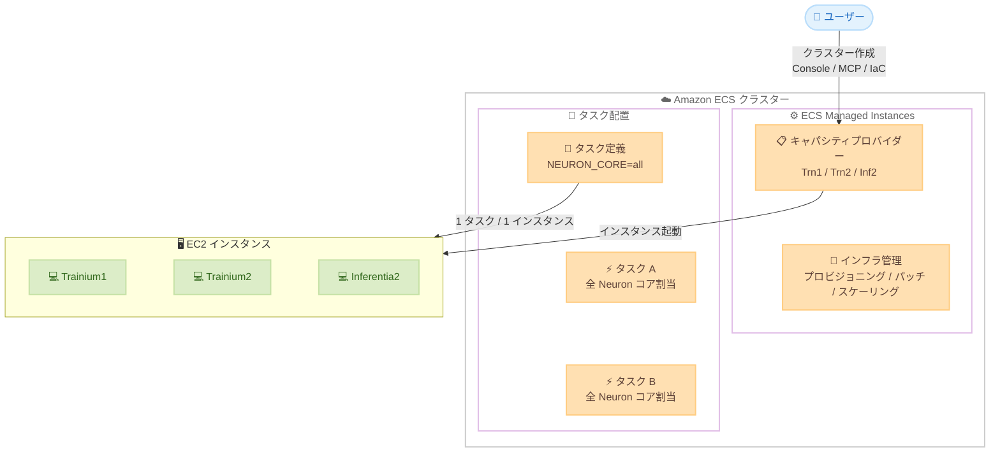

# Amazon ECS Managed Instances - AWS Trainium / AWS Inferentia サポート

**リリース日**: 2026年6月3日
**サービス**: Amazon Elastic Container Service (Amazon ECS)
**機能**: ECS Managed Instances での AWS Trainium および AWS Inferentia サポート

[このアップデートのインフォグラフィックを見る](https://takech9203.github.io/aws-news-summary/20260603-amazon-ecs-managed-instances-neuron.html)

## 概要

Amazon ECS Managed Instances が AWS Trainium および AWS Inferentia をサポートしました。これにより、生成 AI ワークロードのトレーニングと推論に最適化された専用 AI アクセラレータを、ECS のフルマネージドなインフラストラクチャ管理のもとで利用できるようになります。

ECS Managed Instances は、Amazon EC2 のフル機能にアクセスしながら、インフラストラクチャ管理のオーバーヘッドを排除するフルマネージドなコンピュートオプションです。インスタンスの設定、キャパシティのプロビジョニング、ワークロードの配置、パッチ適用、スケーリング、メンテナンスを AWS が管理します。今回のアップデートにより、Inferentia2、Trainium1、Trainium2 のインスタンスタイプを選択し、タスク定義の ResourceRequirement セクションに `NEURON_CORE=all` を設定するだけで、アクセラレータの全リソースがワークロードに自動的に割り当てられます。

**アップデート前の課題**

- ECS 上で Neuron アクセラレータを利用するには、EC2 インスタンスの手動管理やカスタム AMI の設定が必要だった
- アクセラレータリソースの適切な割り当てと分離を手動で管理する必要があった
- AI/ML ワークロード向けのインフラストラクチャのスケーリングとパッチ適用に運用負荷がかかっていた

**アップデート後の改善**

- ECS Managed Instances のキャパシティプロバイダーで Inferentia2、Trainium1、Trainium2 を直接指定可能になった
- `NEURON_CORE=all` 設定により、1 インスタンスあたり 1 タスクの配置でアクセラレータの全リソースが自動的に割り当てられる
- AWS がインフラストラクチャの管理を担当するため、AI/ML ワークロードの運用が大幅に簡素化された

## アーキテクチャ図



ECS Managed Instances がキャパシティプロバイダーで指定された Neuron 対応インスタンスを起動し、タスク定義に基づき 1 インスタンスあたり 1 タスクを配置することで、アクセラレータの全リソースをワークロードに専有させる構成を示しています。

## サービスアップデートの詳細

### 主要機能

1. **Neuron 対応インスタンスタイプの選択**
   - ECS Managed Instances キャパシティプロバイダーで Inferentia2、Trainium1、Trainium2 を指定可能
   - AWS が指定されたインスタンスタイプのプロビジョニングとライフサイクル管理を自動実行
   - 既存の ECS クラスターにも新規クラスターにも適用可能

2. **NEURON_CORE=all によるリソース自動割り当て**
   - タスク定義の ResourceRequirement セクションに `NEURON_CORE=all` を追加
   - 1 インスタンスあたり 1 タスクが配置される排他的なリソース割り当てモデル
   - アクセラレータの全コアがワークロードに自動的に専有される

3. **フルマネージドなインフラストラクチャ運用**
   - インスタンスの設定、キャパシティプロビジョニング、スケーリングを AWS が管理
   - セキュリティパッチの自動適用 (14 日間隔)
   - Bottlerocket OS ベースでコンテナに最適化された環境

4. **柔軟なデプロイオプション**
   - AWS マネジメントコンソール
   - Amazon ECS MCP Server
   - IaC ツール (CloudFormation、CDK、Terraform など)

## 技術仕様

### サポートされるインスタンスタイプ

| インスタンスタイプ | アクセラレータ | 用途 |
|------|----------|----------|
| Inferentia2 (inf2) | AWS Inferentia2 | 推論ワークロード |
| Trainium1 (trn1) | AWS Trainium | トレーニングワークロード |
| Trainium2 (trn2) | AWS Trainium2 | 高性能トレーニング/推論 |

### リソース設定

| 項目 | 詳細 |
|------|------|
| リソース要件キー | `NEURON_CORE` |
| 設定値 | `all` |
| タスク配置 | 1 インスタンスあたり 1 タスク |
| リソース割り当て | アクセラレータの全リソースを専有 |

### タスク定義設定例

```json
{
  "containerDefinitions": [
    {
      "name": "neuron-container",
      "image": "your-neuron-model-image:latest",
      "resourceRequirements": [
        {
          "type": "NEURON_CORE",
          "value": "all"
        }
      ]
    }
  ],
  "requiresCompatibilities": ["EC2"]
}
```

## 設定方法

### 前提条件

1. Amazon ECS クラスター (新規または既存)
2. Neuron SDK を含むコンテナイメージ
3. 適切な IAM 権限 (ECS、EC2 関連)

### 手順

#### ステップ 1: ECS Managed Instances キャパシティプロバイダーの作成

AWS マネジメントコンソールで ECS クラスターを作成し、インフラストラクチャとして「Fargate and Managed Instances」を選択します。カスタム設定で Neuron 対応インスタンスタイプ (inf2、trn1、trn2) を指定します。

#### ステップ 2: タスク定義の作成

```json
{
  "family": "neuron-inference-task",
  "containerDefinitions": [
    {
      "name": "model-server",
      "image": "123456789012.dkr.ecr.us-east-1.amazonaws.com/neuron-model:latest",
      "essential": true,
      "resourceRequirements": [
        {
          "type": "NEURON_CORE",
          "value": "all"
        }
      ],
      "portMappings": [
        {
          "containerPort": 8080,
          "protocol": "tcp"
        }
      ]
    }
  ],
  "requiresCompatibilities": ["EC2"]
}
```

タスク定義の `resourceRequirements` に `NEURON_CORE=all` を設定することで、ECS がインスタンスの全 Neuron コアをタスクに割り当てます。

#### ステップ 3: サービスのデプロイ

```bash
aws ecs create-service \
  --cluster my-neuron-cluster \
  --service-name neuron-inference-service \
  --task-definition neuron-inference-task \
  --desired-count 2 \
  --capacity-provider-strategy capacityProvider=my-neuron-capacity-provider,weight=1
```

キャパシティプロバイダー戦略を指定してサービスを作成します。ECS が自動的に Neuron 対応インスタンスを起動し、各インスタンスに 1 タスクを配置します。

## メリット

### ビジネス面

- **運用コスト削減**: インフラストラクチャ管理を AWS にオフロードすることで、エンジニアリングリソースを AI/ML モデルの開発に集中できる
- **迅速なスケーリング**: 需要に応じて Neuron インスタンスを自動的にスケールアウト/インでき、ビジネスニーズに素早く対応可能
- **TCO 最適化**: Trainium/Inferentia は GPU 比で高いコスト効率を提供し、マネージド管理によりさらに TCO を低減

### 技術面

- **リソース分離**: 1 タスク 1 インスタンスモデルにより、ワークロード間のリソース競合を排除
- **パフォーマンス最適化**: アクセラレータの全コアを専有することで、最大限のスループットを実現
- **運用の簡素化**: パッチ適用、インスタンスのヘルスチェック、リプレースメントが自動化される

## デメリット・制約事項

### 制限事項

- `NEURON_CORE=all` 設定では 1 インスタンスあたり 1 タスクのみ配置可能 (マルチテナント非対応)
- ECS Managed Instances の管理料金が EC2 コストに追加される
- Neuron SDK 対応のコンテナイメージを事前に準備する必要がある

### 考慮すべき点

- Trainium/Inferentia で動作させるには、モデルを Neuron SDK でコンパイルする必要がある
- 全てのフレームワークが Neuron SDK に対応しているわけではない (PyTorch、JAX、TensorFlow は対応)
- インスタンスタイプごとの Neuron コア数やメモリ容量に応じたモデルサイズの選定が必要

## ユースケース

### ユースケース 1: 大規模言語モデルの推論サービング

**シナリオ**: 生成 AI アプリケーションで LLM を Inferentia2 インスタンス上にデプロイし、低レイテンシーの推論を提供する。

**実装例**:
```json
{
  "family": "llm-inference",
  "containerDefinitions": [
    {
      "name": "vllm-neuron",
      "image": "my-registry/vllm-neuron:latest",
      "resourceRequirements": [
        {
          "type": "NEURON_CORE",
          "value": "all"
        }
      ]
    }
  ]
}
```

**効果**: Inferentia2 の全 Neuron コアを活用した高スループット推論を、インフラ管理なしで実現できる。

### ユースケース 2: 分散モデルトレーニング

**シナリオ**: Trainium2 インスタンスを使用して、大規模な生成 AI モデルのファインチューニングを実行する。

**実装例**:
```json
{
  "family": "model-training",
  "containerDefinitions": [
    {
      "name": "training-job",
      "image": "my-registry/neuron-training:latest",
      "resourceRequirements": [
        {
          "type": "NEURON_CORE",
          "value": "all"
        }
      ],
      "environment": [
        {
          "name": "NEURON_RT_NUM_CORES",
          "value": "32"
        }
      ]
    }
  ]
}
```

**効果**: Trainium2 のコスト効率の高いトレーニング性能を、ECS のマネージド環境で活用し、トレーニングジョブの管理を簡素化できる。

### ユースケース 3: マルチモデル推論パイプライン

**シナリオ**: 複数の AI モデル (テキスト生成、画像認識、埋め込み生成) をそれぞれ専用の Neuron インスタンスで実行し、ECS サービスとして管理する。

**実装例**:
```bash
# 各モデルに専用のサービスを作成
aws ecs create-service --cluster ai-cluster \
  --service-name text-generation --task-definition text-gen-task \
  --capacity-provider-strategy capacityProvider=trn2-provider,weight=1

aws ecs create-service --cluster ai-cluster \
  --service-name embedding --task-definition embedding-task \
  --capacity-provider-strategy capacityProvider=inf2-provider,weight=1
```

**効果**: モデルごとに最適なアクセラレータインスタンスを割り当て、独立したスケーリングポリシーを適用できる。

## 料金

ECS Managed Instances の利用料金は以下の 2 つの要素で構成されます。

- **EC2 インスタンス料金**: 選択した Trainium/Inferentia インスタンスタイプに応じた通常の EC2 料金
- **管理料金**: プロビジョニングされたコンピュートの管理に対する追加料金

具体的な管理料金については、[Amazon ECS 料金ページ](https://aws.amazon.com/ecs/pricing/) を参照してください。

## 利用可能リージョン

ECS Managed Instances は以下のリージョンで利用可能です。

- US East (N. Virginia)
- US West (Oregon)
- Europe (Ireland)
- Africa (Cape Town)
- Asia Pacific (Singapore)
- Asia Pacific (Tokyo)

Neuron インスタンスタイプの利用可能性は、各リージョンでの Trainium/Inferentia インスタンスの提供状況に依存します。

## 関連サービス・機能

- **AWS Neuron SDK**: Trainium/Inferentia 上でモデルをコンパイル・実行するための SDK
- **Amazon ECS Managed Instances**: EC2 のフル機能をフルマネージドで利用するコンピュートオプション
- **AWS Trainium**: ML トレーニング向けに設計された専用チップ
- **AWS Inferentia**: ML 推論向けに設計された専用チップ
- **Amazon SageMaker**: エンドツーエンドの ML プラットフォーム (代替オプション)

## 参考リンク

- [インフォグラフィック](https://takech9203.github.io/aws-news-summary/20260603-amazon-ecs-managed-instances-neuron.html)
- [公式発表 (What's New)](https://aws.amazon.com/about-aws/whats-new/2026/06/amazon-ecs-managed-instances-neuron)
- [AWS Blog - Announcing Amazon ECS Managed Instances](https://aws.amazon.com/blogs/aws/announcing-amazon-ecs-managed-instances-for-containerized-applications)
- [Amazon ECS Managed Instances](https://aws.amazon.com/ecs/managed-instances/)
- [ドキュメント - ECS Inference](https://docs.aws.amazon.com/AmazonECS/latest/developerguide/ecs-inference.html)
- [AWS Trainium](https://aws.amazon.com/ai/machine-learning/trainium/)
- [AWS Inferentia](https://aws.amazon.com/ai/machine-learning/inferentia/)

## まとめ

Amazon ECS Managed Instances での Trainium/Inferentia サポートにより、生成 AI ワークロードをコンテナ化しつつ、インフラストラクチャ管理の負担を大幅に軽減できるようになりました。`NEURON_CORE=all` という簡潔な設定でアクセラレータの全リソースを活用できるため、AI/ML エンジニアはモデル開発に集中できます。Neuron 対応のコンテナワークロードを ECS で運用しているチームは、Managed Instances への移行を検討することで運用負荷の削減とコスト最適化を実現できます。
