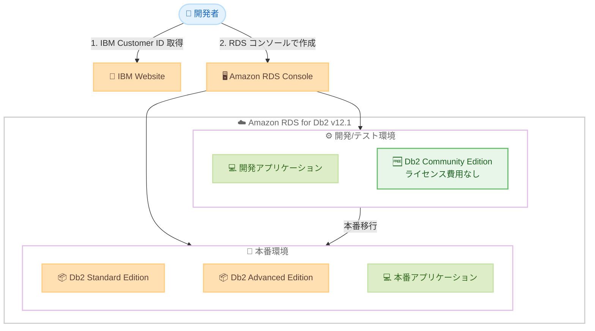

# Amazon RDS for Db2 - IBM Db2 v12.1 および Db2 Community Edition のサポート開始

**リリース日**: 2026年6月3日
**サービス**: Amazon RDS for Db2
**機能**: IBM Db2 v12.1 サポートおよび Db2 Community Edition の追加

[このアップデートのインフォグラフィックを見る](https://takech9203.github.io/aws-news-summary/20260603-amazon-rds-db2-v12-community-edition.html)

## 概要

Amazon RDS for Db2 が IBM Db2 v12.1 のサポートを開始し、新たに Db2 Community Edition が利用可能になった。これにより、RDS for Db2 では Db2 Standard Edition、Db2 Advanced Edition、Db2 Community Edition の 3 つのエディションがサポートされる。

Db2 Community Edition は Standard Edition および Advanced Edition で利用可能なすべての機能を備えながら、開発およびテストアプリケーション向けに商用ソフトウェアライセンス料が不要となる。これにより、ソフトウェアライセンスを気にすることなく、マネージドデータベースサービス上で Db2 アプリケーションの開発とテストを簡単に開始できる。

Db2 Community Edition を使用するには、IBM ウェブサイトから無料の IBM Customer ID を取得し、Amazon RDS コンソールからデータベースインスタンスを作成する。

**アップデート前の課題**

- Amazon RDS for Db2 では Db2 v11.5.9 のみがサポートされており、最新の Db2 v12.1 の機能を利用できなかった
- 開発・テスト用途であっても Standard Edition または Advanced Edition のライセンスが必要であり、ライセンスコストが発生していた
- Db2 の評価や PoC を行う際にもライセンス費用を考慮する必要があり、気軽に試すことが困難だった

**アップデート後の改善**

- Db2 v12.1 の最新機能がマネージドサービスとして利用可能になった
- Community Edition により、開発・テスト環境でのソフトウェアライセンス費用が不要になった
- IBM Customer ID の無料取得のみで Db2 の全機能を開発・テスト用途で利用開始できるようになった
- Standard/Advanced Edition と同等の機能セットで開発できるため、本番環境への移行がスムーズになった

## アーキテクチャ図



開発者は IBM Customer ID を無料で取得し、RDS コンソールから Community Edition インスタンスを作成することで、ライセンス費用なしで開発・テストを開始できる。本番環境への移行時に Standard/Advanced Edition に切り替える運用が可能。

## サービスアップデートの詳細

### 主要機能

1. **IBM Db2 v12.1 サポート**
   - Amazon RDS for Db2 で最新の Db2 v12.1.4 が利用可能
   - Standard Edition、Advanced Edition、Community Edition の 3 エディションすべてで v12.1 をサポート
   - 既存の v11.5.9 も引き続きサポート対象

2. **Db2 Community Edition の追加**
   - Standard Edition および Advanced Edition のすべての機能を利用可能
   - 開発およびテストアプリケーション向けに商用ソフトウェアライセンス料が無料
   - IBM から無料で IBM Customer ID と IBM Site ID を取得して利用

3. **フルマネージドサービスとしての提供**
   - 自動プロビジョニング、バックアップ、ソフトウェアパッチ適用、モニタリング
   - Multi-AZ デプロイメントによる高可用性
   - クロスリージョンバックアップによる災害復旧対策

## 技術仕様

### サポートされるエディションとバージョン

| エディション | サポートバージョン | ライセンスモデル |
|------|------|------|
| Db2 Advanced Edition | v11.5.9, v12.1.4 | BYOL / AWS Marketplace 時間課金 |
| Db2 Standard Edition | v11.5.9, v12.1.4 | BYOL / AWS Marketplace 時間課金 |
| Db2 Community Edition | v12.1.4 | 無料 (IBM Customer ID 必要) |

### Community Edition の特徴

| 項目 | 詳細 |
|------|------|
| 機能範囲 | Standard/Advanced Edition と同等 |
| ライセンス費用 | なし (開発/テスト用途) |
| 前提条件 | IBM Customer ID (無料) |
| 対象用途 | 開発、テスト、評価 |
| 本番利用 | Standard または Advanced Edition への切り替えが必要 |

### マスターユーザー権限

| 権限 | 利用可否 |
|------|------|
| DBADM | 利用可能 (一部制限あり) |
| SYSADM | 利用不可 |
| SYSCTRL | 利用不可 |
| SYSMAINT | 利用不可 |
| SECADM | 利用不可 |

## 設定方法

### 前提条件

1. AWS アカウントおよび Amazon RDS へのアクセス権限
2. IBM Customer ID (IBM ウェブサイトから無料で取得)
3. VPC およびサブネットグループの設定

### 手順

#### ステップ 1: IBM Customer ID の取得

IBM ウェブサイトにアクセスし、無料の IBM Customer ID を取得する。このアカウントは Db2 Community Edition のライセンス認証に使用される。

#### ステップ 2: RDS コンソールでの DB インスタンス作成

```bash
# AWS CLI を使用した Db2 Community Edition インスタンスの作成例
aws rds create-db-instance \
    --db-instance-identifier my-db2-dev \
    --db-instance-class db.t3.medium \
    --engine db2-ce \
    --engine-version 12.1.4 \
    --master-username admin \
    --master-user-password <password> \
    --allocated-storage 100
```

AWS CLI または Amazon RDS コンソールから Db2 Community Edition を選択してインスタンスを作成する。エンジンタイプとして Community Edition を指定し、必要なインスタンスクラスとストレージを設定する。

#### ステップ 3: データベースへの接続

```bash
# IBM Db2 CLP を使用した接続例
db2 connect to mydb user admin using <password>
```

標準的な SQL クライアントまたは IBM Db2 CLP を使用してデータベースに接続する。SSH やシェルアクセスは提供されないため、SQL クライアント経由でのアクセスとなる。

## メリット

### ビジネス面

- **開発コストの削減**: Community Edition により開発・テスト環境のソフトウェアライセンス費用が不要になり、初期コストを大幅に削減可能
- **迅速な評価開始**: ライセンス調達プロセスを経ずに Db2 の全機能を評価できるため、意思決定を加速
- **本番移行の円滑化**: 開発環境と本番環境で同じ機能セットを使用するため、移行時の互換性問題を最小化

### 技術面

- **最新エンジンの利用**: Db2 v12.1 の最新機能 (パフォーマンス改善、新しい SQL 機能等) をマネージドサービスとして利用可能
- **運用負荷の軽減**: バックアップ、パッチ適用、モニタリングが自動化されており、開発者はアプリケーション開発に集中可能
- **高可用性の確保**: Multi-AZ デプロイメントやクロスリージョンバックアップを標準機能として利用可能

## デメリット・制約事項

### 制限事項

- Community Edition は開発・テスト用途に限定され、本番ワークロードには Standard または Advanced Edition のライセンスが必要
- シェルアクセス (SSH/Telnet) は提供されず、SQL クライアント経由のみでアクセス可能
- SYSADM、SYSCTRL、SYSMAINT、SECADM 権限は利用不可

### 考慮すべき点

- IBM Customer ID の取得が必要であり、IBM のアカウント管理ポリシーに従う必要がある
- Community Edition から Standard/Advanced Edition への移行手順を事前に計画しておくことが推奨される
- インフラストラクチャコスト (RDS インスタンス、ストレージ、データ転送) は引き続き発生する

## ユースケース

### ユースケース 1: メインフレームからの移行検証

**シナリオ**: 企業がオンプレミスのメインフレーム上で稼働する Db2 アプリケーションを AWS に移行する際、Community Edition を使用して移行検証を実施する。

**実装例**:
```bash
# 検証用の Community Edition インスタンスを作成
aws rds create-db-instance \
    --db-instance-identifier db2-migration-test \
    --db-instance-class db.m5.xlarge \
    --engine db2-ce \
    --engine-version 12.1.4 \
    --allocated-storage 500

# AWS DMS を使用してデータを移行
aws dms create-replication-task \
    --replication-task-identifier db2-migration-task \
    --source-endpoint-arn arn:aws:dms:...:endpoint:source \
    --target-endpoint-arn arn:aws:dms:...:endpoint:target \
    --migration-type full-load-and-cdc
```

**効果**: ライセンス費用なしで移行検証を完了し、問題点を事前に洗い出してから本番移行を実施できる。

### ユースケース 2: 開発チームのローカル開発環境代替

**シナリオ**: 開発チームが各自のローカル環境に Db2 をインストールする代わりに、共有の RDS for Db2 Community Edition インスタンスを使用する。

**実装例**:
```bash
# 開発チーム共有の Community Edition インスタンス
aws rds create-db-instance \
    --db-instance-identifier db2-team-dev \
    --db-instance-class db.t3.large \
    --engine db2-ce \
    --engine-version 12.1.4 \
    --allocated-storage 200 \
    --multi-az false

# 各開発者用のデータベースを作成
db2 create database devdb1
db2 create database devdb2
```

**効果**: 個々の開発者がライセンスやインストールを管理する必要がなくなり、統一された開発環境を提供できる。

### ユースケース 3: CI/CD パイプラインでの自動テスト

**シナリオ**: CI/CD パイプラインで Db2 データベースを使用したインテグレーションテストを実行する際、Community Edition を利用する。

**実装例**:
```yaml
# CI/CD パイプラインでのテスト用 RDS 設定例
resources:
  db2_test_instance:
    type: aws_db_instance
    properties:
      engine: db2-ce
      engine_version: "12.1.4"
      instance_class: db.t3.medium
      allocated_storage: 100
      identifier: "db2-ci-test-${BUILD_ID}"
```

**効果**: テスト環境のデータベースライセンスコストを削減しながら、本番同等の機能でテストを実行できる。

## 料金

Db2 Community Edition ではソフトウェアライセンス料は不要だが、RDS インフラストラクチャの料金は発生する。

### 料金構成

| 費用項目 | Community Edition | Standard/Advanced Edition |
|--------|------------------|--------------------------|
| ソフトウェアライセンス | 無料 | BYOL または AWS Marketplace 時間課金 |
| RDS インスタンス | オンデマンドまたはリザーブド | オンデマンドまたはリザーブド |
| ストレージ (gp3/io1) | 使用量に応じた課金 | 使用量に応じた課金 |
| データ転送 | 標準料金 | 標準料金 |

### 補足事項

- T3 インスタンスの CPU クレジット: $0.144/vCPU-Hour
- 課金は 1 秒単位 (最低 10 分)
- リザーブドインスタンスは Standard/Advanced Edition で利用可能
- データ転送: インバウンド無料、アウトバウンド月 100 GB まで無料

## 利用可能リージョン

Amazon RDS for Db2 12.1 (Community Edition 含む) は、Amazon RDS for Db2 が現在利用可能なすべての AWS リージョンで提供される。主要なリージョンは以下の通り。

- 米国東部 (バージニア北部、オハイオ)
- 米国西部 (オレゴン、北カリフォルニア)
- アジアパシフィック (東京、大阪、シンガポール、シドニー、ソウル、ムンバイ)
- 欧州 (フランクフルト、アイルランド、ロンドン、パリ、ストックホルム)
- カナダ (中部)
- 南米 (サンパウロ)

## 関連サービス・機能

- **AWS Database Migration Service (DMS)**: オンプレミスの Db2 から RDS for Db2 への移行をサポート。ニアゼロダウンタイムでの移行が可能
- **Amazon S3**: RDS for Db2 との統合により、S3 へのデータエクスポートやインポートが可能
- **Amazon VPC**: RDS for Db2 インスタンスのネットワーク分離とセキュリティ設定を提供
- **AWS Marketplace**: Db2 Standard/Advanced Edition の時間課金ライセンスを提供

## 参考リンク

- [インフォグラフィック](https://takech9203.github.io/aws-news-summary/20260603-amazon-rds-db2-v12-community-edition.html)
- [公式発表 (What's New)](https://aws.amazon.com/about-aws/whats-new/2026/06/amazon-rds-db2-v12-community-edition)
- [Amazon RDS for Db2 ドキュメント](https://docs.aws.amazon.com/AmazonRDS/latest/UserGuide/CHAP_Db2.html)
- [Amazon RDS for Db2 料金ページ](https://aws.amazon.com/rds/db2/pricing/)
- [Amazon RDS for Db2 製品ページ](https://aws.amazon.com/rds/db2/)

## まとめ

Amazon RDS for Db2 の IBM Db2 v12.1 サポートと Community Edition の追加は、Db2 ユーザーにとって開発・テスト環境のコスト削減と最新バージョンへのアクセスを同時に実現する重要なアップデートである。特に、メインフレームからの移行を検討している企業や、Db2 アプリケーションの新規開発を計画しているチームにとって、ライセンス費用なしでフル機能の Db2 を試せる Community Edition は大きなメリットとなる。まずは IBM Customer ID を取得し、開発・テスト環境で Community Edition を活用することを推奨する。
