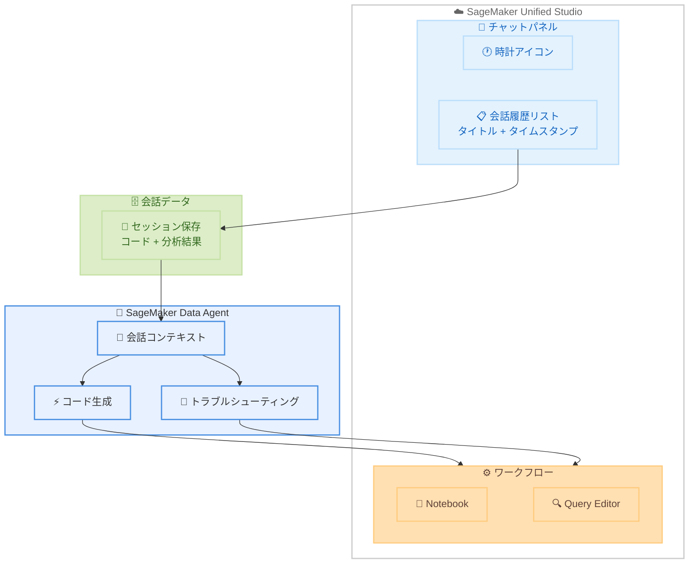

# Amazon SageMaker Data Agent - 会話履歴機能

**リリース日**: 2026 年 6 月 3 日
**サービス**: Amazon SageMaker
**機能**: SageMaker Data Agent 会話履歴 (Conversation History)

📊 [このアップデートのインフォグラフィックを見る](https://takech9203.github.io/aws-news-summary/20260603-amazon-sagemaker-data-agent.html)

## 概要

Amazon SageMaker Data Agent に会話履歴機能が追加された。SageMaker Unified Studio 内で利用可能な Data Agent において、データアナリストやデータサイエンティストが過去の分析セッションの文脈を維持しながら作業を継続できるようになる。これにより、ノートブックや Query Editor のワークフロー内で、以前のエージェント生成コードの参照、マルチステップ分析の再開、過去のトラブルシューティングの確認が可能になった。

チャットパネルヘッダーの時計アイコンから過去の会話一覧にアクセスでき、各会話には自動生成されたタイトルとタイムスタンプが付与される。データチームはコンテキストの再構築に費やしていた時間を削減し、インサイトの発見に集中できるようになる。

**アップデート前の課題**

- 分析セッションを閉じると過去の会話コンテキストが失われ、再度同じ質問やコード生成をやり直す必要があった
- マルチステップの分析作業を中断した場合、どこまで進めたかを手動で確認する必要があった
- エージェントが生成したコードを後から参照する手段がなく、再利用が困難だった
- 複数プロジェクトを並行して進める場合、各プロジェクトのコンテキスト管理が煩雑だった

**アップデート後の改善**

- 過去の会話をスクロール可能なリストとして参照し、中断した分析を即座に再開できる
- 自動生成されたタイトルとタイムスタンプにより、目的の会話を容易に特定できる
- エージェント生成コードを過去のセッションから直接再利用可能になった
- 複数プロジェクト間での切り替えが容易になり、コンテキスト再構築の時間を削減できる

## アーキテクチャ図

SageMaker Data Agent の会話履歴機能により、過去のセッションデータが保存され、チャットパネルの時計アイコンから会話一覧にアクセスして分析を再開できる。

## サービスアップデートの詳細

### 主要機能

1. **会話履歴のアクセス**
   - チャットパネルヘッダーの時計アイコンから過去の会話一覧を表示
   - スクロール可能なリストで全ての過去の会話にアクセス可能
   - 直感的な UI により素早く目的の会話を見つけられる

2. **自動タイトルとタイムスタンプ**
   - 各会話に自動生成されたタイトルが付与される
   - タイムスタンプにより時系列での会話管理が可能
   - 複数の分析プロジェクトを容易に識別できる

3. **コンテキスト保持と再開**
   - マルチステップ分析の途中経過が保存される
   - エージェント生成コードの再利用が可能
   - トラブルシューティングの履歴を参照して問題解決を継続できる

## 技術仕様

### 会話履歴の機能詳細

| 項目 | 詳細 |
|------|------|
| アクセス方法 | チャットパネルヘッダーの時計アイコン |
| 表示形式 | スクロール可能な会話リスト |
| 会話識別 | 自動生成タイトル + タイムスタンプ |
| 対応ワークフロー | Notebook、Query Editor |
| 保持データ | コード、分析結果、トラブルシューティング履歴 |
| 追加設定 | 不要 (Data Agent が有効な環境で自動的に利用可能) |

### 対応環境

| 環境 | サポート状況 |
|------|------|
| SageMaker Unified Studio Notebook | 対応 |
| SageMaker Unified Studio Query Editor | 対応 |
| IAM Identity Center ドメイン | 対応 |

## 設定方法

### 前提条件

1. SageMaker Unified Studio ドメインが構成済みであること
2. SageMaker Data Agent が有効化されていること
3. 適切な IAM 権限が付与されていること

### 手順

#### ステップ 1: 会話履歴へのアクセス

SageMaker Unified Studio のノートブックまたは Query Editor を開き、チャットパネルヘッダーにある時計アイコンをクリックする。過去の会話がリスト形式で表示される。

#### ステップ 2: 過去の会話の再開

表示された会話リストから再開したいセッションを選択する。自動生成されたタイトルとタイムスタンプを手がかりに目的の会話を特定する。

#### ステップ 3: 分析の継続

選択した会話のコンテキストが復元され、以前のエージェント生成コードや分析結果を参照しながら作業を継続できる。

## メリット

### ビジネス面

- **生産性向上**: コンテキストの再構築に費やす時間を削減し、データチームの分析速度が向上する
- **作業の重複排除**: 過去に生成したコードや分析結果を再利用することで、重複作業を排除できる
- **並行プロジェクト管理**: 複数のプロジェクトを効率的に切り替えながら進行できる

### 技術面

- **コード再利用性**: エージェントが生成した Python / SQL コードを過去のセッションから直接再利用可能
- **デバッグ効率化**: 過去のトラブルシューティング履歴を参照して、類似問題の解決を迅速化
- **分析の一貫性**: マルチステップ分析のコンテキストが保持され、段階的な分析の一貫性を維持

## デメリット・制約事項

### 制限事項

- Data Agent が利用可能なリージョンでのみ機能する
- SageMaker Unified Studio 環境内でのみ利用可能 (スタンドアロンの SageMaker Studio Classic では利用不可)
- 会話履歴の保持期間に関する詳細な仕様は公式ドキュメントで確認が必要

### 考慮すべき点

- 機密性の高い分析内容が会話履歴に保存されるため、アクセス権限の管理が重要
- チーム間で会話履歴を共有する機能の有無については公式ドキュメントを参照

## ユースケース

### ユースケース 1: 複数日にまたがるデータ分析

**シナリオ**: データサイエンティストが大規模なデータセットの探索的分析を複数日にわたって実施する場合。初日にデータ品質チェックを行い、翌日にクレンジング、その後に特徴量エンジニアリングと段階的に進める。

**効果**: 各日の作業開始時に前回のコンテキストを自動的に復元でき、分析の連続性が保たれる。Data Agent に「昨日の分析を続けて」と指示するだけで、前回の状態から再開可能。

### ユースケース 2: 並行プロジェクトのコンテキスト切り替え

**シナリオ**: データアナリストが売上分析、顧客セグメンテーション、在庫最適化の 3 つのプロジェクトを並行して担当している。各プロジェクトで異なるデータソースとクエリパターンを使用する。

**効果**: 会話履歴のタイトルとタイムスタンプにより、各プロジェクトのセッションを即座に識別して切り替えられる。プロジェクトごとのコンテキスト再構築が不要になる。

### ユースケース 3: トラブルシューティングの継続

**シナリオ**: ノートブックで実行したクエリがパフォーマンス問題を起こし、Data Agent と共にデバッグを進めていたが、別の緊急タスクで中断する必要が生じた。

**効果**: 会話履歴から過去のトラブルシューティングセッションを再開し、既に試した解決策や特定した原因を確認しながら、デバッグ作業を効率的に継続できる。

## 料金

SageMaker Data Agent の会話履歴機能については、追加料金に関する情報は公式発表時点では明示されていない。SageMaker Unified Studio および Data Agent の既存の料金体系に含まれるものと考えられるが、詳細は公式料金ページを確認することを推奨する。

## 利用可能リージョン

Amazon SageMaker Data Agent が現在利用可能な全ての AWS リージョンで提供される。サポートされるリージョンの最新情報は [SageMaker Unified Studio サポートリージョンページ](https://docs.aws.amazon.com/sagemaker-unified-studio/latest/adminguide/supported-regions.html) を参照。

## 関連サービス・機能

- **Amazon SageMaker Unified Studio**: Data Agent が統合されているデータ分析・ML 統合環境
- **Amazon SageMaker Notebook**: Data Agent による会話履歴がサポートされる分析環境
- **Amazon Athena / Amazon Redshift**: Data Agent がコード生成する際の対象データソース
- **AWS Glue Data Catalog**: Data Agent がスキーマ情報を取得するデータカタログサービス

## 参考リンク

- 📊 [インフォグラフィック](https://takech9203.github.io/aws-news-summary/20260603-amazon-sagemaker-data-agent.html)
- [公式発表 (What's New)](https://aws.amazon.com/about-aws/whats-new/2026/06/amazon-sagemaker-data-agent/)
- [SageMaker Data Agent ドキュメント](https://docs.aws.amazon.com/sagemaker-unified-studio/latest/userguide/sagemaker-data-agent.html)
- [SageMaker Unified Studio サポートリージョン](https://docs.aws.amazon.com/sagemaker-unified-studio/latest/adminguide/supported-regions.html)
- [Amazon SageMaker 製品ページ](https://aws.amazon.com/sagemaker/)

## まとめ

Amazon SageMaker Data Agent の会話履歴機能は、データ分析ワークフローにおける継続性と効率性を大幅に向上させるアップデートである。特に複数プロジェクトを並行して進めるデータチームや、マルチステップの分析を日常的に行うデータサイエンティストにとって、コンテキスト再構築のオーバーヘッドを排除し、インサイト発見に集中できる環境を提供する。SageMaker Unified Studio を利用中のチームは、追加設定なしでこの機能を即座に活用することを推奨する。
