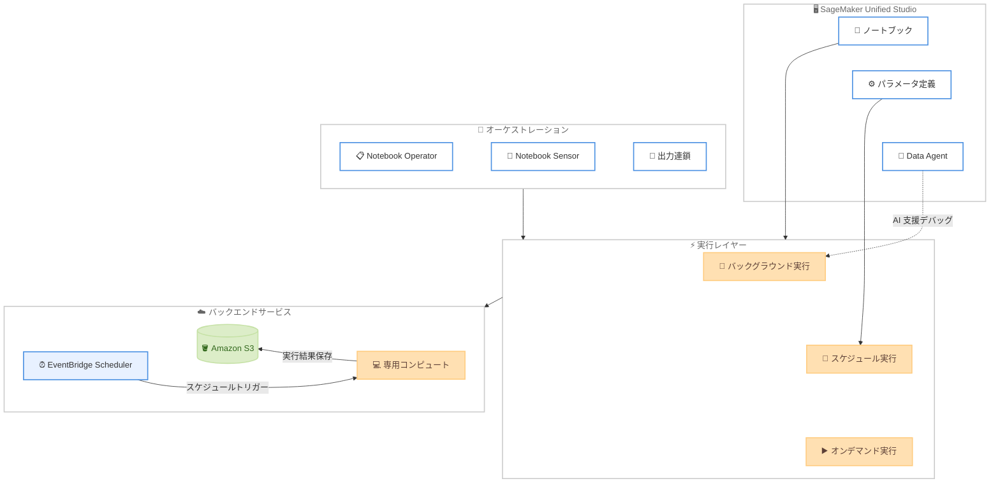

# Amazon SageMaker Unified Studio - ノートブックスケジューリング機能

**リリース日**: 2026 年 6 月 3 日
**サービス**: Amazon SageMaker Unified Studio
**機能**: ノートブックのスケジューリング、パラメータ化、マルチノートブックオーケストレーション

📊 [このアップデートのインフォグラフィックを見る](https://takech9203.github.io/aws-news-summary/20260603-amazon-sagemaker-unified-studio.html)

## 概要

Amazon SageMaker Unified Studio に、ノートブックのスケジューリング、パラメータ化、およびマルチノートブックオーケストレーション機能が追加された。外部のオーケストレーション基盤を管理することなく、ノートブックインターフェースから直接これらの操作を実行できるようになる。

この機能により、データサイエンティストやアナリストは、実験段階のノートブックを本番環境のワークロードとして運用することが容易になる。日次レポート生成、データ品質チェック、モデル再学習といった定期的なタスクを自動化し、インタラクティブセッションを中断することなくバックグラウンドで実行できる。

さらに、実行失敗時には SageMaker Data Agent による AI 支援トラブルシューティングが利用でき、根本原因の特定と修正提案をノートブック内で直接受け取ることが可能である。

**アップデート前の課題**

- ノートブックの定期実行には外部のオーケストレーション基盤 (Step Functions、Airflow など) の構築・管理が必要だった
- 同じノートブックを異なるパラメータで実行するには、複数のコピーを作成するか独自のパラメータ管理機構が必要だった
- 複数ノートブック間のデータ受け渡しには手動での連携やカスタムスクリプトが必要だった
- バックグラウンド実行ができず、長時間の処理中はインタラクティブセッションがブロックされていた
- 実行失敗時の原因特定にはログを手動で確認する必要があった

**アップデート後の改善**

- ノートブック UI から直接スケジュール設定、オンデマンド実行、パラメータ化が可能になった
- 専用コンピュートでのバックグラウンド実行により、インタラクティブ作業を中断せずに処理を実行できる
- Notebook Operator を使用したマルチノートブックワークフローで、複数ノートブックの出力を連鎖的に次のノートブックへ引き渡せる
- SageMaker Data Agent による AI 支援デバッグで、失敗原因の特定と修正が迅速になった
- 自然言語でスケジュール作成やノートブック実行を指示できるようになった

## アーキテクチャ図



SageMaker Unified Studio のノートブックから、バックグラウンド実行やスケジュール実行を専用コンピュート上でトリガーし、Amazon EventBridge Scheduler と Amazon S3 を基盤として動作するアーキテクチャを示す。

## サービスアップデートの詳細

### 主要機能

1. **オンデマンドバックグラウンド実行**
   - ノートブックヘッダーの「Run all」メニューから「Run in background」を選択して実行
   - 現在のノートブック状態のスナップショットを取得し、専用コンピュート上で実行
   - インタラクティブセッションとは独立した環境で処理を実行
   - 実行結果は Output、Parameters、Logs の各タブで確認可能

2. **定期スケジュール実行**
   - ノートブックヘッダーのスケジュールアイコンからスケジュールを作成
   - Recurring (定期) または One-time (単発) のスケジュールタイプを選択可能
   - 頻度はレートベース (毎日、毎時間など) または cron 式で指定
   - タイムゾーン、開始/終了日、フレキシブルタイムウィンドウ、タイムアウト (デフォルト 60 分) を設定可能
   - バックエンドは Amazon EventBridge Scheduler で実装

3. **ノートブックパラメータ化**
   - Parameters アクティビティパネルからパラメータを定義
   - `sagemaker_studio.nbutils.parameters.get()` でパラメータ値を取得
   - 同一ノートブックに対して異なるパラメータ値で複数のスケジュールを作成可能
   - 「Run with settings」でオンデマンド実行時にもパラメータ値をオーバーライド可能

4. **マルチノートブックワークフローオーケストレーション**
   - Notebook Operator: ノートブックをワークフロータスクとして Workflows ツールに追加
   - Notebook Sensor: 上流ノートブックの実行完了を監視 (Jinja テンプレートで run ID を参照)
   - 出力連鎖: Variables パネルで変数を出力としてマークし、下流 Operator のパラメータとして利用
   - 再帰的に任意の数の Operator タスクを連鎖可能

5. **AI 支援トラブルシューティング**
   - 実行失敗時に「Troubleshoot with AI」ボタンを表示
   - SageMaker Data Agent がセル出力を分析し、エラーセルの特定、根本原因の説明、修正提案を実施
   - 自然言語でのスケジュール作成やノートブック実行の指示にも対応

## 技術仕様

### スケジュール設定パラメータ

| 項目 | 詳細 |
|------|------|
| スケジュール名 | 任意の識別名 |
| スケジュールタイプ | Recurring / One-time |
| 頻度 | レートベース / cron 式 |
| タイムゾーン | 任意のタイムゾーンを指定可能 |
| 開始日/終了日 | スケジュールの有効期間を定義 |
| フレキシブルタイムウィンドウ | スケジュール開始後の実行許容時間 (分) |
| コンピュートインスタンス | 非同期実行用のインスタンスタイプ |
| タイムアウト | 最大実行時間 (デフォルト: 60 分) |

### バックグラウンド実行の制約

| 項目 | 詳細 |
|------|------|
| コンピュート | 実行ごとに専用コンピュートを使用 |
| パッケージ | パッケージマネージャーでインストール済みのパッケージが利用可能。セル内の `!pip install` も動作 |
| ローカルファイル | ローカル環境のファイルにはアクセス不可。プロジェクト S3 または接続済みデータソースを使用する必要あり |
| 起動時間 | コンピュートのプロビジョニングに数分を要する |

### SDK の使用方法

```python
# プロジェクトの S3 ストレージにアクセス
from sagemaker_studio import Project

proj = Project()
s3_root = proj.s3.root
df = pd.read_csv(s3_root + '/ShippingLogs.csv')
```

```python
# パラメータ値の取得
import sagemaker_studio

carrier = sagemaker_studio.nbutils.parameters.get("carrier")
```

## 設定方法

### 前提条件

1. Amazon SageMaker Unified Studio プロジェクトで Notebooks が有効化されていること
2. IAM ベースのドメインセットアップが完了していること
3. 必要な IAM 権限が付与されていること

### 手順

#### ステップ 1: バックグラウンド実行

ノートブックを開き、ヘッダーの「Run all」ボタンのメニューを展開して「Run in background」を選択する。ノートブックの現在の状態がスナップショットとして取得され、専用コンピュート上で実行が開始される。

#### ステップ 2: スケジュールの作成

ノートブックヘッダーのスケジュールアイコンをクリックし、以下を設定する。

- スケジュール名 (例: "Daily Shipping Report")
- スケジュールタイプ (Recurring)
- 頻度 (例: every 1 day)
- タイムゾーン
- 開始日/終了日
- コンピュートインスタンスタイプ
- タイムアウト値

#### ステップ 3: パラメータの定義

Parameters アクティビティパネルを開き「Add」を選択する。パラメータ名とデフォルト値を設定する。

```python
# ノートブック内でパラメータを使用
import sagemaker_studio

carrier = sagemaker_studio.nbutils.parameters.get("carrier")
carrier_data = df[df['Carrier'] == carrier].copy()
```

パラメータを定義後、異なる値で複数のスケジュールを作成することで、同一ノートブックを複数のユースケースに再利用できる。

#### ステップ 4: マルチノートブックワークフローの構築

1. ノートブックヘッダーのオプションメニューから「Add to workflows」を選択
2. Workflows ツールで Notebook Operator タスクが作成される
3. Operator タスクのエッジにある「+」ボタンから Notebook Sensor を追加
4. Variables パネルで出力変数をマークし、下流タスクのパラメータとして接続

## メリット

### ビジネス面

- **運用コスト削減**: 外部オーケストレーション基盤の構築・管理が不要になり、インフラ管理コストを削減
- **生産性向上**: 実験から本番化までの時間を短縮し、データサイエンティストが分析に集中できる
- **レポート自動化**: 日次・週次レポートを自動生成し、手動作業を排除

### 技術面

- **シンプルな運用**: ノートブック UI 内で完結するため、追加のツール習得が不要
- **スケーラブルな実行**: 専用コンピュートでの実行により、インタラクティブセッションへの影響なし
- **柔軟なパラメータ化**: 同一ノートブックを異なる入力で再利用し、コードの重複を排除
- **AI 支援デバッグ**: 実行失敗時の原因特定が迅速化し、MTTR を短縮

## デメリット・制約事項

### 制限事項

- バックグラウンド実行ではローカルファイルにアクセスできない (プロジェクト S3 または接続済みデータソースを使用する必要あり)
- コンピュートのプロビジョニングに数分の起動時間が発生する
- デフォルトタイムアウトは 60 分 (変更可能だが上限あり)
- IAM ベースのドメインセットアップが前提条件

### 考慮すべき点

- 長時間実行ノートブックではタイムアウト設定の適切な調整が必要
- パッケージの依存関係はノートブックのパッケージマネージャーで事前にインストールしておく必要がある
- スケジュール削除後も S3 上の履歴データは手動で削除する必要がある

## ユースケース

### ユースケース 1: 日次配送パフォーマンスレポート

**シナリオ**: 物流アナリストが複数の配送キャリアについて、毎朝配送遅延レポートを自動生成したい。

**実装例**:
```python
import sagemaker_studio
import pandas as pd
import matplotlib.pyplot as plt
from sagemaker_studio import Project

carrier = sagemaker_studio.nbutils.parameters.get("carrier")
proj = Project()
df = pd.read_csv(proj.s3.root + '/ShippingLogs.csv')

carrier_data = df[df['Carrier'] == carrier].copy()
carrier_data['is_late'] = carrier_data['ActualShippingDays'] > carrier_data['ExpectedShippingDays']
late_pct = carrier_data['is_late'].mean() * 100

plt.figure(figsize=(12, 4))
plt.hist(carrier_data['ActualShippingDays'] - carrier_data['ExpectedShippingDays'],
         bins=20, edgecolor='black')
plt.axvline(x=0, color='red', linestyle='--', label='On time')
plt.title(f'Shipping Delay Distribution - {carrier} ({late_pct:.1f}% late)')
plt.show()
```

**効果**: キャリアごとに個別のスケジュールを作成し、毎朝自動でレポートを生成。手動作業が不要になり、配送品質の監視が継続的に実施される。

### ユースケース 2: データ品質チェックパイプライン

**シナリオ**: データエンジニアが本番データの品質チェックを定期的に実行し、異常検知時にアラートを発生させたい。

**実装例**:
```python
import sagemaker_studio
from sagemaker_studio import Project

proj = Project()
df = pd.read_csv(proj.s3.root + '/daily_data.csv')

# 品質チェック
null_ratio = df.isnull().sum() / len(df)
duplicates = df.duplicated().sum()
schema_violations = validate_schema(df)

quality_score = calculate_quality_score(null_ratio, duplicates, schema_violations)
# 出力変数として品質スコアを設定 (下流ワークフローで利用)
```

**効果**: 毎日のデータ品質チェックを自動化し、品質スコアを下流のワークフローに渡すことで、品質基準を満たさないデータのパイプラインを自動停止できる。

### ユースケース 3: モデル再学習ワークフロー

**シナリオ**: ML エンジニアが定期的にモデルのパフォーマンスを評価し、精度が閾値を下回った場合に再学習を実行したい。

**実装例**:
```python
# ノートブック 1: モデル評価 (出力: retrain_needed)
from sagemaker_studio import Project
import sagemaker_studio

proj = Project()
model = load_model(proj.s3.root + '/models/latest/')
test_data = pd.read_csv(proj.s3.root + '/test_data.csv')

accuracy = evaluate_model(model, test_data)
retrain_needed = "true" if accuracy < 0.85 else "false"

# ノートブック 2: 再学習 (パラメータ: retrain_needed)
retrain_flag = sagemaker_studio.nbutils.parameters.get("retrain_needed")
if retrain_flag == "true":
    train_data = pd.read_csv(proj.s3.root + '/train_data.csv')
    new_model = train_model(train_data)
    save_model(new_model, proj.s3.root + '/models/latest/')
```

**効果**: Notebook Operator で 2 つのノートブックを連鎖させ、評価結果に基づいて再学習を制御。週次スケジュールでモデル品質を維持しつつ、不要な再学習コストを回避。

## 料金

ノートブックスケジューリング機能自体に追加料金は発生しない。以下のリソース使用に対して課金される。

### 料金要素

| 項目 | 課金対象 |
|------|----------|
| コンピュートインスタンス | バックグラウンド/スケジュール実行時の専用コンピュート使用時間 |
| Amazon S3 | 実行結果の保存ストレージ |
| Amazon EventBridge Scheduler | スケジュール呼び出し回数 |

## 利用可能リージョン

Amazon SageMaker Unified Studio がサポートされているすべての AWS リージョンで利用可能。

- US East (N. Virginia) - us-east-1
- US East (Ohio) - us-east-2
- US West (Oregon) - us-west-2
- Asia Pacific (Tokyo) - ap-northeast-1
- Asia Pacific (Seoul) - ap-northeast-2
- Asia Pacific (Singapore) - ap-southeast-1
- Asia Pacific (Sydney) - ap-southeast-2
- Asia Pacific (Mumbai) - ap-south-1
- Canada (Central) - ca-central-1
- Europe (Ireland) - eu-west-1
- Europe (London) - eu-west-2
- Europe (Paris) - eu-west-3
- Europe (Frankfurt) - eu-central-1
- Europe (Stockholm) - eu-north-1
- South America (Sao Paulo) - sa-east-1

## 関連サービス・機能

- **Amazon EventBridge Scheduler**: スケジュール実行のバックエンドとして使用される
- **Amazon S3**: プロジェクト共有ストレージおよび実行結果の保存に使用
- **SageMaker Data Agent**: AI 支援トラブルシューティングと自然言語インタラクションを提供
- **SageMaker Unified Studio Workflows**: マルチノートブックオーケストレーションの基盤

## 参考リンク

- 📊 [インフォグラフィック](https://takech9203.github.io/aws-news-summary/20260603-amazon-sagemaker-unified-studio.html)
- [公式発表 (What's New)](https://aws.amazon.com/about-aws/whats-new/2026/06/amazon-sagemaker-unified-studio/)
- [AWS Blog: Schedule notebook runs in Amazon SageMaker Unified Studio](https://aws.amazon.com/blogs/big-data/schedule-notebook-runs-in-amazon-sagemaker-unified-studio/)
- [ユーザーガイド: ノートブックスケジュール実行](https://docs.aws.amazon.com/sagemaker-unified-studio/latest/userguide/notebooks-schedule-runs.html)
- [サポートされるリージョン](https://docs.aws.amazon.com/sagemaker-unified-studio/latest/adminguide/supported-regions.html)

## まとめ

Amazon SageMaker Unified Studio のノートブックスケジューリング機能は、データサイエンティストやアナリストがノートブックを実験から本番ワークロードへシームレスに移行することを可能にする重要なアップデートである。外部オーケストレーション基盤の管理が不要になり、パラメータ化による再利用性の向上、マルチノートブックワークフローによる複雑なパイプラインの構築、AI 支援デバッグによる運用負荷の軽減が実現される。定期的なレポート生成、データ品質チェック、モデル再学習などの反復ワークロードを持つチームは、即座にこの機能を活用することを推奨する。
