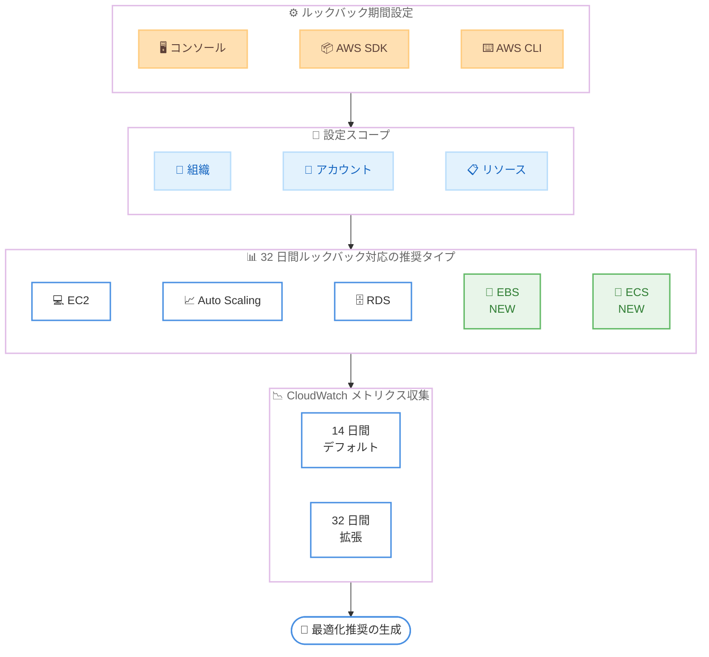

# AWS Compute Optimizer - EBS ボリュームと ECS サービスの 32 日間ルックバック期間サポート

**リリース日**: 2026 年 6 月 3 日
**サービス**: AWS Compute Optimizer
**機能**: EBS ボリュームおよび ECS サービスのライトサイジング推奨における 32 日間ルックバック期間

📊 [このアップデートのインフォグラフィックを見る](https://takech9203.github.io/aws-news-summary/20260603-aws-compute-optimizer-ebs-ecs-32-day-lookback.html)

## 概要

AWS Compute Optimizer が、Amazon EBS ボリュームおよび Amazon ECS サービスのライトサイジング推奨において、ルックバック期間をデフォルトの 14 日間から 32 日間に延長する機能をサポートした。この拡張は追加コストなしで利用できる。

ルックバック期間を 32 日間に延長することで、月末処理などの月次利用パターンを考慮したライトサイジング推奨が生成されるようになる。これにより、ワークロードに対してより適切な最適化判断が可能となり、コストとパフォーマンスの両面で優れた成果を得ることができる。

今回のアップデートにより、AWS Compute Optimizer が 32 日間ルックバックをサポートする推奨タイプは 5 種類 (EC2 インスタンス、EC2 Auto Scaling グループ、RDS データベース、EBS ボリューム、ECS サービス) すべてに拡大された。

**アップデート前の課題**

- EBS ボリュームと ECS サービスの推奨は最大 14 日間の利用データに基づいており、月次パターンを捉えられなかった
- 月末のバッチ処理やレポート生成など、月 1 回のピーク利用が推奨に反映されず、過小なリソース推奨が生成される可能性があった
- EC2 や RDS では 32 日間ルックバックが利用可能だったが、EBS と ECS では同等の分析期間を設定できなかった

**アップデート後の改善**

- EBS ボリュームと ECS サービスでも 32 日間のルックバック期間を設定可能になった
- 月次の利用パターン (月末処理、定期バッチなど) を考慮した、より精度の高い推奨が得られるようになった
- 5 種類すべての推奨タイプで統一的にルックバック期間を管理できるようになった

## アーキテクチャ図



AWS Compute Optimizer のルックバック期間設定の全体像を示す。コンソール、SDK、CLI から組織・アカウント・リソースレベルで設定でき、今回新たに EBS と ECS が 32 日間ルックバックに対応した。

## サービスアップデートの詳細

### 主要機能

1. **EBS ボリュームの 32 日間ルックバック**
   - EBS ボリュームのライトサイジング推奨でデフォルト 14 日間から 32 日間に延長可能
   - ボリュームタイプ、サイズ、IOPS、スループットの最適化推奨がより正確に
   - 月次バッチ処理による一時的な I/O スパイクを考慮した推奨を生成

2. **ECS サービスの 32 日間ルックバック**
   - ECS サービスの CPU およびメモリのライトサイジング推奨で 32 日間の分析期間を利用可能
   - Fargate および EC2 起動タイプの両方に対応
   - コンテナレベルの推奨にも 32 日間のメトリクスが反映

3. **柔軟な設定スコープ**
   - 組織レベル: AWS Organizations 全体に一括適用
   - アカウントレベル: 個別アカウントごとに設定
   - リソースレベル: 特定の EBS ボリュームや ECS サービスに個別設定

## 技術仕様

### ルックバック期間の設定オプション

| 項目 | 詳細 |
|------|------|
| デフォルト期間 | 14 日間 |
| 拡張期間 | 32 日間 |
| 設定スコープ | 組織、アカウント、リソースレベル |
| 設定方法 | コンソール、AWS SDK、AWS CLI |
| 追加料金 | なし |

### 32 日間ルックバック対応の推奨タイプ一覧

| 推奨タイプ | 32 日間サポート | 備考 |
|-----------|:-:|------|
| EC2 インスタンス | 対応済 | 既存機能 |
| EC2 Auto Scaling グループ | 対応済 | 既存機能 |
| RDS データベース | 対応済 | 既存機能 |
| EBS ボリューム | 対応済 | 今回追加 |
| ECS サービス | 対応済 | 今回追加 |

### API 変更履歴

| 日付 | サービス | 変更内容 |
|------|----------|----------|
| 2026/06/03 | [compute-optimizer](https://awsapichanges.com/archive/changes/d1b776-compute-optimizer.html) | 4 updated api methods - EBS/ECS のルックバック期間拡張対応 |

### 更新された API メソッド

| メソッド名 | 変更内容 |
|-----------|----------|
| `GetEBSVolumeRecommendations` | `effectiveRecommendationPreferences.lookBackPeriod` に `DAYS_32` が追加 |
| `GetECSServiceRecommendations` | `effectiveRecommendationPreferences.lookBackPeriod` に `DAYS_32` が追加 |
| `ExportEBSVolumeRecommendations` | `fieldsToExport` に `EffectiveRecommendationPreferencesLookBackPeriod` が追加 |
| `ExportECSServiceRecommendations` | `fieldsToExport` に `EffectiveRecommendationPreferencesLookBackPeriod` が追加 |

### lookBackPeriod の値

```json
{
  "effectiveRecommendationPreferences": {
    "lookBackPeriod": "DAYS_14 | DAYS_32 | DAYS_93"
  }
}
```

## 設定方法

### 前提条件

1. AWS Compute Optimizer がアカウントまたは組織でオプトインされていること
2. 対象リソース (EBS ボリュームまたは ECS サービス) が存在し、メトリクスが収集されていること
3. 設定変更に必要な IAM 権限があること

### 手順

#### ステップ 1: AWS CLI でルックバック期間を設定

```bash
# アカウントレベルで EBS ボリュームの推奨に 32 日間ルックバックを設定
aws compute-optimizer put-recommendation-preferences \
  --resource-type EbsVolume \
  --look-back-period DAYS_32
```

アカウント内のすべての EBS ボリュームに対する推奨のルックバック期間を 32 日間に設定する。

#### ステップ 2: ECS サービスのルックバック期間を設定

```bash
# アカウントレベルで ECS サービスの推奨に 32 日間ルックバックを設定
aws compute-optimizer put-recommendation-preferences \
  --resource-type EcsService \
  --look-back-period DAYS_32
```

アカウント内のすべての ECS サービスに対する推奨のルックバック期間を 32 日間に設定する。

#### ステップ 3: 設定の確認

```bash
# 現在の推奨プリファレンスを確認
aws compute-optimizer get-recommendation-preferences \
  --resource-type EbsVolume
```

設定が正しく適用されたことを確認する。`lookBackPeriod` が `DAYS_32` になっていれば設定完了。

## メリット

### ビジネス面

- **コスト最適化の精度向上**: 月次パターンを考慮することで、過剰な削減推奨を避け、適切なリソースサイズを維持できる
- **追加コストなし**: この機能拡張は無料で利用でき、既存の Compute Optimizer の利用に追加料金は発生しない
- **統一的な最適化管理**: 5 種類すべての推奨タイプで同じルックバック期間を設定でき、組織全体で一貫した最適化戦略を実行できる

### 技術面

- **月次ワークロードパターンの反映**: 月末バッチ、レポート生成、請求処理などの月 1 回のピークが推奨に正しく反映される
- **柔軟なスコープ設定**: 組織全体からリソース単位まで細かく設定でき、ワークロード特性に応じた最適化が可能
- **API 統合の容易さ**: 既存の API に lookBackPeriod パラメータが追加されただけなので、既存の自動化スクリプトへの影響が最小限

## デメリット・制約事項

### 制限事項

- AWS GovCloud (US) リージョンおよび中国リージョンでは利用不可
- ルックバック期間を 32 日間に設定しても、メトリクス収集開始から 32 日分のデータが蓄積されるまでは精度が限定的
- 93 日間のルックバック期間は引き続き Enhanced Infrastructure Metrics (有料) が必要

### 考慮すべき点

- ルックバック期間を延長すると、推奨が生成されるまでの初期待機期間が長くなる可能性がある
- 月次パターンがないワークロードでは、14 日間のデフォルトで十分な場合もある
- 組織レベルで設定すると全アカウントに適用されるため、特定アカウントで異なる設定が必要な場合はリソースレベルでオーバーライドが必要

## ユースケース

### ユースケース 1: 月末バッチ処理を行う EBS ボリュームの最適化

**シナリオ**: 経理部門の月末処理で毎月 25 日から月末にかけて大量の I/O が発生するデータベース用 EBS ボリューム。14 日間のルックバックでは月末ピークが含まれないタイミングで縮小推奨が出てしまう。

**実装例**:
```bash
# 月末バッチ処理用 EBS ボリュームに 32 日間ルックバックを設定
aws compute-optimizer put-recommendation-preferences \
  --resource-type EbsVolume \
  --look-back-period DAYS_32
```

**効果**: 月末の I/O スパイクを含む 32 日間のメトリクスに基づいて推奨が生成されるため、不適切なダウンサイジング推奨を回避できる。

### ユースケース 2: ECS で稼働する月次レポート生成サービス

**シナリオ**: 月初にクライアント向けレポートを生成する ECS サービス。月初の 3-5 日間は CPU/メモリ使用率が高いが、それ以外は低い利用率。14 日間ルックバックではレポート生成期間が含まれないことがある。

**実装例**:
```bash
# 月次レポート生成 ECS サービスに 32 日間ルックバックを設定
aws compute-optimizer put-recommendation-preferences \
  --resource-type EcsService \
  --look-back-period DAYS_32
```

**効果**: 月初のピーク利用を含めた推奨が生成され、レポート生成時のパフォーマンス低下を防止しつつ、通常時のコスト最適化も実現。

### ユースケース 3: 組織全体での統一的なルックバック期間管理

**シナリオ**: マルチアカウント環境で運用している企業が、全アカウントの EBS および ECS リソースに対して一貫した 32 日間ルックバックを適用したい。

**実装例**:
```bash
# 組織レベルで EBS の 32 日間ルックバックを設定
aws compute-optimizer put-recommendation-preferences \
  --resource-type EbsVolume \
  --scope "Name=Organization,Value=r-xxxx" \
  --look-back-period DAYS_32

# 組織レベルで ECS の 32 日間ルックバックを設定
aws compute-optimizer put-recommendation-preferences \
  --resource-type EcsService \
  --scope "Name=Organization,Value=r-xxxx" \
  --look-back-period DAYS_32
```

**効果**: 組織全体で月次パターンを考慮した最適化推奨を一括で有効化し、各チームが個別に設定する手間を削減。

## 料金

AWS Compute Optimizer の 32 日間ルックバック機能は追加料金なしで利用可能。

| 項目 | 料金 |
|------|------|
| 14 日間ルックバック (デフォルト) | 無料 |
| 32 日間ルックバック | 無料 |
| 93 日間ルックバック (Enhanced Infrastructure Metrics) | 有料 |

注: 93 日間のルックバック期間を利用するには Enhanced Infrastructure Metrics のサブスクリプションが必要。

## 利用可能リージョン

AWS Compute Optimizer が利用可能なすべての AWS リージョンで提供。以下のリージョンは除外される。

- AWS GovCloud (US) リージョン
- 中国リージョン (北京、寧夏)

## 関連サービス・機能

- **AWS Cost Optimization Hub**: Compute Optimizer の推奨と統合してコスト最適化の一元管理を提供
- **Amazon CloudWatch**: Compute Optimizer が分析に使用するメトリクスの収集元
- **AWS Organizations**: 組織レベルでのルックバック期間設定に必要
- **Enhanced Infrastructure Metrics**: 93 日間のルックバック期間を提供する有料オプション

## 参考リンク

- 📊 [インフォグラフィック](https://takech9203.github.io/aws-news-summary/20260603-aws-compute-optimizer-ebs-ecs-32-day-lookback.html)
- [公式発表 (What's New)](https://aws.amazon.com/about-aws/whats-new/2026/06/aws-compute-optimizer-ebs-ecs-32-day-lookback/)
- [ドキュメント - Rightsizing Preferences](https://docs.aws.amazon.com/compute-optimizer/latest/ug/rightsizing-preferences.html#rightsizing-preferences-lookback)
- [AWS Compute Optimizer 料金ページ](https://aws.amazon.com/compute-optimizer/pricing/)
- [API 変更履歴](https://awsapichanges.com/archive/changes/d1b776-compute-optimizer.html)

## まとめ

AWS Compute Optimizer の EBS ボリュームおよび ECS サービスにおける 32 日間ルックバック期間のサポートにより、月次利用パターンを持つワークロードのライトサイジング推奨精度が向上する。追加コストなしで利用できるため、月末バッチ処理や月次レポート生成などの定期的なピーク利用があるリソースでは、早期に 32 日間ルックバックを有効化することを推奨する。コンソール、SDK、CLI のいずれからも設定可能であり、組織レベルでの一括適用もできるため、導入の敷居は低い。
