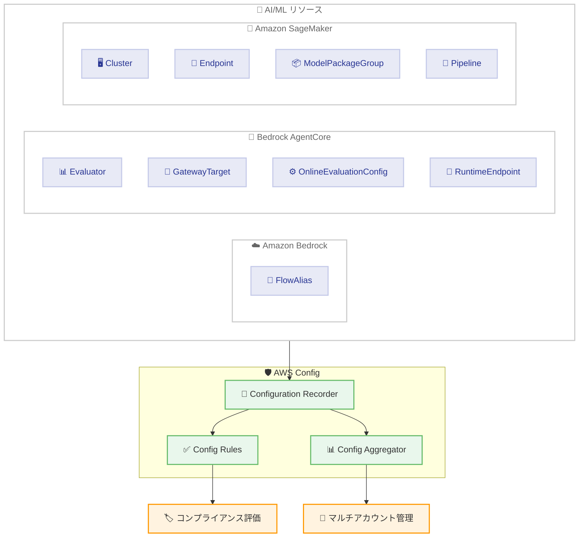

# AWS Config - 9 つの新しいリソースタイプのサポート追加

**リリース日**: 2026年6月3日
**サービス**: AWS Config
**機能**: 9 つの追加リソースタイプのサポート (Amazon Bedrock、Amazon Bedrock AgentCore、Amazon SageMaker)

📊 [このアップデートのインフォグラフィックを見る](https://takech9203.github.io/aws-news-summary/20260603-aws-config-new-resource-types.html)

## 概要

AWS Config が Amazon Bedrock、Amazon Bedrock AgentCore、Amazon SageMaker の 3 つの主要 AI/ML サービスにまたがる 9 つの新しいリソースタイプのサポートを追加しました。この拡張により、生成 AI ワークロードおよび機械学習パイプラインに対する構成管理・コンプライアンス監査のカバレッジが大幅に強化されます。

新しくサポートされたリソースタイプは、Config ルールおよび Config アグリゲーターでも利用可能です。すべてのリソースタイプの記録を有効にしている場合、AWS Config はこれらの新しいリソースタイプを自動的に追跡するため、追加の設定は不要です。

**アップデート前の課題**

- Bedrock AgentCore の Evaluator、GatewayTarget、RuntimeEndpoint などの構成変更を AWS Config で追跡できなかった
- SageMaker Cluster や Pipeline のコンプライアンス状態を Config ルールで評価できなかった
- 生成 AI エージェント基盤のガバナンスを一元管理する仕組みが不足していた

**アップデート後の改善**

- 9 つの AI/ML リソースタイプが AWS Config で自動追跡されるようになった
- Config ルールを使用して、Bedrock AgentCore や SageMaker リソースのコンプライアンスチェックが可能になった
- Config アグリゲーターで複数アカウント・リージョンにまたがる AI/ML リソースを一元管理できるようになった

## アーキテクチャ図



AWS Config が 9 つの新しい AI/ML リソースタイプの構成変更を記録し、Config ルールによるコンプライアンス評価およびアグリゲーターによるマルチアカウント管理を実現する構成図です。

## サービスアップデートの詳細

### 新しくサポートされたリソースタイプ

#### Amazon Bedrock (1 タイプ)

1. **AWS::Bedrock::FlowAlias**
   - Bedrock Flow のエイリアス設定を追跡
   - フローのバージョン管理とルーティングの変更履歴を監査可能
   - 本番環境とテスト環境の切り替え設定を管理

#### Amazon Bedrock AgentCore (4 タイプ)

2. **AWS::BedrockAgentCore::Evaluator**
   - AgentCore の評価プログラムリソースの構成を追跡
   - エージェントの品質評価基準の変更履歴を管理
   - 評価メトリクスやしきい値の設定変更を監査

3. **AWS::BedrockAgentCore::GatewayTarget**
   - ゲートウェイターゲットの設定を追跡
   - エージェントが接続する外部エンドポイントの構成管理
   - ルーティング設定やセキュリティポリシーの変更を監査

4. **AWS::BedrockAgentCore::OnlineEvaluationConfig**
   - オンライン評価設定の構成を追跡
   - リアルタイム評価パラメータの変更履歴を管理
   - 品質モニタリング設定のコンプライアンスを確認

5. **AWS::BedrockAgentCore::RuntimeEndpoint**
   - ランタイムエンドポイントの設定を追跡
   - エージェント実行環境のスケーリング設定やセキュリティ構成を監査
   - デプロイメント設定の変更履歴を管理

#### Amazon SageMaker (4 タイプ)

6. **AWS::SageMaker::Cluster**
   - SageMaker HyperPod クラスターの設定を追跡
   - トレーニング用コンピューティングリソースの構成管理
   - インスタンスタイプ、スケーリング設定の変更を監査

7. **AWS::SageMaker::Endpoint**
   - 推論エンドポイントの設定を追跡
   - モデルバリアント構成、オートスケーリングポリシーの管理
   - エンドポイントのセキュリティ設定変更を監査

8. **AWS::SageMaker::ModelPackageGroup**
   - モデルパッケージグループの設定を追跡
   - モデルレジストリ内のグループポリシーと承認設定を管理
   - モデルガバナンスワークフローの変更を監査

9. **AWS::SageMaker::Pipeline**
   - ML パイプラインの設定を追跡
   - パイプライン定義やスケジュール設定の変更履歴を管理
   - CI/CD パイプライン構成のコンプライアンスを確認

## 技術仕様

### サポートされるリソースタイプ一覧

| サービス | リソースタイプ | 主な用途 |
|----------|---------------|----------|
| Amazon Bedrock | AWS::Bedrock::FlowAlias | フローのエイリアス管理 |
| Bedrock AgentCore | AWS::BedrockAgentCore::Evaluator | エージェント品質評価 |
| Bedrock AgentCore | AWS::BedrockAgentCore::GatewayTarget | 外部接続先の管理 |
| Bedrock AgentCore | AWS::BedrockAgentCore::OnlineEvaluationConfig | リアルタイム評価設定 |
| Bedrock AgentCore | AWS::BedrockAgentCore::RuntimeEndpoint | エージェント実行環境 |
| Amazon SageMaker | AWS::SageMaker::Cluster | HyperPod クラスター |
| Amazon SageMaker | AWS::SageMaker::Endpoint | 推論エンドポイント |
| Amazon SageMaker | AWS::SageMaker::ModelPackageGroup | モデルレジストリグループ |
| Amazon SageMaker | AWS::SageMaker::Pipeline | ML パイプライン |

### Config ルールでの活用

新しいリソースタイプは、マネージドルールおよびカスタムルールの両方で評価対象として指定可能です。

```json
{
  "ConfigRuleName": "sagemaker-endpoint-config-check",
  "Source": {
    "Owner": "CUSTOM_LAMBDA",
    "SourceIdentifier": "arn:aws:lambda:us-east-1:123456789012:function:config-rule-sagemaker",
    "SourceDetails": [
      {
        "EventSource": "aws.config",
        "MessageType": "ConfigurationItemChangeNotification"
      }
    ]
  },
  "Scope": {
    "ComplianceResourceTypes": [
      "AWS::SageMaker::Endpoint",
      "AWS::SageMaker::Cluster"
    ]
  }
}
```

## 設定方法

### 前提条件

1. AWS Config が有効化されていること
2. 適切な IAM 権限が設定されていること
3. 対象リソースが存在するリージョンで Config が有効であること

### 手順

#### ステップ 1: 記録設定の確認

```bash
# 現在の記録設定を確認
aws configservice describe-configuration-recorders
```

すべてのリソースタイプの記録が有効 (`allSupported: true`) になっている場合、新しいリソースタイプは自動的に記録されます。

#### ステップ 2: 特定リソースタイプのみ記録している場合

```bash
# 新しいリソースタイプを記録対象に追加
aws configservice put-configuration-recorder \
  --configuration-recorder name=default,roleARN=arn:aws:iam::123456789012:role/config-role \
  --recording-group '{
    "allSupported": false,
    "resourceTypes": [
      "AWS::Bedrock::FlowAlias",
      "AWS::BedrockAgentCore::Evaluator",
      "AWS::BedrockAgentCore::GatewayTarget",
      "AWS::BedrockAgentCore::OnlineEvaluationConfig",
      "AWS::BedrockAgentCore::RuntimeEndpoint",
      "AWS::SageMaker::Cluster",
      "AWS::SageMaker::Endpoint",
      "AWS::SageMaker::ModelPackageGroup",
      "AWS::SageMaker::Pipeline"
    ]
  }'
```

記録対象を個別に指定している場合は、新しいリソースタイプを明示的に追加する必要があります。

#### ステップ 3: Config アグリゲーターの確認

```bash
# アグリゲーターの設定を確認
aws configservice describe-configuration-aggregators
```

Config アグリゲーターを使用している場合、新しいリソースタイプは自動的に集約対象に含まれます。追加の設定は不要です。

## メリット

### ビジネス面

- **AI/ML ガバナンスの強化**: 生成 AI およびML ワークロードのコンプライアンス管理が自動化され、監査対応コストが削減される
- **リスク管理の向上**: エージェント基盤の構成変更を追跡することで、意図しない変更による障害リスクを早期に検知可能
- **規制対応の効率化**: 金融・ヘルスケアなどの規制業界で、AI/ML リソースの構成管理が求められる要件に対応しやすくなる

### 技術面

- **自動追跡**: allSupported 設定の場合、追加設定不要で新リソースタイプが自動的に記録される
- **統合的な可視性**: Config アグリゲーターにより、マルチアカウント・マルチリージョンの AI/ML リソースを一元管理可能
- **ポリシー適用**: Config ルールを使用して、AI/ML リソースの設定がセキュリティポリシーに準拠しているか自動チェック可能

## デメリット・制約事項

### 制限事項

- リソースが利用可能なリージョンでのみ Config 記録が有効
- Config の記録には追加のストレージコスト (S3 バケット) が発生する
- カスタムルールの作成には Lambda 関数の実装が必要

### 考慮すべき点

- 記録対象リソースの増加に伴い、Configuration Item の数が増加し Config 料金が上がる可能性がある
- 大規模環境では、新しいリソースタイプの追加により Config の評価実行時間が延びる場合がある
- Bedrock AgentCore は比較的新しいサービスであるため、マネージドルールの提供が限定的な可能性がある

## ユースケース

### ユースケース 1: 生成 AI エージェントのガバナンス

**シナリオ**: 企業が Bedrock AgentCore を使用して複数の AI エージェントを運用しており、RuntimeEndpoint や GatewayTarget の構成変更を監査する必要がある。

**実装例**:
```json
{
  "ConfigRuleName": "agentcore-runtime-endpoint-check",
  "Scope": {
    "ComplianceResourceTypes": [
      "AWS::BedrockAgentCore::RuntimeEndpoint",
      "AWS::BedrockAgentCore::GatewayTarget"
    ]
  }
}
```

**効果**: エージェントのランタイム環境や接続先の変更を自動検知し、承認されていない構成変更を即座に特定可能。

### ユースケース 2: ML モデルライフサイクルのコンプライアンス管理

**シナリオ**: データサイエンスチームが SageMaker Pipeline でモデルをトレーニングし、ModelPackageGroup で管理している。モデルの承認フローと本番デプロイのコンプライアンスを確認したい。

**実装例**:
```json
{
  "ConfigRuleName": "sagemaker-model-governance",
  "Scope": {
    "ComplianceResourceTypes": [
      "AWS::SageMaker::ModelPackageGroup",
      "AWS::SageMaker::Pipeline",
      "AWS::SageMaker::Endpoint"
    ]
  }
}
```

**効果**: モデルの登録、パイプライン実行、エンドポイントへのデプロイまでの一連の構成変更を追跡し、ガバナンス要件への準拠を証明可能。

### ユースケース 3: AI 品質モニタリングの設定管理

**シナリオ**: AI エージェントの品質を継続的に評価するために Bedrock AgentCore の Evaluator と OnlineEvaluationConfig を使用しており、評価基準の変更が適切に管理されていることを確認したい。

**実装例**:
```json
{
  "ConfigRuleName": "evaluation-config-compliance",
  "Scope": {
    "ComplianceResourceTypes": [
      "AWS::BedrockAgentCore::Evaluator",
      "AWS::BedrockAgentCore::OnlineEvaluationConfig"
    ]
  }
}
```

**効果**: 評価設定の変更履歴を完全に追跡し、品質基準が意図せず変更されていないことを保証。

## 料金

AWS Config の料金は既存の料金体系に準じます。

### 料金例

| 項目 | 料金 |
|------|------|
| Configuration Item の記録 | $0.003 / Configuration Item |
| Config ルール評価 | $0.001 / 評価 |
| コンフォーマンスパック | $0.001 / 評価 (パック内) |

新しいリソースタイプの追加により、記録される Configuration Item の数が増加するため、リソース数に応じたコスト増加を考慮する必要があります。

## 利用可能リージョン

対象リソースが利用可能なすべての AWS リージョンで利用可能です。具体的な対応リージョンは、各リソースタイプ (Amazon Bedrock、Bedrock AgentCore、Amazon SageMaker) の提供リージョンに依存します。

## 関連サービス・機能

- **AWS Config Rules**: 新しいリソースタイプに対するコンプライアンスルールの評価に使用
- **AWS Config Aggregator**: マルチアカウント・マルチリージョンでの構成データの集約
- **Amazon Bedrock AgentCore**: AI エージェントの構築・運用基盤 (今回の監視対象)
- **Amazon SageMaker**: 機械学習モデルのトレーニング・デプロイ基盤 (今回の監視対象)
- **AWS CloudTrail**: API コールの監査ログ記録 (Config と組み合わせて包括的な監査を実現)

## 参考リンク

- 📊 [インフォグラフィック](https://takech9203.github.io/aws-news-summary/20260603-aws-config-new-resource-types.html)
- [公式発表 (What's New)](https://aws.amazon.com/about-aws/whats-new/2026/05/aws-config-new-resource-types)
- [AWS Config サポートされるリソースタイプ](https://docs.aws.amazon.com/config/latest/developerguide/resource-config-reference.html)
- [AWS Config 料金ページ](https://aws.amazon.com/config/pricing/)
- [AWS Config ドキュメント](https://docs.aws.amazon.com/config/latest/developerguide/)

## まとめ

今回のアップデートにより、AWS Config が AI/ML ワークロードの中核を担う Amazon Bedrock、Bedrock AgentCore、Amazon SageMaker の 9 つのリソースタイプをサポートし、生成 AI 基盤のガバナンスとコンプライアンス管理が大幅に強化されました。特に Bedrock AgentCore のリソースが初めて Config の監視対象となったことで、AI エージェント運用のセキュリティと監査対応が容易になります。allSupported 設定を使用している環境では追加の設定は不要なため、即座にこの恩恵を受けることができます。
