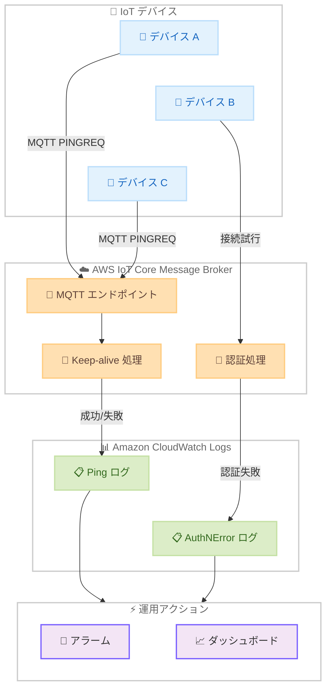

# AWS IoT Core - 接続性と認証のトラブルシューティング用新規ログイベントタイプ

**リリース日**: 2026 年 6 月 3 日
**サービス**: AWS IoT Core
**機能**: Ping ログイベント / Connection.AuthNError ログイベント

📊 [このアップデートのインフォグラフィックを見る](https://takech9203.github.io/aws-news-summary/20260603-aws-iot-core-ping-auth-logs.html)

## 概要

AWS IoT Core に 2 つの新しい Amazon CloudWatch Log イベントタイプが追加された。これにより、IoT フリート全体でデバイスの接続性の問題や認証エラーをより効率的にトラブルシューティングできるようになる。

新しい **Ping** ログイベントタイプは、デバイスが MQTT Keep-alive メッセージを送信した際に発行され、接続を維持できなかったコネクションやデバイスを特定できる。もう 1 つの **Connection.AuthNError** ログイベントタイプは、認証失敗により拒否された接続試行を記録し、何が問題だったかを示す詳細なエラーコードを提供する。

**アップデート前の課題**

- デバイスが MQTT Keep-alive に失敗して切断された場合、切断イベントしか記録されず、Keep-alive の処理状況を直接把握できなかった
- 認証エラーで接続が拒否された場合、詳細なエラー理由を確認する手段が限られていた
- 大規模 IoT フリートにおいて、接続維持の問題や証明書関連の問題を迅速に特定・解決することが困難だった

**アップデート後の改善**

- Ping ログにより MQTT Keep-alive の成功・失敗をリアルタイムで監視でき、接続維持に問題があるデバイスを即座に特定可能になった
- Connection.AuthNError ログにより、認証失敗の原因を 13 種類の詳細エラーコードで把握でき、証明書や認証情報の問題を迅速に解決可能になった
- イベントレベルのログ設定で、必要なイベントタイプのみをオプトインでき、コスト効率の良い監視が実現可能になった

## アーキテクチャ図



IoT デバイスからの MQTT Keep-alive メッセージと接続試行を AWS IoT Core が処理し、Ping ログと AuthNError ログを CloudWatch Logs に出力するフローを示す。

## サービスアップデートの詳細

### 主要機能

1. **Ping ログイベントタイプ**
   - デバイスが MQTT PINGREQ を送信し、IoT Core が PINGRESP を返す際にログエントリを生成
   - 成功時はログレベル `DEBUG`、失敗時はログレベル `ERROR` で記録
   - レイテンシー情報 (PINGREQ 受信から PINGRESP 送信までのミリ秒) を記録
   - 失敗時には理由と詳細メッセージを含む (例: `CONNECTION_ALREADY_CLOSED`)
   - デフォルトでは無効 (オプトイン方式)

2. **Connection.AuthNError ログイベントタイプ**
   - クライアントの接続試行が認証失敗により拒否された際にログエントリを生成
   - 常にログレベル `ERROR`、ステータス `Failure` で記録
   - 認証タイプ (`AWS_X509`、`AWS_SIGV4`、`CUSTOM_AUTH`、`CUSTOM_AUTH_X509`) を記録
   - TLS SNI 情報、送信元/宛先 IP・ポート情報を含む
   - デフォルトでは無効 (オプトイン方式)

3. **イベントレベルログ設定との統合**
   - V2 ロギングのイベントレベル設定でオプトイン可能
   - カスタム CloudWatch ロググループへのルーティングが可能
   - アカウントレベル、イベントレベル、リソース固有の 3 階層でログレベルを制御

## 技術仕様

### Ping ログエントリのフィールド

| フィールド | 説明 |
|------|------|
| `eventType` | `Ping` (固定値) |
| `protocol` | `MQTT` (固定値) |
| `latency` | PINGREQ 受信から PINGRESP 送信までの時間 (ミリ秒、成功時のみ) |
| `requestTimestamp` | PINGREQ 受信タイムスタンプ |
| `responseTimestamp` | PINGRESP 送信タイムスタンプ (成功時のみ) |
| `clientId` | クライアント ID |
| `principalId` | プリンシパル ID |
| `sourceIp` / `sourcePort` | 送信元 IP アドレスとポート |
| `reason` | 失敗理由 (失敗時のみ) |
| `details` | エラーの詳細説明 (失敗時のみ) |

### Connection.AuthNError エラーコード一覧

| エラーコード | 説明 |
|------|------|
| `CUSTOM_AUTHORIZER_LAMBDA_EXECUTION_ERROR` | カスタムオーソライザー Lambda の呼び出し失敗 |
| `CUSTOM_AUTHORIZER_NOT_FOUND` | カスタムオーソライザーが見つからない |
| `CUSTOM_AUTHORIZER_PARAMETER_INVALID` | カスタム認証パラメータが無効 |
| `DEVICE_CERTIFICATE_INACTIVE` | デバイス証明書が非アクティブ |
| `DEVICE_CERTIFICATE_NOT_REGISTERED` | デバイス証明書が未登録 |
| `DEVICE_CERTIFICATE_REVOKED` | デバイス証明書が失効済み |
| `DOMAIN_CONFIGURATION_DISABLED` | ドメイン設定が無効化されている |
| `DOMAIN_CONFIGURATION_INVALID` | ドメイン設定のエンドポイントタイプが無効 |
| `INTERNAL_SERVER_ERROR` | 内部サーバーエラー |
| `NOT_AUTHENTICATED` | 提供された認証情報で認証できない |
| `SECURITY_TOKEN_EXPIRED` | セキュリティトークンが期限切れ |
| `SECURITY_TOKEN_INVALID` | セキュリティトークンが無効 |
| `SECURITY_TOKEN_SIGNATURE_MISMATCH` | リクエスト署名が一致しない |
| `SNI_MISUSED` | SNI がこのアカウントに関連付けられていない |

### API 変更履歴

| 日付 | サービス | 変更内容 |
|------|----------|----------|
| 2026/05/28 | [AWS IoT Data Plane](https://awsapichanges.com/archive/changes/364f28-data-ats.iot.html) | 3 new api methods - GetConnection、ListSubscriptions、SendDirectMessage API の追加 |
| 2026/05/28 | [AWS IoT](https://awsapichanges.com/archive/changes/364f28-iot.html) | 4 updated api methods - GetThingConnectivityData 等に接続性関連フィールドを追加 |

### ログ設定の階層構造

```
アカウントレベル (デフォルト)
  └── イベントレベル (イベントタイプごとに上書き)
       └── リソース固有 (Thing Group/Client ID/Source IP/Principal ID で上書き)
```

## 設定方法

### 前提条件

1. AWS IoT Core V2 ロギングが有効化されていること
2. CloudWatch Logs への書き込み権限を持つ IAM ロールが作成済みであること
3. カスタムロググループを使用する場合、IAM ロールポリシーに該当ロググループの ARN を追加済みであること

### 手順

#### ステップ 1: V2 ロギングの有効化とイベントレベル設定

```bash
# Ping イベントと Connection.AuthNError イベントのログを有効化
aws iot set-v2-logging-options \
    --role-arn "arn:aws:iam::123456789012:role/IoTLoggingRole" \
    --default-log-level INFO \
    --event-configurations '[{"eventType":"Ping","logLevel":"DEBUG"},{"eventType":"Connection.AuthNError","logLevel":"ERROR"}]'
```

Ping ログは `DEBUG` レベルで成功・失敗の両方を記録する。Connection.AuthNError は `ERROR` レベルで認証失敗を記録する。

#### ステップ 2: カスタム CloudWatch ロググループの指定 (オプション)

```bash
# イベントタイプごとに異なるロググループに出力する場合
aws iot set-v2-logging-options \
    --role-arn "arn:aws:iam::123456789012:role/IoTLoggingRole" \
    --default-log-level INFO \
    --event-configurations '[{"eventType":"Ping","logLevel":"DEBUG","logDestination":"IoTPingLogs"},{"eventType":"Connection.AuthNError","logLevel":"ERROR","logDestination":"IoTAuthErrorLogs"}]'
```

イベントタイプごとに専用の CloudWatch ロググループを指定することで、ログの整理と検索性を向上できる。

#### ステップ 3: 設定の確認

```bash
# 現在のログ設定を確認
aws iot get-v2-logging-options --verbose
```

`--verbose` オプションにより、すべてのイベントタイプとその設定内容を確認できる。

#### ステップ 4: CloudWatch Logs でのログ確認

```bash
# Ping ログの確認 (CloudWatch Logs Insights クエリ例)
# fields @timestamp, clientId, status, latency, reason
# | filter eventType = "Ping"
# | sort @timestamp desc
# | limit 50

# AuthNError ログの確認
# fields @timestamp, clientId, authenticationType, reason, details, sourceIp
# | filter eventType = "Connection.AuthNError"
# | sort @timestamp desc
# | limit 50
```

CloudWatch Logs Insights を使用して、特定のイベントタイプのログを効率的にクエリできる。

## メリット

### ビジネス面

- **ダウンタイムの削減**: Keep-alive 失敗や認証エラーを即座に検知でき、デバイスのオフライン時間を最小化
- **運用コストの最適化**: イベントレベルのオプトイン方式により、必要なログのみを収集してコストを制御
- **トラブルシューティング時間の短縮**: 詳細なエラーコードにより、問題の根本原因を迅速に特定

### 技術面

- **きめ細かな可視性**: MQTT Keep-alive レイテンシーの測定や認証失敗の詳細理由を把握
- **柔軟なログ制御**: アカウント/イベント/リソースの 3 階層でログレベルを制御し、コストと可視性のバランスを調整
- **既存の監視基盤との統合**: CloudWatch Logs、CloudWatch Alarms、CloudWatch Logs Insights と連携可能

## デメリット・制約事項

### 制限事項

- Ping ログの成功エントリはログレベル `DEBUG` でのみ出力されるため、大量のログが生成される可能性がある
- Connection.AuthNError ログはクライアントが TLS ハンドシェイクで SNI を提供しない場合、または SNI がアカウントに解決できない場合はログが出力されない
- V2 ロギングへの移行が必要 (V1 ロギングではイベントレベル設定を利用不可)

### 考慮すべき点

- `DEBUG` レベルでの Ping ログ有効化は CloudWatch Logs のコスト増加につながる可能性があるため、大規模フリートでは本番環境での常時有効化を慎重に検討すること
- カスタムロググループを使用する場合、IAM ロールポリシーの更新を忘れるとログが出力されないため注意が必要

## ユースケース

### ユースケース 1: 大規模 IoT フリートの接続品質モニタリング

**シナリオ**: 数千台のセンサーデバイスを運用する製造業の IoT プラットフォームで、特定のデバイスが断続的に切断される問題を調査する必要がある。

**実装例**:
```bash
# Ping ログを DEBUG レベルで有効化
aws iot set-v2-logging-options \
    --role-arn "arn:aws:iam::123456789012:role/IoTLoggingRole" \
    --default-log-level INFO \
    --event-configurations '[{"eventType":"Ping","logLevel":"DEBUG","logDestination":"IoTConnectivityLogs"}]'
```

```
# CloudWatch Logs Insights で Ping 失敗を分析
fields @timestamp, clientId, reason, details
| filter eventType = "Ping" and status = "Failure"
| stats count(*) as failCount by clientId
| sort failCount desc
| limit 20
```

**効果**: Keep-alive 失敗が頻発するデバイスを特定し、ネットワーク環境やファームウェアの問題を早期に発見・対処できる。

### ユースケース 2: 証明書ローテーション時のエラー検知

**シナリオ**: デバイス証明書のローテーションを実施した後、一部のデバイスが接続できなくなった原因を調査する必要がある。

**実装例**:
```bash
# AuthNError ログを有効化
aws iot set-v2-logging-options \
    --role-arn "arn:aws:iam::123456789012:role/IoTLoggingRole" \
    --default-log-level INFO \
    --event-configurations '[{"eventType":"Connection.AuthNError","logLevel":"ERROR","logDestination":"IoTAuthLogs"}]'
```

```
# エラーコード別に認証失敗を集計
fields @timestamp, clientId, authenticationType, reason, sourceIp
| filter eventType = "Connection.AuthNError"
| stats count(*) as errorCount by reason
| sort errorCount desc
```

**効果**: `DEVICE_CERTIFICATE_NOT_REGISTERED` や `DEVICE_CERTIFICATE_INACTIVE` などのエラーコードから、証明書ローテーションが正しく完了していないデバイスを迅速に特定できる。

### ユースケース 3: セキュリティ監査と不正アクセス検知

**シナリオ**: IoT エンドポイントへの不正な接続試行を検知し、セキュリティインシデントに対応する必要がある。

**実装例**:
```bash
# AuthNError ログに CloudWatch Alarm を設定
aws cloudwatch put-metric-alarm \
    --alarm-name "IoT-AuthN-Error-High" \
    --metric-name "Connection.AuthNError" \
    --namespace "AWS/IoT" \
    --statistic Sum \
    --period 300 \
    --threshold 100 \
    --comparison-operator GreaterThanThreshold \
    --evaluation-periods 1 \
    --alarm-actions "arn:aws:sns:us-east-1:123456789012:SecurityAlerts"
```

```
# 不正アクセスの送信元 IP を特定
fields @timestamp, sourceIp, clientId, reason, serverNameIndication
| filter eventType = "Connection.AuthNError"
| filter reason = "DEVICE_CERTIFICATE_NOT_REGISTERED" or reason = "SNI_MISUSED"
| stats count(*) as attempts by sourceIp
| sort attempts desc
```

**効果**: 未登録証明書や不正な SNI を使用した接続試行を検知し、送信元 IP ベースでのブロック等のセキュリティ対策を迅速に実施できる。

## 料金

Ping ログおよび Connection.AuthNError ログの利用自体に AWS IoT Core の追加料金は発生しない。ただし、以下のコストが関連する。

### 料金例

| 項目 | 料金 |
|--------|------|
| CloudWatch Logs 取り込み | $0.50/GB (us-east-1) |
| CloudWatch Logs ストレージ | $0.03/GB/月 (us-east-1) |
| CloudWatch Logs Insights クエリ | $0.005/GB スキャン (us-east-1) |

大規模フリートで Ping ログを `DEBUG` レベルで有効化すると、Keep-alive 間隔 x デバイス数分のログが生成されるため、CloudWatch Logs のコストを事前に見積もることを推奨する。

## 利用可能リージョン

AWS IoT Core が利用可能なすべての AWS リージョンで利用可能。東京リージョン (ap-northeast-1) を含む。

## 関連サービス・機能

- **Amazon CloudWatch Logs**: ログの保存、検索、分析の基盤
- **Amazon CloudWatch Logs Insights**: Ping ログや AuthNError ログのクエリと分析
- **AWS IoT Device Management**: デバイスのグループ管理とリソース固有ログ設定の連携
- **AWS IoT Fleet Indexing**: 接続性データのインデキシングと検索 (GetThingConnectivityData API)

## 参考リンク

- 📊 [インフォグラフィック](https://takech9203.github.io/aws-news-summary/20260603-aws-iot-core-ping-auth-logs.html)
- [公式発表 (What's New)](https://aws.amazon.com/about-aws/whats-new/2026/06/aws-iot-core-ping-auth-logs/)
- [CloudWatch Logs AWS IoT ログエントリ](https://docs.aws.amazon.com/iot/latest/developerguide/cwl-format.html)
- [AWS IoT ロギングの設定](https://docs.aws.amazon.com/iot/latest/developerguide/configure-logging.html)
- [AWS IoT Core 料金](https://aws.amazon.com/iot-core/pricing/)

## まとめ

AWS IoT Core の新しい Ping ログと Connection.AuthNError ログにより、大規模 IoT フリートの接続品質監視と認証エラーの診断が大幅に効率化される。特に、13 種類の詳細エラーコードによる認証失敗の根本原因特定と、MQTT Keep-alive のレイテンシー計測は、運用チームのトラブルシューティング時間を短縮する。イベントレベルのオプトイン設定を活用し、まずは問題のあるデバイスグループに対して有効化することを推奨する。
