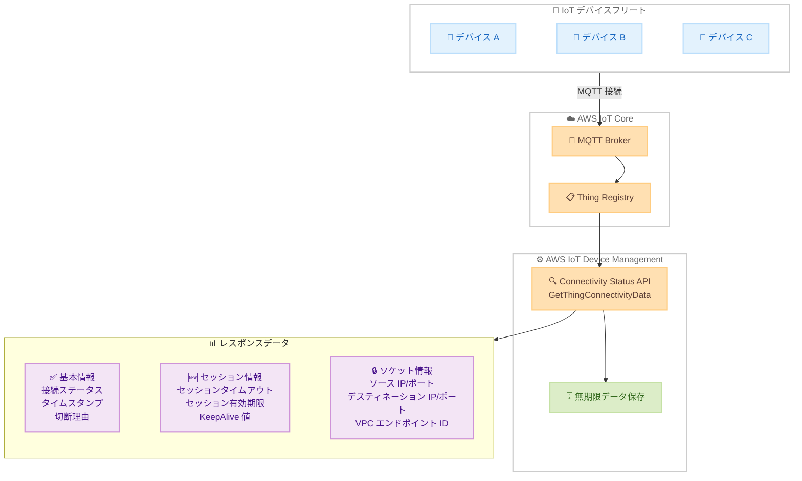

# AWS IoT Device Management - Connectivity Status API への MQTT セッションデータ追加

**リリース日**: 2026 年 6 月 3 日
**サービス**: AWS IoT Device Management
**機能**: Connectivity Status API における MQTT セッションデータの提供

📊 [このアップデートのインフォグラフィックを見る](https://takech9203.github.io/aws-news-summary/20260603-aws-iot-device-management-mqtt.html)

## 概要

AWS IoT Device Management の Connectivity Status API に MQTT セッションデータが追加された。これにより、IoT デバイスフリート全体の接続性の問題をトラブルシューティングし、接続パターンを監査することが可能になる。

このアップデートにより、AWS IoT Device Management の Connectivity Status API は AWS IoT Core が最近リリースした GetConnection API と完全に同等の機能を持つようになった。Thing 名を指定して、IoT デバイスの詳細な接続情報と MQTT セッション情報を取得できる。さらに、Connectivity Status API は GetConnection API と比較して大きな優位性を持つ。GetConnection API がデバイス切断後 30 分間しかデータを保持しないのに対し、Connectivity Status API は情報を無期限に保存する。

**アップデート前の課題**

- Connectivity Status API では接続ステータス、タイムスタンプ、切断理由のみが取得可能で、MQTT セッションの詳細情報にアクセスできなかった
- ソケットレベルの情報 (IP アドレス、ポート番号) を確認するには AWS IoT Core の GetConnection API を使用する必要があったが、30 分間しかデータが保持されなかった
- デバイス切断後の詳細な接続情報を長期間保持して分析することができなかった

**アップデート後の改善**

- MQTT セッションタイムアウトとセッション有効期限の値が Connectivity Status API で確認可能になった
- ソースおよびデスティネーション IP アドレス、ポート番号、クライアント VPC エンドポイント ID をオプションで取得できるようになった
- 接続情報が無期限に保存されるため、長期的な接続パターン分析と監査が可能になった
- きめ細かい IAM ポリシーによるソケット情報へのアクセス制御が実現された

## アーキテクチャ図



Connectivity Status API を通じて、IoT デバイスの MQTT 接続情報を Thing 名で照会し、基本情報に加えて新たにセッション情報とソケット情報を取得できるフローを示している。

## サービスアップデートの詳細

### 主要機能

1. **MQTT セッションデータの取得**
   - セッションタイムアウト値の確認が可能
   - セッション有効期限 (Session Expiry) の取得
   - KeepAlive 期間の確認
   - Clean Session フラグの状態確認
   - クライアント ID の取得

2. **ソケットレベル詳細情報**
   - ソース IP アドレスとポート番号
   - デスティネーション IP アドレスとポート番号
   - クライアント VPC エンドポイント ID
   - IAM ポリシーによるきめ細かなアクセス制御

3. **無期限データ保持**
   - デバイス切断後も接続情報を無期限に保存
   - GetConnection API の 30 分間保持と比較して大幅な改善
   - 長期的な接続パターン分析と監査を実現

4. **GetConnection API との完全互換性**
   - AWS IoT Core の GetConnection API と同等のデータを提供
   - Thing 名ベースでのクエリに対応
   - データ保持期間の優位性を維持

## 技術仕様

### 取得可能なデータフィールド

| カテゴリ | フィールド | 説明 |
|----------|-----------|------|
| 基本情報 | connected | 接続状態 (True/False) |
| 基本情報 | timestamp | 接続/切断のタイムスタンプ |
| 基本情報 | disconnectReason | 切断理由 |
| セッション情報 | sessionExpiry | セッション有効期限 |
| セッション情報 | keepAliveDuration | KeepAlive 期間 (秒) |
| セッション情報 | cleanSession | Clean Session フラグ |
| セッション情報 | clientId | MQTT クライアント ID |
| ソケット情報 | sourceIp | ソース IP アドレス |
| ソケット情報 | sourcePort | ソースポート番号 |
| ソケット情報 | targetIp | デスティネーション IP アドレス |
| ソケット情報 | targetPort | デスティネーションポート番号 |
| ソケット情報 | vpcEndpointId | VPC エンドポイント ID |

### 切断理由の種類

| 値 | 説明 |
|----|------|
| AUTH_ERROR | 認証エラー |
| CLIENT_INITIATED_DISCONNECT | クライアント主導の切断 |
| CLIENT_ERROR | クライアントエラー |
| CONNECTION_LOST | 接続喪失 |
| DUPLICATE_CLIENTID | 重複クライアント ID |
| FORBIDDEN_ACCESS | アクセス禁止 |
| MQTT_KEEP_ALIVE_TIMEOUT | KeepAlive タイムアウト |
| SERVER_ERROR | サーバーエラー |
| SERVER_INITIATED_DISCONNECT | サーバー主導の切断 |
| API_INITIATED_DISCONNECT | API 主導の切断 |
| THROTTLED | スロットリング |
| WEBSOCKET_TTL_EXPIRATION | WebSocket TTL 期限切れ |
| CUSTOMAUTH_TTL_EXPIRATION | カスタム認証 TTL 期限切れ |

### API 変更履歴

| 日付 | サービス | 変更内容 |
|------|----------|----------|
| 2026/05/28 | [AWS IoT](https://awsapichanges.com/archive/changes/364f28-iot.html) | 4 updated api methods - GetIndexingConfiguration, GetThingConnectivityData, SearchIndex, UpdateIndexingConfiguration に接続関連フィールドを追加 |
| 2026/05/28 | [AWS IoT Data Plane](https://awsapichanges.com/archive/changes/364f28-data-ats.iot.html) | 3 new api methods - GetConnection, ListSubscriptions, SendDirectMessage を追加 |

### IAM ポリシー設定例

ソケット情報へのアクセスは IAM ポリシーで制御する。

```json
{
  "Version": "2012-10-17",
  "Statement": [
    {
      "Effect": "Allow",
      "Action": "iot:GetThingConnectivityData",
      "Resource": "arn:aws:iot:*:*:thing/*"
    }
  ]
}
```

ソケット情報を含むリクエストの場合、`includeSocketInformation` パラメータを `true` に設定する必要があり、対応する IAM 権限が必要となる。

## 設定方法

### 前提条件

1. デバイスが AWS IoT Core Thing Registry に登録されていること
2. AWS IoT Device Management が有効化されていること
3. 適切な IAM 権限が設定されていること

### 手順

#### ステップ 1: Thing の接続データを取得する

```bash
aws iot get-thing-connectivity-data \
  --thing-name "my-iot-device"
```

基本的な接続ステータス、タイムスタンプ、切断理由、セッション情報を取得する。

#### ステップ 2: ソケット情報を含めて取得する

```bash
aws iot get-thing-connectivity-data \
  --thing-name "my-iot-device" \
  --include-socket-information
```

ソケットレベルの詳細情報 (IP アドレス、ポート番号、VPC エンドポイント ID) を含めて取得する。IAM ポリシーで適切な権限が付与されている必要がある。

#### ステップ 3: Fleet Indexing でフリート全体の接続性を検索する

```bash
aws iot search-index \
  --query-string "connectivity.connected:false"
```

Fleet Indexing を使用して、切断状態のデバイスをフリート全体から検索する。SearchIndex API のレスポンスにもセッション情報が含まれるようになった。

#### ステップ 4: Fleet Indexing にソケット情報のインデックスを追加する

```bash
aws iot update-indexing-configuration \
  --thing-indexing-configuration '{
    "thingIndexingMode": "REGISTRY_AND_SHADOW",
    "thingConnectivityIndexingMode": "STATUS",
    "filter": {
      "connectivity": {
        "includeSocketInformation": ["GET_THING_CONNECTIVITY_DATA"]
      }
    }
  }'
```

Fleet Indexing の設定を更新し、ソケット情報をインデックスに含めるよう構成する。

## メリット

### ビジネス面

- **運用コスト削減**: 接続問題の迅速なトラブルシューティングにより、ダウンタイムと調査時間を短縮
- **コンプライアンス対応**: 接続情報の無期限保持により、監査要件への対応が容易
- **セキュリティ強化**: IP アドレスと VPC エンドポイントの追跡により、不正アクセスの検出が可能

### 技術面

- **デバッグ効率向上**: MQTT セッションパラメータの可視化により、タイムアウトや切断の根本原因を迅速に特定
- **長期分析の実現**: 無期限データ保持により、トレンド分析や季節的パターンの把握が可能
- **きめ細かなアクセス制御**: ソケット情報を IAM ポリシーで保護し、最小権限の原則を適用

## デメリット・制約事項

### 制限事項

- ソケット情報の取得には追加の IAM 権限設定が必要
- デバイスが Thing Registry に登録されている必要がある
- Fleet Indexing でソケット情報を利用するには、明示的にインデックス構成を更新する必要がある

### 考慮すべき点

- ソケット情報 (IP アドレス等) は機密性が高いため、IAM ポリシーの適切な管理が重要
- 無期限データ保持に伴うストレージコストへの影響を確認する必要がある
- GetConnection API と Connectivity Status API の使い分けを理解し、適切な API を選択する必要がある

## ユースケース

### ユースケース 1: 大規模 IoT フリートの接続問題トラブルシューティング

**シナリオ**: 製造工場で数千台のセンサーデバイスが稼働しており、一部のデバイスが間欠的に切断される問題が発生している。

**実装例**:
```bash
# 切断デバイスの詳細情報を取得
aws iot get-thing-connectivity-data \
  --thing-name "factory-sensor-042" \
  --include-socket-information

# Fleet Indexing で切断パターンを分析
aws iot search-index \
  --query-string "connectivity.connected:false AND connectivity.disconnectReason:MQTT_KEEP_ALIVE_TIMEOUT"
```

**効果**: KeepAlive タイムアウトが切断原因であることを特定し、デバイスファームウェアの KeepAlive 設定を最適化。IP アドレス情報からネットワーク機器の障害箇所も特定可能。

### ユースケース 2: セキュリティ監査とコンプライアンス

**シナリオ**: 医療 IoT デバイスを運用しており、規制要件としてデバイス接続のログを長期保持し、不正アクセスを検知する必要がある。

**実装例**:
```bash
# 特定デバイスの接続履歴を確認
aws iot get-thing-connectivity-data \
  --thing-name "medical-device-001" \
  --include-socket-information

# 想定外の IP アドレスからの接続を検出
# sourceIp が許可リストにない場合にアラートを発行
```

**効果**: 接続情報が無期限に保持されるため、過去の接続パターンの異常を遡及的に調査可能。VPC エンドポイント ID による接続元の特定も容易。

### ユースケース 3: MQTT セッション最適化

**シナリオ**: バッテリー駆動の IoT デバイスで、セッション有効期限と KeepAlive の設定を最適化してバッテリー寿命を延ばしたい。

**実装例**:
```bash
# デバイスのセッション設定を確認
aws iot get-thing-connectivity-data \
  --thing-name "battery-sensor-100"

# レスポンス例:
# {
#   "connected": true,
#   "keepAliveDuration": 300,
#   "sessionExpiry": 3600,
#   "cleanSession": false
# }

# Fleet 全体のセッション設定を検索して比較
aws iot search-index \
  --query-string "thingTypeName:battery-sensor"
```

**効果**: フリート全体のセッション設定を可視化し、KeepAlive 値の最適化によりバッテリー消費を削減。Clean Session の設定状況も一括で確認可能。

## 料金

AWS IoT Device Management の Connectivity Status API の利用料金は、AWS IoT Device Management の標準料金に含まれる。追加の料金情報は公式発表に記載されていないため、最新の料金については [AWS IoT Device Management 料金ページ](https://aws.amazon.com/iot-device-management/pricing/) を確認すること。

## 利用可能リージョン

AWS IoT Device Management がサポートされているすべての AWS リージョンで利用可能。

## 関連サービス・機能

- **AWS IoT Core GetConnection API**: IoT Data Plane で接続情報を取得する API。30 分間のデータ保持。Connectivity Status API と機能的に同等だが保持期間が異なる
- **AWS IoT Fleet Indexing**: デバイスフリート全体の検索とクエリ。今回のアップデートで接続性フィールドにセッション情報が追加された
- **AWS IoT Device Defender**: IoT デバイスのセキュリティ監査と異常検出。接続情報と組み合わせてセキュリティ分析を強化

## 参考リンク

- 📊 [インフォグラフィック](https://takech9203.github.io/aws-news-summary/20260603-aws-iot-device-management-mqtt.html)
- [公式発表 (What's New)](https://aws.amazon.com/about-aws/whats-new/2026/05/aws-iot-device-management-mqtt/)
- [AWS IoT Device Management ドキュメント - デバイス接続性ステータス](https://docs.aws.amazon.com/iot/latest/developerguide/device-connectivity-status.html)
- [AWS IoT Core - GetConnection API ドキュメント](https://docs.aws.amazon.com/iot/latest/developerguide/mqtt.html#get-connection-api)
- [AWS IoT Thing Registry ドキュメント](https://docs.aws.amazon.com/iot/latest/developerguide/thing-registry.html)
- [AWS IoT API リファレンス](https://docs.aws.amazon.com/iot/latest/apireference/Welcome.html)
- [料金ページ](https://aws.amazon.com/iot-device-management/pricing/)

## まとめ

AWS IoT Device Management の Connectivity Status API に MQTT セッションデータが追加されたことで、IoT デバイスフリートの接続性トラブルシューティングと監査能力が大幅に強化された。特に無期限データ保持という GetConnection API に対する優位性は、長期的な分析やコンプライアンス要件への対応において重要な価値を持つ。大規模 IoT フリートを運用するユーザーは、Connectivity Status API への移行を検討し、IAM ポリシーによるソケット情報のアクセス制御を適切に設定することを推奨する。
