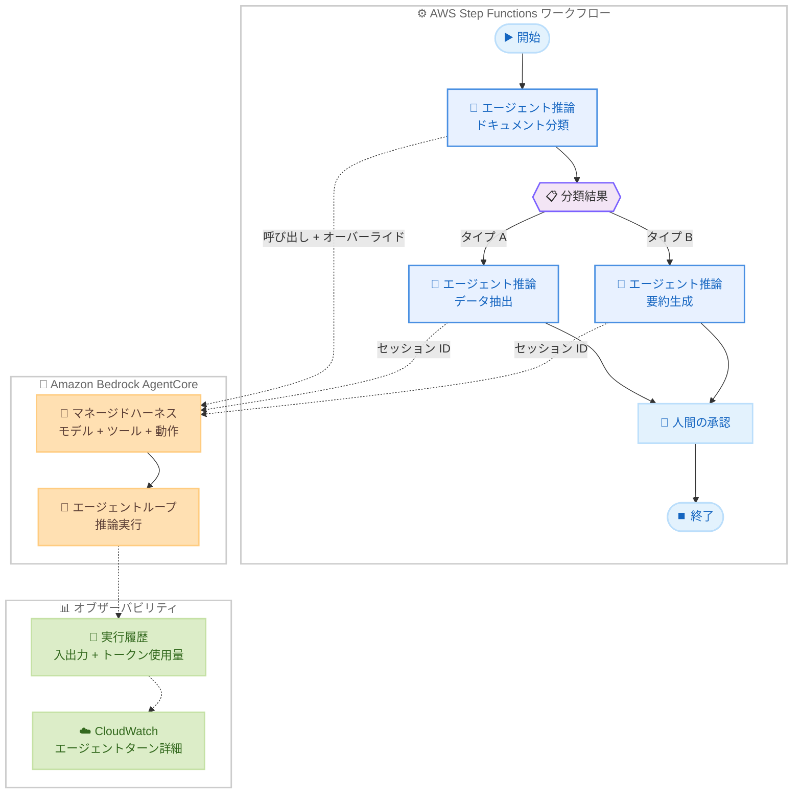

# AWS Step Functions - AgentCore によるエージェンティック推論ステップ

**リリース日**: 2026 年 6 月 3 日
**サービス**: AWS Step Functions / Amazon Bedrock AgentCore
**機能**: AgentCore-powered agentic reasoning step

[このアップデートのインフォグラフィックを見る](https://takech9203.github.io/aws-news-summary/20260603-aws-step-functions-agentcore.html)

## 概要

AWS Step Functions に、Amazon Bedrock AgentCore のマネージドハーネス (現在プレビュー) との最適化された統合による AI エージェント推論ステップが追加された。これにより、ワークフロー内でドキュメント分類や非構造化フォームからの要素抽出といった推論タスクを自動化できるようになった。

AgentCore ハーネスは、モデル、ツール、動作を設定で宣言するだけでエージェントを定義できる仕組みであり、AgentCore がエージェントループをエンドツーエンドで実行するマネージド環境を提供する。Step Functions の視覚的なワークフローオーケストレーション機能と組み合わせることで、複数のエージェントを並列・逐次実行し、重要なアクション前には人間の承認ステップを挟むといった高度なワークフローを構築できる。

**アップデート前の課題**

- AI エージェントをワークフローに組み込むには、Lambda 関数や外部サービスを介した複雑なカスタム実装が必要だった
- エージェントの推論ループの管理、エラーハンドリング、リトライロジックを自前で構築する必要があった
- ワークフロー内の各決定ポイントでエージェント設定を個別に管理する必要があり、設定の重複が発生しやすかった
- エージェントのコンテキストをワークフロー実行間で永続化するための仕組みを独自に構築する必要があった

**アップデート後の改善**

- Step Functions のステートとして直接 AgentCore ハーネスを呼び出せるようになり、統合が大幅に簡素化された
- AgentCore がエージェントループ全体をマネージドで実行するため、インフラ管理が不要になった
- 呼び出しごとにモデル、システムプロンプト、ツールをオーバーライドでき、設定の重複なく柔軟にエージェントを適応できる
- セッション ID によりエージェントコンテキストをワークフロー実行内および実行間で永続化できるようになった
- Workflow Studio から直接ハーネスを作成・再利用でき、開発効率が向上した

## アーキテクチャ図



Step Functions ワークフロー内の各エージェント推論ステップが AgentCore のマネージドハーネスを呼び出し、推論結果に基づいて後続の処理を分岐させる。実行履歴と CloudWatch により、エージェントの全ターンを追跡可能。

## サービスアップデートの詳細

### 主要機能

1. **AgentCore マネージドハーネスとの最適化統合**
   - Workflow Studio から直接ハーネスを作成、または既存のハーネスを再利用可能
   - モデル、ツール、動作を宣言的に設定するだけでエージェントを定義
   - AgentCore がエージェントループをエンドツーエンドで管理・実行

2. **呼び出しごとのオーバーライド**
   - モデル、システムプロンプト、ツールを呼び出し単位で変更可能
   - ワークフローのコンテキストに応じてエージェントの動作を適応
   - 設定の重複なく、1 つのハーネスを複数の用途で再利用

3. **セッション ID によるコンテキスト永続化**
   - エージェントのコンテキストを呼び出し間で保持
   - 同一ワークフロー実行内、または異なるワークフロー実行間で動作
   - 会話の継続性を保ちながら複数ステップで推論を実行

4. **並列・逐次実行と人間の承認**
   - 複数のエージェントをワークフロー内で並列または逐次に実行
   - 単一ワークフロー内の異なる決定ポイントにエージェントを配置
   - 重要なアクション前に人間の承認ステップを追加可能

5. **包括的なオブザーバビリティ**
   - ワークフロー実行履歴にエージェントの入力、出力、トークン使用量、実行時間を表示
   - Amazon CloudWatch へのリンクからエージェントターンの詳細を確認
   - 推論プロセス全体の監査とデバッグが可能

## 技術仕様

### 統合アーキテクチャ

| 項目 | 詳細 |
|------|------|
| 統合タイプ | AgentCore マネージドハーネスとの最適化統合 |
| エージェント定義 | 宣言的設定 (モデル、ツール、動作) |
| カスタマイズ | 呼び出しごとのオーバーライド (モデル、システムプロンプト、ツール) |
| 状態永続化 | セッション ID (実行内・実行間) |
| モニタリング | CloudWatch 統合 (ターンレベルの詳細) |
| ビジュアルビルダー | Workflow Studio でのハーネス作成サポート |
| ステータス | プレビュー |

### API 変更履歴

| 日付 | サービス | 変更内容 |
|------|----------|----------|
| 2026/05/29 | [Amazon Bedrock AgentCore Control](https://awsapichanges.com/archive/changes/96246a-bedrock-agentcore-control.html) | 9 updated methods - AWS Secrets Manager シークレット参照の設定プロバイダー拡張 |

### ワークフロー定義例

```json
{
  "Type": "Task",
  "Resource": "arn:aws:states:::bedrock-agentcore:harness:invoke",
  "Parameters": {
    "HarnessArn": "arn:aws:bedrock-agentcore:us-east-1:123456789012:harness/my-classifier",
    "Input": {
      "message": "Classify this document and extract key fields"
    },
    "Overrides": {
      "Model": "anthropic.claude-sonnet-4-20250514",
      "SystemPrompt": "You are a document classifier specialized in invoices.",
      "Tools": ["extract_fields", "validate_data"]
    },
    "SessionId": "workflow-session-001"
  },
  "Next": "ProcessResult"
}
```

## 設定方法

### 前提条件

1. AWS アカウントがサポートされるリージョンにあること
2. AgentCore ハーネスプレビューへのアクセス権限
3. Amazon Bedrock のモデルアクセスが有効化されていること
4. Step Functions ワークフローの実行に必要な IAM ロール

### 手順

#### ステップ 1: AgentCore ハーネスの作成

Workflow Studio を使用して新しいハーネスを作成する方法と、既存のハーネスを指定する方法がある。

```json
{
  "HarnessName": "document-classifier",
  "Model": "anthropic.claude-sonnet-4-20250514",
  "Tools": ["classify_document", "extract_fields"],
  "Behavior": {
    "SystemPrompt": "You are an expert document classifier.",
    "MaxTurns": 5
  }
}
```

ハーネスではモデル、使用するツール、エージェントの動作を宣言的に定義する。

#### ステップ 2: Step Functions ワークフローへのエージェントステップ追加

Workflow Studio でエージェント推論ステップをドラッグ&ドロップで追加し、ハーネス ARN を指定する。

```json
{
  "StartAt": "ClassifyDocument",
  "States": {
    "ClassifyDocument": {
      "Type": "Task",
      "Resource": "arn:aws:states:::bedrock-agentcore:harness:invoke",
      "Parameters": {
        "HarnessArn.$": "$.harnessArn",
        "Input": {
          "message.$": "$.documentContent"
        }
      },
      "Next": "RouteByType"
    },
    "RouteByType": {
      "Type": "Choice",
      "Choices": [
        {
          "Variable": "$.classification",
          "StringEquals": "invoice",
          "Next": "ExtractInvoice"
        }
      ],
      "Default": "ManualReview"
    }
  }
}
```

ワークフロー内の任意の位置にエージェント推論ステップを配置し、結果に基づいて後続の処理を分岐させる。

#### ステップ 3: オーバーライドとセッション ID の設定

呼び出しごとにモデルやプロンプトをオーバーライドし、セッション ID でコンテキストを維持する。

```json
{
  "Parameters": {
    "HarnessArn": "arn:aws:bedrock-agentcore:us-east-1:123456789012:harness/my-agent",
    "Input": {
      "message": "Continue processing with the previous context"
    },
    "Overrides": {
      "SystemPrompt": "Focus on extracting monetary values from the document."
    },
    "SessionId.$": "$.executionId"
  }
}
```

セッション ID を使用することで、同一ワークフロー内の複数ステップ間、または異なるワークフロー実行間でエージェントのコンテキストを保持できる。

## メリット

### ビジネス面

- **開発期間の短縮**: エージェントループのカスタム実装が不要となり、AI ワークフローの構築期間を大幅に短縮
- **運用コストの削減**: マネージドサービスによるインフラ管理の排除と、追加の統合料金なしでの利用
- **品質管理の強化**: 人間の承認ステップとオブザーバビリティにより、AI 推論結果の品質を担保

### 技術面

- **宣言的なエージェント定義**: コード不要で設定のみによりエージェントを定義、再利用、オーバーライド可能
- **ネイティブな並列処理**: Step Functions の並列実行機能を活用し、複数エージェントの同時実行が容易
- **完全な監査証跡**: 入出力、トークン使用量、実行時間の記録と CloudWatch によるターンレベルの追跡

## デメリット・制約事項

### 制限事項

- 現在プレビュー段階であり、GA 時に仕様が変更される可能性がある
- 利用可能リージョンが 4 リージョンに限定されている (東京リージョン未対応)
- AgentCore ハーネスのマネージド環境に依存するため、カスタムランタイムの要件がある場合は制約となる

### 考慮すべき点

- Bedrock のモデル推論料金と AgentCore の料金が別途発生するため、大量のエージェント呼び出しではコスト管理が重要
- セッション ID によるコンテキスト永続化のデータ保持期間やサイズ制限は GA 時に明確化される見込み
- プレビュー段階のため、本番ワークロードへの適用は慎重に検討する必要がある

## ユースケース

### ユースケース 1: インテリジェントなドキュメント処理パイプライン

**シナリオ**: 企業が大量の受信ドキュメント (請求書、契約書、申請書) を自動分類し、各タイプに応じたデータ抽出と検証を行いたい。

**実装例**:
```json
{
  "StartAt": "ClassifyDocument",
  "States": {
    "ClassifyDocument": {
      "Type": "Task",
      "Resource": "arn:aws:states:::bedrock-agentcore:harness:invoke",
      "Parameters": {
        "HarnessArn": "arn:aws:bedrock-agentcore:us-east-1:123456789012:harness/doc-classifier",
        "Input": {
          "message.$": "$.rawDocument"
        }
      },
      "Next": "RouteByDocType"
    },
    "RouteByDocType": {
      "Type": "Choice",
      "Choices": [
        {
          "Variable": "$.Output.classification",
          "StringEquals": "invoice",
          "Next": "ExtractInvoiceData"
        },
        {
          "Variable": "$.Output.classification",
          "StringEquals": "contract",
          "Next": "ExtractContractData"
        }
      ]
    }
  }
}
```

**効果**: 手動分類作業を排除し、ドキュメント処理のスループットを向上。エラー率の低減と処理時間の短縮を実現。

### ユースケース 2: マルチステップの顧客対応自動化

**シナリオ**: カスタマーサポートワークフローで、問い合わせ内容の分析、回答案の生成、上長承認、回答送信を自動化したい。

**実装例**:
```json
{
  "States": {
    "AnalyzeInquiry": {
      "Type": "Task",
      "Resource": "arn:aws:states:::bedrock-agentcore:harness:invoke",
      "Parameters": {
        "HarnessArn": "arn:aws:bedrock-agentcore:us-east-1:123456789012:harness/support-agent",
        "Input": {
          "message.$": "$.inquiry"
        },
        "SessionId.$": "$.ticketId"
      },
      "Next": "HumanApproval"
    },
    "HumanApproval": {
      "Type": "Task",
      "Resource": "arn:aws:states:::sqs:sendMessage.waitForTaskToken",
      "Next": "SendResponse"
    }
  }
}
```

**効果**: セッション ID でチケット単位のコンテキストを保持しつつ、重要な回答前に人間の承認を挟むことで、品質と効率の両立を実現。

### ユースケース 3: データ品質検証パイプライン

**シナリオ**: ETL パイプラインで取り込んだデータの品質を AI エージェントが並列で検証し、異常を検出した場合はアラートを発行する。

**実装例**:
```json
{
  "States": {
    "ParallelValidation": {
      "Type": "Parallel",
      "Branches": [
        {
          "StartAt": "ValidateSchema",
          "States": {
            "ValidateSchema": {
              "Type": "Task",
              "Resource": "arn:aws:states:::bedrock-agentcore:harness:invoke",
              "Parameters": {
                "HarnessArn": "arn:aws:bedrock-agentcore:us-east-1:123456789012:harness/validator",
                "Overrides": {
                  "SystemPrompt": "Validate data schema compliance."
                }
              },
              "End": true
            }
          }
        },
        {
          "StartAt": "DetectAnomalies",
          "States": {
            "DetectAnomalies": {
              "Type": "Task",
              "Resource": "arn:aws:states:::bedrock-agentcore:harness:invoke",
              "Parameters": {
                "HarnessArn": "arn:aws:bedrock-agentcore:us-east-1:123456789012:harness/validator",
                "Overrides": {
                  "SystemPrompt": "Detect statistical anomalies in the dataset."
                }
              },
              "End": true
            }
          }
        }
      ]
    }
  }
}
```

**効果**: 同一ハーネスをオーバーライドで使い分けることで設定の重複を排除し、並列実行で検証時間を短縮。

## 料金

本統合には追加の統合料金は発生しない。以下の標準料金が適用される。

| コンポーネント | 料金体系 |
|----------------|----------|
| AWS Step Functions | 標準ワークフロー実行料金 (状態遷移ごとに課金) |
| Amazon Bedrock | モデル推論料金 (入出力トークンベース) |
| Amazon Bedrock AgentCore | AgentCore 標準料金 |

### 料金例

| 使用量 | 月額料金 (概算) |
|--------|------------------|
| 10,000 ワークフロー実行 (各 5 状態遷移) | Step Functions: 約 $1.25 + Bedrock 推論料金 |
| 100,000 ワークフロー実行 (各 10 状態遷移) | Step Functions: 約 $25.00 + Bedrock 推論料金 |

※ Bedrock の推論料金はモデルおよびトークン使用量により変動。

## 利用可能リージョン

- US East (N. Virginia) - us-east-1
- US West (Oregon) - us-west-2
- Europe (Frankfurt) - eu-west-1
- Asia Pacific (Sydney) - ap-southeast-2

※ 東京リージョン (ap-northeast-1) は現時点で未対応。

## 関連サービス・機能

- **Amazon Bedrock AgentCore**: エージェントのマネージド実行環境を提供するサービス。ハーネスによる宣言的なエージェント定義が中核
- **AWS Step Functions Workflow Studio**: ワークフローの視覚的な設計ツール。ハーネスの作成・設定をGUIで実行可能
- **Amazon CloudWatch**: エージェントターンの詳細ログとメトリクスを提供し、推論プロセスの可視化を実現
- **Amazon Bedrock**: 基盤モデルへのアクセスを提供。エージェントの推論エンジンとして機能

## 参考リンク

- [インフォグラフィック](https://takech9203.github.io/aws-news-summary/20260603-aws-step-functions-agentcore.html)
- [公式発表 (What's New)](https://aws.amazon.com/about-aws/whats-new/2026/06/aws-step-functions-agentcore/)
- [AWS Step Functions ドキュメント](https://docs.aws.amazon.com/step-functions/latest/dg/welcome.html)
- [Amazon Bedrock AgentCore ドキュメント](https://docs.aws.amazon.com/bedrock/latest/userguide/agentcore.html)
- [AWS Step Functions 料金](https://aws.amazon.com/step-functions/pricing/)
- [Amazon Bedrock 料金](https://aws.amazon.com/bedrock/pricing/)

## まとめ

AWS Step Functions と Amazon Bedrock AgentCore の統合により、AI エージェントによる推論をワークフローのネイティブステップとして組み込めるようになった。宣言的な設定、呼び出しごとのオーバーライド、セッションベースのコンテキスト永続化により、複雑なエージェンティックワークフローを効率的に構築できる。現在プレビュー段階かつ東京リージョン未対応のため、GA の動向を注視しつつ、対応リージョンでの検証を推奨する。
