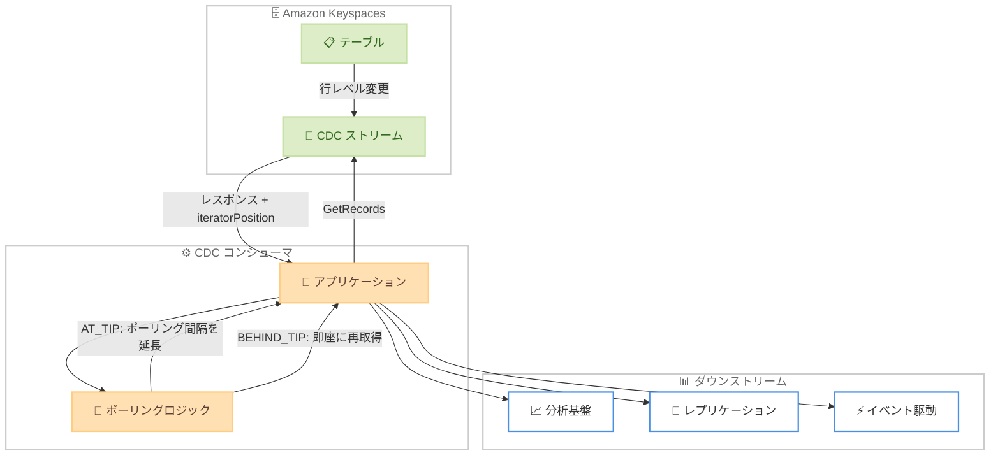

# Amazon Keyspaces - CDC イテレータポジション

**リリース日**: 2026 年 6 月 3 日
**サービス**: Amazon Keyspaces (for Apache Cassandra)
**機能**: CDC ストリームのイテレータポジション (GetRecords API レスポンス拡張)

:bar_chart: [このアップデートのインフォグラフィックを見る](https://takech9203.github.io/aws-news-summary/20260603-keyspaces-cdc-iterator-position.html)

## 概要

Amazon Keyspaces (for Apache Cassandra) の Change Data Capture (CDC) ストリームにおいて、GetRecords API レスポンスにイテレータポジション情報が追加された。これにより、コンシューマがストリームの末端に到達しているか、まだ未処理のレコードが残っているかを判定できるようになった。

この機能は、CDC ストリームを利用してダウンストリームの分析、レプリケーション、イベント駆動アプリケーションとの統合を行うユーザーに対して、ポーリング頻度の最適化とコスト削減を実現するものである。

**アップデート前の課題**

- CDC ストリームのポーリングを固定間隔で実行する必要があり、新しいレコードの有無に関わらず一定のリクエストが発生していた
- 不要なポーリングによるリソースの非効率な使用が発生していた
- 固定間隔ポーリングによる不要な CDC 消費コストが発生していた
- コンシューマがストリーム内の現在位置を把握する手段がなかった

**アップデート後の改善**

- GetRecords レスポンスに `iteratorDescription` 構造体が追加され、`iteratorPosition` フィールドでストリーム位置を確認可能になった
- `AT_TIP` (末端到達) と `BEHIND_TIP` (未処理レコードあり) の 2 つのステータスでポーリング頻度を動的に調整可能になった
- 不要なポーリングを削減し、CDC 消費コストを低減できるようになった
- データ処理のタイムリーさを維持しながら効率的なリソース利用が可能になった

## アーキテクチャ図



GetRecords API の呼び出し後、レスポンスに含まれる `iteratorPosition` の値に応じてポーリング頻度を動的に調整するフローを示している。

## サービスアップデートの詳細

### 主要機能

1. **iteratorDescription 構造体の追加**
   - GetRecords API レスポンスに新たに `iteratorDescription` オブジェクトが追加された
   - ストリーム内でのコンシューマの現在位置を示す情報を提供する
   - 既存の `changeRecords` や `nextShardIterator` と並列で返却される

2. **iteratorPosition フィールド**
   - `AT_TIP`: コンシューマがストリームの末端に到達しており、現時点で新しいレコードがないことを示す
   - `BEHIND_TIP`: ストリームにまだ未処理のレコードが残っている可能性があることを示す
   - この情報に基づいてポーリング戦略を動的に最適化できる

3. **アダプティブポーリング**
   - `AT_TIP` 時にはポーリング間隔を長くしてコストを削減
   - `BEHIND_TIP` 時には即座に次のレコードを取得してデータ処理の遅延を最小化
   - コストとレイテンシのバランスを自動的に最適化可能

## 技術仕様

### GetRecords レスポンス構造

| 項目 | 詳細 |
|------|------|
| 新規フィールド | `iteratorDescription.iteratorPosition` |
| データ型 | String (Enum) |
| 有効値 | `AT_TIP` / `BEHIND_TIP` |
| 返却位置 | GetRecords レスポンスのトップレベル |
| 必須/任意 | レスポンスに常に含まれる |

### API 変更履歴

| 日付 | サービス | 変更内容 |
|------|----------|----------|
| 2026/06/02 | [Amazon Keyspaces Streams](https://awsapichanges.com/archive/changes/250cdc-cassandra-streams.html) | 1 updated api method - GetRecords レスポンスに iteratorDescription を追加 |

### レスポンス例

```json
{
    "changeRecords": [...],
    "nextShardIterator": "AAAAAAAAAAGQBYshYDEe...",
    "iteratorDescription": {
        "iteratorPosition": "AT_TIP"
    }
}
```

```json
{
    "changeRecords": [...],
    "nextShardIterator": "AAAAAAAAAAHRe2Gc9I0...",
    "iteratorDescription": {
        "iteratorPosition": "BEHIND_TIP"
    }
}
```

## 設定方法

### 前提条件

1. Amazon Keyspaces テーブルで CDC が有効化されていること
2. CDC ストリームが作成済みであること
3. 最新の AWS SDK を使用していること (iteratorDescription フィールドのサポートが必要)

### 手順

#### ステップ 1: AWS SDK のアップデート

```bash
# Python (boto3) の場合
pip install --upgrade boto3 botocore

# Node.js の場合
npm install @aws-sdk/client-keyspaces-streams@latest
```

最新の AWS SDK にアップデートすることで、GetRecords レスポンスの `iteratorDescription` フィールドにアクセスできるようになる。

#### ステップ 2: アダプティブポーリングの実装

```python
import boto3
import time

client = boto3.client('keyspaces-streams')

def adaptive_poll(shard_iterator):
    """iteratorPosition に基づいてポーリング間隔を調整"""
    base_interval = 1.0  # 秒
    max_interval = 30.0  # 秒
    current_interval = base_interval

    while True:
        response = client.get_records(
            shardIterator=shard_iterator,
            maxResults=100
        )

        # レコードの処理
        for record in response.get('changeRecords', []):
            process_record(record)

        # イテレータポジションに基づいてポーリング間隔を調整
        iterator_position = response['iteratorDescription']['iteratorPosition']

        if iterator_position == 'AT_TIP':
            # ストリーム末端に到達 - 間隔を延長
            current_interval = min(current_interval * 2, max_interval)
        elif iterator_position == 'BEHIND_TIP':
            # 未処理レコードあり - 即座に再取得
            current_interval = base_interval

        shard_iterator = response['nextShardIterator']
        time.sleep(current_interval)
```

`iteratorPosition` の値に応じてポーリング間隔を動的に調整するアダプティブポーリングロジックの実装例。`AT_TIP` の場合は指数バックオフで間隔を延長し、`BEHIND_TIP` の場合はベース間隔に戻して迅速にレコードを取得する。

#### ステップ 3: ポーリング戦略の最適化

```python
def optimized_poll_strategy(shard_iterator):
    """コスト最適化されたポーリング戦略"""
    response = client.get_records(
        shardIterator=shard_iterator,
        maxResults=1000  # AT_TIP 時は大きなバッチサイズで確認
    )

    position = response['iteratorDescription']['iteratorPosition']

    if position == 'AT_TIP':
        # 新規レコードなし - 次回ポーリングまで待機
        return {
            'next_iterator': response['nextShardIterator'],
            'wait_seconds': 30,
            'records_processed': 0
        }
    else:
        # BEHIND_TIP - 全レコードを取得するまでループ
        return {
            'next_iterator': response['nextShardIterator'],
            'wait_seconds': 0,  # 即座に次のバッチを取得
            'records_processed': len(response.get('changeRecords', []))
        }
```

コスト最適化を重視したポーリング戦略の例。`AT_TIP` 到達時は長い待機時間を設定し、`BEHIND_TIP` 時は待機なしで連続取得する。

## メリット

### ビジネス面

- **コスト削減**: 不要なポーリングリクエストを削減し、CDC 消費コストを直接的に低減できる
- **運用効率の向上**: 固定間隔のチューニングが不要になり、運用負荷が軽減される
- **スケーラビリティ**: ワークロードの変動に自動的に適応するため、ピーク時とアイドル時の両方で最適な動作を実現

### 技術面

- **レイテンシ最適化**: `BEHIND_TIP` 時は即座に次のレコードを取得するため、データ処理のタイムリーさが向上する
- **リソース効率**: 不要な API コールを削減し、ネットワーク帯域やコンピュートリソースを効率的に使用できる
- **実装の簡素化**: ストリーム位置の情報がレスポンスに含まれるため、外部での状態管理が不要になる

## デメリット・制約事項

### 制限事項

- 最新の AWS SDK へのアップデートが必要 (古い SDK では `iteratorDescription` フィールドが無視される可能性がある)
- `AT_TIP` は「現時点で」末端であることを示すのみであり、直後に新しいレコードが到着する可能性がある
- ポーリング間隔の最適化ロジックはアプリケーション側で実装する必要がある

### 考慮すべき点

- 既存のポーリングロジックを修正してアダプティブポーリングに移行する際、テストによる動作確認が推奨される
- `BEHIND_TIP` 時の連続取得はスロットリングに注意が必要。適切なバックオフ戦略を併用すること

## ユースケース

### ユースケース 1: リアルタイム分析パイプライン

**シナリオ**: Keyspaces テーブルの変更を Amazon Kinesis Data Analytics や Amazon Redshift にリアルタイムで連携するパイプラインを運用している。

**実装例**:
```python
def analytics_pipeline_consumer(shard_iterator):
    position = get_iterator_position(shard_iterator)
    if position == 'BEHIND_TIP':
        # バッチ処理で効率的に大量レコードを処理
        batch_process_records(shard_iterator, batch_size=1000)
    else:
        # AT_TIP - 30秒待機してリソースを節約
        time.sleep(30)
```

**効果**: ピーク時は即座にデータを処理し、アイドル時はポーリングコストを最大 90% 削減可能。

### ユースケース 2: マルチリージョンレプリケーション

**シナリオ**: 複数のリージョンにまたがる Keyspaces テーブル間で CDC を利用したカスタムレプリケーションを実装している。

**実装例**:
```python
def replication_consumer(shard_iterator):
    response = client.get_records(shardIterator=shard_iterator)
    position = response['iteratorDescription']['iteratorPosition']

    if position == 'BEHIND_TIP':
        # レプリケーション遅延を検知 - アラート送信
        emit_metric('ReplicationLag', 1)
        # 高速で追いつく
        return {'wait': 0, 'batch_size': 5000}
    else:
        emit_metric('ReplicationLag', 0)
        return {'wait': 5, 'batch_size': 100}
```

**効果**: レプリケーション遅延の検知と自動回復が可能になり、RPO (目標復旧時点) の短縮に貢献。

### ユースケース 3: イベント駆動マイクロサービス

**シナリオ**: Keyspaces テーブルの変更をトリガーとして、下流のマイクロサービス群にイベントを配信するシステム。

**実装例**:
```python
def event_driven_consumer(shard_iterator):
    response = client.get_records(shardIterator=shard_iterator)
    position = response['iteratorDescription']['iteratorPosition']

    # イベント配信
    for record in response['changeRecords']:
        publish_event(record)

    # コスト効率とレイテンシのバランス
    if position == 'AT_TIP':
        return {'poll_interval': 10}  # 10秒間隔
    else:
        return {'poll_interval': 0.1}  # 100ms間隔で高速処理
```

**効果**: イベント配信のレイテンシを最小化しながら、アイドル時のコストを大幅に削減。

## 料金

CDC イテレータポジション機能自体に追加料金は発生しない。ただし、CDC ストリームの利用に関する既存の料金体系が適用される。

### 料金要素

| 項目 | 詳細 |
|------|------|
| CDC ストリーム読み取り | GetRecords API コール回数に基づく課金 |
| データ転送 | 読み取ったデータ量に基づく課金 |
| テーブルストレージ | CDC が有効なテーブルの追加ストレージ |

この機能を活用してポーリング頻度を最適化することで、GetRecords の呼び出し回数を削減し、結果として CDC 消費コストを低減できる。

## 利用可能リージョン

Amazon Keyspaces CDC がサポートされているすべての AWS リージョンで利用可能。

## 関連サービス・機能

- **Amazon Keyspaces CDC**: テーブルの行レベル変更をストリームとしてキャプチャする機能。今回のアップデートの基盤となる機能
- **Amazon DynamoDB Streams**: DynamoDB における同様の変更データキャプチャ機能。DynamoDB Streams にも類似のストリーム位置概念がある
- **Amazon Kinesis Data Streams**: ストリーミングデータの処理基盤。CDC ストリームのダウンストリーム先として利用可能
- **AWS Lambda**: イベント駆動型のサーバーレスコンピューティング。CDC イベントのトリガーとして活用可能

## 参考リンク

- :bar_chart: [インフォグラフィック](https://takech9203.github.io/aws-news-summary/20260603-keyspaces-cdc-iterator-position.html)
- [公式発表 (What's New)](https://aws.amazon.com/about-aws/whats-new/2026/06/keyspaces-cdc-iterator-position/)
- [Amazon Keyspaces CDC ドキュメント](https://docs.aws.amazon.com/keyspaces/latest/devguide/keyspaces-records-cdc.html)
- [Amazon Keyspaces 製品ページ](https://aws.amazon.com/keyspaces/)
- [Amazon Keyspaces 料金](https://aws.amazon.com/keyspaces/pricing/)

## まとめ

Amazon Keyspaces CDC ストリームへのイテレータポジション追加は、CDC を利用する全てのワークロードにおいてコスト最適化とパフォーマンス向上を両立する重要なアップデートである。既存の固定間隔ポーリングからアダプティブポーリングへの移行を検討し、最新の AWS SDK へアップデートした上で `iteratorPosition` フィールドを活用したポーリングロジックの最適化を推奨する。
