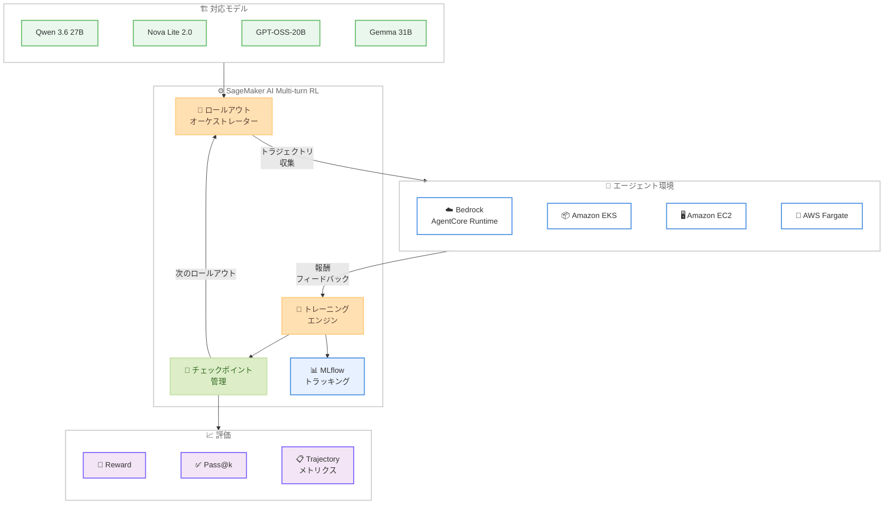

# Amazon SageMaker AI - マルチターン強化学習によるエージェントモデルカスタマイズ

**リリース日**: 2026 年 6 月 3 日
**サービス**: Amazon SageMaker AI
**機能**: Multi-turn Reinforcement Learning (マルチターン強化学習)

📊 [このアップデートのインフォグラフィックを見る](https://takech9203.github.io/aws-news-summary/20260603-multi-turn-reinforcement-learning-on-sagemaker-ai.html)

## 概要

Amazon SageMaker AI にマルチターン強化学習 (Multi-turn RL) が追加された。これは、AI エージェントが複数ステップにわたるタスクを実行する際の意思決定シーケンス全体に対して報酬を与え、モデルをファインチューニングする新しいサーバーレスモデルカスタマイズ技術である。

この機能により、小型で低コストなモデルを特定のワークロードに特化させ、大規模汎用モデルと同等以上のタスク精度を達成できるようになる。SageMaker AI がロールアウトオーケストレーション、トラジェクトリ収集、トレーニング、チェックポイント管理を含む完全なトレーニングループを管理するため、ユーザーは独自のトレーニングインフラストラクチャを構築・運用する必要がない。

**アップデート前の課題**

- SageMaker AI のモデルカスタマイズは教師ありファインチューニング (SFT)、RLVR、RLAIF に限定されており、マルチステップのエージェントタスクに対する強化学習は提供されていなかった
- エージェント環境に対してモデルをトレーニングするには、独自のトレーニングインフラストラクチャの構築と運用が必要だった
- 大規模汎用モデルを使用するしかなく、特定タスクに特化した小型モデルの活用が困難だった
- エージェントの複数ステップにわたる意思決定の品質を体系的に改善する手段がなかった

**アップデート後の改善**

- マルチターン RL により、エージェント環境に対してモデルを直接トレーニングし、タスク全体の意思決定シーケンスに報酬を付与できるようになった
- 完全サーバーレスで動作し、インフラストラクチャのプロビジョニングや管理が不要になった
- Bedrock AgentCore Runtime、Amazon EKS、Amazon EC2、AWS Fargate など任意のインフラストラクチャで動作するエージェントと接続可能になった
- 組み込みの MLflow トラッキングによりエージェントのトラジェクトリ、報酬、トレースを検査できるようになった
- 評価ジョブで reward、pass@k、トラジェクトリメトリクスをレポートし、デプロイ前にベンチマークが可能になった

## アーキテクチャ図



SageMaker AI のマルチターン RL トレーニングループを示す図。オーケストレーターがエージェント環境に対してロールアウトを実行し、トラジェクトリを収集して報酬に基づきモデルをトレーニングする循環的なプロセスを表現している。

## サービスアップデートの詳細

### 主要機能

1. **マルチターン強化学習トレーニング**
   - エージェント環境に対してモデルを直接トレーニング
   - タスク全体の意思決定シーケンスに報酬を付与
   - ロールアウトオーケストレーション、トラジェクトリ収集、トレーニング、チェックポイント管理の自動化
   - 完全サーバーレスで実行され、処理トークンに対する従量課金

2. **柔軟なエージェント環境接続**
   - Amazon Bedrock AgentCore Runtime でのフルマネージドホスティング
   - Amazon EKS、Amazon EC2、AWS Fargate での自己管理
   - 任意のインフラストラクチャおよびフレームワークに対応

3. **組み込み MLflow トラッキング**
   - エージェントのトラジェクトリ、報酬、トレースの検査
   - トレーニングの進捗をリアルタイムでモニタリング
   - 実験管理と比較分析

4. **評価ジョブ**
   - reward メトリクス: 報酬の定量的評価
   - pass@k メトリクス: タスク成功率の測定
   - トラジェクトリメトリクス: 意思決定パスの品質分析
   - デプロイ前のベンチマークとして活用可能

## 技術仕様

### 対応モデル

| モデル | us-west-2 | us-east-1 |
|--------|-----------|-----------|
| Qwen 3.6 27B | 対応 | - |
| Nova Lite 2.0 | 対応 | 対応 |
| GPT-OSS-20B | 対応 | 対応 |
| Gemma 31B | 対応 | - |

### API 変更履歴

| 日付 | サービス | 変更内容 |
|------|----------|----------|
| 2026/06/02 | [Amazon SageMaker Service](https://awsapichanges.com/archive/changes/250cdc-api.sagemaker.html) | 7 new 1 updated api methods - AgentRFT および AgentRFTEvaluation ジョブ管理 |
| 2026/06/02 | [SageMaker Job Runtime Service](https://awsapichanges.com/archive/changes/250cdc-job-runtime.sagemaker.html) | 4 new api methods - トラジェクトリデータ管理およびロールアウト制御 |

### 新規 API メソッド

**SageMaker Service (ジョブ管理)**

| メソッド | 説明 |
|----------|------|
| `CreateJob` | AgentRFT/AgentRFTEvaluation ジョブの作成 |
| `DescribeJob` | ジョブの詳細情報取得 |
| `ListJobs` | ジョブ一覧の取得 |
| `StopJob` | ジョブの停止 |
| `DeleteJob` | ジョブの削除 |
| `DescribeJobSchemaVersion` | ジョブ設定スキーマバージョンの取得 |
| `ListJobSchemaVersions` | スキーマバージョン一覧の取得 |

**SageMaker Job Runtime Service (トラジェクトリ管理)**

| メソッド | 説明 |
|----------|------|
| `Sample` | ジョブ実行中のモデル推論リクエスト送信 |
| `SampleWithResponseStream` | ストリーミング対応の推論リクエスト送信 |
| `CompleteRollout` | ロールアウトの完了マーク |
| `UpdateReward` | トレーニングトラジェクトリへの報酬値の送信 |

### ジョブカテゴリ

```json
{
  "JobCategory": "AgentRFT | AgentRFTEvaluation",
  "JobStatus": "InProgress | Completed | Failed | Stopping | Stopped | Deleting | DeleteFailed",
  "SecondaryStatus": "Starting | Downloading | Training | Uploading | Stopping | Stopped | MaxRuntimeExceeded | Interrupted | Failed | Completed | Restarting | Pending | Evaluating | Deleting | DeleteFailed"
}
```

## 設定方法

### 前提条件

1. AWS アカウントと SageMaker AI へのアクセス権限
2. 対応リージョン (us-west-2 または us-east-1) でのリソース
3. エージェント環境の準備 (Bedrock AgentCore Runtime、EKS、EC2、Fargate など)
4. IAM ロールの設定 (SageMaker ジョブ実行用)

### 手順

#### ステップ 1: エージェント環境の準備

エージェントを Amazon Bedrock AgentCore Runtime、Amazon EKS、Amazon EC2、AWS Fargate、またはその他のインフラストラクチャにデプロイする。エージェントはマルチステップタスクを実行し、SageMaker Job Runtime API と通信できる状態にする。

#### ステップ 2: ジョブ設定の作成

```python
import boto3

client = boto3.client('sagemaker', region_name='us-west-2')

# ジョブ設定スキーマの確認
schema_versions = client.list_job_schema_versions(
    JobCategory='AgentRFT'
)

# 最新のスキーマバージョンを取得
schema = client.describe_job_schema_version(
    JobCategory='AgentRFT',
    JobConfigSchemaVersion=schema_versions['JobConfigSchemas'][0]['JobConfigSchemaVersion']
)
```

ジョブ設定スキーマを確認し、マルチターン RL ジョブの設定ドキュメントを準備する。

#### ステップ 3: マルチターン RL ジョブの作成と実行

```python
# AgentRFT ジョブの作成
response = client.create_job(
    JobName='my-multi-turn-rl-job',
    RoleArn='arn:aws:iam::123456789012:role/SageMakerExecutionRole',
    JobCategory='AgentRFT',
    JobConfigSchemaVersion='1.0',
    JobConfigDocument='<JSON設定ドキュメント>'
)

job_arn = response['JobArn']
```

ジョブを作成すると、SageMaker AI が自動的にロールアウトオーケストレーション、トラジェクトリ収集、トレーニングを管理する。

#### ステップ 4: 評価ジョブの実行

```python
# 評価ジョブの作成
eval_response = client.create_job(
    JobName='my-multi-turn-rl-eval',
    RoleArn='arn:aws:iam::123456789012:role/SageMakerExecutionRole',
    JobCategory='AgentRFTEvaluation',
    JobConfigSchemaVersion='1.0',
    JobConfigDocument='<評価設定ドキュメント>'
)
```

トレーニング済みモデルの性能を reward、pass@k、トラジェクトリメトリクスで評価する。

## メリット

### ビジネス面

- **コスト最適化**: 大規模汎用モデルの代わりに小型モデルを特化させることで、推論コストを大幅に削減できる
- **差別化された AI エージェント**: 自社独自のエージェント環境とタスクに特化したモデルを構築し、競合との差別化を実現
- **運用負荷の削減**: フルサーバーレスのため、トレーニングインフラストラクチャの構築・運用コストが不要

### 技術面

- **エンドツーエンドの最適化**: 単一ステップではなく、タスク全体の意思決定シーケンスを最適化することで、エージェント全体の性能が向上
- **柔軟なインテグレーション**: Bedrock AgentCore Runtime からセルフホスト環境まで、任意のエージェント環境に接続可能
- **実験管理の統合**: 組み込み MLflow トラッキングにより、トレーニングの反復と改善サイクルを効率化
- **定量的な評価基盤**: reward、pass@k、トラジェクトリメトリクスによる客観的な性能評価が可能

## デメリット・制約事項

### 制限事項

- 利用可能リージョンが現時点で us-west-2 と us-east-1 のみに限定される
- 対応モデルが 4 種類に限定されており、東京リージョンでは利用不可
- us-east-1 では Qwen 3.6 27B と Gemma 31B が利用できない
- マルチターン RL の効果を発揮するには、適切な報酬関数の設計とエージェント環境の構築が前提

### 考慮すべき点

- 報酬関数の設計品質がモデルの最終的な性能に大きく影響するため、ドメイン知識に基づく慎重な設計が必要
- トラジェクトリ収集にはエージェント環境との通信が必要であり、環境の安定性がトレーニングの信頼性に影響する
- 小型モデルの特化により汎用性は低下するため、対象ワークロードの選定が重要

## ユースケース

### ユースケース 1: カスタマーサポートエージェントの最適化

**シナリオ**: カスタマーサポート AI エージェントが複数ターンの対話を通じて問題を解決するタスクにおいて、大規模モデルと同等の解決率をより低コストで実現したい。

**実装例**:
```python
# カスタマーサポート環境をエージェントとして設定
# 報酬: 問題解決成功 = 1.0、未解決 = 0.0、顧客満足度スコアを加重
# 対象モデル: Nova Lite 2.0 (低コスト)
# Bedrock AgentCore Runtime でエージェントをホスティング
```

**効果**: Nova Lite 2.0 をカスタマーサポートタスクに特化させ、大規模モデル比で推論コストを削減しながら同等の問題解決率を達成。

### ユースケース 2: コード生成エージェントのファインチューニング

**シナリオ**: ソフトウェア開発において、コードの生成、テスト実行、デバッグを反復的に行う AI エージェントの精度を向上させたい。

**実装例**:
```python
# EKS 上にコード実行環境を構築
# エージェントがコード生成 -> テスト実行 -> 修正のサイクルを実行
# 報酬: テスト合格率、コード品質スコア、ステップ数の効率性
# 対象モデル: Qwen 3.6 27B
```

**効果**: コード生成タスクに特化した 27B モデルにより、汎用大規模モデルに匹敵するコード品質を低レイテンシ・低コストで実現。

### ユースケース 3: データ分析ワークフローエージェント

**シナリオ**: 複数のデータソースに対してクエリを実行し、分析結果をまとめるマルチステップのデータ分析エージェントを構築したい。

**実装例**:
```python
# Fargate 上にデータ分析環境を構築
# エージェントが SQL 生成 -> 実行 -> 結果解釈 -> 追加クエリのサイクルを実行
# 報酬: 分析精度、正確なインサイト抽出率
# 対象モデル: GPT-OSS-20B
```

**効果**: データ分析タスクに特化した 20B モデルにより、効率的かつ正確な自動分析ワークフローを実現。

## 料金

処理トークンに対する従量課金制。インフラストラクチャのプロビジョニングや管理は不要。

具体的なトークン単価については、SageMaker AI の料金ページを参照のこと。

## 利用可能リージョン

| リージョン | 対応モデル |
|------------|-----------|
| us-west-2 (オレゴン) | Qwen 3.6 27B、Nova Lite 2.0、GPT-OSS-20B、Gemma 31B |
| us-east-1 (バージニア北部) | Nova Lite 2.0、GPT-OSS-20B |

## 関連サービス・機能

- **Amazon Bedrock AgentCore Runtime**: エージェント環境のフルマネージドホスティングとして利用可能
- **Amazon SageMaker AI Model Customization**: 教師ありファインチューニング、RLVR、RLAIF などの既存カスタマイズ手法との組み合わせ
- **MLflow on SageMaker**: トレーニングのトラッキングと実験管理
- **Amazon Bedrock**: トレーニング済みモデルのデプロイ先として利用可能
- **Amazon SageMaker Pipelines**: `ListPipelineExecutionSteps` に Job メタデータが追加され、パイプライン統合が可能

## 参考リンク

- 📊 [インフォグラフィック](https://takech9203.github.io/aws-news-summary/20260603-multi-turn-reinforcement-learning-on-sagemaker-ai.html)
- [公式発表 (What's New)](https://aws.amazon.com/about-aws/whats-new/2026/06/multi-turn-reinforcement-learning-on-sagemaker-ai/)
- [SageMaker AI Model Customization ドキュメント](https://docs.aws.amazon.com/sagemaker/latest/dg/model-customization.html)
- [SageMaker AI 料金ページ](https://aws.amazon.com/sagemaker/pricing/)
- [API 変更履歴 - SageMaker Service](https://awsapichanges.com/archive/changes/250cdc-api.sagemaker.html)
- [API 変更履歴 - SageMaker Job Runtime](https://awsapichanges.com/archive/changes/250cdc-job-runtime.sagemaker.html)

## まとめ

Amazon SageMaker AI のマルチターン強化学習は、AI エージェントの性能を効率的に向上させるための重要な新機能である。小型モデルをタスク固有に最適化することで、大規模モデルに匹敵する精度をより低コストで実現でき、エージェント開発の経済性を大きく改善する。現時点では米国リージョン限定であるが、エージェント AI を活用する組織は、対象ワークロードの選定と報酬関数の設計を開始し、GA 拡大に備えることを推奨する。
