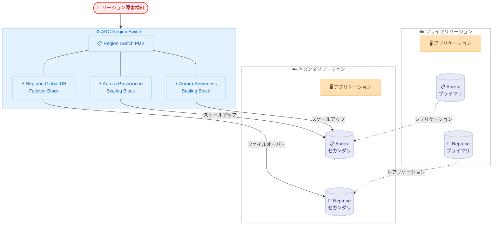

# Amazon Application Recovery Controller - Region Switch に Aurora スケーリングと Neptune グローバルデータベースフェイルオーバーを追加

**リリース日**: 2026 年 6 月 3 日
**サービス**: Amazon Application Recovery Controller (ARC)
**機能**: Region Switch - Aurora Serverless/Provisioned スケーリングおよび Neptune グローバルデータベースフェイルオーバー実行ブロック

📊 [このアップデートのインフォグラフィックを見る](https://takech9203.github.io/aws-news-summary/20260603-region-switch-aurora-scaling-neptune-failover.html)

## 概要

Amazon Application Recovery Controller (ARC) の Region Switch 機能に、3 つの新しい実行ブロック (Execution Block) が追加された。Aurora Serverless スケーリング実行ブロック、Aurora Provisioned スケーリング実行ブロック、Neptune グローバルデータベースフェイルオーバー実行ブロックの 3 つであり、マルチリージョンワークロードにおけるデータベースのスケーリングとフェイルオーバーを自動化する。

ARC Region Switch は、リージョン障害発生時にマルチリージョンアプリケーションのフェイルオーバーをオーケストレーションし、制限時間内でのリカバリを実現するサービスである。今回の新機能により、従来は手動で行う必要があったデータベースのスケーリングやフェイルオーバー判断が自動化され、リカバリ時間の短縮に貢献する。

**アップデート前の課題**

- Aurora グローバルデータベースをアクティブ - パッシブ構成で運用する場合、コスト削減のためにセカンダリクラスターを縮小状態で維持するのが一般的だが、フェイルオーバー時にセカンダリクラスターを本番トラフィックに対応できるよう手動でスケールアップする必要があった
- Aurora のスケーリングが完了するまでリクエストをルーティングできず、リカバリ時間に重大な遅延が発生していた
- Neptune グローバルデータベースのフェイルオーバーでは、障害の種類に応じてスイッチオーバーとデタッチアンドプロモートのどちらを実行するかを手動またはスクリプトで判断する必要があった

**アップデート後の改善**

- Aurora Serverless/Provisioned 両方のセカンダリクラスターのスケーリングが Region Switch プランの一部として自動実行される
- Neptune のフェイルオーバーが計画的スイッチオーバーと非計画的フェイルオーバーの両シナリオで自動化された
- 3 つの実行ブロックすべてがクロスアカウントオーケストレーションに対応し、複数アカウント・リージョンにまたがるデータベース操作を単一プランで制御可能になった

## アーキテクチャ図



ARC Region Switch がリージョン障害を検知すると、プランに定義された実行ブロックが順序に従ってセカンダリリージョンのデータベースをスケーリング・フェイルオーバーし、トラフィック受け入れ準備を自動的に完了させる。

## サービスアップデートの詳細

### 主要機能

1. **Aurora Serverless スケーリング実行ブロック**
   - Aurora Serverless v2 のセカンダリクラスターを自動的にスケールアップ
   - `targetPercent` パラメータでプライマリに対する目標容量の割合を指定可能
   - グローバルクラスター識別子とリージョンごとのデータベースクラスター ARN を設定
   - タイムアウト時間の設定に対応

2. **Aurora Provisioned スケーリング実行ブロック**
   - Aurora Provisioned のセカンダリクラスターのインスタンスサイズを自動的に適正化
   - `instanceArns` パラメータで対象インスタンスを明示的に指定
   - グローバルクラスター識別子による統合管理
   - リージョンごとのデータベースクラスター ARN マッピングをサポート

3. **Neptune グローバルデータベースフェイルオーバー実行ブロック**
   - 計画的スイッチオーバー (`switchoverOnly`) と非計画的フェイルオーバー (`failover`) の両方をサポート
   - `ungraceful` 設定により、プライマリリージョンが応答不能な場合のフェイルオーバー動作を定義
   - 障害の種類に応じた自動判断により、手動スクリプトが不要に
   - クロスアカウントロールによるマルチアカウント対応

## 技術仕様

### 実行ブロック設定パラメータ

| 実行ブロック | 主要パラメータ | 説明 |
|------|------|------|
| AuroraServerlessScaling | `targetPercent` | プライマリクラスターに対するスケーリング目標の割合 |
| AuroraServerlessScaling | `globalClusterIdentifier` | Aurora グローバルクラスターの識別子 |
| AuroraServerlessScaling | `regionDatabaseClusterArns` | リージョンごとのデータベースクラスター ARN マッピング |
| AuroraProvisionedScaling | `instanceArns` | スケーリング対象のインスタンス ARN マッピング |
| AuroraProvisionedScaling | `globalClusterIdentifier` | Aurora グローバルクラスターの識別子 |
| NeptuneGlobalDatabase | `behavior` | `switchoverOnly` または `failover` |
| NeptuneGlobalDatabase | `ungraceful` | 非計画的フェイルオーバー時の動作設定 |
| 共通 | `crossAccountRole` | クロスアカウントオーケストレーション用の IAM ロール ARN |
| 共通 | `externalId` | クロスアカウントアクセス時の外部 ID |
| 共通 | `timeoutMinutes` | 実行ブロックのタイムアウト時間 |

### API 変更履歴

| 日付 | サービス | 変更内容 |
|------|----------|----------|
| 2026/06/03 | [ARC - Region switch](https://awsapichanges.com/archive/changes/d1b776-arc-region-switch.html) | 6 updated api methods - Aurora Serverless/Provisioned Scaling および Neptune Global Database 実行ブロックの追加 |

### 更新された API メソッド

| メソッド | 変更内容 |
|----------|----------|
| `CreatePlan` | 新規実行ブロックタイプの設定パラメータ追加 |
| `GetPlan` | レスポンスに新規実行ブロック設定を含む |
| `GetPlanExecution` | 実行状態に新規ブロックタイプを含む |
| `GetPlanInRegion` | リージョン固有のプラン情報に新規ブロック含む |
| `ListPlanExecutionEvents` | イベントの `executionBlockType` に新タイプ追加 |
| `UpdatePlan` | 既存プランへの新規実行ブロック追加に対応 |

### 新しい executionBlockType 列挙値

```json
{
  "executionBlockType": [
    "AuroraServerlessScaling",
    "AuroraProvisionedScaling",
    "NeptuneGlobalDatabase"
  ]
}
```

## 設定方法

### 前提条件

1. ARC Region Switch プランが既に作成されていること
2. Aurora グローバルデータベースまたは Neptune グローバルデータベースがマルチリージョンで構成済みであること
3. クロスアカウントオーケストレーションを使用する場合、対象アカウントに適切な IAM ロールが設定されていること

### 手順

#### ステップ 1: Aurora Serverless スケーリング実行ブロックの追加

```python
import boto3

client = boto3.client('arc-region-switch')

response = client.create_plan(
    name='my-multi-region-plan',
    recoveryApproach='activePassive',
    primaryRegion='us-east-1',
    regions=['us-east-1', 'us-west-2'],
    workflows=[
        {
            'workflowTargetAction': 'activate',
            'workflowTargetRegion': 'us-west-2',
            'steps': [
                {
                    'name': 'scale-aurora-serverless',
                    'executionBlockType': 'AuroraServerlessScaling',
                    'executionBlockConfiguration': {
                        'auroraServerlessScalingConfig': {
                            'timeoutMinutes': 30,
                            'globalClusterIdentifier': 'my-global-cluster',
                            'regionDatabaseClusterArns': {
                                'us-west-2': 'arn:aws:rds:us-west-2:123456789012:cluster:my-secondary'
                            },
                            'targetPercent': 100
                        }
                    }
                }
            ]
        }
    ]
)
```

Aurora Serverless のセカンダリクラスターをプライマリの 100% の容量までスケールアップするプランを作成する。`targetPercent` を調整することで、段階的なスケーリングも可能。

#### ステップ 2: Neptune グローバルデータベースフェイルオーバー実行ブロックの追加

```python
{
    'name': 'neptune-failover',
    'executionBlockType': 'NeptuneGlobalDatabase',
    'executionBlockConfiguration': {
        'neptuneGlobalDatabaseConfig': {
            'timeoutMinutes': 20,
            'globalClusterIdentifier': 'my-neptune-global',
            'behavior': 'failover',
            'regionDatabaseClusterArns': {
                'us-west-2': 'arn:aws:neptune:us-west-2:123456789012:cluster:my-neptune-secondary'
            },
            'ungraceful': {
                'ungraceful': 'failover'
            }
        }
    }
}
```

Neptune グローバルデータベースのフェイルオーバーを設定する。`behavior` を `failover` に設定することで、計画的・非計画的の両方のシナリオに対応する。

#### ステップ 3: クロスアカウントオーケストレーションの設定

```python
{
    'auroraServerlessScalingConfig': {
        'crossAccountRole': 'arn:aws:iam::987654321098:role/ARC-CrossAccount-Role',
        'externalId': 'my-external-id-12345',
        'globalClusterIdentifier': 'my-global-cluster',
        'regionDatabaseClusterArns': {
            'us-west-2': 'arn:aws:rds:us-west-2:987654321098:cluster:secondary-cluster'
        },
        'targetPercent': 100,
        'timeoutMinutes': 30
    }
}
```

データベースが別のアカウントに存在する場合、`crossAccountRole` と `externalId` を指定してクロスアカウントでのオーケストレーションを実行する。

## メリット

### ビジネス面

- **リカバリ時間の大幅短縮**: セカンダリクラスターの手動スケーリングが不要になり、RTO (Recovery Time Objective) を数分単位で短縮可能
- **運用コストの最適化**: セカンダリクラスターを通常時は縮小状態で維持しながら、フェイルオーバー時には自動的にスケールアップするため、コストとリカバリ速度のバランスを実現
- **ヒューマンエラーの排除**: 障害発生時の判断ミス (スイッチオーバーかデタッチかの選択ミスなど) を防止

### 技術面

- **統一されたオーケストレーション**: Aurora と Neptune のフェイルオーバーを ARC Region Switch の単一プラン内で管理できるため、復旧手順の一貫性が向上
- **クロスアカウント対応**: マルチアカウント戦略を採用する組織でも、単一のリカバリプランでデータベース操作を統合可能
- **計画的・非計画的の両対応**: Neptune の `behavior` パラメータにより、メンテナンス時のスイッチオーバーと障害時のフェイルオーバーの両方を同一ブロックで制御

## デメリット・制約事項

### 制限事項

- 既存の Aurora Global Database フェイルオーバー実行ブロック (`globalAuroraConfig`) とは別機能であり、スケーリングのみを自動化する点に注意が必要
- タイムアウト設定値によっては、大規模なクラスターのスケーリング完了前にタイムアウトする可能性がある
- Neptune の `ungraceful` フェイルオーバーではデータ損失の可能性があるため、RPO (Recovery Point Objective) の要件を慎重に検討する必要がある

### 考慮すべき点

- クロスアカウントロールの権限設定には最小権限の原則を適用し、必要最低限の操作のみ許可すること
- フェイルオーバー後のフォールバック (元リージョンへの復帰) 手順は別途計画が必要
- `targetPercent` の値はワークロードの特性に応じて適切にチューニングすること

## ユースケース

### ユースケース 1: コスト最適化されたアクティブ - パッシブ Aurora 構成

**シナリオ**: 金融機関が Aurora グローバルデータベースをアクティブ - パッシブで運用。セカンダリリージョンはコスト削減のため最小構成で維持しているが、DR (災害復旧) 時には本番同等の処理能力が必要。

**実装例**:
```python
{
    'executionBlockType': 'AuroraProvisionedScaling',
    'executionBlockConfiguration': {
        'auroraProvisionedScalingConfig': {
            'timeoutMinutes': 15,
            'globalClusterIdentifier': 'finance-global-db',
            'regionDatabaseClusterArns': {
                'ap-northeast-1': 'arn:aws:rds:ap-northeast-1:123456789012:cluster:finance-secondary'
            },
            'instanceArns': {
                'ap-northeast-1': 'arn:aws:rds:ap-northeast-1:123456789012:db:finance-secondary-instance-1'
            }
        }
    }
}
```

**効果**: フェイルオーバー時にセカンダリクラスターが自動的に本番サイズにスケールアップされ、手動作業なしに 15 分以内でトラフィック受け入れ準備が完了する。

### ユースケース 2: マルチアカウント Neptune グラフデータベースの DR

**シナリオ**: ソーシャルメディアプラットフォームが Neptune グローバルデータベースで関係性データを管理。本番環境とDR環境が異なる AWS アカウントに存在する。

**実装例**:
```python
{
    'executionBlockType': 'NeptuneGlobalDatabase',
    'executionBlockConfiguration': {
        'neptuneGlobalDatabaseConfig': {
            'timeoutMinutes': 20,
            'crossAccountRole': 'arn:aws:iam::DR-ACCOUNT-ID:role/ARC-Neptune-Failover',
            'externalId': 'neptune-dr-external-id',
            'globalClusterIdentifier': 'social-graph-global',
            'behavior': 'failover',
            'regionDatabaseClusterArns': {
                'eu-west-1': 'arn:aws:neptune:eu-west-1:DR-ACCOUNT-ID:cluster:social-graph-dr'
            },
            'ungraceful': {
                'ungraceful': 'failover'
            }
        }
    }
}
```

**効果**: リージョン障害時に、アカウントをまたいだ Neptune のフェイルオーバーが自動実行され、スイッチオーバーかデタッチかの判断を含めて人的介入なしに復旧が完了する。

### ユースケース 3: 段階的スケーリングによるサーバーレス Aurora の復旧

**シナリオ**: SaaS プロバイダーが Aurora Serverless v2 でマルチテナント環境を運用。フェイルオーバー時には段階的にトラフィックを移行したい。

**実装例**:
```python
{
    'steps': [
        {
            'name': 'partial-scale-aurora',
            'executionBlockType': 'AuroraServerlessScaling',
            'executionBlockConfiguration': {
                'auroraServerlessScalingConfig': {
                    'timeoutMinutes': 10,
                    'globalClusterIdentifier': 'saas-global-cluster',
                    'regionDatabaseClusterArns': {
                        'us-west-2': 'arn:aws:rds:us-west-2:123456789012:cluster:saas-secondary'
                    },
                    'targetPercent': 50
                }
            }
        },
        {
            'name': 'full-scale-aurora',
            'executionBlockType': 'AuroraServerlessScaling',
            'executionBlockConfiguration': {
                'auroraServerlessScalingConfig': {
                    'timeoutMinutes': 10,
                    'globalClusterIdentifier': 'saas-global-cluster',
                    'regionDatabaseClusterArns': {
                        'us-west-2': 'arn:aws:rds:us-west-2:123456789012:cluster:saas-secondary'
                    },
                    'targetPercent': 100
                }
            }
        }
    ]
}
```

**効果**: まず 50% にスケールアップして一部テナントのトラフィックを受け入れ、次に 100% にスケールアップして全トラフィックを処理する段階的復旧を自動化できる。

## 料金

ARC Region Switch の料金は既存の料金体系に準拠する。新しい実行ブロック自体に追加料金は発生しないが、以下の関連コストに注意が必要。

### 関連コスト

| 項目 | 説明 |
|--------|------------------|
| ARC Region Switch | プランの実行に対する課金 |
| Aurora スケーリング | スケールアップ後のインスタンス/ACU に応じた Aurora 利用料金 |
| Neptune フェイルオーバー | フェイルオーバー後のセカンダリクラスターの利用料金 |
| クロスアカウント通信 | IAM ロールの AssumeRole 呼び出し自体は無料 |

## 利用可能リージョン

すべての商用リージョンおよび AWS GovCloud (US) リージョンで利用可能。

## 関連サービス・機能

- **Amazon Aurora Global Database**: マルチリージョンで Aurora データベースをレプリケーションする基盤機能。今回のスケーリングブロックの対象
- **Amazon Neptune Global Database**: マルチリージョンで Neptune グラフデータベースをレプリケーションする機能。今回のフェイルオーバーブロックの対象
- **ARC Routing Control**: トラフィックルーティングを制御する ARC の機能。データベーススケーリング完了後にルーティングを切り替える用途で組み合わせ可能
- **AWS Organizations**: クロスアカウントオーケストレーションのためのマルチアカウント管理基盤

## 参考リンク

- 📊 [インフォグラフィック](https://takech9203.github.io/aws-news-summary/20260603-region-switch-aurora-scaling-neptune-failover.html)
- [公式発表 (What's New)](https://aws.amazon.com/about-aws/whats-new/2026/06/region-switch-aurora-scaling-neptune-failover/)
- [Aurora Provisioned Scaling Block ドキュメント](https://docs.aws.amazon.com/r53recovery/latest/dg/aurora-provisioned-scaling-block.html)
- [Aurora Serverless Scaling Block ドキュメント](https://docs.aws.amazon.com/r53recovery/latest/dg/aurora-serverless-scaling-block.html)
- [Neptune Global Database Block ドキュメント](https://docs.aws.amazon.com/r53recovery/latest/dg/neptune-global-database-block.html)
- [サポートリージョン一覧](https://docs.aws.amazon.com/r53recovery/latest/dg/aws-regions-rs.html)

## まとめ

ARC Region Switch に Aurora スケーリングと Neptune フェイルオーバーの実行ブロックが追加されたことで、マルチリージョンデータベースワークロードの DR 自動化が大幅に強化された。特にアクティブ - パッシブ構成でコスト最適化のためにセカンダリクラスターを縮小運用している組織にとって、フェイルオーバー時のスケーリング自動化は RTO 短縮に直結する改善である。マルチリージョン DR 戦略を持つ組織は、既存の Region Switch プランにこれらの新しい実行ブロックを追加し、フェイルオーバー訓練を実施することを推奨する。
