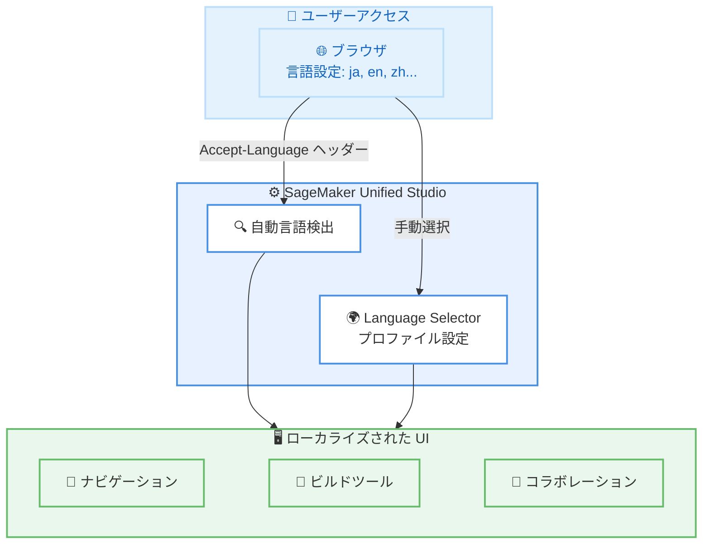

# Amazon SageMaker Unified Studio - 12 言語のローカライズ対応

**リリース日**: 2026 年 6 月 3 日
**サービス**: Amazon SageMaker Unified Studio
**機能**: ユーザーインターフェースの多言語対応 (12 言語)

📊 [このアップデートのインフォグラフィックを見る](https://takech9203.github.io/aws-news-summary/20260603-sagemaker-localization.html)

## 概要

Amazon SageMaker Unified Studio がユーザーインターフェース全体で 12 言語のローカライズ体験をサポートするようになった。対応言語は英語 (米国)、中国語 (簡体字・繁体字)、フランス語、ドイツ語、インドネシア語、イタリア語、日本語、韓国語、ポルトガル語 (ブラジル)、スペイン語、トルコ語である。

このアップデートにより、グローバルチームのデータエンジニア、アナリスト、データサイエンティストが最も使い慣れた言語で SageMaker Unified Studio のナビゲーション、構築、コラボレーションを行えるようになった。言語設定はブラウザのデフォルト言語設定から自動検出されるほか、プロファイル設定の「Language selector」から手動で選択することも可能である。

**アップデート前の課題**

- SageMaker Unified Studio の UI が英語のみで提供されており、英語を母語としないユーザーにとって操作の障壁があった
- グローバルチームでの利用時に、メニューやボタンの英語表記が作業効率を低下させるケースがあった
- 各国のデータ専門家がツールの学習コストに余分な時間を費やしていた

**アップデート後の改善**

- 12 言語でのネイティブな UI 体験が可能になり、操作時の摩擦が大幅に軽減された
- ブラウザ設定による自動言語検出で、追加設定なしに母語での利用が開始できる
- プロファイル設定から手動で言語を切り替えられるため、ユーザーの好みに柔軟に対応

## アーキテクチャ図

ブラウザの言語設定から自動検出するか、プロファイル設定から手動で言語を選択し、SageMaker Unified Studio の UI 全体がローカライズされた状態で表示される。

## サービスアップデートの詳細

### 主要機能

1. **12 言語のフル UI ローカライズ**
   - SageMaker Unified Studio の全画面にわたるローカライズ
   - ナビゲーション、メニュー、ボタン、ダイアログ、エラーメッセージなど UI 全体が対象
   - 選択した言語はセッション全体を通じて一貫して適用

2. **自動言語検出**
   - ブラウザのデフォルト言語設定 (Accept-Language ヘッダー) から優先言語を自動判定
   - 初回アクセス時から設定不要で母語の UI が表示される
   - ブラウザ設定を変更すれば自動的に UI 言語も切り替わる

3. **手動言語選択**
   - プロファイル設定内の「Language selector」から言語を指定可能
   - ユーザーごとに個別の言語設定を保持
   - ブラウザ設定と異なる言語を使いたい場合に有効

## 技術仕様

### 対応言語一覧

| 言語 | ロケールコード | 備考 |
|------|---------------|------|
| English (American) | en-US | デフォルト |
| Chinese (Simplified) | zh-CN | 簡体字 |
| Chinese (Traditional) | zh-TW | 繁体字 |
| French | fr | - |
| German | de | - |
| Indonesian | id | - |
| Italian | it | - |
| Japanese | ja | - |
| Korean | ko | - |
| Portuguese (Brazilian) | pt-BR | ブラジルポルトガル語 |
| Spanish | es | - |
| Turkish | tr | - |

### 対応ドメインタイプ

| ドメインタイプ | サポート状況 |
|---------------|-------------|
| AWS IAM Identity Center ベース | 対応 |
| IAM ベース | 対応 |

## 設定方法

### 前提条件

1. Amazon SageMaker Unified Studio が利用可能なリージョンの AWS アカウント
2. SageMaker Unified Studio ドメインへのアクセス権限 (IAM Identity Center または IAM ベース)
3. 対応言語に設定されたブラウザ (自動検出の場合)

### 手順

#### ステップ 1: 自動検出で利用する場合

ブラウザの言語設定を確認し、使用したい言語が最優先に設定されていることを確認する。

- **Chrome**: 設定 > 言語 > 優先する言語の順序を変更
- **Firefox**: 設定 > 一般 > 言語 > 優先する言語を選択
- **Edge**: 設定 > 言語 > 優先する言語を上位に移動

設定後、SageMaker Unified Studio にアクセスすると、自動的にブラウザの言語設定に基づいた UI が表示される。

#### ステップ 2: 手動で言語を選択する場合

1. SageMaker Unified Studio にログイン
2. 画面右上のプロファイルアイコンをクリック
3. 「Language selector」を選択
4. 一覧から使用したい言語を選択
5. 選択した言語が UI 全体に即座に反映される

手動選択はブラウザの言語設定よりも優先される。一度設定すれば、次回以降のアクセスでも同じ言語設定が維持される。

## メリット

### ビジネス面

- **グローバルチームの生産性向上**: 母語での操作により、ツール習得時間の短縮と日常業務の効率化が実現する
- **オンボーディングコストの削減**: 新規ユーザーが英語の壁なく直感的にツールを使い始められるため、トレーニング工数が削減される
- **グローバル展開の促進**: 12 言語対応により、多国籍企業での SageMaker Unified Studio の標準ツール化が容易になる

### 技術面

- **設定不要の自動検出**: ブラウザ設定を活用した自動言語検出により、管理者による個別設定が不要
- **全ドメインタイプに対応**: IAM Identity Center と IAM の両方のドメインタイプで利用可能なため、既存環境への影響がない
- **全リージョン統一対応**: SageMaker Unified Studio が利用可能な全リージョンで同等の多言語体験を提供

## デメリット・制約事項

### 制限事項

- ドキュメントや API レスポンスのローカライズは含まれず、UI のみが対象
- カスタムコンポーネントやユーザー作成コンテンツのテキストは翻訳されない
- 12 言語以外の言語 (アラビア語、ヒンディー語、ロシア語など) は未対応

### 考慮すべき点

- 技術用語の翻訳が言語によっては不自然に感じられる可能性がある (例: 英語の専門用語がそのままカタカナ化されるケース)
- チーム内で異なる言語を使用する場合、画面共有やトラブルシューティング時に表示が異なることに注意が必要
- ブラウザの言語設定を複数言語に設定している場合、意図しない言語が検出される可能性がある

## ユースケース

### ユースケース 1: 日本語環境での機械学習開発

**シナリオ**: 日本のデータサイエンスチームが SageMaker Unified Studio を使用して機械学習モデルの開発・デプロイを行う。チームメンバーの大半が日本語話者であり、英語 UI が業務効率の低下要因となっていた。

**効果**: 日本語 UI により、メニュー操作やエラーメッセージの理解が迅速になり、開発サイクルが短縮される。新規参画メンバーのオンボーディング期間も短縮される。

### ユースケース 2: 多国籍チームでのデータ分析プロジェクト

**シナリオ**: ドイツ、ブラジル、韓国に拠点を持つグローバル企業が、各拠点のデータアナリストに共通のデータ分析プラットフォームとして SageMaker Unified Studio を提供する。

**効果**: 各拠点のアナリストが母語 (ドイツ語、ポルトガル語、韓国語) で操作できるため、ツール導入の心理的障壁が低減し、プラットフォーム統一による分析品質の向上が実現する。

### ユースケース 3: インドネシア市場向けサービス開発

**シナリオ**: インドネシア市場向けの AI サービスを開発するスタートアップが、現地のデータエンジニアを採用して SageMaker Unified Studio 上でデータパイプラインを構築する。

**効果**: インドネシア語での UI 対応により、現地エンジニアの即戦力化が促進され、英語トレーニングへの投資を最小化しながら開発速度を維持できる。

## 料金

この多言語対応機能は SageMaker Unified Studio の標準機能として提供され、追加料金は発生しない。SageMaker Unified Studio 自体の利用料金は従来通りである。

## 利用可能リージョン

Amazon SageMaker Unified Studio が利用可能な全ての AWS リージョンで利用可能。IAM Identity Center ベースおよび IAM ベースの両方のドメインタイプで対応している。

## 関連サービス・機能

- **Amazon SageMaker Unified Studio**: データエンジニアリング、分析、ML 開発を統合したプラットフォーム
- **AWS IAM Identity Center**: SageMaker Unified Studio へのシングルサインオン認証を提供
- **Amazon SageMaker Studio**: SageMaker Unified Studio の前身となる統合開発環境

## 参考リンク

- 📊 [インフォグラフィック](https://takech9203.github.io/aws-news-summary/20260603-sagemaker-localization.html)
- [公式発表 (What's New)](https://aws.amazon.com/about-aws/whats-new/2026/06/sagemaker-localization)
- [ドキュメント - 表示言語の設定](https://docs.aws.amazon.com/sagemaker-unified-studio/latest/userguide/navigating-sagemaker-unified-studio.html#display-language)

## まとめ

Amazon SageMaker Unified Studio の 12 言語ローカライズ対応は、グローバルチームでのデータ活用を促進する重要なアップデートである。特に日本語を含むアジア言語のサポートにより、国内のデータサイエンティストやエンジニアが母語で快適に作業できるようになった。既存環境への影響なく追加料金も不要なため、SageMaker Unified Studio を利用している組織はブラウザ設定またはプロファイル設定から即座に多言語対応を活用することを推奨する。
