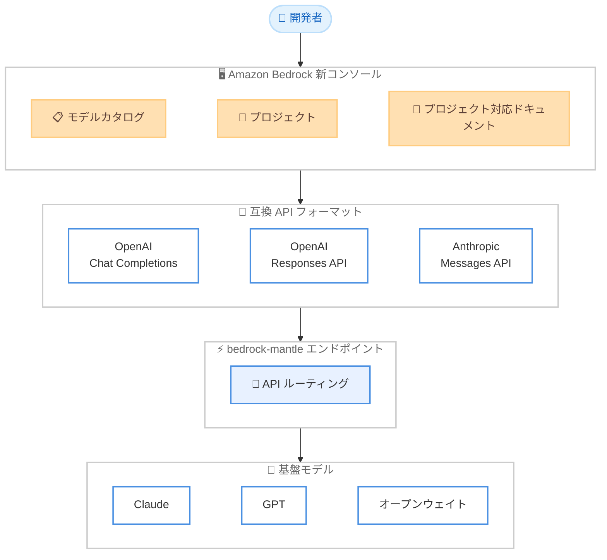

# Amazon Bedrock - リデザインコンソール (OpenAI / Anthropic 互換 API 対応)

**リリース日**: 2026 年 6 月 4 日
**サービス**: Amazon Bedrock
**機能**: リデザインコンソール (bedrock-mantle エンドポイント最適化)

📊 [このアップデートのインフォグラフィックを見る](https://takech9203.github.io/aws-news-summary/20260604-amazon-bedrock-redesigned-console-optimized-openai-anthropic-compatible-apis.html)

## 概要

Amazon Bedrock が、OpenAI 互換 API および Anthropic 互換 API に最適化された新しいコンソールエクスペリエンスを発表した。この新コンソールは、開発者が基盤モデルを使ってアプリケーションを構築する際の実際のワークフロー (実験、イテレーション、スケーリング) に合わせて設計されている。

新しいコンソールは bedrock-mantle エンドポイント向けに最適化されており、OpenAI Responses API、OpenAI Chat Completions API、Anthropic Messages API をサポートする。これにより、既存の OpenAI や Anthropic のクライアントライブラリをそのまま使用して Amazon Bedrock 上のモデルにリクエストを送信できる。

**アップデート前の課題**

- 既存の OpenAI や Anthropic のコードベースを Bedrock に移行する際、API フォーマットの違いによるコード書き換えが必要だった
- モデルの比較に際して、ドキュメント、制限計算ツールなど複数のリソースを横断して確認する必要があった
- コンソールから取得したコードスニペットを実際のアプリケーションで使用する際に、エンドポイントやモデル ID の手動置換が必要だった

**アップデート後の改善**

- bedrock-mantle エンドポイントを通じて、既存の OpenAI / Anthropic クライアントライブラリをそのまま使用可能になった
- モデルカタログで Claude、GPT、オープンウェイトモデルを機能、モダリティ、コンテキストウィンドウ、サービスクォータの観点で一覧比較できるようになった
- プロジェクト単位でコードサンプルが自動的にモデル ID、リージョン、エンドポイント URL、API キーで事前設定され、コピーしてそのまま実行可能になった

## アーキテクチャ図



開発者は新コンソールを通じて、使い慣れた API フォーマットを選択し、bedrock-mantle エンドポイント経由で複数の基盤モデルに統一的にアクセスできる。

## サービスアップデートの詳細

### 主要機能

1. **統合モデルカタログ**
   - Claude、GPT、オープンウェイトモデルを含む全 Bedrock モデルを一覧表示
   - 機能、モダリティサポート、コンテキストウィンドウ、サービスクォータをサイドバイサイドで比較
   - ドキュメントや制限計算ツールを横断する必要がなくなる

2. **プロジェクトベースのワークフロー**
   - 作業をプロジェクト単位で整理
   - プロジェクト内で評価の実行とユーセージインサイトの確認が可能
   - 生成 AI アプリケーション構築のライフサイクルに沿ったストリームラインなワークフロー

3. **プロジェクト対応ドキュメント**
   - コードサンプル、SDK スニペット、API リファレンスがプロジェクトの設定で自動的に事前設定
   - モデル ID、リージョン、bedrock-mantle エンドポイント URL、API キーリファレンスが自動挿入
   - モデルや設定を変更すると、ドキュメント内のスニペットもリアルタイムで更新

4. **互換 API サポート**
   - OpenAI Chat Completions API フォーマット
   - OpenAI Responses API フォーマット
   - Anthropic Messages API フォーマット
   - 既存のクライアントライブラリをそのまま利用可能

## 技術仕様

### サポートされる API フォーマット

| API フォーマット | 説明 | 対応クライアント |
|------|------|------|
| OpenAI Chat Completions | チャット形式の補完リクエスト | OpenAI Python/Node SDK |
| OpenAI Responses API | レスポンス生成 API | OpenAI Python/Node SDK |
| Anthropic Messages API | メッセージベースの対話 API | Anthropic Python/TypeScript SDK |

### API 変更履歴

| 日付 | サービス | 変更内容 |
|------|----------|----------|
| 2026/05/29 | [Amazon Bedrock](https://awsapichanges.com/archive/changes/96246a-bedrock.html) | 3 updated api methods - Automated Reasoning checks のビルドワークフロー追加 |
| 2026/05/29 | [Amazon Bedrock AgentCore Control](https://awsapichanges.com/archive/changes/96246a-bedrock-agentcore-control.html) | 9 updated api methods - Secrets Manager 参照によるクレデンシャルプロバイダー設定 |

### 認証方式

```bash
# bedrock-mantle エンドポイントでの認証には Amazon Bedrock API キーを使用
# 既存の OpenAI クライアントライブラリを使用する例
export OPENAI_API_KEY="your-bedrock-api-key"
export OPENAI_BASE_URL="https://bedrock-mantle.us-east-1.amazonaws.com/v1"
```

## 設定方法

### 前提条件

1. AWS アカウント
2. Amazon Bedrock へのアクセス権限
3. bedrock-mantle エンドポイントが提供されているリージョンの利用

### 手順

#### ステップ 1: コンソールへのアクセス

AWS マネジメントコンソールにサインインし、Amazon Bedrock を開き、ナビゲーションから新しいエクスペリエンスを選択する。

#### ステップ 2: プロジェクトの作成

プロジェクトを作成し、使用するモデルを選択する。モデルカタログから機能やコンテキストウィンドウを比較しながら最適なモデルを選択できる。

#### ステップ 3: API リクエストの送信

```python
# OpenAI 互換クライアントを使用した例
from openai import OpenAI

client = OpenAI(
    api_key="your-bedrock-api-key",
    base_url="https://bedrock-mantle.us-east-1.amazonaws.com/v1"
)

response = client.chat.completions.create(
    model="anthropic.claude-sonnet-4-20250514-v1:0",
    messages=[
        {"role": "user", "content": "Hello, world!"}
    ]
)
print(response.choices[0].message.content)
```

コンソールのプロジェクト対応ドキュメントから、モデル ID やエンドポイント URL が事前設定されたスニペットをコピーしてそのまま実行できる。

#### ステップ 4: Anthropic 互換クライアントの使用

```python
# Anthropic 互換クライアントを使用した例
import anthropic

client = anthropic.Anthropic(
    api_key="your-bedrock-api-key",
    base_url="https://bedrock-mantle.us-east-1.amazonaws.com"
)

message = client.messages.create(
    model="anthropic.claude-sonnet-4-20250514-v1:0",
    max_tokens=1024,
    messages=[
        {"role": "user", "content": "Hello, world!"}
    ]
)
print(message.content[0].text)
```

Anthropic のクライアントライブラリをそのまま使用し、ベース URL のみを bedrock-mantle エンドポイントに向けることで Bedrock 上のモデルにアクセスできる。

## メリット

### ビジネス面

- **移行コストの削減**: 既存の OpenAI / Anthropic ベースのアプリケーションをコード変更最小限で Bedrock に移行可能
- **開発速度の向上**: プロジェクト対応ドキュメントにより、コピー&ペーストですぐに動作するコードが得られる
- **マルチモデル戦略の実現**: 単一のエンドポイントから複数プロバイダーのモデルにアクセスし、ベンダーロックインを回避

### 技術面

- **API 互換性**: OpenAI SDK や Anthropic SDK をそのまま使用でき、既存のコードベースへの影響が最小限
- **統合管理**: プロジェクト単位での評価、使用量の可視化、ドキュメント管理が一元化
- **シームレスなモデル切り替え**: コンソール上でモデルを変更すると、関連するコードスニペットも自動更新

## デメリット・制約事項

### 制限事項

- bedrock-mantle エンドポイントが提供されているリージョンでのみ利用可能
- API キーベースの認証が必要 (IAM 認証とは別の仕組み)
- すべての OpenAI / Anthropic API 機能が完全にサポートされているとは限らない

### 考慮すべき点

- 既存の Bedrock ネイティブ API (InvokeModel 等) は引き続き利用可能であり、新コンソールは追加のオプション
- API キーの管理とローテーションのセキュリティポリシーを検討する必要がある
- モデル固有の機能 (一部のパラメータなど) は互換 API では利用できない場合がある

## ユースケース

### ユースケース 1: 既存 OpenAI アプリケーションの Bedrock 移行

**シナリオ**: OpenAI API を使用している既存のチャットボットアプリケーションを、エンタープライズレベルのセキュリティと複数モデルへのアクセスのために Bedrock に移行したい。

**実装例**:
```python
# 変更前: OpenAI 直接呼び出し
client = OpenAI(api_key="sk-...")

# 変更後: Bedrock bedrock-mantle エンドポイント経由
client = OpenAI(
    api_key="your-bedrock-api-key",
    base_url="https://bedrock-mantle.us-east-1.amazonaws.com/v1"
)
# 以降のコードは変更不要
```

**効果**: エンドポイントと API キーの変更のみで移行が完了し、AWS のセキュリティ、コンプライアンス、スケーラビリティの恩恵を受けられる。

### ユースケース 2: マルチモデル評価とベンチマーク

**シナリオ**: 生成 AI アプリケーションに最適なモデルを選定するため、複数のモデルを同一条件で評価したい。

**実装例**:
```python
models = [
    "anthropic.claude-sonnet-4-20250514-v1:0",
    "openai.gpt-4o",
    "meta.llama-3-70b-instruct"
]

for model in models:
    response = client.chat.completions.create(
        model=model,
        messages=[{"role": "user", "content": test_prompt}]
    )
    evaluate(model, response)
```

**効果**: 統一された API フォーマットにより、モデル間の公平な比較が容易になり、プロジェクト内で評価結果を一元管理できる。

### ユースケース 3: 段階的なモデルアップグレード

**シナリオ**: 本番環境で使用中のモデルを新しいバージョンに段階的に切り替えたい。

**実装例**:
```python
# コンソールでモデルを変更すると、
# プロジェクト対応ドキュメントのスニペットが自動更新される
# コード側ではモデル ID のみ変更
response = client.chat.completions.create(
    model="anthropic.claude-sonnet-4-20250514-v1:0",  # 新モデルに切り替え
    messages=messages
)
```

**効果**: コンソールのモデルカタログで新旧モデルを比較した上で、最小限のコード変更でアップグレードできる。

## 料金

bedrock-mantle エンドポイント経由でのモデル利用料金は、従来の Amazon Bedrock の料金体系に準じる。コンソール自体の追加料金は発生しない。

### 料金例

| モデル | 入力トークン単価 | 出力トークン単価 |
|--------|------------------|------------------|
| Claude Sonnet 4 | $3.00 / 100 万トークン | $15.00 / 100 万トークン |
| Claude Haiku | $0.80 / 100 万トークン | $4.00 / 100 万トークン |

※ 最新の料金は Amazon Bedrock 料金ページを参照。

## 利用可能リージョン

bedrock-mantle エンドポイントが提供されている以下のリージョンで利用可能。

- US East (N. Virginia, Ohio)
- US West (Oregon)
- Asia Pacific (Jakarta, Mumbai, Sydney, Tokyo)
- Europe (Frankfurt, Ireland, London, Milan, Stockholm)
- South America (Sao Paulo)

## 関連サービス・機能

- **Amazon Bedrock API キー**: bedrock-mantle エンドポイントへの認証に使用する API キー管理機能
- **Amazon Bedrock Model Evaluation**: モデルの品質をプログラムで評価するサービス
- **Amazon Bedrock Guardrails**: 生成 AI アプリケーションにセーフガードを適用するための機能

## 参考リンク

- 📊 [インフォグラフィック](https://takech9203.github.io/aws-news-summary/20260604-amazon-bedrock-redesigned-console-optimized-openai-anthropic-compatible-apis.html)
- [公式発表 (What's New)](https://aws.amazon.com/about-aws/whats-new/2026/06/amazon-bedrock-redesigned-console-optimized-openai-anthropic-compatible-apis/)
- [Amazon Bedrock コンソール](https://console.aws.amazon.com/bedrock/)
- [Amazon Bedrock ドキュメント](https://docs.aws.amazon.com/bedrock/)
- [Amazon Bedrock 料金ページ](https://aws.amazon.com/bedrock/pricing/)

## まとめ

Amazon Bedrock の新コンソールは、OpenAI や Anthropic の API フォーマットに慣れた開発者が Bedrock を採用する際の障壁を大幅に下げるアップデートである。bedrock-mantle エンドポイントとプロジェクト対応ドキュメントにより、既存のコードベースをほぼ変更なしで Bedrock に移行できるため、マルチモデル戦略を検討している組織は早期の検証を推奨する。
