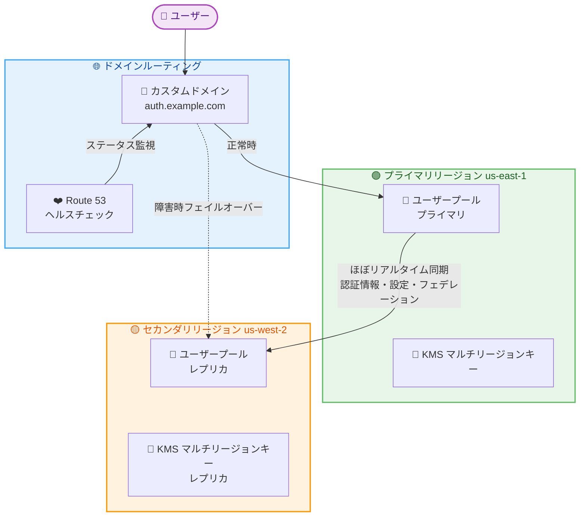

# Amazon Cognito - マルチリージョンレプリケーション

**リリース日**: 2026 年 6 月 4 日
**サービス**: Amazon Cognito
**機能**: Multi-Region Replication

📊 [このアップデートのインフォグラフィックを見る](https://takech9203.github.io/aws-news-summary/20260604-amazon-cognito-multi-region.html)

## 概要

Amazon Cognito がマルチリージョンレプリケーション (MRR) をサポートし、ユーザープールのデータをセカンダリリージョンにほぼリアルタイムで同期できるようになった。これにより、リージョン障害時にもユーザー認証を継続できる災害復旧 (DR) 機能が実現する。

レプリケーション対象には、ユーザーの認証情報 (パスワード含む)、ユーザープール設定、フェデレーション構成が含まれる。プライマリリージョンで障害が発生した場合、Route 53 ヘルスチェックと連携してセカンダリユーザープールへトラフィックを自動的にフェイルオーバーできる。サインイン済みのユーザーは再認証なしでアプリケーションへのアクセスを継続でき、登録済みユーザーは既存の認証情報でサインインできる。

本機能は Essentials または Plus 機能ティアのユーザープール向けのアドオンとして提供され、東京リージョンを含む 16 リージョンで利用可能である。

**アップデート前の課題**

- Cognito ユーザープールは単一リージョンに存在し、リージョン障害時に認証サービスが停止するリスクがあった
- マルチリージョンの認証基盤を構築するには、複数のユーザープール間でユーザーデータを独自に同期する仕組みが必要だった
- フェイルオーバー時にユーザーの再認証が必要となり、ユーザーエクスペリエンスが低下する可能性があった

**アップデート後の改善**

- ユーザープールのデータがセカンダリリージョンにほぼリアルタイムで自動同期される
- Route 53 ヘルスチェックと統合されたフェイルオーバーにより、リージョン障害時も認証サービスを継続できる
- サインイン済みユーザーは再認証不要、登録済みユーザーは既存の認証情報でサインイン可能

## アーキテクチャ図



プライマリリージョンのユーザープールからセカンダリリージョンのレプリカへ、ユーザーデータと設定がほぼリアルタイムで同期される。Route 53 ヘルスチェックが異常を検知すると、カスタムドメイン経由のトラフィックが自動的にセカンダリリージョンへフェイルオーバーする。

## サービスアップデートの詳細

### 主要機能

1. **ほぼリアルタイムのデータレプリケーション**
   - ユーザーの認証情報 (パスワード含む)、属性、プロファイルを同期
   - ユーザープール設定を自動的にセカンダリへ伝播
   - フェデレーション構成 (SAML/OIDC/ソーシャル IdP) を同期
   - 結果整合性モデルで動作し、わずかな遅延が発生する可能性あり

2. **自動フェイルオーバー**
   - Route 53 ヘルスチェックとの統合によるフェイルオーバー制御
   - カスタムドメインを介したマネージドログイン、フェデレーション、M2M 認可フローに対応
   - ヘルスチェックが正常に戻ると自動的にプライマリへトラフィックを復帰
   - API/SDK 利用の場合はアプリケーション側でルーティング制御が必要

3. **セカンダリリージョンでの認証継続**
   - ユーザー名/パスワード認証
   - ソーシャル ID プロバイダーとのフェデレーション
   - SAML/OIDC プロバイダーとのフェデレーション
   - マシン間 (M2M) 認可フロー
   - サインイン済みユーザーの再認証不要

4. **リージョン固有の設定**
   - メール設定は各リージョンで独立して構成可能
   - SMS 設定はリージョンごとに設定
   - Lambda トリガーはリージョンごとに設定
   - AWS WAF Web ACL はリージョンごとに関連付け可能
   - タグとログエクスポート設定もリージョン固有

## 技術仕様

### 前提条件と要件

| 項目 | 詳細 |
|------|------|
| 機能ティア | Essentials または Plus (Lite は不可) |
| KMS キー | マルチリージョン カスタマーマネージドキーが必須 |
| OIDC Issuer | マルチリージョン OIDC Issuer の設定が必要 |
| カスタムドメイン | フェイルオーバーにはカスタムドメインが必要 |
| レプリカ数 | ユーザーディレクトリあたり最大 1 つのセカンダリレプリカ |
| インフラ要件 | 次世代インフラストラクチャへの移行が必要 |

### API 変更履歴

| 日付 | サービス | 変更内容 |
|------|----------|----------|
| 2026/06/01 | [cognito-idp](https://awsapichanges.com/archive/changes/8fdb47-cognito-idp.html) | 4 new 7 updated api methods - マルチリージョンレプリケーションと CMK サポートの追加 |

### 新規 API メソッド

| メソッド名 | 説明 |
|-----------|------|
| `CreateUserPoolReplica` | セカンダリリージョンにレプリカユーザープールを作成 |
| `DeleteUserPoolReplica` | レプリカユーザープールを削除 |
| `ListUserPoolReplicas` | ユーザープールのレプリカ一覧を取得 |
| `UpdateUserPoolReplica` | レプリカのステータスを更新 (ACTIVE/INACTIVE) |

### 更新された API メソッド

| メソッド名 | 変更内容 |
|-----------|----------|
| `CreateUserPool` | `KeyConfiguration`、`IssuerConfiguration` パラメータ追加 |
| `UpdateUserPool` | `KeyConfiguration`、`IssuerConfiguration` パラメータ追加 |
| `DescribeUserPool` | レスポンスに `KeyConfiguration`、`IssuerConfiguration` 追加 |
| `ListUserPools` | レスポンスに `ReplicaRegions` フィールド追加 |
| `CreateUserPoolDomain` | `Routing.Failover` パラメータ追加 |
| `UpdateUserPoolDomain` | `Routing.Failover` パラメータ追加 |
| `DescribeUserPoolDomain` | レスポンスに `Routing.Failover` 情報追加 |

### レプリカステータス

```json
{
  "UserPoolReplica": {
    "RegionName": "us-west-2",
    "Status": "CREATING|ACTIVE|INACTIVE|DELETING",
    "Role": "PRIMARY|SECONDARY",
    "UserPoolArn": "arn:aws:cognito-idp:us-west-2:111122223333:userpool/us-east-1_EXAMPLE"
  }
}
```

## 設定方法

### 前提条件

1. ユーザープールが Essentials または Plus 機能ティアであること
2. マルチリージョン カスタマーマネージドキー (CMK) が AWS KMS で作成済みであること
3. マルチリージョン OIDC Issuer が設定済みであること
4. ユーザープールが次世代インフラストラクチャ上にあること

### 手順

#### ステップ 1: レプリカユーザープールの作成

```bash
aws cognito-idp create-user-pool-replica \
  --user-pool-id us-east-1_EXAMPLE \
  --region-name us-west-2 \
  --user-pool-tags Environment=Production,Application=MyApp
```

プライマリユーザープール (us-east-1) のレプリカをセカンダリリージョン (us-west-2) に作成する。レプリカは `CREATING` ステータスで開始され、準備完了後に `INACTIVE` ステータスに遷移する。

#### ステップ 2: フェイルオーバー用のドメインルーティング設定

```bash
aws cognito-idp update-user-pool-domain \
  --domain auth.example.com \
  --user-pool-id us-east-1_EXAMPLE \
  --managed-login-version 2 \
  --custom-domain-config CertificateArn=arn:aws:acm:us-east-1:111122223333:certificate/example \
  --routing '{"Failover":{"SecondaryRegion":"us-west-2","PrimaryRoute53HealthCheckId":"health-check-id"}}'
```

カスタムドメインに Route 53 ヘルスチェックを関連付け、フェイルオーバールーティングを構成する。ヘルスチェックが異常を検知すると、トラフィックがセカンダリリージョンへルーティングされる。

#### ステップ 3: レプリカのアクティベーション

```bash
aws cognito-idp update-user-pool-replica \
  --user-pool-id us-east-1_EXAMPLE \
  --region-name us-west-2 \
  --status ACTIVE
```

リージョン固有の設定 (メール、SMS、Lambda トリガーなど) を確認した後、レプリカを `ACTIVE` ステータスに変更して本番トラフィックを受け付け可能にする。

## メリット

### ビジネス面

- **認証サービスの高可用性**: リージョン障害時でもユーザーがアプリケーションにアクセスでき、ビジネスの継続性を確保
- **ユーザーエクスペリエンスの維持**: フェイルオーバー時に再認証が不要であり、ユーザーへの影響を最小化
- **コンプライアンス対応**: DR 要件が厳しい金融サービスやヘルスケア業界の規制要件に対応可能

### 技術面

- **マネージドレプリケーション**: 独自の同期メカニズムの構築・運用が不要
- **統合されたフェイルオーバー**: Route 53 ヘルスチェックとの統合により、自動フェイルオーバーを実現
- **共有ユーザープール ID**: プライマリとセカンダリで同じユーザープール ID を使用するため、アプリケーション側の変更が最小限
- **リージョン固有の柔軟な設定**: Lambda トリガーやメール設定をリージョンごとに最適化可能

## デメリット・制約事項

### 制限事項

- セカンダリユーザープールでは新規ユーザーの作成 (サインアップ、管理者作成) ができない
- セカンダリユーザープールではパスワードリセットやプロファイル変更ができない
- TOTP MFA はセカンダリレプリカでサポートされない
- ユーザーディレクトリあたり最大 1 つのセカンダリレプリカのみ
- 自動フェイルオーバーにはカスタムドメインが必須 (プレフィックスドメインでは不可)
- パスワード認証失敗のロックアウトカウントはリージョン間で同期されない
- 新しいフェデレーションユーザーは、プライマリで事前にサインインしていない場合、フェイルオーバー中にセカンダリでサインインできない

### 考慮すべき点

- マルチリージョン CMK の事前設定が必要であり、KMS の追加コストが発生する
- 結果整合性モデルのため、レプリケーションにわずかな遅延が発生する可能性がある
- 次世代インフラストラクチャへの移行が必要であり、一部のユーザープールはまだ対象外
- フェイルオーバー中はセカンダリの制限事項を考慮した UI/UX 設計が必要

## ユースケース

### ユースケース 1: グローバル SaaS アプリケーションの DR 対策

**シナリオ**: 東京リージョン (ap-northeast-1) をプライマリとするグローバル SaaS アプリケーションで、リージョン障害時にも認証サービスを継続したい。

**実装例**:
```bash
# 東京リージョンのユーザープールからオレゴンリージョンへレプリカを作成
aws cognito-idp create-user-pool-replica \
  --user-pool-id ap-northeast-1_EXAMPLE \
  --region-name us-west-2

# カスタムドメインにフェイルオーバールーティングを設定
aws cognito-idp update-user-pool-domain \
  --domain auth.myapp.com \
  --user-pool-id ap-northeast-1_EXAMPLE \
  --routing '{"Failover":{"SecondaryRegion":"us-west-2","PrimaryRoute53HealthCheckId":"hc-12345"}}'
```

**効果**: 東京リージョンで障害が発生した場合、数分以内にオレゴンリージョンへフェイルオーバーし、ユーザーの認証サービスを継続できる。

### ユースケース 2: 金融サービスの規制要件対応

**シナリオ**: 金融サービス企業が RTO (目標復旧時間) の厳しい規制要件を満たすため、認証基盤のマルチリージョン DR を構築する必要がある。

**実装例**:
```bash
# Route 53 ヘルスチェックの作成 (アプリケーションのエンドポイントを監視)
aws route53 create-health-check \
  --caller-reference "cognito-primary-$(date +%s)" \
  --health-check-config '{
    "Type": "HTTPS",
    "FullyQualifiedDomainName": "api.myfinapp.com",
    "Port": 443,
    "ResourcePath": "/health",
    "RequestInterval": 10,
    "FailureThreshold": 2
  }'

# レプリカをアクティベート
aws cognito-idp update-user-pool-replica \
  --user-pool-id us-east-1_EXAMPLE \
  --region-name eu-west-1 \
  --status ACTIVE
```

**効果**: ヘルスチェックが 2 回連続で失敗した場合に自動フェイルオーバーが発動し、厳しい RTO 要件を満たす認証基盤を実現できる。

### ユースケース 3: M2M 認証のマルチリージョン対応

**シナリオ**: マイクロサービスアーキテクチャで M2M (Machine-to-Machine) 認証を使用しており、認証サービスの停止がシステム全体に波及することを防止したい。

**実装例**:
```python
import boto3

# プライマリリージョンのクライアント
primary_client = boto3.client('cognito-idp', region_name='us-east-1')

# レプリカ一覧の確認
response = primary_client.list_user_pool_replicas(
    UserPoolId='us-east-1_EXAMPLE'
)

for replica in response['UserPoolReplicas']:
    print(f"Region: {replica['RegionName']}, "
          f"Status: {replica['Status']}, "
          f"Role: {replica['Role']}")
```

**効果**: M2M 認証のフェイルオーバーにより、バックエンドサービス間の認証が途切れることなく継続し、システム全体の可用性が向上する。

## 料金

マルチリージョンレプリケーションは、ベースのユーザープール料金に追加されるアドオン課金である。各ユニークユーザーはプライマリとセカンダリリージョン全体で 1 回のみカウントされる。

### 料金例

| 構成 | MAU 数 | アドオン月額料金 |
|------|--------|-----------------|
| Essentials + MRR | 10,000 MAU | $45 |
| Essentials + MRR | 100,000 MAU | $450 |
| Essentials + MRR | 500,000 MAU | $2,250 |

- **Essentials ティア**: MAU あたり $0.0045 のアドオン料金
- フェイルオーバーの発生有無にかかわらず、レプリケーション設定期間中は課金される
- 別途、マルチリージョン KMS キーの料金が発生する

## 利用可能リージョン

以下の 16 リージョンで利用可能。

| 地域 | リージョン |
|------|-----------|
| 米国東部 | オハイオ (us-east-2)、バージニア北部 (us-east-1) |
| 米国西部 | 北カリフォルニア (us-west-1)、オレゴン (us-west-2) |
| アジアパシフィック | ムンバイ (ap-south-1)、ソウル (ap-northeast-2)、シンガポール (ap-southeast-1)、シドニー (ap-southeast-2)、東京 (ap-northeast-1) |
| カナダ | 中部 (ca-central-1) |
| 欧州 | フランクフルト (eu-central-1)、アイルランド (eu-west-1)、ロンドン (eu-west-2)、パリ (eu-west-3)、ストックホルム (eu-north-1) |
| 南米 | サンパウロ (sa-east-1) |

## 関連サービス・機能

- **AWS KMS マルチリージョンキー**: レプリケーション対象のデータ暗号化に必須。プライマリとセカンダリリージョンで同じキーマテリアルを使用
- **Amazon Route 53 ヘルスチェック**: フェイルオーバーのトリガーとして使用。カスタムドメインのルーティング制御を担う
- **Amazon CloudFront**: カスタムドメインのエンドポイントとして機能し、マネージドログインページの配信を担当
- **AWS Certificate Manager (ACM)**: カスタムドメイン用の SSL/TLS 証明書の管理に使用

## 参考リンク

- 📊 [インフォグラフィック](https://takech9203.github.io/aws-news-summary/20260604-amazon-cognito-multi-region.html)
- [公式発表 (What's New)](https://aws.amazon.com/about-aws/whats-new/2026/06/amazon-cognito-multi-region/)
- [AWS Security Blog - Amazon Cognito unlocks advanced capabilities with next-generation infrastructure](https://aws.amazon.com/blogs/security/amazon-cognito-unlocks-advanced-capabilities-with-next-generation-infrastructure/)
- [ドキュメント - User Pool Multi-Region](https://docs.aws.amazon.com/cognito/latest/developerguide/user-pool-multi-region.html)
- [料金ページ](https://aws.amazon.com/cognito/pricing/)

## まとめ

Amazon Cognito のマルチリージョンレプリケーションは、認証基盤のリージョン障害対策として待望されていた機能である。Route 53 ヘルスチェックとの統合による自動フェイルオーバー、ほぼリアルタイムのデータ同期、そしてユーザーの再認証不要という特長により、ミッションクリティカルなアプリケーションの可用性を大幅に向上できる。特に金融サービスやヘルスケアなど厳しい DR 要件を持つ業界にとって、マネージドサービスとして提供されることで運用負荷を最小限に抑えながら高い回復力を実現できる点が大きな価値となる。
