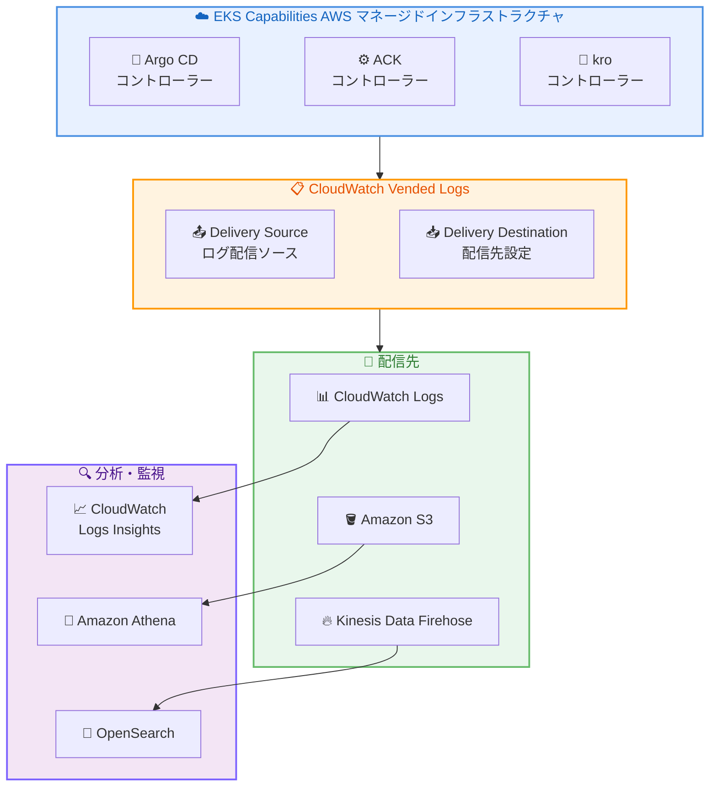

# Amazon EKS Capabilities - Amazon CloudWatch Vended Logs によるログ配信サポート

**リリース日**: 2026 年 6 月 4 日
**サービス**: Amazon Elastic Kubernetes Service (Amazon EKS)
**機能**: EKS Capabilities コントローラーログの CloudWatch Vended Logs 配信

📊 [このアップデートのインフォグラフィックを見る](https://takech9203.github.io/aws-news-summary/20260604-amazon-eks-capabilities-logging.html)

## 概要

Amazon EKS Capabilities が Amazon CloudWatch Vended Logs のログ配信ソースとして構成可能になった。これにより、AWS マネージドインフラストラクチャで稼働するマネージドコントローラーからログを収集し、EKS Capabilities の監視とトラブルシューティングが可能になる。

対象となる EKS Capabilities は、Argo CD、AWS Controllers for Kubernetes (ACK)、および kro (Kubernetes Resource Orchestrator) の 3 つ。これらのコントローラーは顧客のクラスター内ではなく AWS マネージドインフラストラクチャ上で動作するため、従来はログへのアクセスが制限されていた。本アップデートにより、CloudWatch APIs または AWS コンソールからログ配信を有効化し、CloudWatch Logs、Amazon S3、Amazon Kinesis Data Firehose のいずれかの宛先にログを配信できるようになった。

EKS Capabilities を使用するプラットフォームチームやクラスター管理者にとって、コントローラーの動作を可視化し、リコンシリエーションの問題やデプロイメントエラーを迅速に特定できる重要なアップデートである。

**アップデート前の課題**

- EKS Capabilities のコントローラーは AWS マネージドインフラストラクチャ上で動作しており、ログに直接アクセスする手段がなかった
- Argo CD、ACK、kro のリコンシリエーションエラーやデプロイ失敗時に根本原因の特定が困難だった
- AWS マネージドコンポーネントの動作状況を監視するための統合的なログソリューションが存在しなかった
- 問題発生時に AWS サポートに問い合わせる以外の調査手段が限られていた

**アップデート後の改善**

- CloudWatch Vended Logs を通じてコントローラーログにアクセス可能になった
- ログを CloudWatch Logs、S3、Kinesis Data Firehose の 3 つの宛先に配信可能
- ログタイプごとに個別に配信設定が可能で、必要なログだけを選択的に収集できる
- CloudWatch Logs Insights を使用してログの検索・分析が可能になり、トラブルシューティングが迅速化された
- 構造化 JSON 形式でログが配信され、コントローラー名やリコンシリエーション識別子等の運用情報が含まれる

## アーキテクチャ図



EKS Capabilities のマネージドコントローラーから CloudWatch Vended Logs を経由して、3 種類の配信先にログが転送される構成を示している。配信先に応じて、CloudWatch Logs Insights、Amazon Athena、OpenSearch などの分析ツールと連携可能。

## サービスアップデートの詳細

### 主要機能

1. **CloudWatch Vended Logs 配信ソース対応**
   - 各 EKS Capability を CloudWatch Vended Logs の配信ソースとして登録可能
   - `PutDeliverySource` API で Capability ARN を指定してソースを作成
   - 1 つの Capability から複数の宛先への同時配信が可能
   - 複数の Capability から同一宛先への集約配信も対応

2. **構造化ログ配信**
   - JSON 形式の構造化ログで配信される
   - ログレベル、メッセージ、コントローラー名、リコンシリエーション識別子などの運用フィールドを含む
   - AWS 内部メタデータはフィルタリングされ、運用に関連するコンテンツのみが配信される
   - ACK ログには `controllerGroup` フィールドが含まれ、サービスコントローラーの識別が可能

3. **Capability ごとの個別ログタイプ**
   - ACK: `EKS_CAPABILITY_ACK_LOGS` (全 ACK サービスコントローラーを網羅)
   - kro: `EKS_CAPABILITY_KRO_LOGS`
   - Argo CD: 5 つの個別ログタイプ (Application、ApplicationSet、CommitServer、RepoServer、Server)
   - ログタイプごとに独立した配信設定が可能

4. **3 種類の配信先サポート**
   - Amazon CloudWatch Logs: リアルタイムクエリと Logs Insights による分析
   - Amazon S3: 長期保存と Athena による分析
   - Amazon Kinesis Data Firehose: ストリーミング処理と OpenSearch 等への転送

## 技術仕様

### サポートされるログタイプ

| Capability | ログタイプ | 説明 |
|------|----------|----------|
| ACK | `EKS_CAPABILITY_ACK_LOGS` | 全 ACK サービスコントローラーのログ |
| kro | `EKS_CAPABILITY_KRO_LOGS` | kro コントローラーのログ |
| Argo CD | `EKS_CAPABILITY_ARGOCD_APPLICATION_LOGS` | Application コントローラーのログ |
| Argo CD | `EKS_CAPABILITY_ARGOCD_APPLICATIONSET_LOGS` | ApplicationSet コントローラーのログ |
| Argo CD | `EKS_CAPABILITY_ARGOCD_COMMITSERVER_LOGS` | CommitServer のログ |
| Argo CD | `EKS_CAPABILITY_ARGOCD_REPOSERVER_LOGS` | RepoServer のログ |
| Argo CD | `EKS_CAPABILITY_ARGOCD_SERVER_LOGS` | Argo CD Server のログ |

### API 変更履歴

本アップデートに関連する直近 7 日間の EKS および CloudWatch の API 変更は確認されなかった。CloudWatch Vended Logs の既存 API (`PutDeliverySource`、`PutDeliveryDestination`、`CreateDelivery`) を使用してログ配信を設定する。

### 必要な IAM 権限

```json
{
  "Version": "2012-10-17",
  "Statement": [
    {
      "Effect": "Allow",
      "Action": [
        "logs:PutDeliverySource",
        "logs:PutDeliveryDestination",
        "logs:CreateDelivery",
        "logs:GetDelivery",
        "logs:DeleteDelivery",
        "logs:DescribeDeliveries",
        "logs:DescribeDeliverySources",
        "logs:DescribeDeliveryDestinations"
      ],
      "Resource": "*"
    },
    {
      "Effect": "Allow",
      "Action": [
        "eks:DescribeCapability"
      ],
      "Resource": "arn:aws:eks:*:*:capability/*"
    }
  ]
}
```

## 設定方法

### 前提条件

1. EKS クラスターに 1 つ以上の EKS Capability (ACK、Argo CD、または kro) が作成済みであること
2. CloudWatch Vended Logs の配信設定に必要な IAM 権限があること
3. 配信先となる CloudWatch Logs ロググループ、S3 バケット、または Kinesis Data Firehose 配信ストリームが作成済みであること

### 手順

#### ステップ 1: Capability ARN の取得

```bash
aws eks describe-capability \
  --region us-east-1 \
  --cluster-name my-cluster \
  --capability-name my-ack-capability \
  --query 'capability.capabilityArn' --output text
```

対象の EKS Capability の ARN を取得する。この ARN はログ配信ソースの登録に使用する。

#### ステップ 2: 配信ソースの作成

```bash
aws logs put-delivery-source \
  --name "my-ack-logs-source" \
  --resource-arn "arn:aws:eks:us-east-1:123456789012:capability/my-cluster/ack/my-ack-capability" \
  --log-type "EKS_CAPABILITY_ACK_LOGS"
```

CloudWatch Vended Logs の配信ソースとして EKS Capability を登録する。`--log-type` に取得したいログタイプを指定する。

#### ステップ 3: 配信先の作成

```bash
aws logs put-delivery-destination \
  --name "my-logs-destination" \
  --delivery-destination-configuration \
    "destinationResourceArn=arn:aws:logs:us-east-1:123456789012:log-group:/eks/capabilities/ack:*"
```

ログの配信先を指定する。CloudWatch Logs ロググループ、S3 バケット、または Kinesis Data Firehose 配信ストリームの ARN を指定可能。

#### ステップ 4: 配信の作成

```bash
aws logs create-delivery \
  --delivery-source-name "my-ack-logs-source" \
  --delivery-destination-arn "arn:aws:logs:us-east-1:123456789012:delivery-destination:my-logs-destination"
```

配信ソースと配信先を接続し、ログの配信を開始する。この設定完了後、コントローラーログが指定先に配信される。

#### コンソールでの設定手順

1. Amazon EKS コンソール (https://console.aws.amazon.com/eks/) を開く
2. クラスターを選択
3. **Capabilities** タブを選択し、対象の Capability を選択
4. **Log delivery** セクションで **Add** を選択
5. ログタイプと配信先を選択
6. **Add** を選択して配信設定を作成

## メリット

### ビジネス面

- **障害対応時間の短縮**: コントローラーログへの直接アクセスにより、問題の根本原因を迅速に特定でき、MTTR (平均復旧時間) を削減
- **運用コストの削減**: AWS サポートへの問い合わせを減らし、セルフサービスでのトラブルシューティングが可能に
- **コンプライアンス対応**: マネージドコンポーネントのログを S3 に長期保存し、監査要件に対応可能

### 技術面

- **構造化ログによる分析容易性**: JSON 形式の構造化ログにより、CloudWatch Logs Insights での高度なクエリやフィルタリングが可能
- **柔軟な配信アーキテクチャ**: 1 つの Capability から複数宛先、複数 Capability から 1 つの宛先など、柔軟な配信トポロジーを構成可能
- **選択的ログ収集**: Argo CD の 5 つのコンポーネントログを個別に制御でき、必要なログのみを効率的に収集
- **既存の監視基盤との統合**: CloudWatch、S3、Firehose を経由して既存の SIEM やログ分析基盤と連携可能

## デメリット・制約事項

### 制限事項

- EKS Capabilities が利用可能なリージョンでのみ使用可能
- ログに含まれるのは運用関連情報のみで、AWS 内部メタデータはフィルタリングされる
- 各クラスターにつき同一タイプの Capability は 1 つのみ作成可能 (既存の EKS Capabilities の制限)
- ログ配信の遅延は宛先によって異なる場合がある

### 考慮すべき点

- CloudWatch Vended Logs の料金が発生する (配信先に応じた従量課金)
- 大量のリコンシリエーションが発生する環境ではログ量が増加し、コストに影響する可能性がある
- クロスアカウント配信を行う場合は `PutDeliveryDestinationPolicy` API で追加の IAM ポリシー設定が必要
- ACK の場合、50 以上のサービスコントローラーのログが単一のログタイプに集約されるため、`controllerGroup` フィールドでのフィルタリングが必要になる場合がある

## ユースケース

### ユースケース 1: Argo CD デプロイメント障害の調査

**シナリオ**: GitOps ワークフローで Argo CD による自動デプロイが失敗した際に、Application コントローラーのログを確認して根本原因を特定する。

**実装例**:
```
fields @timestamp, controller, message, error
| filter level = "error"
| sort @timestamp desc
| limit 50
```

**効果**: リポジトリ同期エラー、マニフェスト適用エラー、RBAC 関連の問題などを迅速に特定し、デプロイメントパイプラインの復旧時間を短縮。

### ユースケース 2: ACK リソースリコンシリエーションの監視

**シナリオ**: ACK で管理している AWS リソース (RDS、S3 等) のリコンシリエーションが正常に動作しているか継続的に監視し、ドリフトの検出と修正状況を把握する。

**実装例**:
```
fields @timestamp, controllerGroup, message
| filter controllerGroup = "rds.services.k8s.aws"
| filter message like /reconcil/
| sort @timestamp desc
| limit 100
```

**効果**: ACK コントローラーによる AWS リソースの状態管理を可視化し、リコンシリエーション失敗時のアラート設定やダッシュボード作成が可能に。

### ユースケース 3: セキュリティ監査とコンプライアンスログの長期保存

**シナリオ**: マネージドコントローラーの操作ログを S3 に長期保存し、コンプライアンス要件を満たすための監査証跡を維持する。

**実装例**:
```bash
# S3 バケットへの配信設定
aws logs put-delivery-destination \
  --name "audit-logs-s3" \
  --delivery-destination-configuration \
    "destinationResourceArn=arn:aws:s3:::my-audit-bucket"

aws logs create-delivery \
  --delivery-source-name "my-argocd-server-logs" \
  --delivery-destination-arn "arn:aws:logs:us-east-1:123456789012:delivery-destination:audit-logs-s3"
```

**効果**: 規制要件に準拠したログ保存を実現し、必要に応じて Amazon Athena でのアドホック分析も可能。保存期間やライフサイクルポリシーは S3 側で柔軟に設定可能。

## 料金

EKS Capabilities のログ配信自体に追加の EKS 料金は発生しない。CloudWatch Vended Logs の標準料金が配信先に応じて適用される。

### CloudWatch Vended Logs 配信料金 (CloudWatch Logs 宛先の場合、米国東部リージョン)

| 月間ログ量 | 1 GB あたりの料金 |
|--------|------------------|
| 0 - 10 TB | $0.50 |
| 10 TB - 30 TB | $0.25 |
| 30 TB - 50 TB | $0.10 |
| 50 TB 以上 | $0.05 |

### 料金例

| シナリオ | 月間ログ量 (概算) | 月額料金 (概算) |
|--------|------------------|------------------|
| ACK のみ (小規模環境) | 1 GB | $0.50 |
| Argo CD 全コンポーネント (中規模環境) | 10 GB | $5.00 |
| 全 Capability + S3 保存 (大規模環境) | 50 GB | $25.00 + S3 ストレージ料金 |

※ ボリュームティアは毎月リセットされる。S3 や Firehose 宛先の場合は、各サービスの料金も別途発生する。

## 利用可能リージョン

EKS Capabilities が利用可能な全ての AWS 商用リージョンで使用可能。EKS Capabilities は Amazon EKS が利用可能な全ての AWS 商用リージョンでサポートされている。具体的なリージョン一覧は [Amazon EKS のエンドポイントとクォータ](https://docs.aws.amazon.com/general/latest/gr/eks.html) を参照。

## 関連サービス・機能

- **Amazon CloudWatch Vended Logs**: AWS サービスからのログを低コストで配信するマネージドログ配信メカニズム。EKS Capabilities のログ配信基盤として使用
- **Amazon CloudWatch Logs Insights**: 配信されたログに対してインタラクティブなクエリを実行し、パターン検出や異常検知を行う分析ツール
- **Amazon EKS Capabilities**: Argo CD、ACK、kro を含む完全マネージドの Kubernetes プラットフォーム機能群
- **Amazon Kinesis Data Firehose**: リアルタイムストリーミングデータを OpenSearch Service、Redshift 等の分析サービスに配信するサービス
- **Amazon S3**: ログの長期保存先として使用。ライフサイクルポリシーによるコスト最適化や Athena による分析が可能

## 参考リンク

- 📊 [インフォグラフィック](https://takech9203.github.io/aws-news-summary/20260604-amazon-eks-capabilities-logging.html)
- [公式発表 (What's New)](https://aws.amazon.com/about-aws/whats-new/2026/06/amazon-eks-capabilities-logging)
- [EKS Capabilities コントローラーログ ドキュメント](https://docs.aws.amazon.com/eks/latest/userguide/capabilities-controller-logs.html)
- [EKS Capabilities 概要](https://docs.aws.amazon.com/eks/latest/userguide/capabilities.html)
- [CloudWatch Vended Logs 設定ガイド](https://docs.aws.amazon.com/AmazonCloudWatch/latest/logs/AWS-logs-and-resource-policy.html)
- [CloudWatch 料金ページ](https://aws.amazon.com/cloudwatch/pricing/)
- [Amazon EKS 料金ページ](https://aws.amazon.com/eks/pricing/)

## まとめ

Amazon EKS Capabilities の CloudWatch Vended Logs サポートは、AWS マネージドインフラストラクチャで動作するコントローラーの可観測性を大幅に向上させる重要なアップデートである。EKS Capabilities を本番環境で利用しているチームは、すぐにログ配信を有効化し、CloudWatch Logs Insights でのモニタリングダッシュボードやアラートを構築することを推奨する。追加の EKS 料金が発生しないため、導入のハードルが低く、トラブルシューティング能力の向上に直接貢献する。
