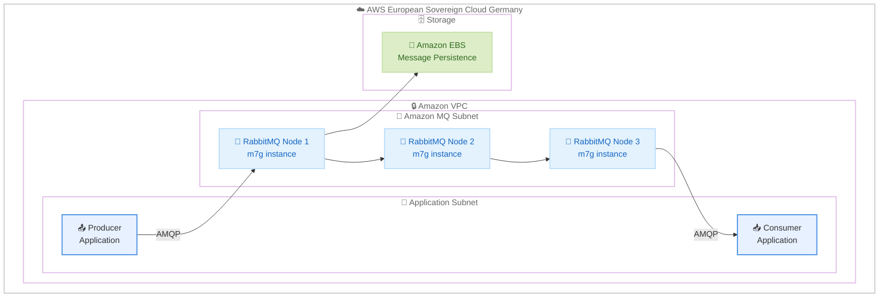

# Amazon MQ - AWS European Sovereign Cloud での提供開始

**リリース日**: 2026 年 6 月 4 日
**サービス**: Amazon MQ
**機能**: AWS European Sovereign Cloud (Germany) リージョンでの RabbitMQ 提供開始

📊 [このアップデートのインフォグラフィックを見る](https://takech9203.github.io/aws-news-summary/20260604-amazon-mq-eur-sov-cloud.html)

## 概要

Amazon MQ for RabbitMQ が AWS European Sovereign Cloud (Germany) リージョンで利用可能になりました。このアップデートにより、欧州におけるデータレジデンシー要件を持つ顧客が、EU 域内に完全にデータを保持しながらマネージドメッセージブローカーサービスを利用できるようになります。

Amazon MQ は、メッセージブローカーのプロビジョニング、パッチ適用、メンテナンスを AWS が管理するフルマネージドサービスです。今回のローンチでは、RabbitMQ 4.2 エンジンと Graviton3 ベースの m7g インスタンス (m7g.medium から m7g.16xlarge) がサポートされています。既存の RabbitMQ ワークロードをアプリケーションコードの書き換えなしに移行できるため、規制の厳しい業界や公共部門の組織が主権要件を満たしながらクラウドネイティブなメッセージングを導入する障壁が大幅に低減されます。

**アップデート前の課題**

- AWS European Sovereign Cloud を利用する顧客は、マネージドメッセージブローカーサービスを利用できなかった
- データ主権要件を満たしながら非同期メッセージングを実装するには、自己管理型の RabbitMQ クラスターを構築・運用する必要があった
- EU 域内にすべてのデータを保持しつつ、高可用性のメッセージングインフラストラクチャを維持する運用負荷が高かった

**アップデート後の改善**

- AWS European Sovereign Cloud 内で Amazon MQ for RabbitMQ をネイティブにデプロイし、マネージドメッセージングが可能になった
- すべてのメッセージデータと運用を EU 域内に保持しながら、他の AWS リージョンと同等の RabbitMQ 機能を利用できるようになった
- フルマネージドサービスとして自動的なパッチ適用、メンテナンス、高可用性が提供され、メッセージブローカーの運用負荷が大幅に軽減された

## アーキテクチャ図



AWS European Sovereign Cloud 内で Amazon MQ for RabbitMQ の 3 ノードクラスターを構成し、Producer と Consumer アプリケーションが AMQP プロトコルで通信する構成を示しています。すべてのデータは EU 域内の Amazon EBS に永続化されます。

## サービスアップデートの詳細

### 主要機能

1. **RabbitMQ 4.2 エンジンのサポート**
   - 最新の RabbitMQ 4.2 エンジンを利用可能
   - 標準的な AMQP プロトコルと RabbitMQ API に完全対応
   - 既存の RabbitMQ アプリケーションコードをそのまま移行可能

2. **Graviton3 ベース m7g インスタンス**
   - m7g.medium から m7g.16xlarge までの幅広いインスタンスサイズを提供
   - AWS Graviton3 プロセッサによる優れたコストパフォーマンス
   - ワークロードの規模に応じた柔軟なスケーリング

3. **フルマネージド運用**
   - ブローカーのプロビジョニング、パッチ適用、メンテナンスを AWS が自動管理
   - 高可用性クラスター構成による耐障害性
   - セキュリティアップデートの自動適用

## 技術仕様

### Amazon MQ for RabbitMQ 仕様

| 項目 | 詳細 |
|------|------|
| エンジンバージョン | RabbitMQ 4.2 |
| インスタンスタイプ | Graviton3 ベース m7g シリーズ |
| インスタンスサイズ | m7g.medium ~ m7g.16xlarge |
| デプロイメントモード | シングルインスタンス、クラスター (3 ノード) |
| プロトコル | AMQP 0-9-1、STOMP、MQTT、WebSocket |
| ストレージ | Amazon EBS |
| 暗号化 | 転送中の暗号化 (TLS)、保管時の暗号化 (AWS KMS) |

### IAM ポリシー例

```json
{
    "Version": "2012-10-17",
    "Statement": [
        {
            "Effect": "Allow",
            "Action": [
                "mq:CreateBroker",
                "mq:DescribeBroker",
                "mq:ListBrokers",
                "mq:CreateConfiguration",
                "mq:UpdateBroker"
            ],
            "Resource": "*",
            "Condition": {
                "StringEquals": {
                    "aws:RequestedRegion": "eu-sovereign-1"
                }
            }
        }
    ]
}
```

## 設定方法

### 前提条件

1. AWS European Sovereign Cloud へのアクセス権限
2. Amazon MQ の操作に必要な IAM 権限
3. ブローカーをデプロイする Amazon VPC とサブネットが European Sovereign Cloud リージョン内に存在すること

### 手順

#### ステップ 1: RabbitMQ ブローカーの作成

```bash
aws mq create-broker \
    --broker-name "eu-sovereign-rabbitmq" \
    --engine-type RABBITMQ \
    --engine-version "4.2" \
    --host-instance-type "mq.m7g.large" \
    --deployment-mode CLUSTER_MULTI_AZ \
    --users '[{"Username": "admin", "Password": "SecurePassword123!"}]' \
    --subnet-ids "subnet-xxxxxxxx" "subnet-yyyyyyyy" "subnet-zzzzzzzz" \
    --security-groups "sg-xxxxxxxxx"
```

RabbitMQ 4.2 エンジンを使用し、複数の Availability Zone にまたがるクラスターモードでブローカーを作成します。m7g.large インスタンスタイプを指定し、高可用性構成をデプロイします。

#### ステップ 2: ブローカーの状態確認

```bash
aws mq describe-broker \
    --broker-id "b-xxxxxxxx-xxxx-xxxx-xxxx-xxxxxxxxxxxx"
```

ブローカーの作成状態を確認します。`BrokerState` が `RUNNING` になればブローカーが利用可能です。

#### ステップ 3: アプリケーションからの接続

```python
import pika

# Amazon MQ RabbitMQ エンドポイントに接続
credentials = pika.PlainCredentials('admin', 'SecurePassword123!')
parameters = pika.ConnectionParameters(
    host='b-xxxxxxxx-xxxx-xxxx-xxxx-xxxxxxxxxxxx.mq.eu-sovereign-1.amazonaws.com',
    port=5671,
    virtual_host='/',
    credentials=credentials,
    ssl_options=pika.SSLOptions()
)

connection = pika.BlockingConnection(parameters)
channel = connection.channel()

# キューの宣言とメッセージ送信
channel.queue_declare(queue='eu-sovereign-queue', durable=True)
channel.basic_publish(
    exchange='',
    routing_key='eu-sovereign-queue',
    body='Hello from EU Sovereign Cloud!'
)
```

TLS を使用して Amazon MQ RabbitMQ エンドポイントに接続し、メッセージを送信します。すべての通信は暗号化され、EU 域内に保持されます。

## メリット

### ビジネス面

- **データ主権の確保**: すべてのメッセージデータと運用が EU 域内に保持され、GDPR や各国のデータ保護規制に準拠
- **コンプライアンス対応の簡素化**: 規制の厳しい業界や政府機関が、データ主権を維持しながらマネージドメッセージングサービスを利用可能
- **運用コストの削減**: 自己管理型 RabbitMQ クラスターの構築・運用が不要になり、メッセージングインフラの管理コストを大幅に削減

### 技術面

- **既存コードの再利用**: 標準的な AMQP プロトコルと RabbitMQ API をサポートし、既存アプリケーションをコード変更なしで移行可能
- **高可用性**: 3 ノードクラスター構成と複数 AZ デプロイメントにより、メッセージングの可用性を確保
- **Graviton3 による高効率**: m7g インスタンスにより、優れたコストパフォーマンスと低消費電力を実現

## デメリット・制約事項

### 制限事項

- 今回のローンチでは RabbitMQ エンジンのみが対象であり、ActiveMQ の European Sovereign Cloud 対応は未発表
- AWS European Sovereign Cloud へのアクセスには、適格な顧客としての要件を満たす必要がある
- 他の商用リージョンと比較して、European Sovereign Cloud で利用可能な連携サービスが限定的な場合がある

### 考慮すべき点

- European Sovereign Cloud リージョンの料金は、標準的な商用リージョンと異なる可能性がある
- 既存の商用リージョンから European Sovereign Cloud への移行には、VPC 構成やネットワーク設計の見直しが必要
- クロスリージョンレプリケーションを利用したい場合、データ主権要件との整合性を確認する必要がある

## ユースケース

### ユースケース 1: 欧州金融機関のイベント駆動アーキテクチャ

**シナリオ**: EU の金融規制 (DORA、MiFID II) に準拠しながら、取引処理システム間の非同期メッセージングを実装する必要がある欧州の銀行

**実装例**:
```bash
aws mq create-broker \
    --broker-name "financial-trading-mq" \
    --engine-type RABBITMQ \
    --engine-version "4.2" \
    --host-instance-type "mq.m7g.xlarge" \
    --deployment-mode CLUSTER_MULTI_AZ \
    --encryption-options '{"UseAwsOwnedKey": false, "KmsKeyId": "arn:aws:kms:eu-sovereign-1:ACCOUNT:key/key-id"}' \
    --users '[{"Username": "trading-app", "Password": "SecurePass!"}]'
```

**効果**: 取引データを EU 域内に保持しつつ、高スループットかつ低レイテンシーの非同期メッセージングにより、リアルタイムの取引処理を実現

### ユースケース 2: 欧州公共部門のマイクロサービス連携

**シナリオ**: データ主権を厳格に遵守しながら、市民向けデジタルサービスのバックエンドをマイクロサービスアーキテクチャで構築する EU 加盟国の政府機関

**実装例**:
```python
import pika

# 市民サービスのイベント処理
channel.exchange_declare(
    exchange='citizen-services',
    exchange_type='topic',
    durable=True
)

# 申請処理イベントの発行
channel.basic_publish(
    exchange='citizen-services',
    routing_key='application.submitted',
    body='{"citizen_id": "EU-12345", "service": "permit-renewal"}',
    properties=pika.BasicProperties(delivery_mode=2)
)
```

**効果**: 市民データが EU 域外に流出するリスクを排除しつつ、スケーラブルなイベント駆動アーキテクチャにより迅速な市民サービスの提供を実現

### ユースケース 3: ヘルスケア業界の医療データ連携

**シナリオ**: GDPR と各国の医療データ保護規制に準拠しながら、病院間のデータ連携や医療機器からのデータ収集を非同期で処理する欧州の病院ネットワーク

**実装例**:
```python
import pika

# 医療データのルーティング設定
channel.exchange_declare(
    exchange='medical-data',
    exchange_type='headers',
    durable=True
)

# 医療機器からのデータ受信キュー
channel.queue_declare(
    queue='patient-monitoring',
    durable=True,
    arguments={'x-message-ttl': 86400000}
)

channel.queue_bind(
    queue='patient-monitoring',
    exchange='medical-data',
    arguments={'data-type': 'vital-signs', 'x-match': 'all'}
)
```

**効果**: 患者データを EU 域内に保持しつつ、医療機器やシステム間の非同期データ連携を信頼性高く実現し、GDPR 準拠を確保

## 料金

Amazon MQ for RabbitMQ の料金は以下の要素で構成されます。AWS European Sovereign Cloud の具体的な料金はリージョンテーブルで確認してください。

### 料金例

参考として US East (N. Virginia) リージョンの料金を示します。

| 項目 | 料金 |
|------|------|
| mq.m7g.large インスタンス | $0.2734/時間 |
| Amazon EBS ストレージ | $0.10/GB-月 |
| クロス AZ データ転送 | $0.01/GB (各方向) |
| クラスター内データ転送 | 追加料金なし |

### 月額コスト例 (m7g.large 3 ノードクラスター)

| 項目 | 計算 | 月額料金 |
|------|------|----------|
| インスタンス | 744 時間 x 3 ノード x $0.2734 | 約 $610 |
| ストレージ (15 GiB x 3) | 45 GB x $0.10 | 約 $5 |
| **合計** | | **約 $615** |

## 利用可能リージョン

AWS European Sovereign Cloud (Germany) リージョン

詳細な利用可能リージョンについては、[AWS リージョンテーブル](https://aws.amazon.com/about-aws/global-infrastructure/regional-product-services/)を参照してください。

## 関連サービス・機能

- **Amazon EventBridge**: サーバーレスイベントバスとして、Amazon MQ と組み合わせたイベント駆動アーキテクチャの構築に利用
- **AWS Lambda**: Amazon MQ をイベントソースとして Lambda 関数をトリガーし、サーバーレスなメッセージ処理を実現
- **Amazon VPC**: Amazon MQ ブローカーのネットワーク分離とセキュリティグループによるアクセス制御
- **AWS KMS**: メッセージデータの保管時暗号化にカスタマーマネージドキーを使用
- **AWS European Sovereign Cloud**: EU のデータ主権要件に対応した独立したクラウドインフラストラクチャ

## 参考リンク

- 📊 [インフォグラフィック](https://takech9203.github.io/aws-news-summary/20260604-amazon-mq-eur-sov-cloud.html)
- [公式発表 (What's New)](https://aws.amazon.com/about-aws/whats-new/2026/06/amazon-mq-eur-sov-cloud)
- [Amazon MQ 製品ページ](https://aws.amazon.com/amazon-mq/)
- [Amazon MQ ドキュメント](https://docs.aws.amazon.com/amazon-mq/latest/developer-guide/)
- [Amazon MQ 料金ページ](https://aws.amazon.com/amazon-mq/pricing/)
- [AWS リージョンテーブル](https://aws.amazon.com/about-aws/global-infrastructure/regional-product-services/)

## まとめ

Amazon MQ for RabbitMQ の AWS European Sovereign Cloud (Germany) リージョンでの提供開始により、EU のデータ主権要件を持つ顧客が、フルマネージドなメッセージブローカーサービスを Sovereign Cloud 環境内で利用できるようになりました。Graviton3 ベースの m7g インスタンスと RabbitMQ 4.2 エンジンのサポートにより、高性能かつコスト効率の良いメッセージングが実現されます。欧州の規制産業や公共部門の組織は、アプリケーションコードの変更なしに既存の RabbitMQ ワークロードを移行できるため、European Sovereign Cloud での非同期メッセージングアーキテクチャの導入を検討することを推奨します。
