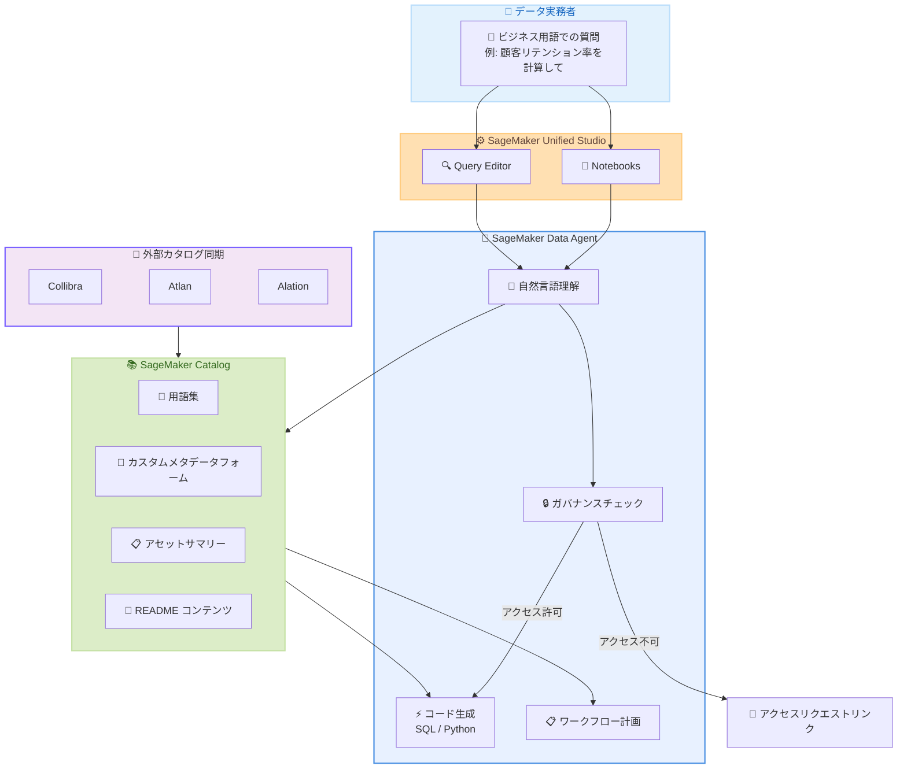

# Amazon SageMaker Data Agent - ビジネスコンテキスト統合

**リリース日**: 2026 年 6 月 4 日
**サービス**: Amazon SageMaker Unified Studio
**機能**: Data Agent と SageMaker Catalog ビジネスコンテキストの統合

📊 [このアップデートのインフォグラフィックを見る](https://takech9203.github.io/aws-news-summary/20260604-amazon-sagemaker-data-agent-bdc.html)

## 概要

Amazon SageMaker Data Agent が SageMaker Catalog のビジネスコンテキストおよびメタデータと統合され、データ実務者がビジネス用語を使用してデータセットを発見し、より正確な SQL および Python コードを生成できるようになった。これにより、難解な技術的テーブル名を解読する必要がなくなり、自然言語でデータに関する質問ができるようになる。

この統合により、Data Agent は企業が SageMaker Catalog で数か月かけてキュレーションしたビジネスコンテキスト (Collibra、Atlan、Alation から同期されたものを含む) を活用し、より正確なデータ検出とコード生成を実現する。データガバナンスも尊重し、サブスクリプションステータスの確認やアクセスリクエストリンクの提供を自動的に行う。

**アップデート前の課題**

- データ実務者は技術的なテーブル名やカラム名を把握している必要があり、ビジネス用語でデータを探すことが困難だった
- SageMaker Catalog に蓄積されたビジネスコンテキスト (用語集、メタデータフォーム、アセットサマリーなど) が Data Agent の会話に活用されていなかった
- コード生成時にテーブルの正確な識別や変換の順序を手動で判断する必要があり、初回の生成精度が低かった
- データガバナンスの確認 (アクセス権限のチェック) が手動プロセスだった

**アップデート後の改善**

- 「顧客リテンション率を計算して」「顧客離脱に関するデータは何がある?」といったビジネス用語での質問が可能になった
- Data Agent が用語集、カスタムメタデータフォーム、アセットサマリー、README コンテンツを検索して正しいテーブルとカラムを特定する
- ビジネスコンテキストの理解により初回のコード生成精度が向上し、マルチステップワークフローの計画も正確に行える
- サブスクリプションステータスの自動チェックとアクセスリクエストリンクの提供でデータガバナンスが自動化された

## アーキテクチャ図



Data Agent がユーザーのビジネス用語での質問を受け取り、SageMaker Catalog のビジネスコンテキストを検索して正確なコードを生成するフローを示している。外部カタログツールから同期されたメタデータも活用される。

## サービスアップデートの詳細

### 主要機能

1. **ビジネス用語による自然言語クエリ**
   - 「顧客リテンション率を計算して」「顧客離脱に関するデータは何がある?」といった質問に対応
   - 用語集 (Glossary Terms) を検索してビジネス用語と技術的なテーブル/カラム名をマッピング
   - カスタムメタデータフォーム、アセットサマリー、README コンテンツも検索対象

2. **初回精度の高いコード生成**
   - ビジネスコンテキストの理解により、最初の試行でより正確な SQL/Python コードを生成
   - テーブルの正しい識別と適切なカラムの選択を自動化
   - 複雑な計算ロジックもビジネス定義に基づいて正確に実装

3. **マルチステップワークフロー計画**
   - 複数テーブルにまたがる分析の場合、正しい順序でテーブルと変換を計画
   - データの結合条件やフィルタリング条件をビジネスコンテキストから推定
   - ステップバイステップの実行計画を自動生成

4. **データガバナンスの自動遵守**
   - サブスクリプションステータスを自動的に確認
   - アクセス権限がない場合はアクセスリクエストリンクを提供
   - 組織のデータポリシーに準拠した形でデータ検出を実行

5. **外部カタログツールとの統合**
   - Collibra、Atlan、Alation から SageMaker Catalog に同期されたメタデータを活用
   - 既存のカタログ投資を最大限に活用し、ワークフローの変更は不要

## 技術仕様

### 対応するメタデータソース

| メタデータタイプ | 説明 | 用途 |
|------|------|------|
| 用語集 (Glossary Terms) | ビジネス用語の定義と関連テーブルのマッピング | ビジネス用語からテーブル/カラムの特定 |
| カスタムメタデータフォーム | 組織固有のメタデータ属性 | データの文脈や利用方法の理解 |
| アセットサマリー | データアセットの概要説明 | データセットの目的と内容の把握 |
| README コンテンツ | データセットのドキュメント | 詳細な利用方法とデータ構造の理解 |

### 対応する外部カタログツール

| ツール | 統合方法 |
|------|------|
| Collibra | SageMaker Catalog への同期 |
| Atlan | SageMaker Catalog への同期 |
| Alation | SageMaker Catalog への同期 |

### API 変更履歴

| 日付 | サービス | 変更内容 |
|------|----------|----------|
| 2026/06/04 | [Amazon SageMaker Service](https://awsapichanges.com/archive/changes/fb8102-api.sagemaker.html) | 4 updated api methods - DescribeModelCard/DescribeModelPackage に IncludedData パラメータ追加、SageMaker Search で MTRL Job リソースサポート |

### 利用可能なインターフェース

| インターフェース | 説明 |
|------|------|
| SageMaker Unified Studio Notebooks | サーバーレスノートブック環境での会話型データ分析 |
| SageMaker Unified Studio Query Editor | SQL クエリエディタでのビジネス用語活用 |

## 設定方法

### 前提条件

1. Amazon SageMaker Unified Studio が利用可能なリージョンで環境が構築されていること
2. SageMaker Catalog にビジネスコンテキスト (用語集、メタデータフォーム等) が設定されていること
3. 対象データアセットへのサブスクリプションまたはアクセス権限が付与されていること

### 手順

#### ステップ 1: SageMaker Catalog でビジネスコンテキストを設定

SageMaker Catalog に用語集やメタデータフォームを登録する。既に Collibra、Atlan、Alation などの外部カタログツールを使用している場合は、同期設定を行うことで既存のビジネスコンテキストを活用できる。

#### ステップ 2: Unified Studio Notebooks または Query Editor を開く

SageMaker Unified Studio にアクセスし、Notebooks または Query Editor を開く。Data Agent は自動的に SageMaker Catalog のビジネスコンテキストを利用可能な状態になる。

#### ステップ 3: ビジネス用語で質問する

```
# Data Agent への質問例
"顧客リテンション率を計算して"
"顧客離脱に関するデータは何がある?"
"過去 6 か月の売上トレンドを分析して"
```

Data Agent が用語集やメタデータを検索し、適切なテーブルとカラムを特定した上で SQL または Python コードを生成する。

## メリット

### ビジネス面

- **Time-to-Insight の短縮**: ビジネス用語で直接質問できるため、テーブル名やカラム名の調査にかかる時間が大幅に削減される
- **既存カタログ投資の最大活用**: SageMaker Catalog に蓄積したビジネスコンテキストや、Collibra/Atlan/Alation から同期したメタデータがそのまま活用される
- **データ民主化の促進**: 技術的な知識が少ないビジネスユーザーでも、自然言語でデータ分析を開始できる

### 技術面

- **初回コード生成精度の向上**: ビジネスコンテキストに基づく正確なテーブル/カラム識別により、試行錯誤が減少する
- **ワークフロー変更不要**: 既存のデータワークフローを変更せずにビジネスコンテキスト統合のメリットを享受できる
- **データガバナンスの自動化**: アクセス権限の確認とリクエストフローが自動化され、コンプライアンスリスクが低減される

## デメリット・制約事項

### 制限事項

- SageMaker Unified Studio が利用可能なリージョンのみで利用可能
- ビジネスコンテキストの品質に依存するため、SageMaker Catalog のメタデータが不十分な場合は精度が低下する可能性がある
- 外部カタログツールとの同期は Collibra、Atlan、Alation の 3 ツールに限定される

### 考慮すべき点

- SageMaker Catalog のビジネスコンテキスト整備には初期投資が必要であり、用語集やメタデータフォームの設計・登録に時間がかかる
- 組織内でビジネス用語の定義が統一されていない場合、Data Agent の検索精度に影響する可能性がある
- 外部カタログツールからの同期遅延が発生する可能性があるため、リアルタイム性が要求されるシナリオでは注意が必要

## ユースケース

### ユースケース 1: ビジネスアナリストによるアドホック分析

**シナリオ**: マーケティング部門のビジネスアナリストが、顧客リテンション率のトレンドを分析したい。技術的なテーブル名 (`dim_customer_lifecycle_v3`) は知らないが、ビジネス用語 (「顧客リテンション率」) は理解している。

**実装例**:
```
# Data Agent への質問
"過去 12 か月の月次顧客リテンション率を計算し、前年同期比を含めて表示して"

# Data Agent が生成するコード例
SELECT 
    DATE_TRUNC('month', activity_date) AS month,
    COUNT(DISTINCT CASE WHEN is_retained = 1 THEN customer_id END) * 100.0 
        / COUNT(DISTINCT customer_id) AS retention_rate
FROM customer_lifecycle.dim_customer_lifecycle_v3
WHERE activity_date >= DATEADD(month, -12, CURRENT_DATE)
GROUP BY 1
ORDER BY 1;
```

**効果**: テーブル名の調査に費やしていた 30 分以上の時間が不要になり、即座に分析を開始できる

### ユースケース 2: 外部カタログ統合によるデータ検出

**シナリオ**: Collibra でデータカタログを管理している企業が、SageMaker Unified Studio でデータ分析を行いたい。Collibra に登録されたビジネス用語定義を活用して Data Agent でデータを検出する。

**実装例**:
```
# Collibra から同期された用語集を活用
"売上予測モデルに必要なデータソースを教えて"

# Data Agent が Collibra から同期された用語集を検索し、
# 関連するテーブル群を特定して回答
```

**効果**: Collibra への既存投資を最大限に活用しながら、SageMaker 環境でのデータ作業効率が向上する

### ユースケース 3: データガバナンスを考慮した分析

**シナリオ**: データエンジニアが機密性の高い顧客データにアクセスしようとするが、まだサブスクリプション申請が完了していない。

**実装例**:
```
# Data Agent への質問
"顧客の PII データを含むテーブルの構造を教えて"

# Data Agent の応答
"指定されたテーブルへのアクセス権限がありません。
以下のリンクからアクセスリクエストを申請してください:
[アクセスリクエスト] https://..."
```

**効果**: データガバナンスポリシーに違反することなく、適切なアクセスフローに誘導される

## 料金

SageMaker Data Agent のビジネスコンテキスト統合に対する追加料金は発表されていない。Amazon SageMaker Unified Studio の標準料金体系に含まれるものと考えられる。詳細な料金情報は AWS の公式料金ページを確認する必要がある。

## 利用可能リージョン

Amazon SageMaker Unified Studio が利用可能な全リージョンで本機能を利用できる。

| リージョン名 | リージョンコード |
|------|------|
| US East (N. Virginia) | us-east-1 |
| US East (Ohio) | us-east-2 |
| US West (Oregon) | us-west-2 |
| Europe (Ireland) | eu-west-1 |
| Europe (Frankfurt) | eu-central-1 |
| Europe (London) | eu-west-2 |
| Europe (Paris) | eu-west-3 |
| Europe (Stockholm) | eu-north-1 |
| Asia Pacific (Tokyo) | ap-northeast-1 |
| Asia Pacific (Seoul) | ap-northeast-2 |
| Asia Pacific (Singapore) | ap-southeast-1 |
| Asia Pacific (Sydney) | ap-southeast-2 |
| Asia Pacific (Mumbai) | ap-south-1 |
| Canada (Central) | ca-central-1 |
| South America (Sao Paulo) | sa-east-1 |

## 関連サービス・機能

- **Amazon SageMaker Catalog**: ビジネスコンテキストとメタデータを管理するカタログサービス。Data Agent が検索するビジネス用語定義の格納先
- **Amazon SageMaker Unified Studio**: Data Agent が動作する統合開発環境。Notebooks と Query Editor の両方で利用可能
- **Amazon Q Developer**: SageMaker Unified Studio 内で利用可能な AI アシスタント。Data Agent と補完的にデータ検出とプロジェクト支援を提供
- **Collibra / Atlan / Alation**: サードパーティのデータカタログツール。SageMaker Catalog にビジネスコンテキストを同期可能

## 参考リンク

- 📊 [インフォグラフィック](https://takech9203.github.io/aws-news-summary/20260604-amazon-sagemaker-data-agent-bdc.html)
- [公式発表 (What's New)](https://aws.amazon.com/about-aws/whats-new/2026/06/amazon-sagemaker-data-agent-bdc/)
- [Data Agent ビジネスカタログ統合ドキュメント](https://docs.aws.amazon.com/sagemaker-unified-studio/latest/userguide/data-agent-business-catalog.html)
- [SageMaker Unified Studio 製品ページ](https://aws.amazon.com/sagemaker/unified-studio/)
- [サポートリージョン](https://docs.aws.amazon.com/sagemaker-unified-studio/latest/adminguide/supported-regions.html)

## まとめ

Amazon SageMaker Data Agent のビジネスコンテキスト統合は、データチームがビジネス言語で直接データ分析を開始できるようにする重要なアップデートである。特に、Collibra、Atlan、Alation などの既存カタログ投資を活用しながら、ワークフローを変更せずに導入できる点が大きな利点となる。SageMaker Catalog に十分なビジネスコンテキストを整備している組織にとっては、Time-to-Insight を大幅に短縮し、データ民主化を推進する有効な手段となるため、早期の検証を推奨する。
