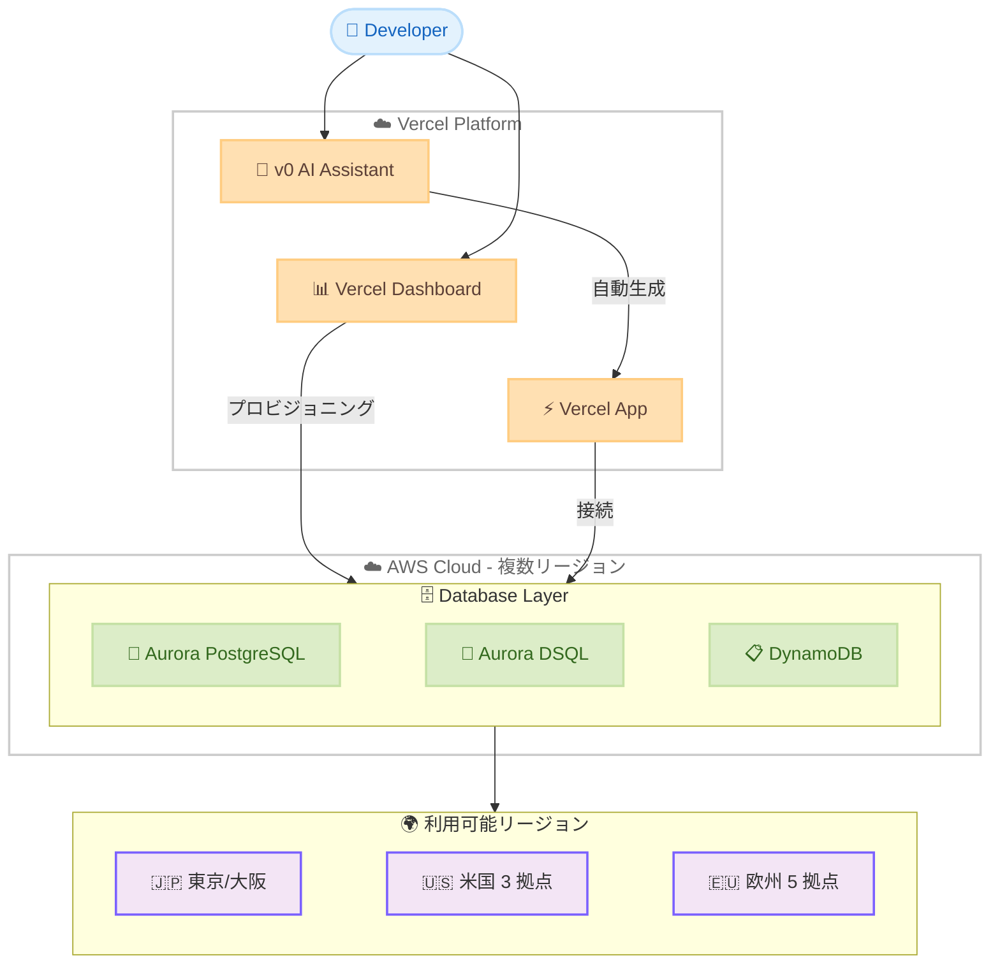

# AWS Databases on Vercel - リージョン拡大

**リリース日**: 2026 年 6 月 4 日
**サービス**: Amazon Aurora PostgreSQL, Amazon Aurora DSQL, Amazon DynamoDB
**機能**: AWS Databases on Vercel の追加リージョン対応

[このアップデートのインフォグラフィックを見る](https://takech9203.github.io/aws-news-summary/20260604-aws-databases-vercel-aws-regions.html)

## 概要

AWS Databases on Vercel が追加の AWS リージョンで利用可能になった。この統合により、Vercel の開発プラットフォーム上から Amazon Aurora PostgreSQL、Amazon Aurora DSQL、Amazon DynamoDB を直接プロビジョニングし、フルスタック Web アプリケーションに接続できる。

Aurora PostgreSQL と DynamoDB は 17 のデフォルト有効リージョンで利用可能となり、Aurora DSQL は 16 リージョンで提供される。東京リージョン (ap-northeast-1) も対象に含まれており、日本のデベロッパーがレイテンシーの低いデータベース接続を活用してアプリケーションを構築できる。

Vercel の AI コーディングアシスタント v0 を使用することで、自然言語でアプリケーションを記述するだけで、コードとインフラストラクチャの両方が自動的に生成・デプロイされ、最適な AWS データベースにデータが保存される。

**アップデート前の課題**

- AWS Databases on Vercel の利用可能リージョンが限定されており、アジア太平洋地域のデベロッパーはレイテンシーの高いリージョンを使用する必要があった
- リージョン選択の幅が狭く、データレジデンシー要件を満たせないケースがあった
- グローバルに展開するアプリケーションで最適なリージョンを選択できなかった

**アップデート後の改善**

- Aurora PostgreSQL と DynamoDB が 17 リージョン、Aurora DSQL が 16 リージョンで利用可能になった
- 東京、大阪を含むアジア太平洋リージョンが対象に追加され、日本のユーザーが低レイテンシーで利用可能
- データレジデンシー要件に応じたリージョン選択の柔軟性が大幅に向上した

## アーキテクチャ図



Vercel プラットフォームから AWS データベースをプロビジョニングし、複数リージョンにデプロイされたデータベースに接続するアーキテクチャを示している。

## サービスアップデートの詳細

### 主要機能

1. **Vercel Marketplace からのデータベースプロビジョニング**
   - Vercel ダッシュボードから直接 AWS データベースを作成・管理
   - 新規 AWS アカウントの作成、または既存アカウントへの接続が可能
   - 環境変数や接続文字列が自動的に生成され、Vercel プロジェクトに安全に保存

2. **v0 による自然言語駆動の開発**
   - 自然言語でアプリケーションを記述すると、コードとインフラストラクチャを自動生成
   - 最適な AWS データベースの選択とプロビジョニングが自動化
   - プロトタイプから本番環境まで同じデータ基盤で運用可能

3. **3 つのサーバーレスデータベースサポート**
   - **Amazon Aurora PostgreSQL**: リレーショナルデータベースのニーズに対応
   - **Amazon Aurora DSQL**: 分散 SQL データベースとしてグローバルスケールに対応
   - **Amazon DynamoDB**: NoSQL ワークロードに対応するサーバーレスデータベース

## 技術仕様

### 対応リージョン

| データベース | 対応リージョン数 | 備考 |
|------|------|------|
| Aurora PostgreSQL | 17 リージョン | デフォルト有効の全リージョン |
| DynamoDB | 17 リージョン | デフォルト有効の全リージョン |
| Aurora DSQL | 16 リージョン | 下記参照 |

### Aurora DSQL 対応リージョン一覧

| リージョン | リージョンコード |
|------|------|
| US East (N. Virginia) | us-east-1 |
| US East (Ohio) | us-east-2 |
| US West (Oregon) | us-west-2 |
| Asia Pacific (Mumbai) | ap-south-1 |
| Asia Pacific (Osaka) | ap-northeast-3 |
| Asia Pacific (Seoul) | ap-northeast-2 |
| Asia Pacific (Singapore) | ap-southeast-1 |
| Asia Pacific (Sydney) | ap-southeast-2 |
| Asia Pacific (Tokyo) | ap-northeast-1 |
| Canada (Central) | ca-central-1 |
| Europe (Frankfurt) | eu-central-1 |
| Europe (Ireland) | eu-west-1 |
| Europe (London) | eu-west-2 |
| Europe (Paris) | eu-west-3 |
| Europe (Stockholm) | eu-north-1 |
| South America (Sao Paulo) | sa-east-1 |

## 設定方法

### 前提条件

1. Vercel アカウント
2. AWS アカウント (既存アカウントの接続、または Vercel から新規作成)
3. Vercel にデプロイされたプロジェクト

### 手順

#### ステップ 1: Vercel Dashboard からデータベースを接続

Vercel Dashboard のデータベースタブから「Connect Database」を選択し、AWS データベースを選択する。新規 AWS アカウントの作成、または既存アカウントの接続が可能。

#### ステップ 2: リージョンとデータベースタイプを選択

利用可能なリージョンから最適なリージョンを選択し、Aurora PostgreSQL、Aurora DSQL、DynamoDB のいずれかを選択する。

#### ステップ 3: v0 を使用した自動構築 (オプション)

```
# v0.app にアクセスして自然言語でアプリケーションを記述
# 例: "Build a task management app with user authentication 
#      that stores data in DynamoDB in the Tokyo region"
```

v0 が自動的にコード生成、データベースプロビジョニング、デプロイを実行する。手動でのコーディングやインフラ構築は不要。

## メリット

### ビジネス面

- **開発速度の向上**: プロビジョニングからデプロイまで数秒で完了し、プロトタイプ作成が大幅に高速化
- **運用コスト削減**: データベース管理の運用オーバーヘッドが不要。サーバーレスモデルにより使用量に応じた課金
- **グローバル展開の容易さ**: 16-17 リージョンから選択可能で、エンドユーザーに近いリージョンにデータベースを配置可能

### 技術面

- **レイテンシーの最適化**: アプリケーションに近いリージョンでデータベースを実行し、応答時間を短縮
- **セキュアな認証情報管理**: 接続文字列や認証情報が自動的に Vercel プロジェクトに安全に保存
- **スケーラビリティ**: 本番環境と同じ AWS インフラストラクチャ上で動作し、エンタープライズレベルのスケーラビリティを提供

## デメリット・制約事項

### 制限事項

- Vercel Marketplace から作成した AWS アカウントは限定的なスコープであり、フル機能の AWS サービスを利用するには既存アカウントの接続が必要
- Aurora DSQL は Aurora PostgreSQL や DynamoDB と比較して対応リージョンが 1 つ少ない (16 リージョン)
- Vercel のホスティングプラットフォームに依存するため、他のホスティングプラットフォームへの移行時にはデータベース接続の再構成が必要

### 考慮すべき点

- データベースの詳細な設定やチューニングには AWS Management Console への直接アクセスが必要になる場合がある
- Vercel と AWS 間のネットワーク経路によるレイテンシーを考慮し、最適なリージョンを選択する必要がある

## ユースケース

### ユースケース 1: AI 搭載の SaaS アプリケーション

**シナリオ**: スタートアップが AI 機能を搭載した B2B SaaS アプリケーションを迅速に構築・デプロイしたい。

**実装例**:
```
# v0 で自然言語からアプリケーションを生成
"Build an AI-powered customer analytics dashboard 
 with Aurora PostgreSQL in ap-northeast-1 for structured data 
 and DynamoDB for session tracking"
```

**効果**: 数分で本番環境対応のフルスタックアプリケーションが完成し、東京リージョンの低レイテンシーデータベースで日本のユーザーに最適なパフォーマンスを提供。

### ユースケース 2: グローバルスケールのリアルタイムアプリケーション

**シナリオ**: 複数リージョンのユーザーに一貫した低レイテンシーを提供するリアルタイムコラボレーションツールを構築する。

**実装例**:
```
# Aurora DSQL を使用してマルチリージョンの一貫性を確保
# Vercel Dashboard > Connect Database > Aurora DSQL
# Region: 東京 + オレゴン (マルチリージョン)
```

**効果**: Aurora DSQL の分散 SQL 機能により、複数リージョン間でのデータ一貫性を維持しながらグローバルに低レイテンシーアクセスを実現。

### ユースケース 3: ハッカソン/プロトタイピング

**シナリオ**: H0 ハッカソン ($160,000 賞金プール) に参加し、週末でプロトタイプを構築する。

**実装例**:
```
# 1. v0.app にアクセス
# 2. アイデアを自然言語で記述
# 3. AWS サーバーレスデータベースが自動的にプロビジョニング
# 4. $100 の AWS クレジットで 6 ヶ月間無料で利用
```

**効果**: インフラストラクチャの構築に時間を取られることなく、アプリケーションのロジックと UX に集中できる。プロトタイプがそのまま本番環境のデータ基盤で動作する。

## 料金

AWS Databases on Vercel の料金は、各 AWS データベースサービスの標準料金に準拠する。Vercel Marketplace 経由で新規 AWS アカウントを作成した場合、$100 USD の AWS クレジットが付与され、6 ヶ月間有効で 3 つのデータベースオプションすべてに適用可能。

### 料金例

| データベース | 料金モデル | 備考 |
|--------|------------------|------|
| Aurora PostgreSQL | ACU ベースのサーバーレス課金 | ストレージ + I/O 課金あり |
| Aurora DSQL | リクエストベースの課金 | 読み取り/書き込みリクエスト単位 |
| DynamoDB | 読み取り/書き込みキャパシティユニット | オンデマンドモード推奨 |

## 利用可能リージョン

Aurora PostgreSQL および DynamoDB は 17 のデフォルト有効 AWS リージョンで利用可能。Aurora DSQL は 16 リージョンで利用可能 (東京、大阪を含むアジア太平洋リージョン対応)。

## 関連サービス・機能

- **Amazon Aurora DSQL**: マルチリージョン対応の分散 SQL データベース。グローバルスケールのアプリケーションに最適
- **Amazon Aurora PostgreSQL**: PostgreSQL 互換のリレーショナルデータベース。高い互換性とパフォーマンスを提供
- **Amazon DynamoDB**: フルマネージドの NoSQL データベース。ミリ秒単位の応答時間とシームレスなスケーリングを提供
- **Vercel v0**: AI コーディングアシスタント。自然言語からフルスタックアプリケーションを生成

## 参考リンク

- [インフォグラフィック](https://takech9203.github.io/aws-news-summary/20260604-aws-databases-vercel-aws-regions.html)
- [公式発表 (What's New)](https://aws.amazon.com/about-aws/whats-new/2026/06/aws-databases-vercel-aws-regions/)
- [AWS Blog - AI-native, full-stack web apps with Vercel and AWS Databases](https://aws.amazon.com/blogs/database/ai-native-full-stack-web-apps-with-vercel-and-aws-databases/)
- [Vercel Marketplace - AWS](https://vercel.com/marketplace/aws)
- [v0 by Vercel](https://v0.app)

## まとめ

AWS Databases on Vercel のリージョン拡大により、日本を含むグローバルなデベロッパーが低レイテンシーで AWS データベースサービスを Vercel プラットフォームから直接利用できるようになった。v0 の自然言語駆動開発と組み合わせることで、プロトタイプから本番環境までのギャップを最小化し、開発生産性を大幅に向上させる。特に東京・大阪リージョンの対応は、日本市場向けアプリケーションを構築するデベロッパーにとって即座にアクションすべきアップデートである。
