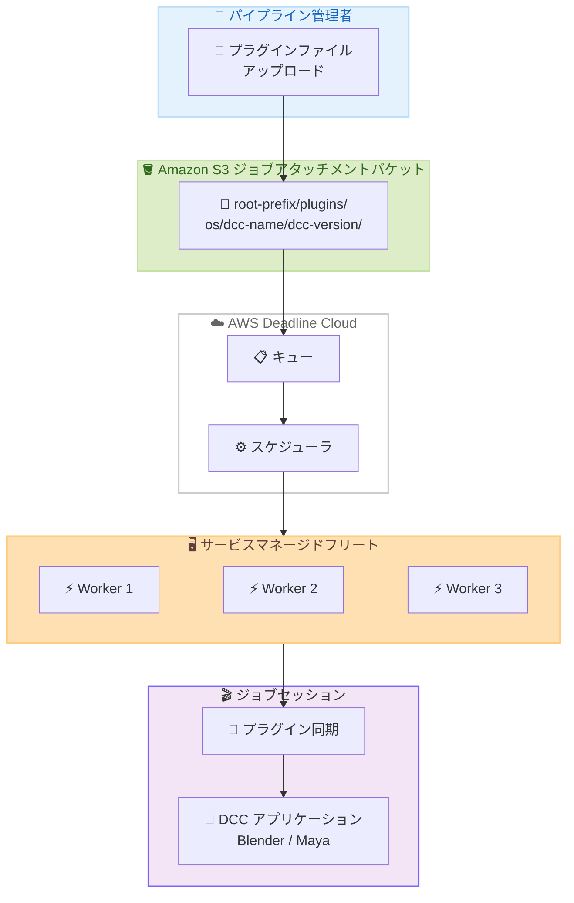

# AWS Deadline Cloud - サービスマネージドフリートのプラグイン同期

**リリース日**: 2026 年 6 月 4 日
**サービス**: AWS Deadline Cloud
**機能**: Plugin Sync for Service-Managed Fleets

[このアップデートのインフォグラフィックを見る](https://takech9203.github.io/aws-news-summary/20260604-deadline-cloud-plugin-sync.html)

## 概要

AWS Deadline Cloud にサービスマネージドフリート向けのプラグイン同期機能が追加された。この機能により、クラウドワーカーへのプラグイン配信が大幅に簡素化される。AWS Deadline Cloud は、VFX、アニメーション、プロダクトデザイン、シミュレーション、ゲームなどのコンピュートインテンシブなワークロードをクラウドで実行するためのフルマネージドサービスである。

プラグイン同期では、キューのジョブアタッチメント用 Amazon S3 バケット内の所定のパスにプラグインファイルをアップロードするだけで、Deadline Cloud がジョブセッション開始時にワーカーへ自動的に同期する。ワークステーション上の共有フォルダにプラグインをコピーするのと同じ感覚で利用できる。

現在、Blender および Autodesk Maya で一般提供 (GA) されており、Foundry Nuke など追加の DCC アプリケーションへの対応も今後予定されている。

**アップデート前の課題**

- DCC アプリケーションごとにカスタムスクリプトを作成してプラグインをデプロイする必要があった
- アプリケーションバージョンごとに手動設定が必要で、設定ミスが発生しやすかった
- パイプラインの初期セットアップが複雑で、新規プロジェクト立ち上げに時間がかかっていた
- プラグインバージョンの管理が煩雑で、ジョブ実行時に正しいプラグインが利用できない場合があった

**アップデート後の改善**

- S3 バケットの所定パスにファイルをアップロードするだけでプラグインを配信可能になった
- ジョブセッション開始時に自動同期されるため、手動設定が不要になった
- 設定エラーが削減され、正しいプラグインが確実にワーカーに配置されるようになった
- パイプラインのセットアップが大幅に簡素化された

## アーキテクチャ図



パイプライン管理者が S3 バケットの所定パスにプラグインをアップロードすると、Deadline Cloud がジョブセッション開始時にサービスマネージドフリートのワーカーへ自動的にプラグインを同期する仕組みを示している。

## サービスアップデートの詳細

### 主要機能

1. **自動プラグイン同期**
   - ジョブセッション開始時にワーカーのセッションディレクトリへ自動同期
   - DCC アプリケーション用の conda パッケージが、同期されたディレクトリからプラグインを読み込むよう自動設定
   - 手動介入なしで正しいプラグインがワーカーに配置される

2. **S3 ベースのプラグイン管理**
   - キューのジョブアタッチメント S3 バケット内の規定パス構造に従ってアップロード
   - OS、DCC アプリケーション名、バージョンごとにフォルダを分離
   - 共有フォルダ感覚でプラグインファイルを配置可能

3. **マルチバージョン対応**
   - 同一 DCC アプリケーションの複数バージョンを同時にサポート
   - メジャーバージョン単位での管理 (例: Maya 2025.3 は `2025` フォルダを使用)
   - Linux と Windows の両 OS に対応

## 技術仕様

### S3 パス構造

プラグインファイルは以下のパス構造に従って配置する。

```
s3://<job-attachments-bucket>/<root-prefix>/plugins/<os>/<dcc-name>/<dcc-version>/
```

| パスコンポーネント | 説明 | 例 |
|------|------|------|
| job-attachments-bucket | キューに関連付けられたジョブアタッチメント S3 バケット | my-farm-attachments |
| root-prefix | キューのジョブアタッチメントルートプレフィックス | Data |
| os | オペレーティングシステム | `linux` または `windows` |
| dcc-name | DCC アプリケーション名 (小文字) | `maya`、`blender` |
| dcc-version | DCC アプリケーションのメジャーバージョン | `2025`、`5.0` |

### 対応 DCC アプリケーション

| DCC アプリケーション | S3 フォルダ名 | 対応バージョン | サービスマネージドフリート対応 | ステータス |
|------|------|------|------|------|
| Blender | `blender` | 5.0、5.1 | 対応 | GA |
| Autodesk Maya | `maya` | 2024、2025、2026 | 対応 | GA |
| Foundry Nuke | `nuke` | 未定 | 近日対応予定 | Coming Soon |

### API 変更履歴

直近 7 日間で Deadline Cloud に関連する API 変更は検出されなかった。本機能は既存の S3 およびジョブアタッチメントの仕組みを活用しており、新規 API の追加なしで実現されている。

### 重要な制約

- S3 パスは大文字・小文字を区別する。すべてのフォルダ名は小文字で指定する必要がある
- バージョンフォルダにはメジャーバージョン番号を使用する (パッチバージョンは不可)
- サービスマネージドフリート専用の機能 (カスタマーマネージドフリートは conda レシピサンプルで対応可能)

## 設定方法

### 前提条件

1. AWS Deadline Cloud ファームとキューが作成済みであること
2. キューにジョブアタッチメント S3 バケットが関連付けられていること
3. サービスマネージドフリートが設定済みであること
4. プラグインファイルが手元に用意されていること

### 手順

#### ステップ 1: S3 バケットとルートプレフィックスの確認

```bash
# AWS CLI でキューの詳細を取得し、ジョブアタッチメントバケット情報を確認
aws deadline get-queue \
  --farm-id farm-xxxxxxxxxxxx \
  --queue-id queue-xxxxxxxxxxxx \
  --query 'jobAttachmentSettings'
```

キューの詳細ページからジョブアタッチメント S3 バケット名とルートプレフィックスを確認する。

#### ステップ 2: プラグインフォルダ構造の作成

```bash
# 例: Maya 2025 用のプラグインフォルダを Linux 向けに作成
aws s3api put-object \
  --bucket my-farm-attachments \
  --key "Data/plugins/linux/maya/2025/"
```

所定のパス構造に従い、OS、DCC アプリケーション名、バージョンのフォルダを作成する。

#### ステップ 3: プラグインファイルのアップロード

```bash
# プラグインファイルを S3 にアップロード
aws s3 cp ./my-plugin.py \
  s3://my-farm-attachments/Data/plugins/linux/maya/2025/my-plugin.py

# ディレクトリごとアップロードする場合
aws s3 sync ./my-plugins/ \
  s3://my-farm-attachments/Data/plugins/linux/maya/2025/
```

プラグインファイルをバージョンフォルダにアップロードする。複数ファイルがある場合は `s3 sync` コマンドでディレクトリ全体を同期できる。

#### ステップ 4: ジョブの送信と動作確認

```bash
# ジョブを送信してプラグイン同期の動作を確認
aws deadline create-job \
  --farm-id farm-xxxxxxxxxxxx \
  --queue-id queue-xxxxxxxxxxxx \
  --template file://job-template.yaml
```

ジョブを送信すると、セッション開始時に Deadline Cloud が自動的にプラグインをワーカーへ同期する。

## メリット

### ビジネス面

- **パイプライン構築時間の短縮**: カスタムスクリプト開発が不要になり、新規プロジェクトの立ち上げが迅速化される
- **運用コスト削減**: プラグイン配信の手動管理が不要になり、パイプライン TD の負担が軽減される
- **品質向上**: 設定ミスによるレンダリング失敗が減少し、やり直しコストが削減される

### 技術面

- **シンプルなアーキテクチャ**: カスタムスクリプトやカスタム AMI の管理が不要で、S3 アップロードのみで完結する
- **バージョン管理の明確化**: OS とバージョンごとにフォルダが分離されるため、プラグインの管理が容易になる
- **自動化との統合**: CI/CD パイプラインから S3 にプラグインをデプロイするだけで全ワーカーに反映される

## デメリット・制約事項

### 制限事項

- 現時点で GA 対応しているのは Blender と Autodesk Maya のみ
- サービスマネージドフリート専用の機能であり、カスタマーマネージドフリートでは conda レシピサンプルを使用した別の方法が必要
- S3 パスは大文字・小文字を厳密に区別するため、パス指定ミスに注意が必要
- パッチバージョン単位での分離はできず、メジャーバージョン単位での管理となる

### 考慮すべき点

- プラグインファイルのサイズが大きい場合、ジョブセッション開始時の同期に時間がかかる可能性がある
- S3 ストレージコストが追加で発生する (標準 S3 料金)
- プラグインの更新を行う場合、既に実行中のジョブセッションには反映されない (次回セッション開始時に反映)

## ユースケース

### ユースケース 1: VFX スタジオでのレンダリングプラグイン配布

**シナリオ**: VFX スタジオが Maya 用のカスタムシェーダープラグインを多数のクラウドワーカーに配布する必要がある。

**実装例**:
```bash
# カスタムシェーダープラグインをアップロード
aws s3 sync ./studio-shaders/ \
  s3://vfx-farm-attachments/Data/plugins/linux/maya/2025/

# Windows ワーカー用にも同じプラグインを配置
aws s3 sync ./studio-shaders-win/ \
  s3://vfx-farm-attachments/Data/plugins/windows/maya/2025/
```

**効果**: カスタムスクリプト不要でプラグインを全ワーカーに自動配布でき、レンダリング時に必要なシェーダーが確実に利用可能になる。

### ユースケース 2: Blender アドオンのバージョン管理

**シナリオ**: アニメーションスタジオが複数の Blender バージョンを併用しており、各バージョンに対応するアドオンを管理する必要がある。

**実装例**:
```bash
# Blender 5.0 用アドオン
aws s3 sync ./addons-5.0/ \
  s3://anim-farm-attachments/Data/plugins/linux/blender/5.0/

# Blender 5.1 用アドオン
aws s3 sync ./addons-5.1/ \
  s3://anim-farm-attachments/Data/plugins/linux/blender/5.1/
```

**効果**: バージョンごとにフォルダが分離されているため、異なるバージョンのプラグインが混在するリスクがなくなる。

### ユースケース 3: CI/CD パイプラインとの統合

**シナリオ**: パイプライン開発チームが、プラグインのビルドとデプロイを自動化したい。

**実装例**:
```yaml
# GitHub Actions でのデプロイ例
name: Deploy Plugins
on:
  push:
    paths: ['plugins/**']
jobs:
  deploy:
    runs-on: ubuntu-latest
    steps:
      - uses: actions/checkout@v4
      - uses: aws-actions/configure-aws-credentials@v4
        with:
          role-to-assume: arn:aws:iam::123456789012:role/plugin-deploy
      - run: |
          aws s3 sync ./plugins/maya/2025/ \
            s3://farm-attachments/Data/plugins/linux/maya/2025/
```

**効果**: プラグインのソースコードを Git で管理し、変更が push されると自動的に S3 へデプロイされ、次のジョブセッションから最新プラグインが利用可能になる。

## 料金

プラグイン同期機能自体に追加料金は発生しない。ただし、以下の関連コストが発生する。

| 項目 | 料金 |
|------|------|
| S3 ストレージ | 標準 S3 料金 (約 $0.023/GB - 月額、リージョンにより異なる) |
| S3 PUT リクエスト | $0.005/1,000 リクエスト |
| サービスマネージドフリート (EC2) | インスタンスタイプとリージョンにより異なる |
| カスタマーマネージドフリート | $0.015/接続ワーカー時間 |

### 料金例

| 使用量 | 月額料金 (概算) |
|--------|------------------|
| プラグイン 500 MB を S3 に保存 | 約 $0.012 |
| プラグイン 5 GB を S3 に保存 | 約 $0.115 |

プラグインファイルのサイズは通常小さいため、ストレージコストへの影響は最小限である。

## 利用可能リージョン

プラグイン同期機能は、AWS Deadline Cloud が提供されているすべての AWS リージョンで利用可能である。Deadline Cloud は以下のリージョンで提供されている。

- 米国東部 (バージニア北部): us-east-1
- 米国西部 (オレゴン): us-west-2
- 欧州 (アイルランド): eu-west-1
- 欧州 (フランクフルト): eu-central-1
- アジアパシフィック (シドニー): ap-southeast-2
- カナダ (中部): ca-central-1

※ 最新のリージョン対応状況は AWS 公式ドキュメントを参照のこと。

## 関連サービス・機能

- **Amazon S3**: プラグインファイルの保存先として使用。ジョブアタッチメントバケットにプラグインをアップロードする
- **AWS Deadline Cloud ジョブアタッチメント**: S3 バケットとキューを関連付け、ジョブデータの受け渡しを管理する仕組み
- **AWS Deadline Cloud サービスマネージドフリート**: EC2 インスタンスを自動管理するフリートタイプ。プラグイン同期の対象
- **conda パッケージ**: DCC アプリケーションの環境構築に使用。プラグインの読み込みパス設定を自動化する

## 参考リンク

- [インフォグラフィック](https://takech9203.github.io/aws-news-summary/20260604-deadline-cloud-plugin-sync.html)
- [公式発表 (What's New)](https://aws.amazon.com/about-aws/whats-new/2026/06/deadline-cloud/plugin-sync)
- [ドキュメント - Sync plugins to workers](https://docs.aws.amazon.com/deadline-cloud/latest/developerguide/plugin-sync.html)
- [AWS Deadline Cloud 製品ページ](https://aws.amazon.com/deadline-cloud/)
- [料金ページ](https://aws.amazon.com/deadline-cloud/pricing/)
- [Conda レシピサンプル (GitHub)](https://github.com/aws-deadline/deadline-cloud-samples/tree/mainline/conda_recipes)
- [Blender プラグインフォーラム](https://github.com/aws-deadline/deadline-cloud-for-blender/discussions/categories/plugins)
- [Maya プラグインフォーラム](https://github.com/aws-deadline/deadline-cloud-for-maya/discussions/categories/plugins)

## まとめ

AWS Deadline Cloud のプラグイン同期機能は、サービスマネージドフリートにおけるプラグイン配信の複雑さを解消する重要なアップデートである。S3 バケットへのアップロードのみで自動的にワーカーへプラグインが同期されるため、VFX やアニメーションスタジオのパイプライン構築と運用が大幅に効率化される。Blender と Maya を利用しているチームは、既存のカスタムスクリプトをこの機能に置き換えることで、運用負担の軽減と設定ミスの削減を実現できる。
