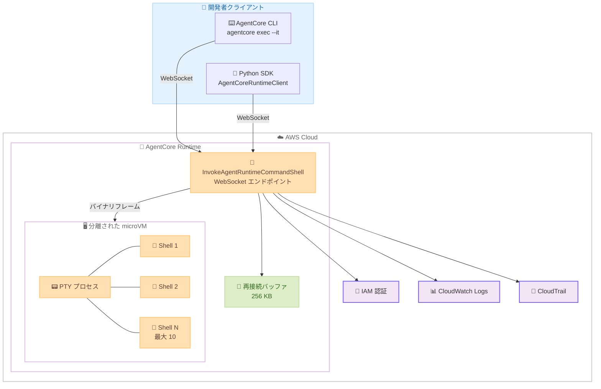

# Amazon Bedrock AgentCore Runtime - インタラクティブシェル

**リリース日**: 2026 年 6 月 5 日
**サービス**: Amazon Bedrock AgentCore Runtime
**機能**: InvokeAgentRuntimeCommandShell API によるインタラクティブシェル

:bar_chart: [このアップデートのインフォグラフィックを見る](https://takech9203.github.io/aws-news-summary/20260605-amazon-bedrock-agentcore-runtime.html)

## 概要

Amazon Bedrock AgentCore Runtime に、新しい `InvokeAgentRuntimeCommandShell` API を通じたインタラクティブシェル機能が追加されました。この機能により、実行中のエージェントセッション内の分離された microVM に対して、WebSocket 経由で永続的な PTY バック付きターミナルセッションを直接開くことが可能になります。

この機能は、既存の `InvokeAgentRuntimeCommand` API によるワンショット実行を補完するものであり、カラー表示、タブ補完、Ctrl+C、ターミナルリサイズ、ネットワーク切断時の自動再接続といった完全なターミナル体験を提供します。特に Claude Code、OpenAI Codex、Amazon Kiro などのコーディングエージェントを AgentCore Runtime 上でホストする開発者にとって重要なアップデートです。

開発者は認証後に microVM にドロップインし、エージェントとの対話、ファイルの検査、アドホックコマンドの実行、環境状態のデバッグをローカルターミナルと同様に行えます。セッション内では環境変数、作業ディレクトリ、コマンド履歴がすべて保持されます。

**アップデート前の課題**

- 既存の `InvokeAgentRuntimeCommand` API はステートレスなワンショット実行のみで、コマンド間で状態が保持されなかった
- エージェントの実行環境をインタラクティブにデバッグする手段がなく、問題の診断に時間がかかった
- コーディングエージェントが反復的にコードを書き、実行し、結果を確認するワークフローで、各コマンドが独立していたため効率が悪かった
- ネットワーク切断時にセッションが失われ、作業を最初からやり直す必要があった

**アップデート後の改善**

- WebSocket 経由の永続的なインタラクティブシェルで、環境変数や作業ディレクトリがコマンド間で保持されるようになった
- `session_id` と `shellId` による再接続が可能になり、ネットワーク切断後も同じシェルに復帰できる
- 1 つのランタイムで最大 10 個の同時シェルセッションをサポートし、複数の microVM で並行作業が可能になった
- フルターミナル体験 (カラー、タブ補完、Ctrl+C、リサイズ) により、ローカル開発と同等の操作性を実現

## アーキテクチャ図



開発者は CLI または SDK を通じて WebSocket 接続を確立し、AgentCore Runtime 内の分離された microVM 上で動作する PTY プロセスとインタラクティブに通信します。再接続バッファにより、ネットワーク切断後も最大 256 KB の出力が再生されます。

## サービスアップデートの詳細

### 主要機能

1. **永続的インタラクティブシェル**
   - WebSocket 経由で microVM 内のシェルプロセスに永続的に接続
   - 環境変数、作業ディレクトリ、コマンド履歴がセッション内で保持
   - バイナリフレームによる生のターミナル I/O ストリーミング (カラー、カーソル制御、フルスクリーンアプリ対応)

2. **再接続サポート**
   - `session_id` と `shellId` を保持することで同じシェルに再接続可能
   - 短時間のネットワーク切断は自動再接続
   - 再接続時に最大 256 KB の最近の出力を再生
   - SDK の `ReconnectConfig` による自動再接続設定

3. **複数同時シェルセッション**
   - 1 つのランタイムあたり最大 10 個の同時シェルセッション
   - 同一または異なる microVM に対して複数ターミナルを開放可能
   - エージェントが異なるブランチで並行作業する様子を監視可能

4. **認証とセキュリティ**
   - デフォルト AWS 認証情報、事前署名 URL、OAuth ベアラートークンの 3 種類の認証方式
   - 各セッションは分離された microVM で実行され、他の顧客のワークロードにアクセス不可
   - CloudTrail による API 呼び出しの監査、CloudWatch Logs による接続メタデータの記録

## 技術仕様

### シェル実行モードの比較

| 項目 | ワンショット実行 | インタラクティブシェル |
|------|------------------|------------------------|
| API | `InvokeAgentRuntimeCommand` | `InvokeAgentRuntimeCommandShell` |
| プロトコル | HTTP/2 (リクエスト-レスポンスストリーム) | WebSocket (永続接続) |
| シェル状態 | ステートレス - 各コマンドで新プロセス起動 | 永続 - 環境変数、作業ディレクトリ、履歴を保持 |
| 出力形式 | 構造化イベント (contentStart、contentDelta、contentStop) | バイナリフレーム (生ターミナル I/O) |
| 再接続 | 不可 | `shellId` による再接続可能 |
| 最大時間 | 設定可能 (1-3,600 秒) | 1 時間 (同じ `shellId` で再接続して継続) |

### クォータと制限

| 項目 | 値 | 説明 |
|------|-----|------|
| 最大フレームペイロードサイズ | 64 KB | 超過時はクローズコード `1009` |
| フレームレート | 250 フレーム/秒 | 超過時はクローズコード `1008` |
| 最大接続時間 | 1 時間 | 同じ `shellId` で再接続して継続 |
| ランタイムあたりの同時シェル数 | 10 | 上限到達時は新規接続拒否 |
| 再接続バッファ | 256 KB | 再接続時に再生される最大出力量 |

### API 変更履歴

| 日付 | サービス | 変更内容 |
|------|----------|----------|
| 2026/06/05 | Amazon Bedrock AgentCore Runtime | InvokeAgentRuntimeCommandShell API の追加 - インタラクティブシェル機能 |

### IAM 権限

```json
{
  "Version": "2012-10-17",
  "Statement": [
    {
      "Effect": "Allow",
      "Action": "bedrock-agentcore:InvokeAgentRuntimeCommandShell",
      "Resource": "arn:aws:bedrock-agentcore:*:*:runtime/*"
    }
  ]
}
```

## 設定方法

### 前提条件

1. `bedrock-agentcore:InvokeAgentRuntimeCommandShell` IAM 権限が付与されていること
2. AgentCore Runtime エンドポイント ARN があり、ランタイムが READY 状態であること
3. 2026 年 6 月 5 日以降にデプロイされたエージェント (それ以前のエージェントは再デプロイが必要)

### 手順

#### ステップ 1: AgentCore CLI でインタラクティブシェルを開く

```bash
agentcore exec --it --runtime <runtime-arn> --region us-west-2
```

指定したランタイム ARN の microVM に対してインタラクティブターミナルセッションを確立します。`--it` フラグによりインタラクティブモードが有効になります。

#### ステップ 2: シェルからデタッチする

ターミナル内で `Ctrl+]` を押すとシェルを閉じずにデタッチできます。CLI は再接続コマンドを表示します。

```bash
agentcore exec --it \
  --runtime <runtime-arn> \
  --region us-west-2 \
  --session-id <uuid> \
  --shell-id <id>
```

表示された `session-id` と `shell-id` を使用して、後から同じシェルに再接続できます。

#### ステップ 3: Python SDK でプログラム的にシェルを操作する

```bash
pip install bedrock-agentcore
```

SDK をインストールした後、以下のコードでシェルセッションを開きます。

```python
import asyncio
from bedrock_agentcore.runtime import AgentCoreRuntimeClient, ShellChannel

async def main():
    runtime_arn = "arn:aws:bedrock-agentcore:us-west-2:123456789012:runtime/my-agent"
    client = AgentCoreRuntimeClient(region="us-west-2")

    async with client.open_shell(runtime_arn) as shell:
        print(f"Connected. Shell ID: {shell.shell_id}")

        await shell.send("echo Hello from AgentCore Shell\n")

        async for frame in shell:
            if frame.channel == ShellChannel.STDOUT:
                print(frame.text, end="")
                if "Hello from AgentCore Shell" in frame.text:
                    break

asyncio.run(main())
```

`open_shell` メソッドが WebSocket 接続を確立し、非同期コンテキストマネージャ内でコマンドの送信と出力の受信を行います。

#### ステップ 4: 自動再接続を設定する

```python
import asyncio
from bedrock_agentcore.runtime import AgentCoreRuntimeClient, ReconnectConfig, ShellChannel

async def on_reconnect(reconnected: bool):
    print(f"Reconnected: {reconnected}")

async def main():
    runtime_arn = "arn:aws:bedrock-agentcore:us-west-2:123456789012:runtime/my-agent"
    config = ReconnectConfig(max_retries=5, base_delay=0.5, on_reconnect=on_reconnect)

    client = AgentCoreRuntimeClient(region="us-west-2")
    async with client.open_shell(runtime_arn, shell_id="my-shell", reconnect_config=config) as shell:
        await shell.send("long-running-command\n")
        async for frame in shell:
            if frame.channel == ShellChannel.STDOUT:
                print(frame.text, end="")

asyncio.run(main())
```

`ReconnectConfig` を指定することで、WebSocket 接続が切断された場合に SDK が自動的に再接続を試行します。

## メリット

### ビジネス面

- **開発生産性の向上**: コーディングエージェントがローカルターミナルと同等のインタラクティブ体験で動作し、開発ワークフローが効率化される
- **ダウンタイムの削減**: ネットワーク切断後も自動再接続により作業が中断されず、復旧時間が最小化される
- **並行作業の実現**: 最大 10 個の同時シェルで複数のエージェントやブランチを並行監視でき、チームの生産性が向上する

### 技術面

- **状態の永続性**: 環境変数、作業ディレクトリ、コマンド履歴がセッション内で保持され、複雑なワークフローを効率的に実行可能
- **セキュアな分離**: 各セッションが分離された microVM 内で実行され、マルチテナント環境でのセキュリティを確保
- **柔軟な認証方式**: AWS 認証情報、事前署名 URL、OAuth トークンの 3 種類をサポートし、様々なアーキテクチャに対応

## デメリット・制約事項

### 制限事項

- ランタイムあたり同時シェル数は最大 10 個に制限される
- 最大接続時間は 1 時間で、それ以降は再接続が必要
- フレームペイロードサイズは 64 KB が上限で、大きな入力は分割が必要
- フレームレートは 250 フレーム/秒に制限される
- 再接続バッファは 256 KB で、それ以上の出力は再生されない
- 2026 年 6 月 5 日以前にデプロイされたエージェントは再デプロイが必要

### 考慮すべき点

- ターミナル I/O の内容 (stdin/stdout) はサービス側でログに記録されないため、独自の監査メカニズムが必要な場合がある
- シェルコマンドはコンテナのファイルシステムと設定済みの認証情報にフルアクセスを持つため、IAM ポリシーによるアクセス制御が重要
- デタッチされたセッションは 10 セッションの上限にカウントされるため、不要なセッションは明示的にクローズする必要がある

## ユースケース

### ユースケース 1: コーディングエージェントのターミナルアクセス

**シナリオ**: Claude Code や Amazon Kiro などの AI コーディングエージェントが、AgentCore Runtime 上でコードの記述、実行、テストを反復的に行う場合。

**実装例**:
```python
async with client.open_shell(runtime_arn, shell_id="agent-workspace") as shell:
    await shell.send("cd /workspace && git clone https://github.com/user/repo.git\n")
    await shell.send("cd repo && pip install -r requirements.txt\n")
    await shell.send("python -m pytest tests/ -v\n")
    # エージェントがテスト出力を読み取り、失敗を修正し、再実行する
```

**効果**: エージェントがシェル状態を保持したまま反復的に開発を行えるため、各ステップでのコンテキスト再構築が不要になり、コーディングエージェントの効率が大幅に向上する。

### ユースケース 2: インタラクティブデバッグ

**シナリオ**: エージェントの実行環境で予期しないエラーが発生した際に、開発者がリアルタイムで環境を調査する場合。

**実装例**:
```bash
# AgentCore CLI でシェルを開く
agentcore exec --it --runtime arn:aws:bedrock-agentcore:us-west-2:123456789012:runtime/my-agent

# シェル内でデバッグ
python --version && pip list | head -20
env | grep AWS
cat /var/log/agent/error.log
```

**効果**: ローカルターミナルと同じ感覚でリモート環境をデバッグでき、問題の特定と解決が迅速に行える。

### ユースケース 3: 長時間実行プロセスの監視

**シナリオ**: 機械学習モデルのトレーニングなど、長時間実行されるプロセスを開始し、定期的に進捗を確認する場合。

**実装例**:
```bash
# シェル 1: トレーニング開始
agentcore exec --it --runtime <arn> --shell-id training-monitor
nohup python train.py > /tmp/train.log 2>&1 &

# ネットワーク切断後に再接続
agentcore exec --it --runtime <arn> --session-id <uuid> --shell-id training-monitor
tail -f /tmp/train.log
```

**効果**: 再接続機能により、ネットワーク切断や作業中断があっても同じシェルに戻り、長時間プロセスの進捗を継続的に監視できる。

## 料金

AgentCore Runtime のインタラクティブシェル機能の料金は、AgentCore Runtime の使用量に基づきます。シェル接続自体に追加料金は発生しませんが、microVM の稼働時間に応じた課金が適用されます。

### 料金例

| 使用量 | 月額料金 (概算) |
|--------|------------------|
| AgentCore Runtime microVM 稼働時間 | AgentCore Runtime 標準料金に準拠 |
| WebSocket 接続 | 追加料金なし |

詳細な料金情報については AWS 公式料金ページを参照してください。

## 利用可能リージョン

公式発表時点での具体的なリージョン情報は公開されていませんが、ドキュメントの例では `us-west-2` (米国西部オレゴン) が使用されています。AgentCore Runtime が利用可能なリージョンで順次提供されます。

## 関連サービス・機能

- **Amazon Bedrock AgentCore Runtime**: エージェントの実行基盤。今回のインタラクティブシェルはこの上で動作する
- **InvokeAgentRuntimeCommand API**: ステートレスなワンショットコマンド実行。インタラクティブシェルと相補的に使用
- **AWS CloudTrail**: `InvokeAgentRuntimeCommandShell` API 呼び出しの監査ログを記録
- **Amazon CloudWatch Logs**: 接続メタデータとリクエスト ID のログ記録
- **AWS IAM**: `bedrock-agentcore:InvokeAgentRuntimeCommandShell` 権限によるアクセス制御

## 参考リンク

- :bar_chart: [インフォグラフィック](https://takech9203.github.io/aws-news-summary/20260605-amazon-bedrock-agentcore-runtime.html)
- [公式発表 (What's New)](https://aws.amazon.com/about-aws/whats-new/2026/06/amazon-bedrock-agentcore-runtime/)
- [ドキュメント - Interactive Shells](https://docs.aws.amazon.com/bedrock-agentcore/latest/devguide/runtime-get-started-command-shell.html)
- [ドキュメント - Shell execution in AgentCore Runtime](https://docs.aws.amazon.com/bedrock-agentcore/latest/devguide/runtime-shell-execution.html)
- [AgentCore サンプルコード](https://github.com/awslabs/agentcore-samples)

## まとめ

Amazon Bedrock AgentCore Runtime のインタラクティブシェル機能は、コーディングエージェントを本番環境でホストする開発者にとって大きな前進です。WebSocket 経由の永続的ターミナルセッション、自動再接続、最大 10 個の同時シェルにより、Claude Code や Amazon Kiro などの AI コーディングエージェントがローカル開発と同等の体験で動作できるようになります。AgentCore Runtime を使用してコーディングエージェントを運用している場合は、`agentcore exec --it` コマンドで即座にこの機能を試すことを推奨します。
