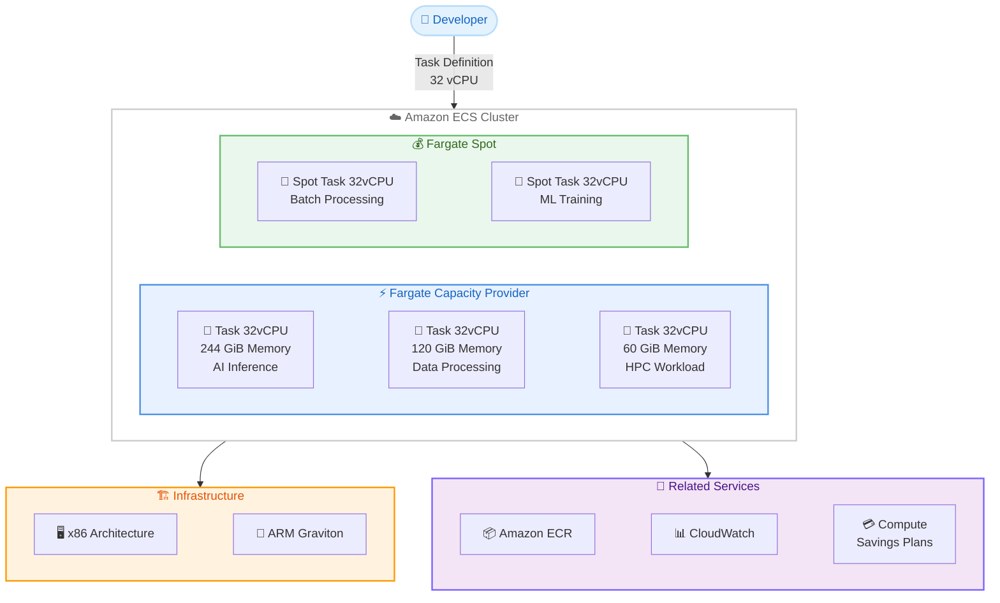

# Amazon ECS with AWS Fargate - 32vCPU コンピュート構成のサポート

**リリース日**: 2026 年 6 月 5 日
**サービス**: Amazon ECS (Elastic Container Service)
**機能**: AWS Fargate 32vCPU タスクサイズ

📊 [このアップデートのインフォグラフィックを見る](https://takech9203.github.io/aws-news-summary/20260605-amazon-ecs-fargate-32vcpu.html)

## 概要

Amazon Elastic Container Service (Amazon ECS) の AWS Fargate で 32vCPU のコンピュート構成がサポートされました。これにより、従来の 16vCPU という上限を超えて、より大規模で計算負荷の高いワークロードをサーバーレスコンテナ環境で実行できるようになります。

32vCPU タスクでは、60 GiB、120 GiB、244 GiB の 3 つのメモリ構成が選択可能で、x86 ベースと ARM ベース (Graviton) の両方の Linux ワークロードに対応しています。ハイパフォーマンスコンピューティング (HPC)、大規模データ処理、AI 推論などのコンピュート集約型ワークロードを、Fargate のサーバーレスモデルのメリットを享受しながら実行できるようになりました。

既存の Compute Savings Plans が自動的に適用されるため、追加のコスト最適化設定は不要です。また、Fargate Spot キャパシティプロバイダーでも利用可能であり、コスト効率の高い運用が実現できます。

**アップデート前の課題**

- Fargate タスクの最大 vCPU は 16vCPU が上限であり、それを超える計算リソースが必要なワークロードは EC2 起動タイプに切り替える必要があった
- AI 推論や大規模データ処理など、高い CPU リソースを必要とするコンテナワークロードでは、Fargate のサーバーレスメリットを活用できなかった
- EC2 インスタンスの管理 (パッチ適用、スケーリング、キャパシティ管理) が運用負荷として残っていた

**アップデート後の改善**

- 32vCPU と最大 244 GiB のメモリを持つ Fargate タスクが利用可能になり、より大規模なワークロードをサーバーレスで実行可能になった
- EC2 起動タイプへの切り替えが不要になり、インフラストラクチャ管理の負荷を排除しながら高性能な計算リソースを利用できるようになった
- Fargate Spot との組み合わせにより、大規模計算タスクのコストを最大 70% 削減できるようになった

## アーキテクチャ図



Amazon ECS の Fargate タスクが 32vCPU をサポートし、x86 と ARM の両アーキテクチャで 3 つのメモリ構成を選択できるようになった全体像を示しています。Fargate 標準と Fargate Spot の両方のキャパシティプロバイダーで利用可能です。

## サービスアップデートの詳細

### 主要機能

1. **32vCPU タスクサイズ**
   - Fargate タスクで 32vCPU を指定可能
   - 従来の最大値 16vCPU から 2 倍に拡張
   - タスク定義の `cpu` パラメータに `32768` (32 vCPU = 32,768 CPU units) を指定

2. **3 つのメモリ構成オプション**
   - 60 GiB: CPU 集約型ワークロード向け (vCPU あたり約 1.9 GiB)
   - 120 GiB: バランス型ワークロード向け (vCPU あたり約 3.75 GiB)
   - 244 GiB: メモリ集約型ワークロード向け (vCPU あたり約 7.6 GiB)

3. **マルチアーキテクチャ対応**
   - x86 ベース: Intel/AMD プロセッサ上で動作
   - ARM ベース: AWS Graviton プロセッサ上で動作 (約 20% のコスト削減)
   - Linux オペレーティングシステムのみサポート

4. **Fargate Spot 対応**
   - 32vCPU タスクを Fargate Spot で実行可能
   - 通常料金から最大 70% の割引
   - バッチ処理や耐障害性のあるワークロードに最適

## 技術仕様

### Fargate vCPU とメモリの組み合わせ

| vCPU | メモリオプション | CPU Units | 用途 |
|------|-----------------|-----------|------|
| 32 vCPU | 60 GiB | 32768 | CPU 集約型ワークロード |
| 32 vCPU | 120 GiB | 32768 | バランス型ワークロード |
| 32 vCPU | 244 GiB | 32768 | メモリ集約型ワークロード |

### サポートアーキテクチャ

| アーキテクチャ | プラットフォーム | 特徴 |
|---------------|-----------------|------|
| x86_64 | Linux | Intel/AMD 互換、既存コンテナイメージをそのまま利用可能 |
| ARM64 | Linux | Graviton ベース、約 20% のコスト削減と優れた電力効率 |

### タスク定義の設定例

```json
{
  "family": "high-performance-task",
  "requiresCompatibilities": ["FARGATE"],
  "networkMode": "awsvpc",
  "cpu": "32768",
  "memory": "245760",
  "runtimePlatform": {
    "cpuArchitecture": "X86_64",
    "operatingSystemFamily": "LINUX"
  },
  "containerDefinitions": [
    {
      "name": "inference-container",
      "image": "123456789012.dkr.ecr.us-east-1.amazonaws.com/my-inference:latest",
      "cpu": 32768,
      "memory": 245760,
      "essential": true
    }
  ]
}
```

## 設定方法

### 前提条件

1. Amazon ECS クラスターが作成済みであること
2. Fargate キャパシティプロバイダーが関連付けられていること
3. 適切な IAM ロール (タスク実行ロール、タスクロール) が設定されていること
4. VPC とサブネットが構成済みであること

### 手順

#### ステップ 1: タスク定義の作成

```bash
aws ecs register-task-definition \
  --family my-32vcpu-task \
  --requires-compatibilities FARGATE \
  --network-mode awsvpc \
  --cpu 32768 \
  --memory 122880 \
  --runtime-platform cpuArchitecture=X86_64,operatingSystemFamily=LINUX \
  --execution-role-arn arn:aws:iam::123456789012:role/ecsTaskExecutionRole \
  --container-definitions '[
    {
      "name": "app",
      "image": "123456789012.dkr.ecr.us-east-1.amazonaws.com/my-app:latest",
      "essential": true,
      "portMappings": [{"containerPort": 8080, "protocol": "tcp"}]
    }
  ]'
```

32vCPU と 120 GiB (122880 MiB) のメモリを持つ Fargate タスク定義を作成します。`--cpu` には CPU ユニット数 (32768 = 32 vCPU) を、`--memory` には MiB 単位のメモリ量を指定します。

#### ステップ 2: サービスの作成またはタスクの実行

```bash
# サービスとして実行する場合
aws ecs create-service \
  --cluster my-cluster \
  --service-name my-32vcpu-service \
  --task-definition my-32vcpu-task \
  --desired-count 2 \
  --launch-type FARGATE \
  --network-configuration "awsvpcConfiguration={subnets=[subnet-12345],securityGroups=[sg-12345],assignPublicIp=ENABLED}"
```

作成したタスク定義を使用して ECS サービスを起動します。Fargate 起動タイプを指定し、VPC ネットワーク設定を行います。

#### ステップ 3: Fargate Spot を使用する場合

```bash
# キャパシティプロバイダー戦略を使用
aws ecs create-service \
  --cluster my-cluster \
  --service-name my-spot-service \
  --task-definition my-32vcpu-task \
  --desired-count 4 \
  --capacity-provider-strategy '[
    {"capacityProvider": "FARGATE_SPOT", "weight": 3, "base": 0},
    {"capacityProvider": "FARGATE", "weight": 1, "base": 1}
  ]' \
  --network-configuration "awsvpcConfiguration={subnets=[subnet-12345],securityGroups=[sg-12345],assignPublicIp=ENABLED}"
```

Fargate Spot と標準 Fargate を組み合わせたキャパシティプロバイダー戦略を設定します。この例では、最低 1 タスクを標準 Fargate で確保し、残りは 75% を Spot で実行してコストを削減します。

## メリット

### ビジネス面

- **運用コスト削減**: EC2 インスタンスの管理が不要になり、パッチ適用やスケーリングの運用負荷を排除できる
- **柔軟なコスト最適化**: Fargate Spot との組み合わせで最大 70% の割引、Compute Savings Plans で最大 50% の割引が自動適用される
- **市場投入の迅速化**: インフラストラクチャの管理に時間を費やすことなく、大規模な計算ワークロードを即座にデプロイできる

### 技術面

- **スケーラビリティ向上**: 16vCPU の制約がなくなり、より大きなコンテナを単一タスクで実行可能
- **アーキテクチャの簡素化**: 大規模ワークロードのために EC2 起動タイプに切り替える必要がなくなり、統一的なサーバーレスアーキテクチャを維持できる
- **マルチアーキテクチャ対応**: x86 と ARM (Graviton) の両方をサポートし、ワークロードに最適なプロセッサを選択できる

## デメリット・制約事項

### 制限事項

- Linux のみサポート (Windows コンテナは非対応)
- メモリ構成は 60 GiB、120 GiB、244 GiB の 3 つに限定 (任意の値は指定不可)
- エフェメラルストレージの上限は従来と同じ (最大 200 GiB)
- タスクあたりのネットワーク帯域幅は vCPU 数に応じてスケールするが、上限がある

### 考慮すべき点

- 32vCPU タスクは起動時間が従来の小さいタスクよりも長くなる可能性がある
- Fargate Spot 使用時は中断リスクがあるため、ステートレスなワークロードやチェックポイント機構を備えたアプリケーションに適している
- 大規模タスクの場合、VPC サブネットの IP アドレス枯渇に注意が必要 (各タスクが ENI を 1 つ消費)
- コンテナイメージのプルに要する時間が増加する可能性がある (大規模なイメージの場合)

## ユースケース

### ユースケース 1: AI 推論ワークロード

**シナリオ**: 大規模言語モデル (LLM) の推論エンドポイントを、GPU なしの CPU ベースで運用したいケース。32vCPU と 244 GiB のメモリにより、量子化されたモデルをメモリにロードし、並列推論リクエストを処理できる。

**実装例**:
```json
{
  "family": "llm-inference",
  "cpu": "32768",
  "memory": "245760",
  "containerDefinitions": [
    {
      "name": "inference-server",
      "image": "my-registry/llm-inference:latest",
      "cpu": 32768,
      "memory": 245760,
      "environment": [
        {"name": "NUM_THREADS", "value": "32"},
        {"name": "MODEL_PATH", "value": "/models/quantized-llm"}
      ]
    }
  ]
}
```

**効果**: EC2 インスタンスの管理なしに、高スループットの AI 推論を実現。オートスケーリングと組み合わせて、リクエスト量に応じた柔軟なスケーリングが可能。

### ユースケース 2: 大規模データパイプライン処理

**シナリオ**: ETL パイプラインで数百 GB のデータセットを並列処理する必要があるケース。32vCPU により、Apache Spark や Dask などの並列処理フレームワークを単一コンテナで効率的に実行できる。

**実装例**:
```bash
aws ecs run-task \
  --cluster data-processing-cluster \
  --task-definition spark-processing:1 \
  --launch-type FARGATE \
  --overrides '{
    "containerOverrides": [{
      "name": "spark-worker",
      "environment": [
        {"name": "SPARK_WORKER_CORES", "value": "32"},
        {"name": "SPARK_WORKER_MEMORY", "value": "110g"}
      ]
    }]
  }' \
  --network-configuration "awsvpcConfiguration={subnets=[subnet-abc123],securityGroups=[sg-abc123]}"
```

**効果**: データ処理時間を大幅に短縮。Fargate Spot と組み合わせることで、大規模バッチ処理のコストを最大 70% 削減。

### ユースケース 3: 科学技術計算・シミュレーション

**シナリオ**: 計算流体力学 (CFD) や有限要素法 (FEM) のシミュレーションを、オンデマンドでバースト実行したいケース。32vCPU により、十分な並列計算リソースを即座に利用可能。

**実装例**:
```json
{
  "family": "simulation-task",
  "cpu": "32768",
  "memory": "61440",
  "runtimePlatform": {
    "cpuArchitecture": "ARM64",
    "operatingSystemFamily": "LINUX"
  },
  "containerDefinitions": [
    {
      "name": "openfoam-solver",
      "image": "my-registry/openfoam:latest",
      "cpu": 32768,
      "memory": 61440,
      "command": ["mpirun", "-np", "32", "simpleFoam", "-parallel"]
    }
  ]
}
```

**効果**: ARM (Graviton) アーキテクチャにより約 20% のコスト削減を実現しながら、32 並列のシミュレーションを実行。インフラ管理なしで、必要なときだけ計算リソースを利用可能。

## 料金

AWS Fargate の料金は、vCPU とメモリの使用量に基づいて秒単位 (最低 1 分) で課金されます。

### 料金体系 (米国東部 - バージニア北部リージョン)

| リソース | x86 料金 (1 時間あたり) | ARM/Graviton 料金 (1 時間あたり) |
|----------|------------------------|--------------------------------|
| vCPU | $0.04048/vCPU | $0.03238/vCPU |
| メモリ | $0.004446/GB | $0.003560/GB |

### 32vCPU タスクの料金例 (1 時間あたり、米国東部)

| 構成 | x86 料金 | ARM 料金 |
|------|----------|----------|
| 32 vCPU + 60 GiB | $1.562 | $1.250 |
| 32 vCPU + 120 GiB | $1.829 | $1.463 |
| 32 vCPU + 244 GiB | $2.380 | $1.904 |

**コスト最適化オプション:**
- **Compute Savings Plans**: 最大 50% の割引 (1 年または 3 年のコミットメント)
- **Fargate Spot**: 通常料金から最大 70% の割引 (中断の可能性あり)

## 利用可能リージョン

すべての AWS 商用リージョンおよび AWS GovCloud (US) リージョンで利用可能です。

## 関連サービス・機能

- **Amazon ECR (Elastic Container Registry)**: コンテナイメージの保存・管理。大規模タスク向けに最適化されたイメージプルが可能
- **AWS Compute Savings Plans**: 32vCPU タスクに自動適用され、長期利用時のコスト最適化を実現
- **Amazon CloudWatch**: 32vCPU タスクの CPU・メモリ使用率モニタリング、カスタムメトリクスの送信
- **AWS Application Auto Scaling**: タスク数のオートスケーリングにより、需要に応じた動的なスケーリングが可能
- **Amazon ECS Service Connect**: サービス間通信の簡素化、大規模タスク間のネットワーキング

## 参考リンク

- 📊 [インフォグラフィック](https://takech9203.github.io/aws-news-summary/20260605-amazon-ecs-fargate-32vcpu.html)
- [公式発表 (What's New)](https://aws.amazon.com/about-aws/whats-new/2026/06/amazon-ecs-fargate-32vcpu)
- [Amazon ECS タスク定義パラメータ ドキュメント](https://docs.aws.amazon.com/AmazonECS/latest/developerguide/task_definition_parameters.html)
- [AWS Fargate 料金ページ](https://aws.amazon.com/fargate/pricing/)
- [Amazon ECS 開発者ガイド](https://docs.aws.amazon.com/AmazonECS/latest/developerguide/)

## まとめ

Amazon ECS with AWS Fargate の 32vCPU サポートは、サーバーレスコンテナの適用範囲を大幅に拡大するアップデートです。AI 推論、大規模データ処理、HPC など従来は EC2 起動タイプが必要だったワークロードを、Fargate のサーバーレスモデルで実行できるようになりました。Fargate Spot や Compute Savings Plans との組み合わせにより、高性能とコスト効率を両立させながら、インフラストラクチャ管理の負荷を排除できます。大規模な計算ワークロードを持つチームは、既存のタスク定義を更新して新しい 32vCPU 構成への移行を検討することを推奨します。
