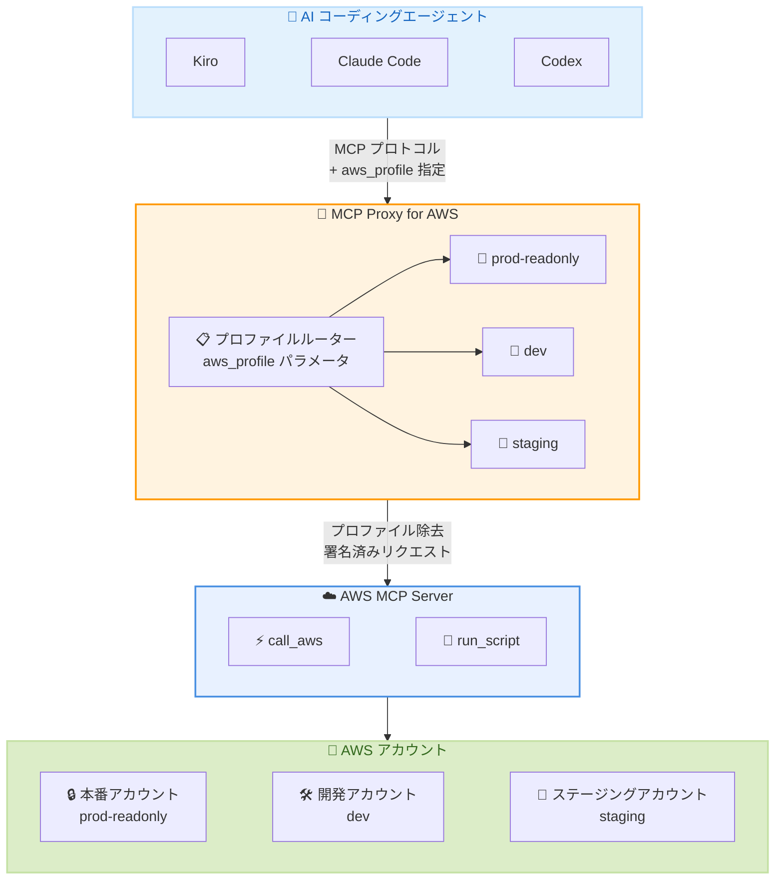

# AWS MCP Server - クロスアカウント・クロスロールアクセス

**リリース日**: 2026年6月5日
**サービス**: Agent Toolkit for AWS
**機能**: AWS MCP Server マルチプロファイルサポート (クロスアカウント・クロスロールアクセス)

📊 [このアップデートのインフォグラフィックを見る](https://takech9203.github.io/aws-news-summary/20260605-aws-mcp-server.html)

## 概要

AWS は、AWS Model Context Protocol (MCP) Server にクロスアカウントおよびクロスロールアクセス機能を追加したことを発表した。Agent Toolkit for AWS の一部である AWS MCP Server において、AI コーディングエージェント (Kiro、Claude Code、Codex) が単一のセッション内で複数の AWS アカウントおよび IAM ロールを切り替えて操作できるようになった。再起動は不要である。

この機能により、マルチアカウント環境で作業する開発者の生産性が大幅に向上する。各リクエストで使用するプロファイルを指定するため、コマンドが誤ったアカウントに送信されるリスクがなく、安全にクロスアカウント操作を実行できる。MCP Proxy for AWS のバージョン 1.6.0 以降で利用可能であり、`--profile` フラグまたは `AWS_MCP_PROXY_PROFILES` 環境変数で設定する。

**アップデート前の課題**

- プロファイルを切り替えるたびに AI コーディングセッションを停止する必要があった
- ローカルの AWS 認証情報を手動で更新し、MCP サーバーを再起動する必要があった
- マルチアカウント環境での作業が中断され、コンテキストが失われていた
- 複数アカウントをまたぐ調査やデプロイに時間と手間がかかっていた

**アップデート後の改善**

- 単一セッション内で複数の AWS アカウント・ロールをシームレスに切り替え可能になった
- 各コマンドでプロファイルを指定するため、再起動が不要になった
- 明示的なプロファイル指定により、誤ったアカウントへのコマンド送信リスクが排除された
- プロファイルのホワイトリスト方式により、起動時に宣言されたプロファイルのみ使用可能で安全性が確保された

## アーキテクチャ図



AI コーディングエージェントが MCP Proxy for AWS に `aws_profile` パラメータ付きでリクエストを送信し、プロキシが該当プロファイルの認証情報でリクエストに署名してから AWS MCP Server に転送する。プロファイル情報はプロキシ側で除去され、バックエンドには渡されない。

## サービスアップデートの詳細

### 主要機能

1. **コマンドごとのプロファイル指定**
   - 各ツール呼び出しに `aws_profile` パラメータを付与してプロファイルを指定
   - 対応ツール: `call_aws`、`run_script`、`get_presigned_url`、`get_tasks`、`suggest_aws_commands`
   - `aws_profile` を省略した場合はデフォルト (最初に指定した) プロファイルが使用される
   - 無効なプロファイルを指定した場合、許可されたプロファイル一覧と共にエラーが返される

2. **ステートレスルーティング**
   - 各リクエストが独立したアイデンティティを持つ
   - 共有セッション状態がないため、並列リクエストが相互に干渉しない
   - プロファイル情報はプロキシ側で除去され、AWS MCP Server バックエンドには渡されない

3. **明示的なプロファイルホワイトリスト**
   - 起動時に宣言されたプロファイルのみが利用可能
   - エージェントが `~/.aws/config` 内の他のプロファイルを検出・使用することは不可能
   - セキュリティバウンダリが明確に定義される

## 技術仕様

### 設定オプション

| 項目 | 詳細 |
|------|------|
| 設定方法 | `--profile` CLI フラグまたは `AWS_MCP_PROXY_PROFILES` 環境変数 |
| 必要バージョン | mcp-proxy-for-aws 1.6.0 以降 |
| デフォルトプロファイル | 最初に指定されたプロファイル |
| 対応ツール | `call_aws`, `run_script`, `get_presigned_url`, `get_tasks`, `suggest_aws_commands` |
| 優先順位 | `AWS_MCP_PROXY_PROFILES` > `--profile` > `AWS_PROFILE` |

### プロファイル動作仕様

| パラメータ指定 | 動作 |
|----------------|------|
| `aws_profile` 省略 | デフォルト (最初の) プロファイルで署名 |
| `aws_profile="dev"` | dev プロファイル用の専用コネクションで署名 |
| 無効なプロファイル指定 | エラー返却 (許可リスト表示) |

### API 変更履歴

今回のアップデートに直接対応する API 変更はクライアントサイド (MCP Proxy) の機能追加であり、AWS バックエンド API の変更は伴わない。関連する最近の AgentCore API 変更を以下に示す。

| 日付 | サービス | 変更内容 |
|------|----------|----------|
| 2026/05/29 | [Amazon Bedrock AgentCore Control](https://awsapichanges.com/archive/changes/96246a-bedrock-agentcore-control.html) | 9 updated methods - Secrets Manager シークレットの参照による認証プロバイダー設定 |

### MCP サーバー設定例

```json
{
  "mcpServers": {
    "aws-mcp": {
      "command": "uvx",
      "args": ["mcp-proxy-for-aws@latest", "https://aws-mcp.us-east-1.api.aws/mcp"],
      "env": {
        "AWS_MCP_PROXY_PROFILES": "prod-readonly dev staging"
      }
    }
  }
}
```

## 設定方法

### 前提条件

1. mcp-proxy-for-aws バージョン 1.6.0 以降がインストールされていること
2. 使用する各プロファイルが `~/.aws/config` および `~/.aws/credentials` に設定済みであること
3. 各プロファイルに必要な IAM 権限が付与されていること
4. MCP 対応の AI コーディングエージェント (Kiro、Claude Code、Codex など)

### 手順

#### ステップ 1: AWS CLI プロファイルの設定

```bash
# ~/.aws/config に複数プロファイルを設定
[profile prod-readonly]
region = us-east-1
role_arn = arn:aws:iam::111111111111:role/ReadOnlyAccess
source_profile = default

[profile dev]
region = us-east-1
role_arn = arn:aws:iam::222222222222:role/DeveloperAccess
source_profile = default

[profile staging]
region = us-east-1
role_arn = arn:aws:iam::333333333333:role/StagingAccess
source_profile = default
```

使用する各アカウント・ロールに対応する AWS CLI プロファイルを定義する。AssumeRole を使用したクロスアカウントアクセスの設定が一般的である。

#### ステップ 2: MCP プロキシの設定

**CLI フラグ方式:**

```bash
mcp-proxy-for-aws https://aws-mcp.us-east-1.api.aws/mcp --profile prod-readonly dev staging
```

最初に指定したプロファイル (prod-readonly) がデフォルトとなる。追加のプロファイルは明示的に指定した場合にのみ使用される。

**環境変数方式 (プラグイン統合向け):**

```json
{
  "mcpServers": {
    "aws-mcp": {
      "command": "uvx",
      "args": ["mcp-proxy-for-aws@latest", "https://aws-mcp.us-east-1.api.aws/mcp"],
      "env": {
        "AWS_MCP_PROXY_PROFILES": "prod-readonly dev staging"
      }
    }
  }
}
```

MCP クライアントの設定ファイルに環境変数を追加する。CLI 引数を変更できないプラグイン統合で有用である。

#### ステップ 3: エージェントからのクロスアカウント操作

```
エージェントへの指示:
「prod-readonly プロファイルで本番環境の CloudWatch ログを確認し、
staging プロファイルでステージング環境のログと比較して、
パフォーマンス低下の原因を調査してください。」
```

エージェントが自動的に各コマンドに適切な `aws_profile` パラメータを付与し、アカウント間でシームレスに操作を切り替える。

## メリット

### ビジネス面

- **生産性の大幅向上**: マルチアカウント環境での作業中にセッションの中断・再起動が不要になり、コンテキストの喪失を防止
- **運用速度の改善**: 複数アカウントをまたぐトラブルシューティングやデプロイ作業を単一会話内で完結可能
- **セキュリティリスクの低減**: 明示的なプロファイル指定とホワイトリスト方式により、誤ったアカウントへの操作を防止

### 技術面

- **ステートレス設計**: 各リクエストが独立しており、並列リクエスト間の干渉がない
- **最小権限の原則**: プロファイルごとに異なる権限レベルを設定可能 (読み取り専用をデフォルト、書き込み可能を明示的指定)
- **クライアントサイド制御**: MCP クライアントのフックや権限ルールと組み合わせた追加のガードレール設定が可能
- **シンプルな設定**: 既存の AWS CLI プロファイル設定をそのまま活用可能

## デメリット・制約事項

### 制限事項

- 利用可能リージョンが US East (N. Virginia) と Europe (Frankfurt) の 2 リージョンに限定
- mcp-proxy-for-aws バージョン 1.6.0 以降が必要
- 起動時に宣言したプロファイルのみ使用可能 (動的なプロファイル追加は不可)
- AWS MCP Server 固有の機能であり、他の MCP サーバーへのプロキシ時には利用不可

### 考慮すべき点

- 各プロファイルの IAM 権限を適切に設計する必要がある (過剰な権限付与を避ける)
- 本番環境のプロファイルには読み取り専用権限を推奨し、書き込み操作は別途承認フローを検討
- プロファイル数が多い場合、エージェントが適切なプロファイルを選択するための明確な指示が必要
- CloudTrail ログで各プロファイルの操作を監査し、意図しないクロスアカウント操作がないか確認

## ユースケース

### ユースケース 1: クロスアカウントのパフォーマンストラブルシューティング

**シナリオ**: DevOps エンジニアが本番環境とステージング環境の CloudWatch ログを比較して、パフォーマンス問題の原因を調査する。

**実装例**:
```json
{
  "mcpServers": {
    "aws-mcp": {
      "command": "uvx",
      "args": ["mcp-proxy-for-aws@latest", "https://aws-mcp.us-east-1.api.aws/mcp"],
      "env": {
        "AWS_MCP_PROXY_PROFILES": "prod-readonly staging-readonly"
      }
    }
  }
}
```

```
エージェントへの指示:
「prod-readonly で /aws/lambda/payment-api の過去 1 時間のエラーログを取得し、
staging-readonly で同じ Lambda 関数のログと比較して、
本番環境固有の問題を特定してください。」
```

**効果**: セッション切り替えなしに両アカウントのログを即座に比較でき、問題の特定時間を大幅に短縮する。

### ユースケース 2: マルチアカウントでのリソース設定変更

**シナリオ**: アプリケーション開発者が開発アカウントで Lambda 設定を更新し、別アカウントで S3 バケットポリシーを調整する。

**実装例**:
```json
{
  "env": {
    "AWS_MCP_PROXY_PROFILES": "dev-admin shared-services"
  }
}
```

```
エージェントへの指示:
「dev-admin プロファイルで Lambda 関数 data-processor のメモリを
512MB から 1024MB に変更し、shared-services プロファイルで
S3 バケット shared-data-lake のバケットポリシーに dev アカウントからの
読み取りアクセスを追加してください。」
```

**効果**: 複数アカウントにまたがるリソース変更を単一の会話内で完結させ、設定の整合性を保ちながら迅速にデプロイできる。

### ユースケース 3: クロスアカウントセキュリティ監査

**シナリオ**: セキュリティチームが複数アカウントの S3 バケットのパブリックアクセス設定を一括で確認する。

**実装例**:
```json
{
  "env": {
    "AWS_MCP_PROXY_PROFILES": "security-audit-prod security-audit-dev security-audit-staging"
  }
}
```

```
エージェントへの指示:
「3 つのアカウントすべてで S3 バケットの一覧を取得し、
パブリックアクセスが有効になっているバケットがあれば報告してください。」
```

**効果**: 3 つのアカウントを個別にログインして確認する代わりに、単一セッションでセキュリティ監査を完了できる。

## 料金

AWS MCP Server およびマルチプロファイル機能自体に追加料金は発生しない。エージェントが各アカウントで実行する AWS API 呼び出しに対して、各サービスの標準料金が適用される。

### 料金例

| 項目 | 料金 |
|------|------|
| AWS MCP Server 利用料 | 無料 |
| マルチプロファイル機能 | 無料 |
| 各アカウントでの AWS API 呼び出し | 各サービスの標準料金 |

## 利用可能リージョン

現時点で以下の 2 リージョンで利用可能。

- US East (N. Virginia) - us-east-1
- Europe (Frankfurt) - eu-west-1

## 関連サービス・機能

- **Agent Toolkit for AWS**: AWS MCP Server を含む AI エージェント向けツールキット。マルチプロファイル機能はこのツールキットの一部
- **AWS IAM**: 各プロファイルのアクセス制御とロールベースのクロスアカウントアクセスに使用
- **AWS Organizations**: マルチアカウント環境の管理基盤。クロスアカウントアクセスのユースケースと密接に関連
- **AWS CloudTrail**: 各プロファイルによる API 呼び出しの監査ログを記録し、クロスアカウント操作の追跡に活用
- **AWS STS (Security Token Service)**: AssumeRole によるクロスアカウントアクセスの認証基盤

## 参考リンク

- 📊 [インフォグラフィック](https://takech9203.github.io/aws-news-summary/20260605-aws-mcp-server.html)
- [公式発表 (What's New)](https://aws.amazon.com/about-aws/whats-new/2026/06/aws-mcp-server/)
- [Multi-profile support ユーザーガイド](https://docs.aws.amazon.com/agent-toolkit/latest/userguide/multi-account-access.html)
- [Agent Toolkit for AWS 製品ページ](https://aws.amazon.com/products/developer-tools/agent-toolkit-for-aws/)

## まとめ

AWS MCP Server のクロスアカウント・クロスロールアクセス機能により、マルチアカウント環境で AI コーディングエージェントを活用する開発者の生産性が大幅に向上する。セッションの中断なしに複数アカウントを横断して操作できるため、トラブルシューティング、デプロイ、セキュリティ監査などのワークフローが効率化される。マルチアカウント環境で AWS MCP Server を使用している開発者は、mcp-proxy-for-aws を 1.6.0 以降にアップデートし、`AWS_MCP_PROXY_PROFILES` 環境変数でプロファイルを設定することから始めることを推奨する。
